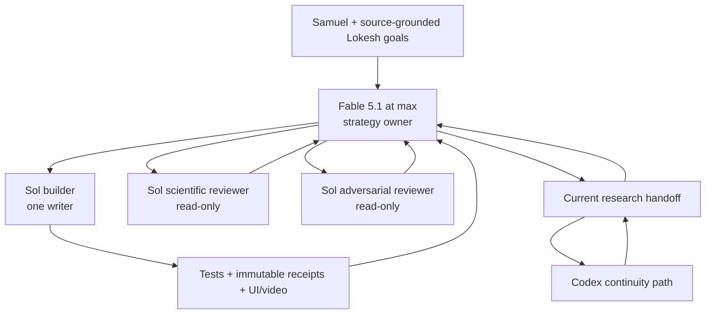

# Fable-to-Sol orchestration

| status | setup truth |
|---|---|
| progress | Claude Code, the official OpenAI Codex plugin, project model settings, identity checks, durable handoff, prompts, and a 30-minute Codex continuity heartbeat are installed. |
| bottleneck | Claude Code's shell session is not authenticated. Consumer desktop apps do not expose an API for pushing messages into a closed Fable session. |
| next step | Run the live identity check, start Fable, and let it complete the source/strategy audit before it delegates a write task. |

## Control plane



## Role contract

| role | authority | token discipline |
|---|---|---|
| Fable | Research strategy, questions, decomposition, acceptance criteria, synthesis, strategy/decision docs, final go/no-go recommendation | Read raw private sources once; maintain a compact goal ledger; inspect diffs and receipts, not routine implementation logs |
| Sol builder | One bounded implementation or experiment-preparation slice | `gpt-5.6-sol`, `max`; one write-capable worker at a time |
| Sol scientific reviewer | Check construct validity, confounds, evidence ceiling, and goal alignment | read-only; independent prompt and context |
| Sol adversarial reviewer | Search for lifecycle, lineage, leakage, reproducibility, and negative-path failures | read-only; independent prompt and context |
| Samuel | Goal changes, private-data publication, expensive/irreversible work, formal runs, and final scientific authorization | receives the three-row decision summary |

`max` is intentional for Sol leaf workers. The locally available `ultra` mode
adds automatic nested delegation; that would duplicate Fable's topology and use
limits less predictably.

## What is enforced and what is observed

| control | fact |
|---|---|
| Fable launch | `scripts/start-fable-orchestrator` passes the exact model ID and `--effort max`. |
| Fable settings | `.claude/settings.json` selects Fable and sets `switchModelsOnFlag=false`. Project settings are policy, not a hard provider attestation. |
| Fable identity | `scripts/orchestration-doctor --live` checks startup and root-response JSON for `claude-fable-5-1`. It checks one response, not every later turn. |
| Live-probe spend | The doctor asks before its noninteractive request because that mode can use Anthropic usage credits without the interactive consent dialog. |
| Safeguard fallback | Disabling model switching makes a flagged request refuse/pause instead of silently falling back. It does not bypass Anthropic safeguards. |
| Sol selection | `.codex/config.toml` requests `gpt-5.6-sol` at `max` and disables nested delegation. The doctor checks those reviewed values, the live account catalog, and the saved ChatGPT login. |
| Sol receipt ceiling | Record requested model, reasoning setting, CLI version, and Codex thread ID. This is reproducible configuration evidence, not cryptographic served-model proof. |
| session authority guard | Project hooks deny requested non-Fable switches and all Claude tool use when the recorded model is not Fable or the active effort is not `max`. A post-switch hook cannot reverse the provider's switch; it removes that session's working authority. |
| writer coordination | `scripts/orchestration-lease` creates one 45-minute lease and serializes acquire, renew, and release. Expired state cannot be revived automatically. Claude's native write tools and ordinary Bash require the matching Fable lease; the Sol launcher acquires and renews its own. Recorded path scope remains an audit boundary, not an OS sandbox. |
| takeover gate | Runtime JSON must name an authorized task, source, expiry, owner, role, scope, and SHA-256/size-bound prompt. State changes share one lock; launch consumes the authorization once and the worker verifies its owned prompt copy against the authorized identity. Without that record, the heartbeat reports only. |
| limit signal | The consumer apps expose no supported cross-app quota event here. A Fable checkpoint or Samuel's explicit handoff must create the single-use authorization; the heartbeat cannot infer a limit from silence. |

If Fable reports Opus, Sonnet, another model, or an automatic model switch:

1. Stop that session's orchestration.
2. Do not ask the replacement model to evade or undo the safeguard.
3. Discard unreviewed strategic output created after the switch.
4. Preserve the current handoff.
5. Continue only bounded, already-approved work through the Codex takeover path.
6. Start a new Fable session later and rerun the live gate.

## One-time setup

Already completed:

- Claude Code `2.1.260` installed at `~/.local/bin/claude`.
- Official marketplace `openai/codex-plugin-cc` added.
- Plugin `codex@openai-codex` version `1.0.6` installed and enabled.
- App-bundled Codex CLI found and authenticated through ChatGPT.
- Project configurations written under `.claude/` and `.codex/`.

One human login remains:

```bash
cd "/Users/samueldoane/Documents/ChatGPT/humanoid-harness"
claude auth login
./scripts/orchestration-doctor
./scripts/start-fable-orchestrator
```

Inside Claude Code, Samuel must run `/status` and confirm Fable 5.1 before
strategy work. Fable must also inspect the latest session-start entry in
`.orchestration/model-events.jsonl`; it must not claim that it ran `/status`.
The launcher runs the single no-tool live probe. Authorize it only if possible
usage-credit consumption is acceptable. Do not run the doctor's optional
`--live` mode first unless a second probe is intentionally authorized.

## Delegation paths

Strict default path:

```bash
./scripts/start-sol-worker launch write SOL_OWNER builder allowed,path,prefixes .orchestration/task-packets/TASK_ID.md
./scripts/start-sol-worker status RUN_DIR
```

Use `read-only` in place of `write` for research and review. The launcher
requests the exact model and effort, disables nested delegation, and detaches
the worker in GNU screen rather than Claude's session-scoped background-task
list. It retains JSONL, final message, screen name, runner PID, lease owner, and
Codex thread ID under ignored `.orchestration/sol-runs/` state. It acquires and
renews the lease for a write worker. Do not launch foreground `codex exec` from
Fable.

For Fable's own strategy edits, use the exact owner printed by the launcher:

```bash
./scripts/orchestration-lease acquire FABLE_OWNER claude-fable-5-1 strategy docs/strategy,docs/operations,.orchestration/task-packets
./scripts/orchestration-lease release FABLE_OWNER
```

The model/tool hooks fail closed for native Claude writes without that lease.
The scope string is recorded for review but is not an OS-level path constraint.

Official plugin convenience path, pending an authenticated smoke test:

```text
/codex:setup
/codex:rescue --background --fresh <bounded task packet>
/codex:status
/codex:result
/codex:adversarial-review --background <specific challenge>
```

- Omit `--model` and `--effort` from `/codex:rescue`; project Codex settings
  request Sol at `max`.
- The plugin uses a thin Claude routing subagent declared as Sonnet. It performs
  forwarding only; it is not the research orchestrator or implementation model.
- Do not use `/codex:rescue` without Samuel accepting that routing shim and a
  smoke test proving its behavior under the effective model policy.
- Never widen the Fable policy merely to make the shim launch.

## Review rounds

Every material slice uses separate passes:

1. Fable defines the question, allowed changes, frozen controls, test, and stop
   rule.
2. Sol builder implements the smallest complete slice and updates tests/docs.
3. Sol scientific reviewer checks whether the evidence answers the question.
4. Sol adversarial reviewer looks for bypasses, hidden coupling, stale lineage,
   and negative paths.
5. Sol builder repairs only accepted findings.
6. Fable inspects the diff and receipts, updates strategy and handoff, and states
   the claim ceiling.

No reviewer may be the sole authority for its own implementation.

## Limit and continuity behavior

| event | supported response |
|---|---|
| Fable nearing a limit | Stop opening new tasks. Update the handoff, active Codex IDs, changed files, unresolved decisions, and exact resume instruction. |
| Fable hard limit/refusal | A background Sol worker may finish and retain a result. New implementation requires a valid single-use takeover authorization. |
| 30-minute checkpoint | Active heartbeat `humanoid-harness-continuity` is coordination-only. It checks the lease and takeover JSON, reports status when authorization is absent, or consumes one valid record to launch an exact Sol/max worker. |
| Codex limit | Preserve thread IDs and partial receipts; do not spawn fallback models silently. |
| Fable returns | Rerun identity gate, read the handoff and Codex results, check for overlapping writes, then explicitly reclaim strategy control. |

There is no supported cross-app API that injects a new message into an inactive
Claude Code conversation or directly reports its usage-limit transition to this
heartbeat. The durable handoff and explicit authorization are the reliable
rendezvous point.

Takeover state lives at ignored
`.orchestration/takeover-authorization.json`; its public shape is
`docs/operations/TAKEOVER_AUTHORIZATION.example.json`. Only Fable or Samuel may
record an authorization source. The heartbeat may run `status` and
`launch TASK_ID`; it may not authorize its own work.

## Sources

- [Anthropic Fable 5.1](https://platform.claude.com/docs/en/models/fable-5-1/overview)
- [Claude Code model configuration](https://code.claude.com/docs/en/model-config)
- [Claude Code hooks](https://code.claude.com/docs/en/hooks)
- [Claude Code programmatic use](https://code.claude.com/docs/en/headless)
- [Claude Code background-task behavior](https://code.claude.com/docs/en/interactive-mode#background-bash-commands)
- [OpenAI Codex authentication](https://learn.chatgpt.com/docs/auth)
- [OpenAI Codex models](https://learn.chatgpt.com/docs/models)
- [OpenAI Codex non-interactive mode](https://learn.chatgpt.com/docs/non-interactive-mode)
- [Official OpenAI Codex plugin for Claude Code](https://github.com/openai/codex-plugin-cc)
