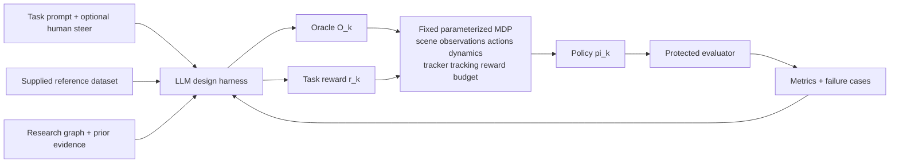

# Research strategy and Lokesh goal ledger

| status | current strategy |
|---|---|
| progress | Direct user goals, the private Lokesh meeting, the proposal, and the repository charter are separated into a traceable strategy ledger. |
| bottleneck | The future VIBE adapter, exact task set, reference-data interface, and protected success metrics are not yet supplied by Lokesh. |
| next step | Fable may challenge and edit this strategy, but must record the source, uncertainty, decision, and expected discriminating evidence for every material change. |

## Fable's authority

When a live session is verified as `claude-fable-5-1` at `max` effort, Fable may:

- establish, reorder, narrow, or replace strategy in `docs/strategy/`;
- question decisions made by Samuel, Codex, PRAXIST, or prior agents;
- create or supersede records in `docs/decisions/`;
- change hypotheses, milestones, benchmark order, knowledge-graph priorities,
  worker assignments, and stop rules;
- edit `docs/operations/CURRENT_RESEARCH_HANDOFF.md`; and
- recommend an exact charter patch when the current boundary blocks the goals.

Fable may not:

- silently change a collaborator goal, user authorization, historical result,
  frozen evaluator, or safety gate;
- treat an auto-transcript interpretation as collaborator approval;
- expand the two scientific knobs without a recorded reason and human review;
- launch the real 1M-step attempt, a PRAXIST campaign, paid API usage, or a
  formal study without its separate authorization gate; or
- hide a model substitution, failed check, contradictory result, or uncertainty.

Material disagreement is expected. Change the strategy when evidence supports
it. Ask Samuel when the proposed change alters a goal rather than the route.

## Evidence hierarchy

| priority | source | use |
|---|---|---|
| 1 | Samuel's current explicit instruction | Defines authority, priority, and authorization. |
| 2 | `docs/PROJECT_CHARTER.md` | Current repository scientific contract. |
| 3 | Private Lokesh transcript named in `CLAUDE.local.md` | Collaborator-goal evidence; auto-transcribed and fallible. |
| 4 | Research proposal named in `CLAUDE.local.md` | Compact written objective, method, evaluation, and deliverables. |
| 5 | Immutable experiment artifacts and protected metrics | Authority for measured claims. |
| 6 | Primary literature and source code | Grounds mechanisms and rival designs. |
| 7 | Prior-agent output and old RL-Sculptor repo | Leads and historical evidence only. |

Exact private-source snapshots and stable anchors are recorded in
`docs/strategy/SOURCE_MANIFEST.md`.

If sources conflict:

- follow the newest explicit user instruction;
- preserve the charter until an explicit revision is recorded;
- quote or paraphrase the conflicting source with a locator;
- state whether the conflict changes a goal, assumption, or implementation; and
- ask one concise question when choosing would materially alter the research.

## Goal ledger

The transcript is private. These are terse paraphrases, not public quotations or
claims of final collaborator approval.

| id | evidence anchor | source paraphrase | project interpretation | confidence | unresolved question |
|---|---|---|---|---|---|
| LG-01 | `LKS-A02`, `LKS-A05`, `PRP-A01` | Automate reference composition and task reward as the two scientific workstreams. | Every other knob stays frozen. A change elsewhere is adapter development or a separate family, never evidence for an oracle/reward claim. | high | Does the future VIBE interface introduce any unavoidable third input? |
| LG-02 | `LKS-A04`, `PRP-A01` | Accept a supplied reference dataset and compose its behaviors into a task-appropriate oracle. | Do not relabel motion generation, retrieval, retargeting, or dataset cleaning as oracle composition. | high | What exact reference schema and provenance will VIBE supply? |
| LG-03 | `LKS-A02`, `PRP-A01`, `PRP-A03` | Improve task reward from protected rollout metrics and failure cases. | Study reward generation as a separate factor after its interface, oracle, and evaluator are frozen. | high | Which task metrics remain independent of generated reward code? |
| LG-04 | `LKS-A05`, `PRP-A02` | Treat policy training as an external parameterized MDP; VIBE is one future implementation. | Use a small compatible MDP now and keep the adapter boundary general. | high | VIBE API, tasks, and release date are pending. |
| LG-05 | `LKS-A03` | The product loop may ask targeted questions and accept small natural-language steering; Lokesh described the human as orchestrator. | Do not assume a fully autonomous product. Keep product-level autonomy distinct from Fable's autonomy while developing the system. | high | What product autonomy level should the paper claim and evaluate? |
| LG-06 | `LKS-A06`, `PRP-A03`, `PRP-A04` | Demonstrate baseline-to-final improvement and steerable design on multiple policy-training MDPs. | Predeclare task metrics and compare oracle-only, reward-only, and combined changes under matched conditions. | high | Which MDPs and VIBE tasks will Lokesh provide? |
| LG-07 | `PRP-A04` | Target staged locomotion and loco-manipulation with transitions and recovery. | Start with an identifiable Humanoid phase/transition benchmark; locomotion alone cannot establish complex-task generality. | medium | Which proposed demonstrations are commitments versus examples? |
| LG-08 | `LKS-A07`, `LKS-A08`, `PRP-A04` | Aim for a paper/preprint and a highly usable open-source repository. | Treat reproducibility, clear CLI contracts, UI evidence, and concise docs as deliverables. | high | Publication and authorship remain contingent on results and collaborator confirmation. |
| LG-09 | `LKS-A01`, `LKS-A09` | Lead with progress, bottleneck, and next step; prefer points, figures, and tables. | Keep research updates terse and put evidence receipts below the summary. | high | none |
| LG-10 | Samuel's current instruction | Fable owns strategy and may challenge prior directions while aligning with this ledger. | Fable may park the TQC-v2 route if a recorded rival reaches a falsifiable oracle test more directly. | explicit | Which first route does Fable recommend after source audit? |
| LG-11 | Samuel's project instruction; charter | Oracle composition is the immediate focus; task reward follows as a separate workstream. | Establish tracker admission and causal reference use before comparing phase-aware composition. | explicit | Can the prerequisite use an existing admitted tracker instead of building one? |
| LG-12 | Samuel's orchestration instruction | Use autonomous Fable-led development with Sol workers and reviewer rounds. | This governs the research-development process, not the autonomy claim of the product being studied. | explicit | How much human intervention should the product experiment permit? |

## Current research hypothesis

Given a fixed policy-training MDP, fixed tracker, supplied reference clips, and
protected evaluator, an observable-state-conditioned oracle can select,
transition, and recover between local reference phases more effectively than a
matched elapsed-time oracle.

Discriminating evidence requires:

- one admitted tracker that consumes the exact actor/critic reference window;
- matched restored states with futures that require different actions;
- exact, zeroed, shuffled, and shifted reference interventions;
- an elapsed-time baseline and manually specified state/phase baseline;
- protected transition, recovery, fall, contact, task-progress, and naturalness
  metrics; and
- fixed trainer, seeds, interaction budget, checkpoint rule, and evaluator.

## Research loop

## Strategic sequence

| gate | factor allowed to change | evidence required | current state |
|---|---|---|---|
| S0: interface | none | deterministic artifact, trace, metric, and evaluator contracts | implemented; regression evidence only |
| S1: tracker admission | tracker family during development only | stable behavior plus exact immutable lineage | blocked |
| S2: causal use | reference-window intervention only | matched-state expected-direction effects | blocked |
| S3: oracle comparison | oracle only | protected matched-budget comparison | not authorized |
| S4: reward comparison | task reward only | frozen admitted oracle and protected comparison | not implemented |
| S5: combined loop | oracle and reward by predeclared schedule | held-out multi-MDP improvement and steerability | future target |

## Strategy-change record

For each material change, add one row before implementation. Cite every affected
goal ID.

| date | goal ids | decision | source/evidence | expected test | status |
|---|---|---|---|---|---|
| 2026-09-04 | `LG-01`-`LG-12` | Seed the two-knob parameterized-MDP strategy and give verified Fable authority to revise the route. | Private meeting, proposal, Samuel's instruction, project charter | Fable source audit before its first worker assignment | pending live Fable review |

## Known strategy inconsistencies

- `docs/decisions/` contains two records numbered `0002`. Fable must resolve the
  index without deleting either historical decision.
- The current TQC-v2 work may be prerequisite rigor or infrastructure drift.
  Fable must compare it with at least one existing-tracker route before deciding.
