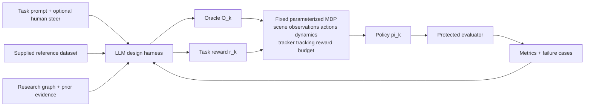

# Research strategy and Lokesh goal ledger

| status | current strategy |
|---|---|
| progress | A human-confirmed Fable session audited the ledger, added four goal rows, resolved the duplicate ADR index, replaced the local TQC bootstrap with a hash-pinned public expert base controller (ADR 0005), and opened the approved reward-first parallel track (ADR 0006). |
| bottleneck | ADR 0005 awaits its Sol review receipts; the reward track has no executable reward contract, sandbox, or predeclared task metric yet. |
| next step | Launch builder `TASK-20260904-03` when the reviews return, and the read-only reward-track design survey `TASK-20260904-04` when a slot frees. |

## Fable's authority

When a live session is verified as `claude-fable-5-1` at `max` effort, Fable may:

- establish, reorder, narrow, or replace strategy in `docs/strategy/`;
- question decisions made by Samuel, Codex, PRAXIST, or prior agents;
- create or supersede records in `docs/decisions/`;
- change hypotheses, milestones, benchmark order, knowledge-graph priorities,
  worker assignments, and stop rules;
- edit `docs/operations/CURRENT_RESEARCH_HANDOFF.md`; and
- recommend an exact charter patch when the current boundary blocks the goals.

Fable may not:

- silently change a collaborator goal, user authorization, historical result,
  frozen evaluator, or safety gate;
- treat an auto-transcript interpretation as collaborator approval;
- expand the two scientific knobs without a recorded reason and human review;
- launch the real 1M-step attempt, a PRAXIST campaign, paid API usage, or a
  formal study without its separate authorization gate; or
- hide a model substitution, failed check, contradictory result, or uncertainty.

Material disagreement is expected. Change the strategy when evidence supports
it. Ask Samuel when the proposed change alters a goal rather than the route.

## Evidence hierarchy

| priority | source | use |
|---|---|---|
| 1 | Samuel's current explicit instruction | Defines authority, priority, and authorization. |
| 2 | `docs/PROJECT_CHARTER.md` | Current repository scientific contract. |
| 3 | Private Lokesh transcript named in `CLAUDE.local.md` | Collaborator-goal evidence; auto-transcribed and fallible. |
| 4 | Research proposal named in `CLAUDE.local.md` | Compact written objective, method, evaluation, and deliverables. |
| 5 | Immutable experiment artifacts and protected metrics | Authority for measured claims. |
| 6 | Primary literature and source code | Grounds mechanisms and rival designs. |
| 7 | Prior-agent output and old RL-Sculptor repo | Leads and historical evidence only. |

Exact private-source snapshots and stable anchors are recorded in
`docs/strategy/SOURCE_MANIFEST.md`.

If sources conflict:

- follow the newest explicit user instruction;
- preserve the charter until an explicit revision is recorded;
- quote or paraphrase the conflicting source with a locator;
- state whether the conflict changes a goal, assumption, or implementation; and
- ask one concise question when choosing would materially alter the research.

## Goal ledger

The transcript is private. These are terse paraphrases, not public quotations or
claims of final collaborator approval.

| id | evidence anchor | source paraphrase | project interpretation | confidence | unresolved question |
|---|---|---|---|---|---|
| LG-01 | `LKS-A02`, `LKS-A05`, `PRP-A01` | Automate reference composition and task reward as the two scientific workstreams. | Every other knob stays frozen. A change elsewhere is adapter development or a separate family, never evidence for an oracle/reward claim. | high | Does the future VIBE interface introduce any unavoidable third input? |
| LG-02 | `LKS-A04`, `PRP-A01` | Accept a supplied reference dataset and compose its behaviors into a task-appropriate oracle. | Do not relabel motion generation, retrieval, retargeting, or dataset cleaning as oracle composition. | high | What exact reference schema and provenance will VIBE supply? |
| LG-03 | `LKS-A02`, `PRP-A01`, `PRP-A03` | Improve task reward from protected rollout metrics and failure cases. | Study reward generation as a separate factor after its interface, oracle, and evaluator are frozen. | high | Which task metrics remain independent of generated reward code? |
| LG-04 | `LKS-A05`, `PRP-A02` | Treat policy training as an external parameterized MDP; VIBE is one future implementation. | Use a small compatible MDP now and keep the adapter boundary general. | high | VIBE API, tasks, and release date are pending. |
| LG-05 | `LKS-A03` | The product loop may ask targeted questions and accept small natural-language steering; Lokesh described the human as orchestrator. | Do not assume a fully autonomous product. Keep product-level autonomy distinct from Fable's autonomy while developing the system. | high | What product autonomy level should the paper claim and evaluate? |
| LG-06 | `LKS-A06`, `PRP-A03`, `PRP-A04` | Demonstrate baseline-to-final improvement and steerable design on multiple policy-training MDPs. | Predeclare task metrics and compare oracle-only, reward-only, and combined changes under matched conditions. | high | Which MDPs and VIBE tasks will Lokesh provide? |
| LG-07 | `PRP-A04` | Target staged locomotion and loco-manipulation with transitions and recovery. | Start with an identifiable Humanoid phase/transition benchmark; locomotion alone cannot establish complex-task generality. | medium | Which proposed demonstrations are commitments versus examples? |
| LG-08 | `LKS-A07`, `LKS-A08`, `PRP-A04` | Aim for a paper/preprint and a highly usable open-source repository. | Treat reproducibility, clear CLI contracts, UI evidence, and concise docs as deliverables. | high | Publication and authorship remain contingent on results and collaborator confirmation. |
| LG-09 | `LKS-A01`, `LKS-A09` | Lead with progress, bottleneck, and next step; prefer points, figures, and tables. | Keep research updates terse and put evidence receipts below the summary. | high | none |
| LG-10 | Samuel's current instruction | Fable owns strategy and may challenge prior directions while aligning with this ledger. | Fable may park the TQC-v2 route if a recorded rival reaches a falsifiable oracle test more directly. | explicit | Answered 2026-09-04: ADR 0005 parks the v2 supervisor. |
| LG-11 | Samuel's project instruction; charter | Oracle composition is the immediate focus; task reward follows as a separate workstream. | Establish tracker admission and causal reference use before comparing phase-aware composition. | explicit | Answered 2026-09-04: the prerequisite uses a public expert base controller (ADR 0005); the tracker on top of it is still built locally; Samuel approved a parallel reward track (ADR 0006). |
| LG-12 | Samuel's orchestration instruction | Use autonomous Fable-led development with Sol workers and reviewer rounds. | This governs the research-development process, not the autonomy claim of the product being studied. | explicit | How much human intervention should the product experiment permit? |
| LG-13 | `LKS-A10`, `LKS-A11` | The lab's policy-training block fine-tunes a pretrained whole-body tracker; the reference dataset becomes the tracker's commands; training from scratch is no longer the paradigm. | Any locally trained Gymnasium tracker is a temporary public stand-in adapter, never a contribution. Minimize its cost and keep the adapter boundary identical to the lab block. | high paraphrase; medium attribution | Which command ABI and horizon will the lab tracker expose? |
| LG-14 | `LKS-A12` | VIBE access was expected within weeks of the meeting. | Prefer routes that reach a causal-use result in days; do not build multi-week Gymnasium lifecycle infrastructure. | low: auto-transcript timing, meeting date not in the source | Has VIBE or lab training code been shared yet? |
| LG-15 | `LKS-A13` | Suggested first exercise: iterate only the task reward on an already-solved locomotion MDP, for example speed, an acceleration phase, or a curriculum term. | A reward-only loop on stock `Humanoid-v5` is a valid Family-B smoke path that needs no tracker. | medium | Answered 2026-09-04: approved as a parallel track (ADR 0006). |
| LG-16 | `LKS-A14`, `LKS-A08` | The harness must run locally through CLI calls and possibly MCP servers. | CLI first; an MCP surface is a later deliverable. | medium | none |

## 2026-09-04 startup audit

### Identity

| check | observed | ceiling |
|---|---|---|
| Session-start event | `.orchestration/model-events.jsonl` records `claude-fable-5-1` for session `807bcdb2-462c-4ea8-803a-1e4b41259e12` at `15:58:52Z` | CLI-reported |
| Project hooks | Every tool call passed hooks that deny non-Fable models and non-`max` effort | CLI-reported |
| System declaration | Fable 5.1 at `max` | not provider attestation |
| Human check | Samuel ran `/status` and confirmed `claude-fable-5-1` on 2026-09-04 | human-confirmed for this session |

### Source verification

| source | manifest | observed | result |
|---|---|---|---|
| `SRC-LOKESH-TRANSCRIPT-01` | `42,294` bytes; `2b0c8af9…6220c` | same | match |
| `SRC-PROPOSAL-01` | `166,679` bytes; `d97df2c7…8013` | same | match |
| PRAXIST `2608.25955v1` | not in the private manifest | `3,806,276` bytes; `360967ac…c9fc` | public paper; engineering-methods source only |

### Ledger check

Rows `LG-01` to `LG-12` hold against the raw text; every attribution stays
medium because the transcript has no speaker labels. Discrepancies:

| id | finding | consequence |
|---|---|---|
| D-01 | The ledger omitted the fine-tuning paradigm: the collaborator's MDP contains a pretrained whole-body tracker, and the repository's critical path was building that component from scratch. | New `LG-13`. Tracker work is stand-in adapter work; choose the cheapest admissible base (ADR 0005). |
| D-02 | The ledger omitted the expected VIBE timing. | New `LG-14`. Weeks-long Gymnasium lifecycle infrastructure is not justified. |
| D-03 | The ledger omitted the suggested reward-only locomotion exercise. | New `LG-15`. Route D is the recorded rival and needs Samuel's ordering answer. |
| D-04 | `docs/decisions/` had two records numbered `0002`. | The 2026-09-03 bootstrap record is now ADR 0004 with a renumbering note; `docs/decisions/README.md` indexes all records. |
| D-05 | `README.md`, `experiments/README.md`, and the E1 note still present the local TQC development screen as the next step. | Updated by the builder slice after the gate answer. |
| D-06 | The master prompt's status row says shell authentication may be missing; the handoff says it passed. | Handoff is current; prompt row is stale and harmless. |
| D-07 | `praxist/README.md` records `gpt-5.6-luna` as the PRAXIST doctor's model. | PRAXIST is not in use; note only. |

### TQC-v2 verdict

| fact | value |
|---|---|
| Repository age at audit | `2` days (first commit 2026-09-02 18:44 PDT) |
| TQC lifecycle commits | `18` between 2026-09-03 16:02 and 22:23 PDT, then `4,499` uncommitted insertions |
| Largest uncommitted module | `tqc_development_supervisor_v2.py`, `3,835` lines |
| Open lifecycle findings | `TQC-P1-01` to `TQC-P1-08`, all process control |
| Focused test receipt | `tests/experiments`: `822 passed` in `154 s` at `16:05-16:08Z` on the WIP tree |
| Guarded job cost | E0: `619.66` steps/s, so `1M` steps is about `27 min`; peak RSS `4.25 GB` |
| Trained controller produced | none |

Verdict: infrastructure detour. The science needs a base controller and then a
reference-conditioned tracker; it does not need a one-attempt supervisor.

### Route comparison

| route | science gained before E4/E5 | compute | implementation risk | artifact availability | time to a falsifiable causal-use result |
|---|---|---|---|---|---|
| A. Finish the v2 supervisor | none | `27 min` to `3 h` per attempt | high | local | weeks |
| B. Plain receipted local training | none | same per attempt; `9-48 h` for 20M steps | low to moderate | local | days to a base, then E1-E5 |
| C. Public expert import, data-only (ADR 0005) | none by itself; enables E1 after contender construction | base acquisition only: `7.4 MB` download and one 20-reset evaluation; E2-E5 compute unchanged | low to moderate; security review required | public, hash-pinned, same model and observation/action ABI | unmeasured estimate: days to E1/E2 |
| D. Reward-first loop on stock `Humanoid-v5` | end-to-end test of the reward sub-loop and `RQ-R`; no tracker needed | per cycle: matched `r_0`, candidate, reward-scale, and term-removal arms, each `27 min` TQC or `11 min` PPO per 1M steps per seed | moderate: executable reward contract and sandbox not implemented | local | unmeasured estimate: `1-2` weeks; now a parallel track |
| E. Embodiment-matched public tracker (BeyondMimic, PHC class) | closest to the lab block | training needs a remote NVIDIA GPU | high: new adapter | public checkpoints exist; GPU absent | blocked until GPU or VIBE |
| F. Extend the 002A matched-input probe to a restored-state one-step intervention | falsifiable input/action sensitivity on the existing local checkpoint | minutes | low | local | fastest sensitivity result; reaches neither behavioral E5 nor admission |

Schedule and risk entries are unmeasured planning estimates (scientific review finding `Q4`). Route F is cheap and non-blocking; it is an optional builder slice after packet 03.

Recommended: **C with B as the built-in fallback**. Rival **D** was approved by
Samuel on 2026-09-04 as a parallel track (ADR 0006). E becomes relevant when
VIBE or a GPU host arrives.

### Answers from Samuel (2026-09-04)

| id | answer | consequence |
|---|---|---|
| Q1 | approved: data-only import of the public expert | Route C proceeds; route B stays the fallback. |
| Q2 | approved: reward-first parallel track | ADR 0006 opens Family B on stock `Humanoid-v5` in parallel; `LG-11` ordering is relaxed to two tracks. |
| veto | not vetoed | The builder moves the v2 files to `wip/tqc-v2-attempt-supervisor`. |

Samuel also confirmed `claude-fable-5-1` through `/status` and instructed
Fable to run Sol workers directly, delegate token-heavy work, and stop asking
about routine decisions. Hard gates in the charter still require his
authorization.

## Current research hypothesis

Given a fixed policy-training MDP, fixed tracker, supplied reference clips, and
protected evaluator, an observable-state-conditioned oracle can select,
transition, and recover between local reference phases more effectively than a
matched elapsed-time oracle.

Discriminating evidence requires:

- one admitted tracker that consumes the exact actor/critic reference window;
- matched restored states with futures that require different actions;
- exact, zeroed, shuffled, and shifted reference interventions;
- an elapsed-time baseline and manually specified state/phase baseline;
- protected transition, recovery, fall, contact, task-progress, and naturalness
  metrics; and
- fixed trainer, seeds, interaction budget, checkpoint rule, and evaluator.

## Research loop

## Strategic sequence

| gate | factor allowed to change | evidence required | current state |
|---|---|---|---|
| S0: interface | none | deterministic artifact, trace, metric, and evaluator contracts | implemented; regression evidence only |
| S1: tracker admission | tracker family during development only | stable behavior plus exact immutable lineage | route recorded in ADR 0005; base controller import pending review and gate |
| S2: causal use | reference-window intervention only | matched-state expected-direction effects | blocked by S1 |
| S3: oracle comparison | oracle only | protected matched-budget comparison | not authorized |
| S4: reward comparison | task reward only | frozen oracle (none on the stock MDP) and protected comparison | parallel track approved 2026-09-04; design survey pending (ADR 0006) |
| S5: combined loop | oracle and reward by predeclared schedule | held-out multi-MDP improvement and steerability | future target |

## Strategy-change record

For each material change, add one row before implementation. Cite every affected
goal ID.

| date | goal ids | decision | source/evidence | expected test | status |
|---|---|---|---|---|---|
| 2026-09-04 | `LG-01`-`LG-12` | Seed the two-knob parameterized-MDP strategy and give verified Fable authority to revise the route. | Private meeting, proposal, Samuel's instruction, project charter | Fable source audit before its first worker assignment | done 2026-09-04 |
| 2026-09-04 | `LG-13`-`LG-16` | Add four ledger rows and anchors `LKS-A10`-`LKS-A14`. | Raw transcript re-read at hash `2b0c8af9…` | Samuel confirms or corrects attribution | recorded |
| 2026-09-04 | `LG-01`, `LG-04`, `LG-10`, `LG-11`, `LG-13`, `LG-14` | Park the TQC-v2 attempt supervisor; adopt the public expert base controller with a data-only import and a receipted local fallback (ADR 0005). | Anchors `LKS-A10`-`LKS-A12`; Hugging Face artifact record; E0 receipt; commit timeline; eight open P1 findings | Sol scientific and adversarial reviews; then contender construction, E1, and the 20-reset development screen on the imported actor | recorded; scientific and adversarial reviews both `GO-WITH-FIXES` (no P0; `4` and `9` P1) folded 2026-09-04; builder split into slices 03A and 03B; gate Q1 approved 2026-09-04 |
| 2026-09-04 | `LG-11`, `LG-15` | Record the reward-first loop as the rival route; not adopted. | Anchor `LKS-A13`; charter Family B | Samuel's ordering answer (Q2) | approved 2026-09-04; see ADR 0006 |
| 2026-09-04 | none | Renumber the duplicate ADR `0002` bootstrap record to ADR 0004; add the decisions index. | `docs/decisions/` listing | unique index | done |
| 2026-09-04 | `LG-03`, `LG-06`, `LG-11`, `LG-15` | Open the reward-first parallel track on stock `Humanoid-v5` (ADR 0006). | Samuel's answer `reward-first-track: approved`; anchor `LKS-A13`; charter Family B | Sol design survey, then a matched `r_0` baseline and one exploratory candidate cycle | recorded; design pending |

## Known strategy inconsistencies

- `README.md`, `experiments/README.md`, and
  `experiments/bootstrap_tqc_humanoid/E1_INITIALIZATION_IDENTITY.md` still
  describe the local TQC development screen and a ban on loading uploaded
  checkpoints. They change only after Samuel answers Q1 and the builder slice
  lands.
- Speaker attribution in the transcript remains inferential. No decision in
  this audit depends on disputed wording.
