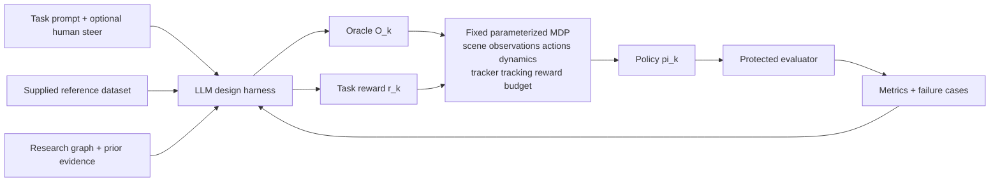

# Research strategy and Lokesh goal ledger

| status | current strategy |
|---|---|
| progress | G1 posture-course family (frozen GMT tracker plus residual PPO, oracle O_k and reward r_k as the two knobs): 37 training runs and about 2.3M transitions through 2026-09-07; the composed oracle loop runs end to end with data-only proposals through the firewall; a finite-horizon runtime correction (study 012) is retained as the default semantics; the O7 four-state oracle survives 20 s at zero residual with all transitions executed. No configuration passes the full task. |
| bottleneck | Two structural failures shared by every retained run: lateral drift (2.2 to 5.7 m against a 0.75 m corridor) because the tracker is yaw-blind and the after-walk clip commands a turn, and a crouch that never reaches the 0.50 m dip gate. Astra's forward-kinematics audit (2026-09-07) shows the supplied crouch clip's deepest frames are not contact-consistent on the G1 model (0.146 m foot penetration), so the dip gate rests on an inconsistent reference frame; the bounded depth reward (study 014) was active and did not deepen the crouch. |
| next step | Study 015 is done: the balanced after-walk crop removed the commanded turn and the backtracking and reached 9/11 task gates, but heading still veers 1.4 rad over the 15 s after-walk (0.93 rad commanded residue plus 0.36 rad uncommanded, mostly at hand-over) and lateral reaches 10.9 m. Fable's candidate next test, Astra's call: a zero-residual heading-feedback probe on the issued yaw-rate channel with O7b as the substrate, or an after window balanced below 0.01 rad/s; not both in one probe. For depth, the reference is the suspect: a consistency control from a retained executed crouch (option B), then a contact-aware repaired reference ladder (option A), both labeled reference-supply adapter work, never oracle composition. The frozen 0.50 m dip gate is preserved with its uncertainty reported; Samuel is informed of the finding, and continuing to study the gate needs no new decision from him. |

## Fable's authority

When a live session is verified as `claude-fable-5-1` at `max` effort, Fable may:

- establish, reorder, narrow, or replace strategy in `docs/strategy/`;
- question decisions made by Samuel, Codex, PRAXIST, or prior agents;
- create or supersede records in `docs/decisions/`;
- change hypotheses, milestones, benchmark order, knowledge-graph priorities,
  worker assignments, and stop rules;
- edit `docs/operations/CURRENT_RESEARCH_HANDOFF.md`; and
- recommend an exact charter patch when the current boundary blocks the goals.

Fable may not:

- silently change a collaborator goal, user authorization, historical result,
  frozen evaluator, or safety gate;
- treat an auto-transcript interpretation as collaborator approval;
- expand the two scientific knobs without a recorded reason and human review;
- launch the real 1M-step attempt, a PRAXIST campaign, paid API usage, or a
  formal study without its separate authorization gate; or
- hide a model substitution, failed check, contradictory result, or uncertainty.

Material disagreement is expected. Change the strategy when evidence supports
it. Ask Samuel when the proposed change alters a goal rather than the route.

## Evidence hierarchy

| priority | source | use |
|---|---|---|
| 1 | Samuel's current explicit instruction | Defines authority, priority, and authorization. |
| 2 | `docs/PROJECT_CHARTER.md` | Current repository scientific contract. |
| 3 | Private Lokesh transcript named in `CLAUDE.local.md` | Collaborator-goal evidence; auto-transcribed and fallible. |
| 4 | Research proposal named in `CLAUDE.local.md` | Compact written objective, method, evaluation, and deliverables. |
| 5 | Immutable experiment artifacts and protected metrics | Authority for measured claims. |
| 6 | Primary literature and source code | Grounds mechanisms and rival designs. |
| 7 | Prior-agent output and old RL-Sculptor repo | Leads and historical evidence only. |

Exact private-source snapshots and stable anchors are recorded in
`docs/strategy/SOURCE_MANIFEST.md`.

If sources conflict:

- follow the newest explicit user instruction;
- preserve the charter until an explicit revision is recorded;
- quote or paraphrase the conflicting source with a locator;
- state whether the conflict changes a goal, assumption, or implementation; and
- ask one concise question when choosing would materially alter the research.

## Goal ledger

The transcript is private. These are terse paraphrases, not public quotations or
claims of final collaborator approval.

| id | evidence anchor | source paraphrase | project interpretation | confidence | unresolved question |
|---|---|---|---|---|---|
| LG-01 | `LKS-A02`, `LKS-A05`, `PRP-A01` | Automate reference composition and task reward as the two scientific workstreams. | Every other knob stays frozen. A change elsewhere is adapter development or a separate family, never evidence for an oracle/reward claim. | high | Does the future VIBE interface introduce any unavoidable third input? |
| LG-02 | `LKS-A04`, `PRP-A01` | Accept a supplied reference dataset and compose its behaviors into a task-appropriate oracle. | Do not relabel motion generation, retrieval, retargeting, or dataset cleaning as oracle composition. | high | What exact reference schema and provenance will VIBE supply? |
| LG-03 | `LKS-A02`, `PRP-A01`, `PRP-A03` | Improve task reward from protected rollout metrics and failure cases. | Study reward generation as a separate factor after its interface, oracle, and evaluator are frozen. | high | Which task metrics remain independent of generated reward code? |
| LG-04 | `LKS-A05`, `PRP-A02` | Treat policy training as an external parameterized MDP; VIBE is one future implementation. | Use a small compatible MDP now and keep the adapter boundary general. | high | VIBE API, tasks, and release date are pending. |
| LG-05 | `LKS-A03` | The product loop may ask targeted questions and accept small natural-language steering; Lokesh described the human as orchestrator. | Do not assume a fully autonomous product. Keep product-level autonomy distinct from Fable's autonomy while developing the system. | high | What product autonomy level should the paper claim and evaluate? |
| LG-06 | `LKS-A06`, `PRP-A03`, `PRP-A04` | Demonstrate baseline-to-final improvement and steerable design on multiple policy-training MDPs. | Predeclare task metrics and compare oracle-only, reward-only, and combined changes under matched conditions. | high | Which MDPs and VIBE tasks will Lokesh provide? |
| LG-07 | `PRP-A04` | Target staged locomotion and loco-manipulation with transitions and recovery. | Start with an identifiable Humanoid phase/transition benchmark; locomotion alone cannot establish complex-task generality. | medium | Which proposed demonstrations are commitments versus examples? |
| LG-08 | `LKS-A07`, `LKS-A08`, `PRP-A04` | Aim for a paper/preprint and a highly usable open-source repository. | Treat reproducibility, clear CLI contracts, UI evidence, and concise docs as deliverables. | high | Publication and authorship remain contingent on results and collaborator confirmation. |
| LG-09 | `LKS-A01`, `LKS-A09` | Lead with progress, bottleneck, and next step; prefer points, figures, and tables. | Keep research updates terse and put evidence receipts below the summary. | high | none |
| LG-10 | Samuel's current instruction | Fable owns strategy and may challenge prior directions while aligning with this ledger. | Fable may park the TQC-v2 route if a recorded rival reaches a falsifiable oracle test more directly. | explicit | Answered 2026-09-04: ADR 0005 parks the v2 supervisor. |
| LG-11 | Samuel's project instruction; charter | Oracle composition is the immediate focus; task reward follows as a separate workstream. | Establish tracker admission and causal reference use before comparing phase-aware composition. | explicit | Answered 2026-09-04: the prerequisite uses a public expert base controller (ADR 0005); the tracker on top of it is still built locally; Samuel approved a parallel reward track (ADR 0006). |
| LG-12 | Samuel's orchestration instruction | Use autonomous Fable-led development with Sol workers and reviewer rounds. | This governs the research-development process, not the autonomy claim of the product being studied. | explicit | How much human intervention should the product experiment permit? |
| LG-13 | `LKS-A10`, `LKS-A11` | The lab's policy-training block fine-tunes a pretrained whole-body tracker; the reference dataset becomes the tracker's commands; training from scratch is no longer the paradigm. | Any locally trained Gymnasium tracker is a temporary public stand-in adapter, never a contribution. Minimize its cost and keep the adapter boundary identical to the lab block. | high paraphrase; medium attribution | Which command ABI and horizon will the lab tracker expose? |
| LG-14 | `LKS-A12` | VIBE access was expected within weeks of the meeting. | Prefer routes that reach a causal-use result in days; do not build multi-week Gymnasium lifecycle infrastructure. | low: auto-transcript timing, meeting date not in the source | Has VIBE or lab training code been shared yet? |
| LG-15 | `LKS-A13` | Suggested first exercise: iterate only the task reward on an already-solved locomotion MDP, for example speed, an acceleration phase, or a curriculum term. | A reward-only loop on stock `Humanoid-v5` is a valid Family-B smoke path that needs no tracker. | medium | Answered 2026-09-04: approved as a parallel track (ADR 0006). |
| LG-16 | `LKS-A14`, `LKS-A08` | The harness must run locally through CLI calls and possibly MCP servers. | CLI first; an MCP surface is a later deliverable. | medium | none |

## 2026-09-04 startup audit

### Identity

| check | observed | ceiling |
|---|---|---|
| Session-start event | `.orchestration/model-events.jsonl` records `claude-fable-5-1` for session `807bcdb2-462c-4ea8-803a-1e4b41259e12` at `15:58:52Z` | CLI-reported |
| Project hooks | Every tool call passed hooks that deny non-Fable models and non-`max` effort | CLI-reported |
| System declaration | Fable 5.1 at `max` | not provider attestation |
| Human check | Samuel ran `/status` and confirmed `claude-fable-5-1` on 2026-09-04 | human-confirmed for this session |

### Source verification

| source | manifest | observed | result |
|---|---|---|---|
| `SRC-LOKESH-TRANSCRIPT-01` | `42,294` bytes; `2b0c8af9…6220c` | same | match |
| `SRC-PROPOSAL-01` | `166,679` bytes; `d97df2c7…8013` | same | match |
| PRAXIST `2608.25955v1` | not in the private manifest | `3,806,276` bytes; `360967ac…c9fc` | public paper; engineering-methods source only |

### Ledger check

Rows `LG-01` to `LG-12` hold against the raw text; every attribution stays
medium because the transcript has no speaker labels. Discrepancies:

| id | finding | consequence |
|---|---|---|
| D-01 | The ledger omitted the fine-tuning paradigm: the collaborator's MDP contains a pretrained whole-body tracker, and the repository's critical path was building that component from scratch. | New `LG-13`. Tracker work is stand-in adapter work; choose the cheapest admissible base (ADR 0005). |
| D-02 | The ledger omitted the expected VIBE timing. | New `LG-14`. Weeks-long Gymnasium lifecycle infrastructure is not justified. |
| D-03 | The ledger omitted the suggested reward-only locomotion exercise. | New `LG-15`. Route D is the recorded rival and needs Samuel's ordering answer. |
| D-04 | `docs/decisions/` had two records numbered `0002`. | The 2026-09-03 bootstrap record is now ADR 0004 with a renumbering note; `docs/decisions/README.md` indexes all records. |
| D-05 | `README.md`, `experiments/README.md`, and the E1 note still present the local TQC development screen as the next step. | Updated by the builder slice after the gate answer. |
| D-06 | The master prompt's status row says shell authentication may be missing; the handoff says it passed. | Handoff is current; prompt row is stale and harmless. |
| D-07 | `praxist/README.md` records `gpt-5.6-luna` as the PRAXIST doctor's model. | PRAXIST is not in use; note only. |

### TQC-v2 verdict

| fact | value |
|---|---|
| Repository age at audit | `2` days (first commit 2026-09-02 18:44 PDT) |
| TQC lifecycle commits | `18` between 2026-09-03 16:02 and 22:23 PDT, then `4,499` uncommitted insertions |
| Largest uncommitted module | `tqc_development_supervisor_v2.py`, `3,835` lines |
| Open lifecycle findings | `TQC-P1-01` to `TQC-P1-08`, all process control |
| Focused test receipt | `tests/experiments`: `822 passed` in `154 s` at `16:05-16:08Z` on the WIP tree |
| Guarded job cost | E0: `619.66` steps/s, so `1M` steps is about `27 min`; peak RSS `4.25 GB` |
| Trained controller produced | none |

Verdict: infrastructure detour. The science needs a base controller and then a
reference-conditioned tracker; it does not need a one-attempt supervisor.

### Route comparison

| route | science gained before E4/E5 | compute | implementation risk | artifact availability | time to a falsifiable causal-use result |
|---|---|---|---|---|---|
| A. Finish the v2 supervisor | none | `27 min` to `3 h` per attempt | high | local | weeks |
| B. Plain receipted local training | none | same per attempt; `9-48 h` for 20M steps | low to moderate | local | days to a base, then E1-E5 |
| C. Public expert import, data-only (ADR 0005) | none by itself; enables E1 after contender construction | base acquisition only: `7.4 MB` download and one 20-reset evaluation; E2-E5 compute unchanged | low to moderate; security review required | public, hash-pinned, same model and observation/action ABI | unmeasured estimate: days to E1/E2 |
| D. Reward-first loop on stock `Humanoid-v5` | end-to-end test of the reward sub-loop and `RQ-R`; no tracker needed | per cycle: matched `r_0`, candidate, reward-scale, and term-removal arms, each `27 min` TQC or `11 min` PPO per 1M steps per seed | moderate: executable reward contract and sandbox not implemented | local | unmeasured estimate: `1-2` weeks; now a parallel track |
| E. Embodiment-matched public tracker (BeyondMimic, PHC class) | closest to the lab block | training needs a remote NVIDIA GPU | high: new adapter | public checkpoints exist; GPU absent | blocked until GPU or VIBE |
| F. Extend the 002A matched-input probe to a restored-state one-step intervention | falsifiable input/action sensitivity on the existing local checkpoint | minutes | low | local | fastest sensitivity result; reaches neither behavioral E5 nor admission |

Schedule and risk entries are unmeasured planning estimates (scientific review finding `Q4`). Route F is cheap and non-blocking; it is an optional builder slice after packet 03.

Recommended: **C with B as the built-in fallback**. Rival **D** was approved by
Samuel on 2026-09-04 as a parallel track (ADR 0006). E becomes relevant when
VIBE or a GPU host arrives.

### Answers from Samuel (2026-09-04)

| id | answer | consequence |
|---|---|---|
| Q1 | approved: data-only import of the public expert | Route C proceeds; route B stays the fallback. |
| Q2 | approved: reward-first parallel track | ADR 0006 opens Family B on stock `Humanoid-v5` in parallel; `LG-11` ordering is relaxed to two tracks. |
| veto | not vetoed | The builder moves the v2 files to `wip/tqc-v2-attempt-supervisor`. |

Samuel also confirmed `claude-fable-5-1` through `/status` and instructed
Fable to run Sol workers directly, delegate token-heavy work, and stop asking
about routine decisions. Hard gates in the charter still require his
authorization.

## Experiment 003 frame: composition first (2026-09-05)

Samuel's concern, relayed through Astra after the September 3 running video:
the oracle plan must test what the collaborator means by reference
composition, not single-clip timing. The independent transcript reading
(anchors `19721` stitch behaviors, `25699` state machine or composition,
`26473` walking-then-running abstraction, `29277` a new composition each
iteration) supports this frame:

| item | decision |
|---|---|
| What composition is | Given a supplied behavior library, the oracle decides at each step which behavior segment is active, its phase, when and how to transition, and how to recover and rejoin, so that tracking becomes task-optimal; references are selected and stitched, never generated or improved. |
| Current plan's role | Import, corpus, Tier-D, E3, E4, and E5 are the stand-in adapter's tracker prerequisites, not a composition experiment. Single-clip retiming and the four-panel video are tracker diagnostics at most. |
| Experiment 003 | A three-behavior locomotion composition on stock `Humanoid-v5` using the public expert, medium, and simple gaits as the library: hold one gait, switch on a state condition, return, and rejoin after an injected push. The LLM designs the oracle program (segment use, guards, dwell, phase transfer, recovery) from the task text and the library manifest; the protected evaluator reports transition success, phase error, resynchronization latency, falls, and task progress; the feedback loop revises guards, dwell, and phase transfer after observed failures; baselines are elapsed-time playback and a hand-written state machine. Reward stays frozen. |
| Consequence for E4 | The tracker screen must include gait-transition episodes, not only single-gait ones, because the composition task requires following all three gaits and their transitions. |
| Open questions for Samuel or Lokesh | Selection-only versus blended references; online oracle execution inside the training framework; joint versus alternating revision of oracle and reward; which task-state signals the lab MDP exposes; acceptability of the three public gaits as the first benchmark. |

## Corpus result and the instrumentation divergence (2026-09-05)

Slice 03B (`41b2597`) is the first result on the tracker chain that rests on
measured behavior rather than on artifact integrity.

| item | result | consequence |
|---|---|---|
| Tier-D replay (E2 for the corpus) | `108/108` clips, `108,000/108,000` transitions exact in a separate process | the three actors are deterministic same-runtime references; the certificate binds clip bytes, runtime, and certifier source |
| E3 fork corpus | `27/36` blocks qualified; pairs expert–medium `32/36`, expert–simple `29/36`; every pair failure came from a branch that fell, left the upright band, or touched the floor with a non-foot body, never from the first-action or future-variation thresholds | forks from a shared state are identifiable by actor; the surviving blocks are biased toward states from which all three actors stay upright for 1,000 steps |
| Role split after failures | training blocks `9/12` (`120002`, `120008`, `120009` failed); E4 screen blocks `14/20` (`120102`, `120103`, `120105`, `120111`, `120118`, `120119` failed); sealed E5 blocks `4/4` | packet B must be designed on `9/14/4` with no seed replacement; if the training role needs more blocks, that is a new predeclared draw, not a refill |
| Actor stability over 1,000 steps | expert fell in `2/36` blocks (healthy boundaries `171` and `629`); medium fell in `1/36` and left the upright band in `1/36`; simple fell in `2/36` and left the upright band in `3/36` | the screen's healthy and upright gates on `20` resets will sit near their thresholds for the expert; a `20/20` expectation is not supported by this evidence |
| Expert development screen | no result: seed `96001` stopped on the plain-versus-instrumented reward canary before any gate was computed | the substep-contact instrumentation changes the observable MDP at some step; every path that uses it (corpus collector, screen, reward-lane protected evaluator) inherits the question of which environment is the frozen one |

Decisions:

1. The v1 run stays as recorded; it is not retried or relabeled. The fix ships
   as its own slice with a regression canary that runs the expert actor for
   `1,000` steps in both environments and compares state, observation, reward,
   and termination at every step.
2. If the diagnostic shows an instrumentation-only extra operation, the plain
   environment remains the frozen MDP (ADR 0004 boundary unchanged) and the
   instrumentation must become observation-preserving. If the plain path is
   the one out of order, or the two cannot be reconciled without changing
   contact readback semantics, the frozen runtime is redeclared in a decision
   record before any rerun, and the corpus certificates are reinterpreted under
   that declaration; they remain valid same-runtime certificates either way.
3. Both lanes share the instrumentation. Astra's protected evaluator must not
   accept a candidate-reward result until the equivalence question is closed,
   because the eight-step smoke in the reward lane cannot detect a divergence
   that appears after hundreds of steps.

### Preregistration for E4 and E5 admission (2026-09-05T07:20Z, written before Fable read any run v2 result)

The scientific review of `41b2597` (SCI-03) found that the E3 certificate's
`qualifying_corpus` boolean becomes true when one block passes and that no
corpus-level admission rule existed. The following rule is fixed now, after
the v1 result and before any later run's E3 certificate is read.

| rule | value |
|---|---|
| Block admission | A block is admitted for its predeclared role only if all three branches pass the locked branch gates and both non-expert pairs pass, in the E3 certificate of the corpus run version that packet B binds. The certificate publishes a per-block, per-branch admission map; the single boolean is renamed to `has_qualifying_e3_block` and carries no admission meaning. |
| Roles | Unchanged seed ranges: training `120001`-`120012`, E4 screen `120101`-`120120`, sealed E5 `120201`-`120204`. Failed blocks are dropped from their role; no seed replacement, no re-draw, no role transfer, and no post-hoc filtering of branches inside an admitted block. |
| Training use | Reference-state-initialization cells are the admitted training blocks times three origin actors, consumed by a balanced deterministic scheduler; the hold, one-way, and round-trip schedule classes are balanced within each cell. |
| E4 screen | The fifteen-cell gait-transition design from the 2026-09-05 design survey (three holds, four fixed one-way, four random one-way, two fixed round-trip, two random round-trip; four replicates; `60` episodes per checkpoint; blocks allocated over the sorted admitted screen list by `(4c + j) mod n`). Gates: whole-episode tracking RMSE within the reward scales, the safety and structural gates on every boundary, hold max-error gates, resynchronization within `64` steps after every switch. Pass rule: `>= 57/60` episodes and `>= 3/4` in every cell per checkpoint; `>= 4/5` checkpoints for the family, all five present. E4 can eliminate a tracker family; it cannot establish reference use. |
| E5 | Only the admitted sealed blocks are opened, by slice C alone, at the eight fixed anchors; the per-checkpoint matched-state gate is `>= 80%` of anchors (`77/96` when all four sealed blocks are admitted); the family rule is `>= 4/5` checkpoints. The four formal arms stay as ADR 0005 froze them; wrong-clip is diagnostic. |
| Labels | Tracker training runs carry `residual_tracker_development_v1` (or the family name a superseding decision record assigns) and E4 carries `tracker_family_screen_v1`, both with `claim_status = no_tracker_admission_before_E5`; `matched_study` is never used on this chain. |
| Composer authority | The survey reports that at shared states the medium and simple actors' first controls differ from the expert's by up to about `0.7` while the residual's authority is `0.08`. Whether slice B keeps the residual composer or moves to the predeclared expanded-TQC family is decided in a decision record before packet B is written, on a read-only whole-clip authority-gap analysis, never by widening authority after a failed run. |

## Alignment audit against the transcript (2026-09-05T17:50Z)

Samuel asked for a check that the work aligns with the collaborator's stated
goal. Source: the raw transcript (`SOURCE_MANIFEST.md`, anchors `LKS-A01`-`LKS-A14`),
re-read in full on 2026-09-05. Paraphrases only; no raw private text.

| collaborator requirement (transcript) | current state | verdict | action |
|---|---|---|---|
| Two scientific knobs only: compose references into a task-optimal program, and iteratively enhance a task reward; the MDP, tracker, tracking reward, observations, and scene are frozen and given (`LG-01`, `LG-02`, `LG-03`, `LKS-A11`-`LKS-A13`) | Charter and strategy state this exactly; no cycle of either knob has executed on any MDP | aligned in framing, not in execution | make one full cycle run before any further substrate work |
| Fine-tuning paradigm: a pretrained tracker anchors behavior, the task reward nudges; do not solve training-from-scratch problems (`LG-13`, `LKS-A10`) | The tracker chain (E1-E5) was built as a stand-in for the tracker the collaborator will supply; E5 causal-use ablations study the stand-in, not the harness | drifted | E5 leaves the critical path; the local tracker becomes a fine-tuning runtime warm-started from the expert, gated by a utility smoke, not an admission chain |
| Start with something very simple: an existing locomotion policy, steer its speed with reward edits, then move to the real block when it arrives (`LG-15`, `LKS-A13`) | Astra's reward lane has a verified sandbox and a target-speed candidate family but has executed no candidate; my lane produced no policy result | drifted | first joint demo target: the reward loop on the fine-tuning runtime with the target-speed task, cycle 0 (stock reward) and cycle 1 (one candidate) |
| Composition is the harder unsolved knob; the LLM is good at designing the program (which behavior, when, transitions) (`LG-02`, `LG-06`, `LKS-A06`-`LKS-A09`) | Experiment 003 frame recorded; the library (three gaits with certified clips) exists; no oracle designed or evaluated | ready, not started | packet `E003-C0`: cycle 0 and 1 with the library executed by controller switching, so the loop runs before any tracker is trained |
| Deliverable: a demonstration of baseline-to-improved performance and steerable design on a couple of MDPs, a preprint, and an embarrassingly convenient open-source tool (`LG-05`, `LG-16`) | Rigor is high; usability is nil: no CLI runs a cycle | drifted | every cycle is a CLI command producing a JSON report and a one-page table; the harness code path is the product |
| Communication: crisp progress, bottleneck, next step; tables over prose (`LKS-A05`) | Handoff and strategy follow the trifecta | aligned | keep |
| Do not chase ten leaks with duct tape; find the one fundamental issue (`LKS-A04`) | Two review rounds produced fifteen hardening P1s on the corpus pipeline; none changes a scientific conclusion | drifted | hardening backlog file; only findings that change a claim are folded into slices |

Decisions from the audit (strategy authority; Samuel may reverse any of them; ADR 0008):

1. Composition-loop cycle 0 runs now on stock `Humanoid-v5`. The library is the
   three public actors; the oracle is a state-machine program over them
   (active behavior, state guards, dwell, transition, recovery); the executor
   switches controllers, which stands in for a frozen tracker following
   composed references and is labeled as such. Task: a speed-profile task the
   library cannot solve with one behavior. Baselines: elapsed-time playback and
   a hand-written state machine. Cycle 1 is one LLM-designed revision from the
   cycle-0 report. Evidence label `exploratory_oracle_cycle`.
2. The residual tracker family is retired before training on the authority-gap
   evidence. The local policy-training block becomes a fine-tuning runtime
   warm-started from the expert with full authority (the predeclared
   expanded-TQC family), gated by E1 identity and a utility smoke; it serves
   both knobs: composed references plus tracking reward for the oracle knob,
   and candidate task rewards for the reward knob.
3. E5 and the hardening backlog leave the critical path. The scientifically
   necessary review items (admission map, screen label, process IDs out of
   scientific digests, E3 manifest wording) are folded into the next slice that
   touches those files.
4. The imported expert stays the development base with its failed screen
   recorded (`19/20`); no local training fallback is requested.
5. The sealed E5 blocks were read by the authority-gap analysis and are no
   longer sealed; if E5 ever runs, it draws new sealed seeds first.

## Composition loop results (2026-09-05T18:51Z)

| cycle | designer | arm | median speed MAE (m/s) | falls | note |
|---|---|---|---:|---:|---|
| 0 | predeclared | `single_fast` (expert only) | 2.07 | 0/20 | best score; ignores the slow third |
| 0 | predeclared | `single_slow` (simple only) | 3.31 | 0/20 | |
| 0 | predeclared | `playback` (switch at 300 and 600) | 3.18 | 20/20 | falls after the first switch |
| 0 | builder | `handwritten` (velocity and time guards) | 3.21 | 20/20 | never reached `simple` |
| 1 | read-only LLM from the prompt only | staged through `medium`, dwell 30, velocity gates, recovery | 3.22 | 20/20 | fell 22-57 steps after every expert-to-medium switch at step 300 |

Task T1: fast (expert median `5.52 m/s`) for steps `0`-`299`, slow (simple
median `0.89 m/s`) for `300`-`599`, fast again to `999`; `20` fixed seeds;
metric from simulator state; label `exploratory_oracle_cycle`.

What the loop established: the designer can produce contract-valid programs
from the prompt alone, the reports are deterministic (`20/20` replay), and
none of the three tested step-300 handovers at running speed survived;
alternative phases, timings, and state-conditioned handovers are untested
(correction recorded after the scientific review of `74d7aa5`, SCI-002). That is the collaborator's point restated
as a measurement: the composition knob needs a tracker that follows a
composed reference and learns the transition (fine-tuning runtime), and the
harness's job includes detecting infeasibility and reporting it to the human
with options rather than iterating blindly.

### Corrections and phase B endpoint after the Experiment 003 reviews (2026-09-05T20:23Z)

| item | correction |
|---|---|
| Steering text (SCI-001) | Fable's cycle-2 steering said every cycle-0 and cycle-1 fall followed an expert-to-medium switch by `22`-`57` steps. The cycle-0 playback arm switched expert to simple and fell `20`-`25` steps later; the handwritten arm switched expert to medium and fell `23`-`60` steps later; only the cycle-1 candidate has the `22`-`57` range. The cycle-2 designer worked from that inaccurate summary; the historical text stays, with this correction attached in the cycle record. |
| Infeasibility wording (SCI-002) | "Cannot hand over" is replaced everywhere by "none of the three tested step-300 running-speed handovers survived; alternative phases, timings, and state-conditioned handovers remain untested". |
| Evaluator lineage (SCI-004, R03, R04) | The runtime fingerprint hashed only the executor while the evaluator changed each cycle, and reports embed timestamps, so identical reruns change hashes. The repair slice binds runtime, interpreter, metric-core, report-writer, loader, and schema identities separately and chains cycles through a deterministic scientific receipt with telemetry outside the hash. |
| Designer provenance (SCI-005, R07) | Designer isolation is audit-log-only, not OS-enforced; sanitized provenance receipts (packet, request, events, final response, allowed inputs, model and effort, canonical oracle) are committed per cycle and the property is labeled as observed, not enforced. |
| Report wording (SCI-007) | "passed" and "improved" become "component-wise lower, equal, or higher" with "task not completed: slow segment absent" above the comparison table. |

Phase B task-success endpoint, frozen before any phase B evaluation (SCI-003):

| element | rule |
|---|---|
| Safety gate | `0/20` falls, no forbidden contact, all `1,000` steps completed; an unsafe arm never outranks a safe arm |
| Episode success | fast, slow, and return-fast segment tolerances and both transition-latency bounds met; tolerances calibrated on a separate calibration-only split and frozen before candidate evaluation |
| Primary endpoint | per checkpoint: task-success proportion over the `20` fixed evaluation seeds with an exact binomial interval; arm-level inference uses the matched PPO seeds (five final checkpoints) as the independent units, paired across arms; episodes are never pooled as `n = 100` |
| Secondary endpoints | equal-weight mean of the three segment errors, transition-window error, settle latency, time to first failure |
| Ordering | safety gate, then task-success proportion, then segment-balanced error, then transition latency; no post-hoc weighted aggregate |
| Controls | fixed training and evaluation seeds, budget, final-checkpoint rule, tracker, reward and reference manifests, evaluator digest; tolerances (segment speed-error bands, transition-latency caps, settled-state band, censoring rule) calibrated on a disjoint calibration split of blocks and seeds with the complete procedure frozen before candidate evaluation |

## Phase B design decisions (2026-09-05T19:32Z)

From the fine-tuning runtime survey (`sol-survey-20260905-ft`, clean `89688ba`).
Frozen by strategy authority; the builder packets bind them.

| item | decision |
|---|---|
| Policy | Full-authority actor warm-started bitwise from the expert: input `float32[708] = state[348] || reference[8,45]`; the reference columns of the first affine layer start at positive zero; second layer, mean head, and state-dependent log-std head copied bitwise; log-std clamped to `[-20, 2]`; fresh value network `708-256-256-1`; no residual, blend, or expert bypass; exact strict-runtime action mapping (a generic rescale wrapper differs on `58%` of random controls by up to `6e-8` and is not E1-safe). |
| E1 receipt | Four synthetic states plus `64` SHA-ranked real `(block, boundary)` fixtures; bitwise equality of copied parameters, mean, log-std, deterministic and seeded stochastic actions, reload, and export; PPO likelihood recomputation within `1e-5`; the listed negative tests. |
| Reference composition | The oracle program (same guard grammar, schema `humanoid_reference_composition_oracle/v1`) selects the active behavior; on a behavior change the target phase is the nearest-state boundary `j* <= t` by lexicographic (max normalized error, sum of squares, index); holds advance one boundary per step; no continuous rematching; no wrap; terminal hold only at the reference end. Static check over the nine admitted training blocks: nearest-phase transfer halves the same-index splice error (expert to medium `1.26`-`2.57` versus `1.51`-`5.24`). |
| Reward | Training reward is `r_track + r_task`; the baseline is `tracking_only/v1` with `r_task = +0.0`; the stock reward is descriptive telemetry only (this supersedes the earlier "cycle 0 = stock reward" sentence). Reward specifications enter through a fail-closed registry keyed by schema, formula, parser, bounds, and compositor hashes; `CandidateTaskInputsV2` exposes only the trusted COM forward velocity and the constant target `3.0 m/s`; Astra's V1 draft is not integrable and must be handed over as a reviewed V2. |
| Training design | Inherited PPO recipe and budget (`1,048,576` transitions per seed, seeds `121001`-`121401`, final checkpoint only); training blocks are the nine admitted v2 blocks; two composition-stream and two rehearsal-stream environments at `50/50`; first eight rollouts train only the reference columns and the value network, then the full actor; PPO losses only; no gait ID or imitation loss. |
| Utility gate | Evaluation blocks `120101`-`120120` with failures in the denominator; three hold cells and one fixed round-trip cell (`20` episodes each); safety plus six whole-episode RMSE scales plus `E <= 1` for eight boundaries within `64` steps after each switch; cell pass `>= 16/20`; family `>= 4/5` of five checkpoints; the step-0 E1 actor reported beside every checkpoint. Bounded utility only. |
| Labels | `interface_check` for no-learning checks and the disposable smoke; `exploratory_fine_tuning_cycle` for trained cycles; claim ceiling: exploratory reference-conditioned fine-tuning utility only, no causal reference use, oracle or reward improvement, generalization, naturalness, or competence claim. |
| Compute and gates | Disposable smoke seed `121901`, `196,608` transitions, expected `3 min`, hard `20 min`, mailbox acceptance required; one five-seed arm about `106 min` (hard `120`), which needs a mailbox reservation and Samuel's explicit authorization; a matched two-arm reward comparison about `186 min` as two sequential reservations. |

## Reward lane under Fable (2026-09-06T04:09Z)

Inherited from Astra at the swap (ADR 0009): the A1 proposal and ingestion loop
(`reward_search` package: `prepare`, `ingest-sol`, `prepare-revision`),
static-only B0 validation (R1 accepted; R2 containment and R3 provenance still
gate any generated Python), the F1 target-speed formula lineage, the F2 T2
evaluator (registered in `main` by FT2R2), and the F3 one-call protocol
(`ACCEPT_F3_STATIC_ONLY`, conditional `APPROVE_F3_ONE_CALL_PROTOCOL`, zero calls
made). The reward knob has never been executed against a trained policy.

| item | decision |
|---|---|
| First milestone | One executed reward cycle on the fine-tuning runtime for task T2 (hold `3.0 m/s` COM forward speed for `1,000` steps from the expert start, seeds `97001`-`97020`): a tracking-only baseline cohort (`r_task = +0.0`), one LLM alpha and beta hypothesis through the accepted F3 one-call protocol re-pinned to this lane, a matched candidate cohort under the same frozen oracle, initialization, budget, seeds, and evaluator, protected evaluation that measures the tradeoff against tracking rather than relaxing it, and one revision prepared from measured feedback. |
| Oracle variant for T2 | To be locked in a reviewed protocol before any cohort: fixed expert-reference hold (`expert_hold/v1`) is the candidate variant because it is the collaborator's steer-the-speed example and gives the task reward real work; the survey's medium-hold variant is the alternative. The headroom of either is unknown until the baseline cohort measures COM speed; corpus medians (`5.52`, `3.07 m/s`) are root-delta quantities and do not measure COM-speed task error. |
| Matched controls | A cohort counts as the reward study's baseline only if its oracle, task, initialization, training design, seeds, and evaluator match the candidate arm and were declared before running; the tracker lane's composition cohort is a separate study unless every condition matches. |
| Route | Data-only formula family first (F2, bounded alpha and beta); generated Python stays behind R2 and R3. |
| Compute | The disposable smoke and every cohort follow the shared gates: mailbox reservation, one heavy job at a time, Samuel's authorization for cohorts. |

### T2 reward-study protocol `t2_reward_study_expert_hold/v1` (frozen 2026-09-06T04:38Z; execution NO-GO until every TBD hash exists)

Source: design survey `sol-survey-20260906-t2proto`. Frozen by the reward
lane's authority; the shared-runtime change it needs is proposed to Astra.

| field | frozen value |
|---|---|
| Family and authorable factor | Family B; the reward specification only |
| Task | stock `Humanoid-v5`; expert start; target COM forward speed `3.0 m/s`; `1,000` steps |
| Oracle | `expert_hold/v1`: hold the expert reference from authentic boundary `0`, no transitions, expert-reference RSI only in both arms; canonical artifact hash TBD. Switch to a `medium_hold/v1` study only as a new preregistered study if an interface check shows the expert reference cannot supply the `1,000`-step reference or if cycle 0 fails baseline viability; never because the effect is small. |
| Arms | `tracking_only/v1` (`eea2b6a9…`) versus one admitted `target_speed_triangular_affine_t2_adapter/v1` specification (hash TBD after the single F3 call) |
| Candidate timing | the independent T2 evaluator is frozen first; one initial F3 call; the candidate is admitted and both arm manifests sealed before any baseline measurement is exposed |
| Common references and initialization | corpus `a3e9a723…`, library `ad57578d…`, `starting_checkpoint_v1.json` `9931750c…`, same E1 actor and value initialization |
| Training | PPO seeds `121001, 121101, 121201, 121301, 121401`; `1,048,576` transitions per seed; four environments (two composition, two rehearsal, expert reference only); first eight rollouts restricted, then the full actor; final checkpoint only; no retries; a T2-specific training design artifact (hash TBD) replaces the 27-cell multi-behavior design |
| Pairing | a common arm-invariant `study_pairing_sha256` computed from every common study field and excluding reward, arm label, output path, and timestamps; action RNG, minibatch RNG, RSI order, class, and start, and evaluation streams derive from it; verified identical by seed across arms (shared-runtime change in `phase_b/training.py`, proposed to Astra) |
| Evaluation | seeds `97001`-`97020`; deterministic actions; a reward-independent T2 evaluator and report (hash TBD) recomputing COM speed and the six tracking errors from direct state; full `1,000`-step traces; calibration receipt `none` for the T2 primary |
| Primary endpoint | per checkpoint, the mean over the `20` episodes of the per-episode mean absolute per-step COM speed error against `3.0`, all `1,000` steps, no censoring |
| Arm estimator | five paired PPO-seed differences `d_s = Y_baseline - Y_candidate`; report every pair, mean, median, range, paired 95 percent t interval, and the exact one-sided sign result; the five policies are the units |
| Task-improvement rule | all five `d_s > 0` and mean reduction `>= 0.25 m/s` (preregistered minimum relevant effect) |
| Safety | `0/100` candidate episodes with a fall, forbidden contact, invalid action, or incomplete trace; the baseline must be viable first |
| Tracking | each episode: all six whole-episode RMSE components within the frozen scales; checkpoint `>= 16/20`; arm `>= 4/5`; a candidate that fails while the baseline passes broke tracking |
| Overall candidate pass | task rule met and safety passed and tracking passed; the tradeoff table reports task, safety, and each tracking component separately with no weighted aggregate |
| Secondary endpoints | six tracking RMSEs; protected alpha-and-beta-independent task return `sum_t [1 - min(1, |v_t - 3| / 3)]`; fraction of steps in `[2.75, 3.25] m/s`; fall-only first-fall step; fall and contact counts; descriptive stock return; candidate `sum r_task` and `sum r_train` are diagnostics only |
| Evidence | both cohorts `exploratory_fine_tuning_cycle`; claim ceiling: the candidate met or did not meet the preregistered T2 criterion in this matched five-seed implementation |
| Cycles | pre-cycle (freeze artifacts, F3 call, admit and seal); cycle 0 baseline cohort (`106 min` expected, `120` hard; reservation, Samuel authorization 1); cycle 1 candidate cohort (new reservation, authorization 2); cycle 2 prepare a revision from the protected feedback dossier under a separately reviewed T2 revision protocol; a revised cohort needs a third reservation and authorization |
| Risk mitigations | per-step absolute error (not error of the mean); band occupancy and speed quantiles reported; falls and posture gates separate; static velocity-grid values and observed reward-stream distributions recorded; beta contribution reported separately; expert-reference rehearsal, staged unfreeze, final-checkpoint-only selection, step-zero comparator; evaluator frozen and kept out of the LLM prompt; same clean commit and host fingerprint for both arms, sequential runs |

Pre-cycle work: builder packet `T2A` (expert-hold oracle artifact, T2 training
design, T2 protected evaluator and report fields, study manifest with the
pairing key seam, negatives), a targeted review of the F3 re-pin, the single
F3 call, candidate admission and sealing.

## First-principles challenge and the reward lane's position (2026-09-06T08:36Z)

Samuel, through Astra, asked whether explicit closed-loop oracle and reward
design is needed at all given emergent composability from scale (GEN-1.5 and
related demonstration-conditioned policies) and why a harness rather than
in-context learning. Astra's advisory review is in its checkout under
`docs/strategy/astra/FIRST_PRINCIPLES_20260906.md`. Fable's independent
position, formed from the transcript anchors and the evidence this project has
produced:

| question | position |
|---|---|
| Necessity | Dropped as a claim. Nothing here shows that scaled or demonstration-conditioned policies cannot compose humanoid behaviors. The claim of record becomes conditional: given a fixed controller family, reference library, MDP, and adaptation budget, does LLM-driven revision of the oracle or the task reward improve held-out task success and recovery over fixed-schedule, handwritten state-aware, and, where an interface exists, prompt or demonstration-conditioned alternatives, at what cost. This is also the collaborator's own frame: the harness automates two design steps a person now does by hand for each task; the measured quantity is design cost and outcome, not a proof against scale. |
| Harness versus in-context learning | Not a dichotomy. Policy-level in-context learning needs a demonstration-conditioned policy for the embodiment; none exists for stock `Humanoid-v5` on this hardware, and if one is supplied it is a different policy-training block behind the same two inputs, which the harness is designed to be agnostic to. Design-level in-context learning, an LLM revising oracle and reward artifacts from measured feedback, is what the harness is; it should be named that and compared against a prompt-only baseline wherever a compatible interface exists. |
| Vision | An optional factor. Structured state, contact, and phase metrics first; a visual judge is added only where it supplies evidence the metrics lack, and it is compared against the same pipeline without it. |
| Custom tracker bootstrapping | The phase B fine-tuning runtime is a stand-in that exists so the loop can run on this machine now. It is not the research contribution. Stop rule, agreed with Astra: one capped mechanism smoke on the existing T1 schedule (at most `196,608` transitions or `45` minutes, non-promotable, under a reservation); if the local runtime cannot demonstrate numeric-reference consumption and trainable tracking within that cap, adopt a supplied or existing compatible tracker for the joint task rather than continuing custom tracker engineering. |
| Cheapest joint demonstration | Two stages. Stage 1 needs no cross-gait tracking: the reward study T2 on the expert-hold oracle (baseline cohort, one LLM reward hypothesis, candidate cohort), which exercises the reward knob with the lowest risk and gives the first measured adaptation effect. Stage 2, only after the mechanism smoke passes, is Astra's straight-course speed-zone task with both knobs in the four locked arms plus a handwritten state-aware composer, on whichever tracker survives the stop rule. Each stage's cohorts follow the existing gates: reservation, one heavy job, Samuel's authorization. |
| Claim ceiling | "Under these fixed conditions the revised oracle or reward met or did not meet the preregistered criterion in a matched five-seed implementation, at this cost." No generalization or scale claim in either direction. |

## Role change: Astra system lead, Fable reviewer (2026-09-06T17:58Z)

Samuel, through Astra's mailbox messages `20260906T164045` and `164341`,
assigned Astra complete leadership of both harness lanes (implementation and
bounded local training) through a trained, evaluated full-loop demonstration,
and made Fable the independent reviewer, critic, and ideation partner. Fable
acknowledged in `20260906T…` (acknowledgment reply), finished only the bounded
T2C2 checkpoint, and launched no further builder. Samuel can confirm or
adjust this in the Fable session; until then Fable acts on it. Bounded local
training is authorized by Samuel to Astra under the existing correctness,
evaluator, held-out, provenance, and resource-coordination gates; paid
compute, publication of private data, and safeguard evasion remain excluded.

Fable's standing review duties: source reviews on request (correctness and
scientific blockers, not protocol expansion), critique of study designs
against the Lokesh goal ledger, resource-conflict acknowledgment, and joint
ideation. Fable keeps its identity and writer guards; the mailbox remains the
channel.

## G1 course: horizon semantics, depth reward, and the reference contact finding (2026-09-07)

Fable's review-lane record for the G1 posture-course family run by Astra.
Every number below is from retained artifacts scored independently; one seed
per arm; development gates only.

| study | change under test | result | reading |
|---|---|---|---|
| 011 | fixed actor-normalizer trainer profile (O2/r1, 131k) | first trained O2 policy to survive 20 s with both switches; all-visits compliance 0.642 below the 0.684 control | retained, not adopted |
| 012 | finite-horizon runtime: the 20 s ending is a termination, not a timeout bootstrap | control reproduced byte-exact at the new source; candidate survives with compliance 0.517 and inside-speed deviation 0.184 against the 0.642 and 0.10 rows | semantics correct and retained as default; behavioral screen failed; no attribution across one-seed arms |
| O7 (013 stage A) | balanced crouch loop [3.78, 5.64] s on the four-state oracle | 20 s, three transitions, rise and after executed; the loop never ran because the longer entry pass reached the exit first; after-walk U-turn under basic_walk's commanded yaw (0.466 rad/s) | qualified transitions only |
| 014 | admitted r4 depth multiplier (strength 1.0, ceiling 0.48 m) on the finite-horizon substrate | multiplier verified active on every inside frame; guardrails and compliance held; minimum height 0.516 m against the 0.485 m prediction | depth intervention rejected on its own terms |
| FK audit (Astra, preliminary then confirmed) | literal crouch reference pose at the dip on the exact G1 model | 0.146 m foot penetration and five non-foot overlaps at root height 0.425 m; persists with a unit quaternion; retained executed poses show foot contact only | the supplied reference is not contact-consistent at its deepest frames |
| 015 | O7b: after-walk from a balanced basic_walk crop (30.62 to 31.56 s) on O7, zero residual | control reproduced byte-exact; prefix exact through the rise; 20 s, three switches, finish, no backtracking, 9/11 task gates (only dip 0.516 m and lateral fail); unwrapped heading 1.40 rad and lateral 10.9 m fail the screen; commanded yaw integral 6.87 to 0.93 rad, executed exceeds commanded by 0.36 rad with most of it in the first 2 s after hand-over | not adopted; commanded-turn class removed; a per-step mean of 0.06 rad/s is not balanced over 15 s; the uncommanded hand-over turn remains |

What follows for strategy:

1. The depth failure is not evidence against the reward knob. The reference's
   joint configuration at the dip, placed with feet on the plane, sits near
   0.57 m; the retained executions at 0.49 to 0.52 m are deeper than the
   reference joints imply. The frozen 0.50 m dip gate therefore asks for more
   flexion than the supplied reference specifies. The gate is preserved with
   this uncertainty reported; whether it is ever re-derived from a
   contact-consistent crouch on the G1 model is a goal-level question
   (`LG-01`, `LG-03`) that Samuel is informed of, and continuing to study the
   gate needs no new decision from him. A failed option B rejects only the
   extracted clip, its conditioning and its handover; an option A rung bounds
   only the tested repaired references; IK is one route among others.
2. Reference repair is dataset cleaning or retargeting under `LG-02`, never
   oracle composition. Any repaired reference gets a new motion identity, an
   adapter label, and its own tracking test; no oracle or reward claim may rest
   on it until the tracking test is recorded. The harness's product role here is
   to detect and report a contact-inconsistent supplied reference, which it did
   only after four studies; a static contact check on admitted references
   belongs in the admission path.
3. Order recommended to Astra: study 015 as scheduled; then option B (native
   reference from a retained contact-valid executed crouch, re-tracked at zero
   residual as the consistency control); then option A (contact-aware IK repair
   on the named model, a three-rung depth ladder tracked at zero residual);
   only then are residual-authority or reward questions well posed again.
4. Lateral drift is a separate structural failure: the tracker's reference frame
   carries no global yaw, so heading is left to clip content and the residual.
   Study 015 tests the commanded-turn class; a reference-side heading feedback
   probe on the yaw-rate channel is recorded as the candidate for the
   uncommanded class, as a separate zero-residual study, not a proven primitive.
5. Governance: acceptances of withdrawn requests are void; a fallback
   `sol-reviewer` identity exists for Fable unavailability with provenance
   conditions accepted by Astra; Fable runs no simulation or checkpoint load
   outside a shared reservation.

## Current research hypothesis

Given a fixed policy-training MDP, fixed tracker, supplied reference clips, and
protected evaluator, an observable-state-conditioned oracle can select,
transition, and recover between local reference phases more effectively than a
matched elapsed-time oracle.

Discriminating evidence requires:

- one admitted tracker that consumes the exact actor/critic reference window;
- matched restored states with futures that require different actions;
- exact, zeroed, shuffled, and shifted reference interventions;
- an elapsed-time baseline and manually specified state/phase baseline;
- protected transition, recovery, fall, contact, task-progress, and naturalness
  metrics; and
- fixed trainer, seeds, interaction budget, checkpoint rule, and evaluator.

## Research loop

## Strategic sequence

| gate | factor allowed to change | evidence required | current state |
|---|---|---|---|
| S0: interface | none | deterministic artifact, trace, metric, and evaluator contracts | implemented; regression evidence only |
| S1: tracker admission | tracker family during development only | E1 identity plus a utility smoke on the library gaits and transitions | residual family retired (ADR 0008); fine-tuning runtime warm-started from the expert to be built; E4/E5 admission science off the critical path |
| S2: causal use | reference-window intervention only | matched-state expected-direction effects | blocked by S1 |
| S3: oracle comparison | oracle only | protected matched-budget comparison | cycle 0 and 1 with controller switching authorized as `exploratory_oracle_cycle` (packet `E003-C0`); formal comparison not authorized |
| S4: reward comparison | task reward only | frozen oracle (none on the stock MDP) and protected comparison | design v1 recorded in ADR 0006; builder slice B0 (no training) queued |
| S5: combined loop | oracle and reward by predeclared schedule | held-out multi-MDP improvement and steerability | future target |

## Strategy-change record

For each material change, add one row before implementation. Cite every affected
goal ID.

| date | goal ids | decision | source/evidence | expected test | status |
|---|---|---|---|---|---|
| 2026-09-04 | `LG-01`-`LG-12` | Seed the two-knob parameterized-MDP strategy and give verified Fable authority to revise the route. | Private meeting, proposal, Samuel's instruction, project charter | Fable source audit before its first worker assignment | done 2026-09-04 |
| 2026-09-04 | `LG-13`-`LG-16` | Add four ledger rows and anchors `LKS-A10`-`LKS-A14`. | Raw transcript re-read at hash `2b0c8af9…` | Samuel confirms or corrects attribution | recorded |
| 2026-09-04 | `LG-01`, `LG-04`, `LG-10`, `LG-11`, `LG-13`, `LG-14` | Park the TQC-v2 attempt supervisor; adopt the public expert base controller with a data-only import and a receipted local fallback (ADR 0005). | Anchors `LKS-A10`-`LKS-A12`; Hugging Face artifact record; E0 receipt; commit timeline; eight open P1 findings | Sol scientific and adversarial reviews; then contender construction, E1, and the 20-reset development screen on the imported actor | recorded; scientific and adversarial reviews both `GO-WITH-FIXES` (no P0; `4` and `9` P1) folded 2026-09-04; builder split into slices 03A and 03B; gate Q1 approved 2026-09-04 |
| 2026-09-04 | `LG-11`, `LG-15` | Record the reward-first loop as the rival route; not adopted. | Anchor `LKS-A13`; charter Family B | Samuel's ordering answer (Q2) | approved 2026-09-04; see ADR 0006 |
| 2026-09-04 | none | Renumber the duplicate ADR `0002` bootstrap record to ADR 0004; add the decisions index. | `docs/decisions/` listing | unique index | done |
| 2026-09-05 | `LG-02`, `LG-06`, `LG-07`, `LG-11` | Frame Experiment 003 as a three-gait composition task with state-triggered transitions and recovery; treat the tracker chain as prerequisite only; require gait-transition episodes in E4. | Samuel's alignment question via Astra; independent transcript reading | LLM-designed oracle versus elapsed-time and hand-written baselines under a frozen reward | recorded; five open questions for Samuel or Lokesh |
| 2026-09-04 | `LG-03`, `LG-06`, `LG-11`, `LG-15` | Open the reward-first parallel track on stock `Humanoid-v5` (ADR 0006). | Samuel's answer `reward-first-track: approved`; anchor `LKS-A13`; charter Family B | Sol design survey, then a matched `r_0` baseline and one exploratory candidate cycle | design v1 adopted 2026-09-04 from the Sol survey; B0 queued |
| 2026-09-04 | `LG-03` | Cycle 1 keeps the stock reward as `r_0` and records that its headroom is trivial; a frozen manual target-aware baseline arm is required from cycle 2 for an informative comparison. | Sol survey sections 3 and 5; Fable synthesis | Cycle-2 protocol adds the manual arm | recorded |
| 2026-09-05 | `LG-01`, `LG-04`, `LG-10`, `LG-13` | Record the corpus result (`108/108` certified, E3 `27/36`, role split `9/14/4`), preserve the stopped screen run, and require an instrumentation fix with a 1,000-step equivalence canary before any screen, tracker, or candidate-reward result. | Slice 03B receipts (`41b2597`); E3 certificate `c977f506…`; runner stop at seed `96001` | diagnostic worker report; fixed slice passes the canary; versioned screen v2 | recorded; diagnostic and two reviews running |
| 2026-09-05 | `LG-01`, `LG-04`, `LG-10`, `LG-13` | Preregister E3 block admission, the E4 fifteen-cell gait-transition screen and its pass rule, E5's admitted-block rule, and the tracker labels, before any run v2 result is read. | SCI-03 of the `41b2597` scientific review; design survey `sol-survey-20260905-b` | packet B binds the admission map of the run it uses; E4 and E5 receipts cite this row | recorded 2026-09-05T07:20Z |
| 2026-09-05 | `LG-01`, `LG-02`, `LG-05`, `LG-13`, `LG-15`, `LG-16` | Alignment pivot: run the composition loop now with controller switching; retire the residual tracker family; make the local policy-training block a fine-tuning runtime warm-started from the expert; move E5 and hardening off the critical path; every cycle is a CLI command with a JSON report. | Samuel's alignment request; transcript re-read; authority-gap analysis (`0/56,000` steps within `0.08`); failed screen `19/20` | cycle-0 and cycle-1 reports exist and a human can steer cycle 2 from text | recorded 2026-09-05T17:50Z; ADR 0008 |
| 2026-09-05 | `LG-02`, `LG-05`, `LG-06`, `LG-16` | Record cycles 0 and 1 of the composition loop; conclude that controller switching cannot compose this library; make the fine-tuning runtime the next block and one steered cycle 2 the confirmation. | cycle reports `report_0`, `report_1`; designer runs `e003d1`, `e003d2` | cycle 2 confirms or refutes the infeasibility; the fine-tuning runtime smoke keeps identity at step 0 and trains | recorded 2026-09-05T18:51Z |
| 2026-09-05 | `LG-01`, `LG-03`, `LG-04`, `LG-13` | Freeze the phase B fine-tuning runtime design (full-authority E1 warm start, nearest-state phase transfer, tracking-only baseline reward, utility gate) and split implementation into `FT1` and `FT2`; training beyond the 20-minute smoke needs Samuel's authorization. | survey `sol-survey-20260905-ft`; phase A closure `74d7aa5` | FT1 passes the E1 receipt and phase-transfer tests; FT2 trains a fake runtime end to end; the smoke keeps identity at step 0 | recorded 2026-09-05T19:32Z |
| 2026-09-05 | `LG-02`, `LG-05`, `LG-16` | Fold the Experiment 003 reviews: correct the steering and infeasibility record, freeze the phase B task-success endpoint, and run repair slice `E003R1` (evaluator and schema identities, deterministic scientific receipts, prior-report chain validation, sealed execution manifest, designer provenance receipts, recovery semantics, non-vacuous negatives) before the training-worker slice. | reviews `sol-review-sci-20260905-e003` (ACCEPT-WITH-REPAIRS, 6 P1) and `sol-review-adv-20260905-e003` (ACCEPT-WITH-REPAIRS, 9 P1, 1 P2) | repair slice passes its negatives; identical reruns give identical scientific receipts | recorded 2026-09-05T20:23Z |
| 2026-09-05 | `LG-01`, `LG-03`, `LG-04`, `LG-13` | Fold the FT1 scientific review (ACCEPT-WITH-REPAIRS, 4 P1, 1 P2) and the E003R1 robustness review (ACCEPT-WITH-REPAIRS, 4 P1, 3 P2) into repair slice `FT2R1` before any training smoke; clarify the phase B endpoint's independent unit and calibration split; accept Astra's F2 formula interface with an adapter-owned velocity admission certificate. | reviews `sol-review-sci-20260905-ft1`, `sol-review-adv-20260905-e003r1`; Astra proposal `20260905T220539` | FT2R1 negatives pass; no smoke before the reservation | recorded 2026-09-05T23:08Z |
| 2026-09-06 | `LG-01`, `LG-03`, `LG-04`, `LG-13` | Fold the FT2 reviews (scientific ACCEPT-WITH-REPAIRS, 8 P1, 1 P2; robustness ACCEPT-WITH-REPAIRS, 9 P1) into two repair slices, `FT2R2` (evaluator independence, evaluation lineage, non-scoring endpoint, rollout likelihood audit, report completeness, reservation binding, bounded loaders, cohort authority, the F2 registry entry) and `FT2R3` (sealed-input lineage in the worker, clean-environment and resource isolation, bounded IPC frames, fail-closed RSI evidence, mechanism-level negatives); the disposable smoke waits for both. FT2R1 committed as `5965f0c`. | reviews `sol-review-sci-20260905-ft2`, `sol-review-adv-20260905-ft2`; FT2R1 final | repair negatives pass; a combined re-review before the smoke | recorded 2026-09-06T00:32Z |
| 2026-09-06 | `LG-03`, `LG-05`, `LG-11`, `LG-15` | Lane swap on Samuel's instruction: Fable takes the reward and feedback lane, Astra the oracle and tracker lane; tracker lane handed over at FT2R3 (`docs/operations/TRACKER_LANE_HANDOFF.md`); reward-lane first milestone defined. | Samuel's instruction to both orchestrators; Astra proposal `20260906T023515`; ADR 0009 | reward cycle 0 and 1 executed on T2 with a matched baseline | recorded 2026-09-06T04:09Z |
| 2026-09-06 | `LG-03`, `LG-11`, `LG-15` | Freeze the T2 reward-study protocol `t2_reward_study_expert_hold/v1` (expert-hold oracle, paired five-seed arms, reward-independent evaluator, preregistered `0.25 m/s` rule, separate safety and tracking gates); propose the arm-invariant pairing key to Astra as a shared-runtime change. | survey `sol-survey-20260906-t2proto` | every TBD hash exists and the pairing receipt verifies identical streams before cycle 0 | recorded 2026-09-06T04:38Z |
| 2026-09-06 | `LG-01`, `LG-02`, `LG-03`, `LG-05`, `LG-13` | Answer the first-principles challenge: drop the necessity claim, frame the harness as design-level in-context learning measured as conditional adaptation benefit and cost against fixed-schedule, handwritten, and prompt-conditioned baselines; adopt the tracker stop rule (capped mechanism smoke, then a supplied or existing tracker); stage the joint demonstration after the reward study. | Samuel's challenge via Astra `20260906T073336`; Astra advisory `d47f528`; project evidence (switching failures, authority gap, failed screen) | mechanism smoke result and T2 cycle 0 and 1 | recorded 2026-09-06T08:36Z |
| 2026-09-06 | `LG-03`, `LG-05`, `LG-15`, `LG-16` | First real LLM reward hypothesis retained under the one-call protocol after an independent APPROVE_DISPATCH: alpha `1.0`, beta `0.0` for the F2 target-speed family on T2; hypothesis only; candidate admission next. | `F3_INITIAL_CALL_RESULT.md`; readback `20260906T144450Z-48272687` | admission seals final-ready; cycle 0 after reservation and authorization | recorded 2026-09-06T15:35Z |
| 2026-09-06 | all | Role change relayed from Samuel: Astra leads implementation and bounded training; Fable reviews and ideates; Fable stops dispatching after the T2C2 checkpoint. | Astra messages `20260906T164045`, `164341`, `164747`, `171815`, `173107` | Fable's reviews are requested and answered through the mailbox | recorded 2026-09-06T17:58Z |
| 2026-09-07 | `LG-01`, `LG-02`, `LG-03`, `LG-08`, `LG-13` | Record the G1 family results (011, 012, O7, 014) and the reference contact finding; treat reference repair as adapter-side dataset cleaning with its own tracking test; ask Samuel whether the frozen 0.50 m dip gate is re-derived from a contact-consistent crouch; order 015, then option B, then option A. | Retained run artifacts scored by Fable; Astra FK audit messages `20260907T062856` and `063156`; Fable review `20260907T063231` | 015 result; option B consistency control; option A depth ladder; Samuel's answer on the gate | recorded 2026-09-07T06:40Z |

## Known strategy inconsistencies

- `README.md` and `experiments/README.md` were updated by Slice 03B; check
  `experiments/bootstrap_tqc_humanoid/E1_INITIALIZATION_IDENTITY.md` still
  describes the local TQC development screen and the old ban on loading
  uploaded checkpoints; it changes with the importer closure slice.
- Speaker attribution in the transcript remains inferential. No decision in
  this audit depends on disputed wording.
