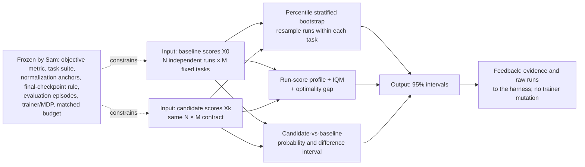

# Deep Reinforcement Learning at the Edge of the Statistical Precipice

| Field | Value |
| --- | --- |
| Primary source | [arXiv 2108.13264v4](https://arxiv.org/html/2108.13264v4), 2022-01-05; [NeurIPS 2021 proceedings](https://proceedings.neurips.cc/paper/2021/hash/f514cec81cb148559cf475e7426eed5e-Abstract.html). Official code evidence: [`rliable` tag `v1.0`, commit `48b62f5e15812aa872e345ba1bd9f685f05cd88f`](https://github.com/google-research/rliable/tree/48b62f5e15812aa872e345ba1bd9f685f05cd88f), 2021-10-14; `setup.py` declares package `1.0.5`. The paper does not bind its figures to an exact code commit. |
| Harness relevance | **Evaluation only.** Protects matched reference-oracle and task-reward comparisons; it is not a trainer, oracle, or reward intervention. |
| Evidence tier | Baseline |

## Main point

A candidate oracle or task reward earns a matched-improvement claim only if independent run-by-task scores are evaluated under one frozen protocol and reported with uncertainty and distributional evidence; a point estimate or changed checkpoint-selection rule can reverse the conclusion.

## Mechanism

Paper mechanism: statistical reporting over an `N runs × M tasks` score matrix. Sam-specific boundary: the objective metric and frozen runtime receipt must be supplied elsewhere; this paper does not make training return reward-independent.

## Exact parameters

| Parameter | Value | Context | Source locator |
| --- | ---: | --- | --- |
| Score data contract | `x_mn`, `M` tasks × `N` independent runs | One normalized scalar per run and task | E02; §2 |
| Normalization anchors | 2 per task | Linear rescaling; random `0`, average human `1` is only the Atari example | E02; §2 |
| Claimed practical workflow range | 3–10 runs/task | Applicability claim, not universal coverage calibration | E03, E08; §1, Fig. 6 |
| Nominal interval | 95% | Paper and pinned API default | E07, E17; §4.1; `library.py:211-283` |
| Stratification | Resample `N` runs with replacement independently for each of `M` tasks | Run-only estimand keeps the task suite fixed | E07, E17; §4.1; `library.py:25-122` |
| Empirically supported percentile CI | `N = 10` | Good coverage for median and IQM on the Atari 100k DER study | E08; Fig. 6, §4.1 |
| Three-run caveat | Undercovered | Three-run bootstrap CIs underestimated true 95% intervals | E08; Fig. 6 |
| Aggregate bootstrap draws | 50,000 | Default unless otherwise specified | E14, E17; App. A.5; `library.py:211-283` |
| Profile / probability draws | 2,000 | Pointwise bands and average probability of improvement | E14, E17; App. A.5; `library.py:301-354` |
| IQM trim | 25% from each tail | Mean of middle 50%, `floor(NM/2)` pooled scores | E10, E18; §4.3; `metrics.py:61-70` |
| Optimality-gap target | `γ = 1.0` | Meaningful only when score `1` is a declared target | E11, E18; §4.3; `metrics.py:46-58` |
| One-outlier profile influence | At most `1/(MN)` | Change at any threshold `τ` | E09; §4.2, Eq. 1 |
| Atari 100k tasks | 26 games | Case-study suite | E04; §3 |
| Atari 100k budget | 100,000 steps/game | About 2–3 gameplay hours | E04; §3 |
| Run bank | 100 runs/game/configuration | Simulates the few-run regime | E04, E13; §3, App. A.2 |
| Run score | Mean of 100 post-training episodes | Final evaluation after training | E04; §3 |
| Resampled run counts | 3–100 | Sampled with replacement from each 100-run bank | E04; §3 |
| Median sampling sets | 100,000 | Estimate sampling distribution and expected median | E04; Figs. 2–3 |
| Coverage outer samples | 10,000 sets of `K` runs | Drawn without replacement from DER reference bank | E08; Fig. 6 |
| Coverage reference | 200 DER runs/game | Finite proxy for the true statistic | E08; Fig. 6 |
| Median small-uncertainty estimate | 50–100 runs/game | Atari 100k result, not a universal threshold | E04; §3 |
| Median lift recovery | 25 runs for +25%; 100 runs for +10% | Synthetic SPR lift study | E05; Fig. 4 |
| Zero-lift residual | 20% deviation possible at 100 runs | Two independent SPR samples | E05; Fig. 4 |
| CURL maximum | 10 evaluation checkpoints | Maximum-during-training selection | E06; App. A.4 |
| SUNRISE maximum | 8 configurations × 3 runs | Per-game hyperparameter selection | E06; App. A.4 |
| Full case-study compute | 18,200 runs | Includes 2,600 extra DER reference runs | E13; App. A.2 |
| Pinned public code | `v1.0`; `48b62f5…`; package `1.0.5` | Paper-era implementation evidence; not claimed as the paper's exact figure snapshot | E19 |

## What transfers to Sam's harness

- Freeze one evaluation receipt before comparing `oracle_k` or `task_reward_k`: task set, objective metric, normalization anchors, final-checkpoint rule, episode count, perturbations, software, and budget. A changed receipt starts a new experiment family. [Harness implication from E02, E06, E21]
- Retain every raw per-run, per-task score. Do not retain only the plotted mean, median, or best seed. [E02, E13, E20]
- Primary suite summary: IQM with a percentile stratified-bootstrap 95% CI. Add the run-score profile, optimality gap at a predeclared target, and candidate-vs-baseline probability of improvement. No scalar is sufficient alone. [E03, E09–E12]
- Compute the interval for the candidate-minus-baseline effect directly. Overlap of two marginal confidence intervals does not quantify uncertainty in their difference. [E04; Fig. 2, App. A.2]
- Use the same end-of-training rule for every variant. Selecting each variant's best checkpoint or best per-task configuration changes the estimand and introduces positive bias. [E06]
- Treat a three-run interval as undercalibrated evidence on the paper's validation, not as a nominally reliable 95% interval. If only one or two runs exist, task-plus-run bootstrap answers a different question and produces wider uncertainty. [E08, E14, E16]
- Record seed integers and runtime facts, but treat repeated executions as random outcomes rather than assuming seed identity proves deterministic replay. [E15]

## What does not transfer

- No reference selection, composition, transition, guard, or recovery mechanism.
- No task-reward generation, repair, search, or coefficient update.
- No reward-independent objective metric, safety metric, tracking metric, or normalization anchor. Sam must define and freeze those outside the generated task reward.
- No permission to change the controller, observations, actions, dynamics, optimizer, architecture, training budget, or evaluation protocol inside a two-knob comparison.
- No universal run count. The reported coverage and 50–100-run median result are specific to estimators and Atari score distributions.
- No proof that `rliable` tag `v1.0` is the exact code snapshot that generated every figure.
- No evidence that RL-Sculptor implements any paper mechanism.

## Failure modes and caveats

| Failure | Evidence | Harness consequence |
| --- | --- | --- |
| Point estimates vary enough to reverse rankings | E04 | Never promote on a lone mean/median or best seed. |
| Finite-run median is biased and statistically inefficient | E04, E05, E10 | Prefer IQM; retain effect intervals. |
| Mean can be dominated by a few outlier tasks | E03, E12 | Inspect profiles and robust summaries. |
| Max over checkpoints/runs/configurations is positively biased | E06 | Freeze the checkpoint and selection rule. |
| Three-run aggregate CIs and small-`N` per-task CIs under-cover | E08, E14 | Label calibration limits; do not equate nominal and empirical coverage. |
| Metric or normalization changes can change ordering | E11, E12, E21 | Predeclare a metric suite and anchors; do not choose after seeing results. |
| Probability of improvement ignores effect magnitude | E11 | Pair it with IQM difference, gap, and the profile. |
| Fixed seeds do not ensure identical GPU runs | E15 | Persist observed runtime facts and independent outcomes. |
| Results reproducibility is narrower than methods reproducibility | E20 | Statistical evidence cannot certify the trainer or evaluator implementation. |

## Evidence ledger

| ID | Claim | Source locator |
| --- | --- | --- |
| E01 | arXiv v4 is dated 2022-01-05; five authors; NeurIPS 2021 Outstanding Paper. | [arXiv metadata and history](https://arxiv.org/abs/2108.13264v4) |
| E02 | Formal `M`-task, `N`-independent-run, two-anchor normalized-score contract. | [§2](https://arxiv.org/html/2108.13264v4) |
| E03 | Recommended trio: stratified intervals, profiles, IQM plus complementary metrics. | [§1, Table 1](https://arxiv.org/html/2108.13264v4) |
| E04 | 26-game, 100-run Atari study; 100 evaluation episodes; median variability and bias. | [§3, Figs. 2–3](https://arxiv.org/html/2108.13264v4) |
| E05 | Known-lift stress test and required median run counts. | [§3, Fig. 4](https://arxiv.org/html/2108.13264v4) |
| E06 | CURL/SUNRISE maximum protocols produce positive bias and incompatible estimands. | [§3, Fig. 5; App. A.4](https://arxiv.org/html/2108.13264v4) |
| E07 | Runs resampled with replacement independently within task for aggregate CIs. | [§4.1](https://arxiv.org/html/2108.13264v4) |
| E08 | 10,000-set/200-run coverage validation; `N=10` support; `N=3` undercoverage. | [Fig. 6, §4.1](https://arxiv.org/html/2108.13264v4) |
| E09 | Run-score tail profile, pointwise bands, and `1/(MN)` influence bound. | [§4.2, Eq. 1](https://arxiv.org/html/2108.13264v4) |
| E10 | IQM trims each tail 25%, uses middle 50%, and narrows intervals. | [§4.3](https://arxiv.org/html/2108.13264v4) |
| E11 | Optimality gap, task-averaged Mann-Whitney probability, and effect-size caveat. | [§4.3; App. A.7, Eq. A.2](https://arxiv.org/html/2108.13264v4) |
| E12 | ALE, Procgen, and DM Control reanalysis exposes overlaps and ranking sensitivity. | [§5, Figs. 9–11](https://arxiv.org/html/2108.13264v4) |
| E13 | Public raw-run banks and 18,200-run compute receipt. | [App. A.1–A.2](https://arxiv.org/html/2108.13264v4) |
| E14 | Single-task undercoverage; 50,000 aggregate and 2,000 profile/probability draws. | [App. A.3–A.5](https://arxiv.org/html/2108.13264v4) |
| E15 | Same-seed DER runs remain weakly correlated under GPU nondeterminism. | [App. A.2, Fig. A.13](https://arxiv.org/html/2108.13264v4) |
| E16 | Task-plus-run bootstrap for one or two runs answers a different, wider-uncertainty question. | [App. A.5, Fig. A.22](https://arxiv.org/html/2108.13264v4) |
| E17 | Pinned bootstrap and profile implementation/defaults. | [`library.py` at `48b62f5…`](https://github.com/google-research/rliable/blob/48b62f5e15812aa872e345ba1bd9f685f05cd88f/rliable/library.py) |
| E18 | Pinned mean, median, IQM, optimality-gap, and probability implementations. | [`metrics.py` at `48b62f5…`](https://github.com/google-research/rliable/blob/48b62f5e15812aa872e345ba1bd9f685f05cd88f/rliable/metrics.py) |
| E19 | Paper-era tag `v1.0` resolves to `48b62f5…`; package version `1.0.5`. | [`rliable` pinned tree](https://github.com/google-research/rliable/tree/48b62f5e15812aa872e345ba1bd9f685f05cd88f) |
| E20 | Results/methods reproducibility boundary; raw-run reporting; uncertainty is not a panacea. | [§6](https://arxiv.org/html/2108.13264v4) |
| E21 | Benchmark-specific normalization choices change comparability. | [App. A.6](https://arxiv.org/html/2108.13264v4) |
