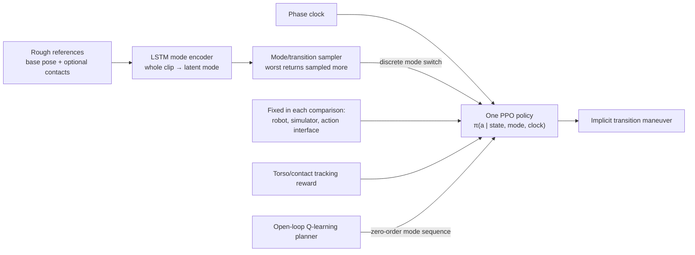

# Learning Multimodal Bipedal Locomotion and Implicit Transitions: A Versatile Policy Approach

| Field | Value |
| --- | --- |
| Primary source | [arXiv:2303.05711v2](https://arxiv.org/html/2303.05711v2), 12 Aug 2023; [IROS 2023 DOI](https://doi.org/10.1109/IROS55552.2023.10342398) |
| Exact public bytes | v2 PDF SHA-256 `2706df707af15cc3857935d2f8ba10fa24671fc9dda7b6e093766239ddc8b97b`; v2 TeX archive SHA-256 `207ed8b18493e4fe560fe041dc268483cf629349bb1d5adb5d922f7fea4d1b91` |
| Harness relevance | Reference composition; task reward; evaluation; fixed-trainer boundary |
| Evidence tier | Core precursor to OGMP |
| Public code | No paper-specific implementation is identified. The paper links unpinned [`sequitur`](https://github.com/shobrook/sequitur) and [an external PPO implementation](https://github.com/osudrl/RSS-2020-learning-memory-based-control). |

## Main point

Given one policy conditioned on learned motion codes, training on discrete mode switches without transition demonstrations should outperform uniform sampling and separately switched unimodal policies on the reported multimode simulation tests.

## Mechanism

## Exact parameters

| Parameter | Value | Context | Source locator |
| --- | ---: | --- | --- |
| Mode-encoder hidden layer | 32 neurons | Identical one-layer LSTM encoder and decoder; no activations | Sec. II-B |
| Minimum latent size used | 4 | Empirically sufficient for reported results | Sec. II-C.1 |
| Proprioceptive state | 31 | Full dynamics state except torso world-frame x/y | Sec. II-C.1 |
| Policy observation | `33 + n_m` | 31 state + 2 clock + latent mode | Sec. II-C.1 |
| Phase | `[0,1]` | Clock is `[sin(phi), cos(phi)]` | Sec. II-C.1 |
| Action size | 10 | Motor targets for 5 joints per leg | Sec. II-C.2 |
| PD gains | `Kp=30`, `Kd=0.5` | Fixed gains; units are not stated | Eq. 2 |
| Torque clip | 30 Nm | Actual-robot torque limit used in simulation | Sec. II-C.2 |
| Reward sensitivities | `[5,5,2]` | Position, orientation, contact errors | Sec. II-C.3 |
| `pi1` modes / directed transitions | 9 / 81 | Idle; four-direction walk; four-direction leap | Table I |
| `pi1`, `pi2` reward weights | `[0.5,0.5,0]` | Position, orientation, contact | Table I |
| `pi3` reward weights | `[0.35,0.35,0.3]` | Contact-conditioned walk/hop experiment | Table I |
| Sampling floor `epsilon` | 0.2 | Preserves nonzero probability for best-return mode | Sec. II-D |
| Return-history `gamma_i`, `gamma_f` | `{0.2,0.4,0.8}` | Varied across trainings; paper does not map each value to each run | Sec. II-D |
| Switch phases | `{0.25,0.5,0.75}` | Uniform draw | Algorithm 1, line 16 |
| Switch clips | `{0,1}` | Uniform draw over one of two mode cycles | Algorithm 1, line 17 |
| Training budget | 2 days, 8 CPU workers | Per training run | Sec. III |
| `pi1` mode MRA: uniform / adaptive | `0.81±0.06 / 0.87±0.04` | Normalized mean return | Table II |
| `pi1` transition MRA: uniform / adaptive | `0.71±0.09 / 0.77±0.05` | Normalized mean return | Table II |
| `pi2` mode MRA: uniform / adaptive | `0.87±0.10 / 0.91±0.05` | Normalized mean return | Table II |
| `pi2` transition MRA: uniform / adaptive | `0.64±0.18 / 0.79±0.24` | Normalized mean return | Table II |
| Planner search | 5 trials × 100 episodes | Parallel Monte Carlo rollouts; best plan retained | Sec. II-E |
| Gap-plan knots / period / time | 11 / 0.3 s / `3:05±0:08` | Goal `[2.0,0.0,0.5]` m | Table III |
| Gap+block knots / period / time | 30 / 0.15 s / `2:41±0:20` | Goal `[2.0,0.0,0.9]` m | Table III |
| Terrain tests | gap 0.45 m; plateau 0.2 m; block 0.4 m | Simulation | Sec. III-C |

## What transfers to Sam's harness

- Treat a candidate `oracle_k` as an immutable, queryable sequence of mode IDs, switch phases, clocks, and source-reference provenance.
- Keep reference composition separate from transition execution. This paper learns transition maneuvers inside the policy after sampled command switches; it does not synthesize transition trajectories.
- Use the mode-by-mode and ordered-pair return matrices as diagnostics for oracle coverage. Do not reuse them as independent success metrics.
- Preserve optional contact schedules as first-class reference fields; the same base-pose reference produced distinct walk and hop modes only after contact timing changed.
- Test reference and reward changes against mode aliasing, mode collapse, transition collapse, and separately switched policies.

## What does not transfer

- This is not an explicit state-feedback oracle or branching state machine. Its high-level planner emits an open-loop, time-indexed, zero-order mode sequence with no robot or terrain feedback.
- Its transitions are implicit policy behavior. A discrete switch command is not evidence that the harness composed or certified a transition reference.
- The experiments change policy conditioning, adaptive sampling, and training behavior. They do not isolate Sam's two knobs under a fixed trainer.
- Table II reports normalized training returns. Those reward-linked numbers are not independent objective metrics.
- Simulation results do not establish hardware transfer, impact safety, dynamics feasibility of rough references, or RL-Sculptor implementation.

## Precise relation to OGMP

| 2023 paper | Later OGMP (`2403.04205v2`) | Contract consequence |
| --- | --- | --- |
| Whole rough clip → one latent code | Reuses a 32-neuron LSTM mode encoder, but trains it on oracle-generated modal data | The encoder lineage continues; the data generator changes. |
| One policy conditioned on latent mode + phase clock | Retains latent mode + clock conditioning | These are controller/trainer interfaces, not automatically authorable harness outputs. |
| Discrete mode switches; transition maneuver emerges inside policy | Defines task-vital modes with continuous parameters and bounds policy state around a receding-horizon oracle | OGMP adds explicit oracle guidance; the 2023 transition mechanism alone is not OGMP. |
| Open-loop Q-learning mode plan, no state/terrain feedback | Oracle maps current state and task variant to a finite-horizon state trajectory | Sam's `oracle_k` should be evaluated against the later closed-loop oracle contract, not mislabeled from the 2023 planner. |

OGMP explicitly cites this paper as reference [15], invokes it for learned latent mode encoding, and cites its clock input. The later work extends the lineage with oracle-bounded exploration, task-vital parameterized modes, and latent-mode reachability tests.

## Failure modes and caveats

- **Mode aliasing:** one-hot commands produced indistinguishable walk and leap profiles in the reported comparison.
- **Mode collapse:** uniform mode sampling failed on leap-left for `pi1`.
- **Transition collapse:** uniform pair sampling converged to a subset of successful transitions.
- **Unimodal switch failure:** switching walk → launch policies exposed the launch policy to out-of-distribution states.
- **Weak continuous control:** mode conditioning lacked granular velocity control; doubling clock rate raised leap speed from 0.5 to 1.0 m/s, then saturated near 1.2 m/s at 3×.
- **Open-loop planner:** no exteroceptive terrain input or proprioceptive robot-state input.
- **Motion quality / transfer:** hardware transfer was out of scope; the authors report that impact/jitter-oriented reward shaping was absent.
- **Reproducibility:** no paper-specific code snapshot is linked; the two external repositories are not commit-pinned in the paper.

## Evidence ledger

| ID | Claim | Source locator |
| --- | --- | --- |
| E01 | Exact arXiv version, authors, abstract, and public version date | [arXiv v2, header and abstract](https://arxiv.org/html/2303.05711v2) |
| E02 | Rough references require base-pose keyframes and optional contact sequence, not joint trajectories | [Sec. II-A](https://arxiv.org/html/2303.05711v2#S2.SS1) |
| E03 | Whole-clip LSTM autoencoder; 32-neuron hidden layer; unpinned `sequitur` link | [Sec. II-B](https://arxiv.org/html/2303.05711v2#S2.SS2) |
| E04 | State, clock, latent observation; 4-D latent; 10-D action; PD gains and torque cap | [Secs. II-C.1–2](https://arxiv.org/html/2303.05711v2#S2.SS3) |
| E05 | Tracking-reward equation and sensitivities | [Eq. 3, Sec. II-C.3](https://arxiv.org/html/2303.05711v2#S2.SS3.SSS3) |
| E06 | Return-skewed sampling, `epsilon`, and `gamma` | [Sec. II-D](https://arxiv.org/html/2303.05711v2#S2.SS4) |
| E07 | Switch phase/clip sets and PPO update | [Algorithm 1](https://arxiv.org/html/2303.05711v2#S2.SS4) |
| E08 | Open-loop Q-learning mode planner and missing state/terrain feedback | [Sec. II-E](https://arxiv.org/html/2303.05711v2#S2.SS5) |
| E09 | Policy configurations, training budget, simulator, and unpinned PPO link | [Table I and Sec. III](https://arxiv.org/html/2303.05711v2#S3) |
| E10 | Uniform-versus-adaptive normalized MRA | [Table II](https://arxiv.org/html/2303.05711v2#S3.SS1) |
| E11 | Mode aliasing and collapse comparisons | [Sec. III-A](https://arxiv.org/html/2303.05711v2#S3.SS1) |
| E12 | Contact-reference and clock-rate results | [Sec. III-A](https://arxiv.org/html/2303.05711v2#S3.SS1) |
| E13 | Unimodal-switch failure, implicit transitions, and transition collapse | [Sec. III-B](https://arxiv.org/html/2303.05711v2#S3.SS2) |
| E14 | Planner configurations, terrain dimensions, and solve times | [Table III and Sec. III-C](https://arxiv.org/html/2303.05711v2#S3.SS3) |
| E15 | Simulation-only scope and absent impact/jitter reward shaping | [Sec. IV](https://arxiv.org/html/2303.05711v2#S4) |
| E16 | IROS venue and DOI | [IEEE DOI record](https://doi.org/10.1109/IROS55552.2023.10342398) |
| E17 | OGMP cites and extends the latent-mode/clock lineage with explicit oracle guidance | [OGMP v2, Secs. 1–3 and ref. 15](https://arxiv.org/html/2403.04205v2) |
| E18 | Exact retrieved arXiv source/PDF byte hashes | [arXiv v2 source](https://export.arxiv.org/e-print/2303.05711v2) and [PDF](https://arxiv.org/pdf/2303.05711v2) |
