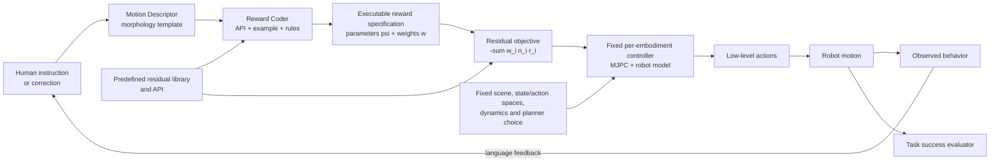

# Language to Rewards for Robotic Skill Synthesis

| Field | Value |
| --- | --- |
| Primary source | [CoRL 2023 / PMLR 229:374–404](https://proceedings.mlr.press/v229/yu23a.html); final PDF SHA-256 `5088126171bc422d33b6cccd0169e371db11ecce79ff6355b22d81a9b095dbae`; [arXiv:2306.08647v2](https://arxiv.org/abs/2306.08647v2) |
| Authors | Wenhao Yu, Nimrod Gileadi, Chuyuan Fu, Sean Kirmani, Kuang-Huei Lee, Montserrat Gonzalez Arenas, Hao-Tien Lewis Chiang, Tom Erez, Leonard Hasenclever, Jan Humplik, Brian Ichter, Ted Xiao, Peng Xu, Andy Zeng, Tingnan Zhang, Nicolas Heess, Dorsa Sadigh, Jie Tan, Yuval Tassa, Fei Xia |
| Official code | [`google-deepmind/language_to_reward_2023` at `4a3a20f`](https://github.com/google-deepmind/language_to_reward_2023/tree/4a3a20f9c8705e3a3ded4d218d9c129303d9682e), package `0.0.1`, pinned 30 August 2026 |
| Harness relevance | Task reward / human steering / evaluation / fixed trainer |
| Evidence tier | Core |

## Main point

With the robot model and optimizer fixed inside each embodiment, a two-stage GPT-4 translator compiled language into a constrained residual-reward API; under 10 generated responses and 50 MJPC trials per response, the paper reports higher success in 11 of 17 task categories and rounded task coverage of 90% versus 50% for Code-as-Policies, but it does not test learned-policy training.

## Mechanism

## Interface boundary

| Layer | Fixed or generated in the paper | Consequence for Sam |
| --- | --- | --- |
| User interface | Language instruction and later language correction | Preserve each correction and the resulting reward diff as provenance |
| Motion Descriptor | LLM-filled, morphology-specific structured template | Useful compiler intermediate; not a robot-independent representation |
| Reward Coder | LLM-generated Python calls to a predefined API | Generate a typed reward manifest, then compile it; do not execute arbitrary model text |
| Reward design space | Fixed residual terms and norms; LLM changes parameters and may zero weights | The paper searches a bounded parameter/composition space, not arbitrary reward programs |
| Controller | MJPC; iLQG for locomotion and Predictive Sampling for manipulation | Evidence concerns online trajectory optimization, not PPO or another learned-policy trainer |
| Evaluation | Task-specific expected behaviors, repeated controller trials, and pass-rate curves | Keep success metrics immutable and separate from generated reward code |
| Reference/oracle | None | No evidence for reference-dataset composition or OGMP-style mode logic |

## Exact parameters

| Parameter | Value | Context | Source locator |
| --- | ---: | --- | --- |
| Reward form | `R(s,a) = -Σ(i=0..M) w_i n_i(r_i(s,a,psi_i))` | Non-negative weights; twice-differentiable norms minimize at zero; each residual is optimal at zero | [final paper §3.1, Eq. 2, PDF p. 3](https://proceedings.mlr.press/v229/yu23a/yu23a.pdf) |
| Translator stages | `2` | Motion Descriptor, then Reward Coder | [§3.2 and Fig. 2, PDF pp. 3–5](https://proceedings.mlr.press/v229/yu23a/yu23a.pdf) |
| Reward Coder prompt parts | `3` | API descriptions, one response-format example, constraints/rules | [§3.2, PDF p. 5](https://proceedings.mlr.press/v229/yu23a/yu23a.pdf) |
| LLM | GPT-4 | Used in all reported experiments | [§4.1, PDF p. 5](https://proceedings.mlr.press/v229/yu23a/yu23a.pdf) |
| Simulated task suite | `17 = 9 + 8` | Nine quadruped and eight dexterous-manipulator task categories | [§4.3 and App. A.2, PDF pp. 5, 13–14](https://proceedings.mlr.press/v229/yu23a/yu23a.pdf) |
| LLM samples | `10` per task and method | Independent reward-code responses | [§4.4, PDF p. 6](https://proceedings.mlr.press/v229/yu23a/yu23a.pdf) |
| Controller trials | `50` per generated response | Repeated MJPC evaluation of each code sample | [§4.4, PDF p. 6](https://proceedings.mlr.press/v229/yu23a/yu23a.pdf) |
| Better task categories | `11 / 17` | Paper reports higher success than alternatives in these categories | [§4.4, PDF p. 6](https://proceedings.mlr.press/v229/yu23a/yu23a.pdf) |
| Rounded task coverage | L2R `90%`; CaP `50%` | Reported in abstract; do not convert these rounded values into inferred integer counts | [PMLR abstract](https://proceedings.mlr.press/v229/yu23a.html) |
| Quadruped morphology | `12` DoF | Three joints per leg | [§4.1, PDF p. 5](https://proceedings.mlr.press/v229/yu23a/yu23a.pdf) |
| Manipulator morphology | `27` DoF | Seven-DoF Franka arm plus 20-DoF Shadow Hand | [§4.1, PDF p. 5](https://proceedings.mlr.press/v229/yu23a/yu23a.pdf) |
| Planner selection | iLQG: locomotion; Predictive Sampling: manipulation | Fixed by embodiment, not selected by the LLM | [§3.3, PDF p. 5](https://proceedings.mlr.press/v229/yu23a/yu23a.pdf) |
| Gait phase / air ratio | Each in `[0,1]` | Structured quadruped prompt; phase difference `0.5` means opposite gait phase | [App. A.4, PDF pp. 15–16](https://proceedings.mlr.press/v229/yu23a/yu23a.pdf) |
| Default plan duration | `2 s` | Default argument exposed by both paper reward-coder APIs | [App. A.4, PDF pp. 16, 19](https://proceedings.mlr.press/v229/yu23a/yu23a.pdf) |
| Quadruped default residual weights | CoM XY `0.3`; height `1.0`; yaw `0.3`; pitch `0.6`; roll `0.1`; forward/side/yaw velocity `0.1` each; foot x/y/z `1/1/2` | Foot terms repeat for all four feet | [App. A.5, Table 1, PDF p. 21](https://proceedings.mlr.press/v229/yu23a/yu23a.pdf) |
| Manipulator default residual weights | object distance `5`; target XY row `5`; target-height row `10`; joint target `10`; orientation weight not printed | Table labels/formulas for target XY and height appear swapped; preserve the source discrepancy | [App. A.5, Table 2, PDF p. 21](https://proceedings.mlr.press/v229/yu23a/yu23a.pdf) |
| Real-robot regularizer thresholds | end-effector speed `0.3`; joint speed `0.7`; gripper/object distance `0.1` | Added because simulated MPC produced motions beyond hardware capability | [App. A.6, PDF p. 21](https://proceedings.mlr.press/v229/yu23a/yu23a.pdf) |
| Public code model / temperature | `gpt-4` / `0.3` | Release behavior, not a complete model snapshot | [`user_interaction.py`](https://github.com/google-deepmind/language_to_reward_2023/blob/4a3a20f9c8705e3a3ded4d218d9c129303d9682e/src/language_to_reward_2023/user_interaction.py#L31-L38); [`conversation.py`](https://github.com/google-deepmind/language_to_reward_2023/blob/4a3a20f9c8705e3a3ded4d218d9c129303d9682e/src/language_to_reward_2023/conversation.py#L27-L48) |
| Public code package / MJPC pin | `0.0.1`; MJPC `c5c7ead065b7f4034ab265a13023231900dbfaa7` | Exact public release metadata and recommended dependency revision | [`pyproject.toml`](https://github.com/google-deepmind/language_to_reward_2023/blob/4a3a20f9c8705e3a3ded4d218d9c129303d9682e/pyproject.toml#L5-L37); [README](https://github.com/google-deepmind/language_to_reward_2023/blob/4a3a20f9c8705e3a3ded4d218d9c129303d9682e/README.md#L15-L42) |

## Evaluation evidence

| Question | Evidence | Boundary |
| --- | --- | --- |
| Does the structured intermediate help? | Reward-Coder-only fails more often on tasks requiring multi-step reasoning; the paper's drawer example omits approaching the handle | This is an ablation of one prompt stage, not a modern-LLM or cross-domain study |
| Does reward beat fixed primitives? | L2R reports better success in almost all tasks and rounded 90% versus 50% task coverage | CaP is limited to three hand-designed primitives per embodiment |
| Is the pipeline stable? | Ten generated responses per task/method; each is run 50 times; pass-rate curves show best-of-N coverage | No confidence intervals or hypothesis tests are reported |
| Is feedback interactive? | Four-turn moonwalk and four-turn apple-in-drawer examples revise behavior through language | Demonstrations, not a quantified user study |
| Does it transfer to hardware? | Two real-manipulator tasks: pushing and grasping, with F-VLM/point-cloud state estimation and a hand-designed regularizer | No tabulated hardware success rate or safety envelope |
| Are metrics independent? | Appendix A.2 states expected task behavior separately from reward prompts; some tasks have explicit distance, height, duration, or angle criteria | The paper does not provide an immutable evaluator artifact or a formal leakage audit |

## Paper claims versus public-release behavior

| Item | Paper | Pinned public code |
| --- | --- | --- |
| Embodiments | Quadruped, dexterous manipulator, and real manipulator | `ALL_TASKS` exposes only `barkour` |
| Human correction | Motion Descriptor retains dialogue semantics; Reward Coder translates the current description | Two LLM calls; thinker history retained, coder history disabled |
| Output | Python API calls that set reward parameters and weights | Extracted model code is embedded in a template and executed to emit JSON parameter dictionaries |
| Safety | Prompt says not to invent APIs or libraries | macOS path explicitly warns that code is untrusted, asks for confirmation, then executes it in the local Python interpreter; confirmation is not a sandbox |
| Reproduction | Paper includes moonwalking | README says the released model has weaker, more realistic actuators and cannot moonwalk |
| Dependency identity | GPT-4 and MJPC named | MJPC commit is pinned; the `openai` package and the mutable `gpt-4` model alias are not pinned to immutable behavior |

## What transfers to Sam's harness

- Split natural-language steering from reward compilation: **instruction/correction → structured task description → typed reward manifest → executable reward**.
- Keep the controller, scene, state/action interface, dynamics, training algorithm, budget, and evaluator fixed while varying only reward manifests.
- Admit only a bounded, versioned reward API. Include term IDs, units, frames, parameters, weights, activation masks, and source evidence.
- Store every candidate as data first. Validate types and bounds, then compile it into trusted project-owned reward code. Never execute raw model-generated Python.
- Regenerate a complete reward manifest after each correction. Record the parent artifact and a semantic diff, rather than relying on hidden conversation state.
- Sample multiple reward candidates and evaluate each with repeated fixed-seed trials. Report coverage, per-candidate variance, and objective success separately from training return.
- Use an intermediate task description when a direct reward compiler omits enabling subgoals. Test the ablation explicitly against direct instruction-to-reward.
- Treat task success evaluators as immutable inputs. A reward candidate cannot edit its own acceptance criteria.
- Carry the useful abstraction, not the planner: the paper explicitly allows RL as a downstream optimizer, but all reported numbers come from MJPC.

## What does not transfer

- No reference dataset, reference composition, phase oracle, state machine, or mode transition is generated.
- No policy is trained. Receding-horizon MPC optimizes actions online, so the reported results do not establish that the same rewards improve PPO, SONIC, VIBE, or another fixed learned-policy trainer.
- The reward space is not free-form. It is a manually defined residual library plus morphology-specific templates and APIs.
- The study does not isolate reward effects across embodiments because planner choice, robot model, state/action spaces, and task APIs differ.
- The reported real-robot examples are not evidence of robust sim-to-real deployment, calibration, safety, or a quantified hardware success rate.
- Rounded task coverage is not a confidence interval and should not be converted into exact task counts.
- The current public repository is not evidence that the manipulator, real-robot, or moonwalk results are reproducible from the released code.

## Failure modes and caveats

- **Manual morphology templates:** a new robot type requires hand-designed motion-description structure.
- **Language bottleneck:** style goals such as “walk gracefully” may not be expressible precisely enough.
- **Bounded reward vocabulary:** predefined terms improve stability but limit flexibility; time-varying rewards are unsupported without prompt/API redesign.
- **Correct-reward controller variance:** dynamic and precise tasks such as biped standing and upright banana vary even when the intended reward is generated.
- **Table ambiguity:** manipulator Table 2 appears to swap the XY and height formulas and omits the orientation default weight.
- **Release/model mismatch:** the published moonwalk used unrealistically strong actuators and is impossible with the released robot model.
- **Partial release:** the pinned code config exposes Barkour only, not the full paper suite.
- **Mutable dependencies:** `gpt-4` and the Python `openai` dependency are not immutable snapshots.
- **Unsafe execution pattern:** the macOS fallback runs confirmed model-generated Python locally; user confirmation does not constrain imports, filesystem access, or subprocesses.
- **Evaluation gap:** repeated rollouts are reported, but confidence intervals, statistical tests, full evaluator code, and a cross-task hardware reliability study are absent.

## Evidence ledger

| ID | Claim | Source locator |
| --- | --- | --- |
| E01 | Final venue, authors, pages, year, abstract, and reported 90% versus 50% task coverage | [PMLR record](https://proceedings.mlr.press/v229/yu23a.html) |
| E02 | Parameterized residual-reward equation, non-negative weights, differentiable norms, and predefined generic terms | [final paper §3.1, Eq. 2, PDF p. 3](https://proceedings.mlr.press/v229/yu23a/yu23a.pdf) |
| E03 | Two-stage Motion Descriptor and Reward Coder; structured template; three-part coder prompt | [§3.2 and Fig. 2, PDF pp. 3–5](https://proceedings.mlr.press/v229/yu23a/yu23a.pdf) |
| E04 | MJPC receding-horizon loop; iLQG for locomotion and Predictive Sampling for manipulation | [§3.3, PDF p. 5](https://proceedings.mlr.press/v229/yu23a/yu23a.pdf) |
| E05 | GPT-4, robot morphologies, 12/27 DoF, and simulated setup | [§4.1, PDF p. 5](https://proceedings.mlr.press/v229/yu23a/yu23a.pdf) |
| E06 | Reward-Coder-only and hand-designed Code-as-Policies baselines | [§4.2 and App. A.3, PDF pp. 5, 14](https://proceedings.mlr.press/v229/yu23a/yu23a.pdf) |
| E07 | Nine quadruped plus eight manipulator tasks and separate expected behaviors | [§4.3 and App. A.2, PDF pp. 5, 13–14](https://proceedings.mlr.press/v229/yu23a/yu23a.pdf) |
| E08 | Ten responses per task/method, 50 MJPC trials per response, 11/17 advantage, and Reward-Coder-only omission example | [§4.4, PDF pp. 6–7](https://proceedings.mlr.press/v229/yu23a/yu23a.pdf) |
| E09 | Best-of-N pass-rate interpretation and task-coverage/stability claims | [§4.4 and Fig. 4, PDF pp. 6–7](https://proceedings.mlr.press/v229/yu23a/yu23a.pdf) |
| E10 | Multi-turn moonwalk and apple-in-drawer language-steering demonstrations | [§4.5 and Fig. 5, PDF p. 7](https://proceedings.mlr.press/v229/yu23a/yu23a.pdf) |
| E11 | Real-robot state estimation, hardware-specific regularization, pushing, and grasping | [§4.7 and Fig. 7, PDF p. 8](https://proceedings.mlr.press/v229/yu23a/yu23a.pdf) |
| E12 | Manual templates, language-only interaction limits, predefined-term tradeoff, and no time-varying rewards | [§5, PDF p. 8](https://proceedings.mlr.press/v229/yu23a/yu23a.pdf) |
| E13 | Full morphology-specific prompts, API signatures, bounds, rules, and default plan duration | [App. A.4, PDF pp. 15–20](https://proceedings.mlr.press/v229/yu23a/yu23a.pdf) |
| E14 | Residual libraries, default weights, formula/label ambiguity, and sim-to-real thresholds | [Apps. A.5–A.6, Tables 1–2, PDF pp. 20–21](https://proceedings.mlr.press/v229/yu23a/yu23a.pdf) |
| E15 | Per-reward repeated evaluation and higher variance on dynamic/precise tasks | [App. A.7, PDF pp. 21–23](https://proceedings.mlr.press/v229/yu23a/yu23a.pdf) |
| E16 | Exact public code revision inspected on 30 August 2026 | [commit `4a3a20f`](https://github.com/google-deepmind/language_to_reward_2023/commit/4a3a20f9c8705e3a3ded4d218d9c129303d9682e) |
| E17 | Package version, Python/dependency declarations, and unpinned `openai` dependency | [`pyproject.toml` at `4a3a20f`](https://github.com/google-deepmind/language_to_reward_2023/blob/4a3a20f9c8705e3a3ded4d218d9c129303d9682e/pyproject.toml#L5-L37) |
| E18 | MJPC commit pin, demo entry point, and released-model moonwalk mismatch | [README at `4a3a20f`](https://github.com/google-deepmind/language_to_reward_2023/blob/4a3a20f9c8705e3a3ded4d218d9c129303d9682e/README.md#L15-L47) |
| E19 | Public task registry exposes only Barkour and three prompt variants | [`task_configs.py` at `4a3a20f`](https://github.com/google-deepmind/language_to_reward_2023/blob/4a3a20f9c8705e3a3ded4d218d9c129303d9682e/src/language_to_reward_2023/task_configs.py#L28-L43) |
| E20 | Release selects the mutable `gpt-4` model alias | [`user_interaction.py` at `4a3a20f`](https://github.com/google-deepmind/language_to_reward_2023/blob/4a3a20f9c8705e3a3ded4d218d9c129303d9682e/src/language_to_reward_2023/user_interaction.py#L31-L38) |
| E21 | Two-call release dataflow, thinker-only history, and generated-code extraction before parameter installation | [`prompt_thinker_coder.py` at `4a3a20f`](https://github.com/google-deepmind/language_to_reward_2023/blob/4a3a20f9c8705e3a3ded4d218d9c129303d9682e/src/language_to_reward_2023/platforms/barkour/prompts/prompt_thinker_coder.py#L142-L195); [`process_code.py`](https://github.com/google-deepmind/language_to_reward_2023/blob/4a3a20f9c8705e3a3ded4d218d9c129303d9682e/src/language_to_reward_2023/platforms/process_code.py#L29-L47) |
| E22 | Generated code mutates whitelisted output dictionaries, which are JSON-decoded, key-filtered, and float-cast | [`barkour_execution.py` at `4a3a20f`](https://github.com/google-deepmind/language_to_reward_2023/blob/4a3a20f9c8705e3a3ded4d218d9c129303d9682e/src/language_to_reward_2023/platforms/barkour/barkour_execution.py#L29-L83) |
| E23 | macOS fallback warns, asks for confirmation, then compiles and executes untrusted code with the local interpreter | [`confirmation_safe_executor.py` at `4a3a20f`](https://github.com/google-deepmind/language_to_reward_2023/blob/4a3a20f9c8705e3a3ded4d218d9c129303d9682e/src/language_to_reward_2023/confirmation_safe_executor.py#L16-L114) |
| E24 | Release uses temperature 0.3 and retries outputs that still contain template placeholders | [`conversation.py` at `4a3a20f`](https://github.com/google-deepmind/language_to_reward_2023/blob/4a3a20f9c8705e3a3ded4d218d9c129303d9682e/src/language_to_reward_2023/conversation.py#L27-L48) |
