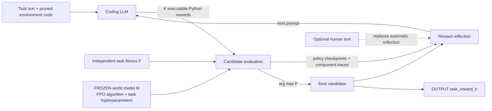

# Eureka: Human-Level Reward Design via Coding Large Language Models

| Field | Value |
| --- | --- |
| Primary source | [arXiv:2310.12931v2](https://arxiv.org/html/2310.12931v2), 30 April 2024; [ICLR 2024](https://openreview.net/forum?id=IEduRUO55F) |
| Authors | Yecheng Jason Ma, William Liang, Guanzhi Wang, De-An Huang, Osbert Bastani, Dinesh Jayaraman, Yuke Zhu, Linxi Fan, Anima Anandkumar |
| Official supplement | [Code at commit `9eee428`](https://github.com/eureka-research/Eureka/tree/9eee42808b52d8abc14845d1547bfde886403ccc) |
| Harness relevance | Task reward / human steering / evaluation / fixed trainer |
| Evidence tier | Core |

## Main point

With the world model and PPO trainer held fixed, Eureka searches executable task-reward code by repeatedly training candidate policies, selecting with a separate task fitness function, and feeding component-level learning traces back to a coding LLM; its evidence does **not** establish safe code execution, reference-oracle design, or generalization beyond the tested trainer and simulators.

## Mechanism

## Exact parameters

| Parameter | Value | Context | Source locator |
| --- | ---: | --- | --- |
| Reward-search interface | `R -> A_M(R) -> policy -> F(policy)` | `M=(S,A,T)` and learning algorithm `A_M` are distinct from candidate reward `R`; `F` scores the resulting policy | Sec. 2, Definition 2.1 |
| Backbone LLM | `gpt-4-0314` | Used for all LLM reward-design methods unless specified | Sec. 4 |
| Independent search runs | `5` per environment | Random restarts | Sec. 3.2 |
| Search iterations | `5` per run | Paper experiments | Sec. 3.2 |
| Candidate batch | `K=16` per iteration | Paper experiments; at least one first-iteration candidate executed on every tested environment | Sec. 3.2 |
| Intermediate evaluation | `1` PPO run per reward | Default task parameters | App. D |
| Final evaluation | `5` PPO runs per reward | Average performance under task fitness `F` | Sec. 4.2; App. D |
| Checkpoint selection | maximum over `10` fixed-interval checkpoints | Same count for each method | Sec. 4.2 |
| Trainer control | same PPO implementation and task hyperparameters | Hyperparameters were originally tuned for human rewards and left unchanged across reward methods | Sec. 4.2 |
| Benchmark | `29` tasks, `10` robot morphologies | `9` Isaac Gym tasks + `20` Dexterity tasks | Sec. 4 |
| Main reported win rate | `83%` (`24/29` by task counts) | At least human level on all 9 Isaac tasks and 15/20 Dexterity tasks | Abstract; Sec. 4.3 |
| Average normalized improvement | `52%` | Each task score is clipped to `[0,3]` before the 29-task average | Abstract; App. D |
| Reflection ablation | `-28.6%` average normalized score | Removing component-level reflection and retaining only fitness snapshots, averaged over Isaac tasks | Sec. 4.3 |
| Human-feedback sampling | `1` reward per iteration | Human text replaces automatic reward reflection | App. D.3 |
| Human-feedback user study | `20` raters; `15/20` prefer Eureka-HF vs `5/20` Eureka | One Humanoid comparison; forward velocities `5.58` vs `7.53` | Sec. 4.4; App. D.3 |
| Dexterity uncertainty analysis | `100` RL runs | 5 final-reward runs × 20 tasks; 95% confidence intervals for aggregate metrics | App. F |
| Reported compute | `8 × A100`; `<1 day` per Eureka run | Authors also estimate `4 × V100`; each Isaac Gym RL run uses at most `8 GB` | App. D.4 |
| Release config defaults | model `gpt-4-0314`; temperature `1.0`; iteration `1`; sample `3`; PPO iterations `3000`; final evals `5` | Official code at `9eee428`; these are **not** the paper's 5-iteration, 16-sample search settings | `eureka/cfg/config.yaml` at `9eee428` |
| README-advertised defaults | iteration `5`; sample `16` | Conflicts with the pinned config file | `README.md` at `9eee428` |

## Executable reward and feedback contracts

- **Input:** task description plus environment code pruned to state/action variables. The initial prompt excludes an existing reward.
- **Output:** TorchScript-compatible Python returning `(total_reward, component_dictionary)` and using only exposed environment attributes.
- **Search:** train every executable candidate once; rank by the task fitness `F`; keep the best-so-far reward across iterations and random restarts.
- **Reflection:** serialize roughly ten snapshots of each reward component and ground-truth metric, plus maximum/mean/minimum and execution errors. Only the latest reward and reflection remain in context.
- **Human steering:** replace automatic reflection with colloquial text. This edits reward code; it does not update the LLM or directly command the policy.

## What transfers to Sam's harness

- Use a typed executable interface for `task_reward_k`: allowed state/action inputs, tensor shapes, output reward, named component diagnostics, and a pinned source hash.
- Keep `M`, the policy trainer, task-specific hyperparameters, training budget, and checkpoint protocol frozen while comparing reward candidates. Eureka's controlled comparison directly matches this experimental contract.
- Keep the search reward separate from objective evaluation. Component traces are useful mutation diagnostics; the task metric decides candidate quality.
- Start from `task_reward_0` by treating the human reward as the first candidate, then return a new immutable `task_reward_k` after each search cycle.
- Route natural-language steering to the reward designer. Record the exact text, previous reward, reflection source, and resulting code as lineage.
- Add holdout metrics and immutable trust gates outside the search objective. Eureka optimizes and reports against `F`; it does not demonstrate resistance to overfitting that metric.
- Validate and sandbox reward code before training. The official release writes generated code into an environment module and launches it; this is a research implementation, not a safe execution boundary.

## What does not transfer

- Eureka does not generate, compose, or select reference datasets, motion modes, state machines, or closed-loop oracles.
- The pen-spinning result is a curriculum result: policy initialization and target sequence change. It is not evidence for a reward-only intervention under a fully frozen MDP.
- `F` is separate from the generated reward but is also the search objective. It is not an untouched holdout metric.
- Results do not establish portability to a different controller, optimizer, observation contract, or training budget. The paper states reward effectiveness is algorithm-dependent.
- The official release does not establish macOS or Apple-MPS execution. It was tested on Ubuntu 20.04/22.04 with NVIDIA Isaac Gym Preview 4.
- Human-feedback evidence is one simulated Humanoid comparison with 20 student raters, not a general safety or alignment result.
- No result implies that RL-Sculptor currently implements Eureka.

## Failure modes and caveats

- First-attempt reward code may fail to execute or optimize poorly. Batch sampling lowers the all-invalid probability but does not prove correctness.
- Intermediate candidates receive one PPO run, so noisy training can alter selection; five-run evaluation is reserved for the final reward.
- A human-definable fitness `F` is required for automated search. Human text can replace reflection when `F` is inadequate, but this introduces manual evaluation.
- Reward performance depends on the fixed RL algorithm and hyperparameters. Dexterity training curves were less smooth than human-reward curves under PPO tuned for human rewards.
- The `52%` headline clips each per-task normalized score to `[0,3]`; the main protocol also selects the maximum of ten checkpoints.
- Search is compute-heavy: the reported setup used eight A100 GPUs and up to 16 concurrent policy trainings.
- Evidence is primarily simulation on one engine and one fixed RL algorithm, apart from a single MuJoCo Humanoid test and preliminary sim-to-real appendix result.
- The 20-person human study trades forward velocity for stated preference and covers one behavior pair.
- The release directly executes generated Python and exposes no sandbox or proof that code is side-effect free.
- Reproduction identity is ambiguous unless pinned: the README says defaults are 5 iterations and 16 samples, while `config.yaml` at the same commit uses 1 and 3.

## Evidence ledger

| ID | Claim | Source locator |
| --- | --- | --- |
| E1 | arXiv v2 date, title, and authors | [v2 header](https://arxiv.org/html/2310.12931v2) |
| E2 | Reward design separates world model, trainer, candidate reward, and policy fitness | [v2 Sec. 2, Definition 2.1](https://arxiv.org/html/2310.12931v2#S2) |
| E3 | Environment-as-context and the sample/evaluate/reflect/update algorithm | [v2 Sec. 3.1, Algorithm 1](https://arxiv.org/html/2310.12931v2#S3.SS1) |
| E4 | Batch reliability, mutation context, 5 restarts, 5 iterations, and `K=16` | [v2 Sec. 3.2](https://arxiv.org/html/2310.12931v2#S3.SS2) |
| E5 | Reward reflection logs component and fitness trajectories and is trainer-dependent | [v2 Sec. 3.3](https://arxiv.org/html/2310.12931v2#S3.SS3) |
| E6 | Executable reward output and component-dictionary prompt contract | [v2 App. A](https://arxiv.org/html/2310.12931v2#A1) |
| E7 | GPT-4 snapshot, benchmark composition, fixed PPO protocol, five final runs, and ten checkpoints | [v2 Sec. 4 and 4.2](https://arxiv.org/html/2310.12931v2#S4.SS2) |
| E8 | Aggregate results, evolution/reflection ablations, and pen-spinning curriculum boundary | [v2 Sec. 4.3](https://arxiv.org/html/2310.12931v2#S4.SS3) |
| E9 | Human initialization, text reflection, one-sample mode, user-study protocol, preference, and speed | [v2 Sec. 4.4](https://arxiv.org/html/2310.12931v2#S4.SS4); [App. D.3](https://arxiv.org/html/2310.12931v2#A4.SS3) |
| E10 | One-run intermediate evaluation, five-run final evaluation, Markov reward history, and `[0,3]` score clipping | [v2 App. D](https://arxiv.org/html/2310.12931v2#A4) |
| E11 | Eight-A100 setup, wall time, V100 estimate, and memory bound | [v2 App. D.4](https://arxiv.org/html/2310.12931v2#A4.SS4) |
| E12 | 100-run uncertainty analysis and less-smooth Dexterity training curves | [v2 App. F](https://arxiv.org/html/2310.12931v2#A6) |
| E13 | Simulation, fitness-function, simulator, and fixed-algorithm limitations | [v2 App. H](https://arxiv.org/html/2310.12931v2#A8) |
| E14 | Release extracts code, injects it into a task module, and launches PPO subprocesses | [official `eureka.py` at `9eee428`, lines 47–200](https://github.com/eureka-research/Eureka/blob/9eee42808b52d8abc14845d1547bfde886403ccc/eureka/eureka.py#L47-L200) |
| E15 | Release constructs reflection, selects by task score, retains one reward/reflection pair, and evaluates the best code | [official `eureka.py` at `9eee428`, lines 202–348](https://github.com/eureka-research/Eureka/blob/9eee42808b52d8abc14845d1547bfde886403ccc/eureka/eureka.py#L202-L348) |
| E16 | Actual release defaults are 1 iteration, 3 samples, 3000 PPO iterations, and 5 final evaluations | [official `config.yaml` at `9eee428`](https://github.com/eureka-research/Eureka/blob/9eee42808b52d8abc14845d1547bfde886403ccc/eureka/cfg/config.yaml#L11-L21) |
| E17 | README says the default search is 5 iterations with 16 samples | [official README at `9eee428`, lines 53–73](https://github.com/eureka-research/Eureka/blob/9eee42808b52d8abc14845d1547bfde886403ccc/README.md#L53-L73) |
| E18 | Release was tested on Ubuntu and requires NVIDIA Isaac Gym Preview 4 | [official README at `9eee428`, lines 24–50](https://github.com/eureka-research/Eureka/blob/9eee42808b52d8abc14845d1547bfde886403ccc/README.md#L24-L50) |
| E19 | Paper was published at ICLR 2024 | [OpenReview forum `IEduRUO55F`](https://openreview.net/forum?id=IEduRUO55F) |
