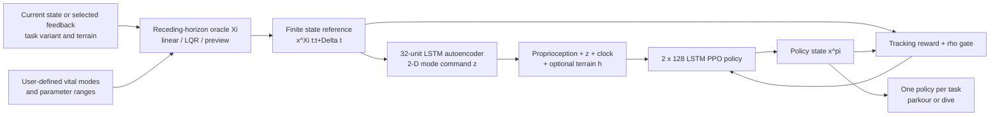

# OGMP: Oracle Guided Multi-mode Policies for Agile and Versatile Robot Control

| Field | Value |
| --- | --- |
| Primary source | [arXiv:2403.04205v3](https://arxiv.org/html/2403.04205v3), 18 September 2024; latest public arXiv version verified 30 August 2026 |
| Authors | Lokesh Krishna, Nikhil Sobanbabu, Quan Nguyen |
| Official supplements | [Project page](https://og-mps.github.io/); [code at commit `085d293`](https://github.com/DRCL-USC/ogmp/tree/085d293f4e8b494021e6bb93fb33b137b98ca6de) |
| Harness relevance | Reference composition / task reward / fixed trainer / evaluation |
| Evidence tier | Anchor |

## Main point

On HECTOR parkour and diving, PPO constrained by a tuned state-space neighborhood around an online receding-horizon oracle produced one recurrent policy per task; the evidence does **not** show automatic reference-set design, and the result couples the oracle to replanning, conditioning, reward, and termination.

## Mechanism

## Exact parameters

| Parameter | Value | Context | Source locator |
| --- | ---: | --- | --- |
| Oracle contract | `x^Xi[t,t+Delta t] = Xi(x_t, psi_T)` | A finite reference must exist for every current state and task variant and remain within unknown `epsilon` of an unknown optimum | Sec. II-1, Eq. 1 |
| Permissible-state constraint | `||x^pi_t - x^Xi_t||_W < rho` | Conceptual constrained optimization; sufficient reachability condition is `rho >= epsilon` | Sec. II-1, Eq. 2–5 |
| Operational constraint | terminate if `||x^pi_t-x^Xi_t||_W > rho` | Implemented as episode termination, not a projection or constrained optimizer | Sec. III-C |
| Weight selection | parkour `W_11=1`; dive `W_33=1`; all other entries `0` | The experimental gate observes one selected task-space coordinate | Sec. III-C |
| Tested parkour horizons | `7dt`, `15dt`, `30dt` = `0.21`, `0.45`, `0.9 s` | Respectively stationary/myopic, quasi-static, and successful agile block-to-block behavior | Sec. IV-B; official project “Preview Horizon variation” |
| Model-based oracle state sizes | `x in R^13`; `y,u in R^12` | Gravity-augmented LTI state, output, and control over one horizon | Sec. III-B, Eq. 6–7 |
| Task-vital modes | parkour: pace `{v}`, jump `{w,h}`, leap `{w,d}`; dive: settle `{}`, flip `{r,h}` | The mode decomposition is user-defined | Sec. II-2; Table I |
| Mode encoder | 1 hidden LSTM layer, `32` units; latent `dim(z)=2` | Autoencoder trained on oracle trajectories sampled across modes and initial states | Sec. III-C |
| Policy observation | `[proprioception, z_t, c_t, h_t]` | `c_t` is a clock; `h_t` is optional task feedback such as terrain scan | Sec. III-C |
| Policy | PPO; 2-layer LSTM, `128` nodes/layer | One policy trained per task | Sec. III-C |
| Tracking reward | `0.475 exp(-5||er_p||) + 0.475 exp(-5||er_o||)` | Base-position and base-orientation reference errors | Sec. III-C, Eq. 8 |
| Regulation reward | `0.05 exp(-0.01||u_t||) - 0.3 I(non-toe contact)` | Same reported weights for both tasks | Sec. III-C, Eq. 8 |
| Parkour `rho` sweep | `0.05–0.8`; reported optimum `rho*=0.5` | For the preview oracle; `0.1 <= rho <= 0.6` reached the reported global optimum in training curves | Sec. IV-B |
| Dive oracle/bound result | preview: `rho=0.1`; linear and LQR: `rho=0.4` | Best reported bound differs with oracle quality | Sec. IV-B |
| Unguided baseline | `rho=10^10` | Vanilla PPO proxy; converged to the same local optimum as `rho=0.8` | Sec. IV-B |
| Evaluation rollouts | `100` | Sample means for agility metrics | Sec. IV-A.1 |
| Evaluation episodes | parkour `400` steps on a `10 m` track; dive `150` steps | Test-only termination at horizon or fall; fall if terrain-relative base height `<0.3 m` | Sec. IV-A.1 |
| Best reported parkour row | speed `1.77 m/s`; Froude `0.72`; completion `84%` | Observation `[h_t,z_t,c_t]`; maximum acceleration in that row `3.1g` | Table II |
| Maximum reported acceleration | `4.7g` | Observation `z_t` only; not the same row as the best completion | Table II |
| Real-robot envelope | gap `105%` leg length; block `20%` nominal robot height; pace `0.6 m/s` | Parkour sim-to-real demonstrations | Abstract; Sec. IV-A |
| Cleaned code parkour gate | x-reference error `0.3`; horizon `30`; terrain scan `1.0`; 10 PD targets; `Kp=30`, `Kd=0.5` | Release configuration; not identical to every paper ablation | `exp_confs/parkour.yaml` at `085d293` |
| Cleaned code dive gate | z-reference error `0.1`; horizon `30`; height support `1.0–1.75`; rotation support `-6.28–6.28`; 10 PD targets | Release configuration; label separately from paper claims | `exp_confs/dive.yaml` at `085d293` |
| Released PPO defaults | `gamma=.95`, fixed std `.13`, actor/critic LR `1e-4`, KL `.02`, grad clip `.05`, batch `64`, `8` epochs, `30` workers, `50,000` samples/update | Code defaults; repository does not prove each default generated every reported checkpoint | `train.py` at `085d293` |

## Oracle and closed-loop interface

- **Definition:** an oracle is a prior that can be queried from a current state and task variant to return a finite-horizon state reference. The theorem-like argument assumes, but does not measure, a uniform unknown error bound `epsilon` to the unknown optimal state trajectory.
- **Oracle families:** linear interpolation (`Xi_li`), LQR (`Xi_lqr`), and preview control (`Xi_prev`) over an approximate single-rigid-body LTI model. Flight uses zero control; contact uses optimized control. Auxiliary contact moments and horizon-averaged orientation matrices simplify the model.
- **Training loop:** the oracle is queried online at horizon boundaries. Its reference supplies the mode embedding, tracking targets, and the deviation termination test.
- **Parkour release input:** current simulator state is reduced to selected `x,y,z,x_dot,y_dot,z_dot`, plus a forward terrain scan and desired displacement `[1,0]`. Unselected pose/rate components are replaced by nominal values.
- **Dive release input:** sampled height and flip direction set a constructed initial state and desired rotation. The settle segment starts from the prior **reference** endpoint, not measured robot state. Therefore “closed loop from any state” is a conceptual oracle contract, not uniformly demonstrated by both released task implementations.

## Evaluation evidence

| Question | Evidence | Boundary |
| --- | --- | --- |
| Does bounded exploration matter? | Preview-oracle parkour peaked near `rho=.5`; `rho=.8` and unguided `rho=10^10` reached a reported local optimum | One robot family, task suite, and PPO implementation |
| Does oracle fidelity matter? | Preview control outperformed linear and LQR oracles for the 2 m side-flip case | Parkour showed no significant oracle difference |
| Does horizon matter? | `30dt` aligned the tracking surrogate with forward progress; `7dt` exploited frequent replanning by standing still | Empirical ablation, not a general horizon theorem |
| Is latent conditioning necessary for return? | No improvement between terrain+clock and terrain+latent+clock variants | Authors retain it for analysis, reuse, and reactive commandability |
| Is behavior versatile? | In-domain and out-of-domain terrain sweeps plus real parkour transitions; simulation diving from varied heights | No statistical real-world success rate is reported in the paper text |

## What transfers to Sam's harness

- Treat an oracle candidate as a **versioned executable reference interface**, not only a bag of clips: current-state inputs, task inputs, horizon, mode state, transition logic, and output schema all affect the run.
- Reference-composition candidates can vary the mode set, parameter support, transition sequence, oracle family, and horizon. Record each separately; they are not interchangeable “datasets.”
- Evaluate oracle/reward candidates against an independent task metric. OGMP's `7dt` result shows that high reference-tracking return can coexist with task failure.
- Sweep or adapt the permissible bound jointly with the oracle. The paper directly shows that an oracle ranking and a fixed `rho` cannot be evaluated independently.
- If Sam freezes the trainer/MDP, classify the deviation gate, query cadence, observation clock, and conditioning channel before experiments. Otherwise an “oracle-only” edit silently changes termination and policy inputs.
- Useful first controlled comparison: fixed PPO, network, task distribution, and training budget; cross oracle composition × horizon × `rho`; report task metric, tracking metric, termination reason, and mode-transition coverage.

## What does not transfer

- OGMP does not search for, rank, or compose reference datasets automatically. Humans define the modes, parameter ranges, oracle structure, and `rho` sweep.
- It does not establish that reference composition alone improves a frozen trainer. The oracle also changes reward targets, early termination, online replanning, and sometimes observations.
- It provides no natural-language steering, preference learning, vision-conditioned control, VIBE integration, or foundation-controller result.
- It does not prove a global policy, global convergence, or dynamic feasibility of the oracle. The oracle may use deliberately approximate/nonphysical auxiliary controls.
- A mode latent is not evidence that a policy truly conditions on an immutable reference manifest. The paper reports that latent conditioning did not improve parkour performance.
- Its task-independent **form** of the reward is still oracle-dependent; changing the oracle changes the numerical reward signal even if coefficients stay fixed.

## Failure modes and caveats

- The existence and bounded-error oracle premise is conceptual: `x*` and `epsilon` are unknown, so `rho` is selected by grid search.
- Too-small `rho` can exclude the optimum. Too-large `rho` admits local optima. States outside the oracle tube may fail, so the authors explicitly forgo global-policy coverage.
- Short horizons can reward-hack the surrogate by standing still. Medium horizons produced quasi-static transitions.
- Task-vital mode selection is user-defined; the paper does not test sensitivity to missing, redundant, or incorrect modes.
- The tracking surrogate and task objective aligned only under suitable horizon/bound choices in the tested parkour setting.
- Only parkour is transferred to hardware; diving remains a simulation result in this paper.
- The released repository says it was cleaned after the paper and that convergence/analysis numbers can change slightly. Pin the code commit and do not treat current YAML as the exact identity of every paper checkpoint.

## Evidence ledger

| ID | Claim | Source locator |
| --- | --- | --- |
| E1 | v3 is the latest arXiv version; submitted 7 Mar 2024, revised 18 Sep 2024 | [arXiv record, submission history](https://arxiv.org/abs/2403.04205) |
| E2 | Oracle definition and unknown `epsilon`; permissible bound and `rho>=epsilon` argument | [v3 Sec. II-1, Eq. 1–5](https://arxiv.org/html/2403.04205v3#S2.SS1) |
| E3 | Finite task-vital modes and parameterized repetitions represent infinite-horizon tasks | [v3 Sec. II-2](https://arxiv.org/html/2403.04205v3#S2.SS2) |
| E4 | User-defined parkour and dive modes and parameters | [v3 Table I](https://arxiv.org/html/2403.04205v3#S3.SS1) |
| E5 | Linear, LQR, and preview oracles use an approximate 13-state/12-output-control LTI SRB model | [v3 Sec. III-B, Eq. 6–7](https://arxiv.org/html/2403.04205v3#S3.SS2) |
| E6 | 2-D latent, 32-unit LSTM autoencoder, observation components, exact reward, termination gate, and 2×128 LSTM PPO | [v3 Sec. III-C, Eq. 8](https://arxiv.org/html/2403.04205v3#S3.SS3) |
| E7 | Agility protocol and observation ablation metrics | [v3 Sec. IV-A.1, Table II](https://arxiv.org/html/2403.04205v3#S4.SS1.SSS1) |
| E8 | Oracle, horizon, and `rho` ablations; latent-conditioning null result | [v3 Sec. IV-B](https://arxiv.org/html/2403.04205v3#S4.SS2) |
| E9 | Loss of global coverage and possible failure outside the oracle neighborhood | [v3 Sec. V](https://arxiv.org/html/2403.04205v3#S5) |
| E10 | Exact horizon durations and qualitative outcomes | [official project page, “Preview Horizon variation”](https://og-mps.github.io/) |
| E11 | Released parkour inputs, reward coefficients, bound proxy, horizon, and terrain supports | [official code `parkour.yaml` at `085d293`](https://github.com/DRCL-USC/ogmp/blob/085d293f4e8b494021e6bb93fb33b137b98ca6de/exp_confs/parkour.yaml) |
| E12 | Parkour oracle receives selected current state, terrain scan, and desired displacement | [official code `parkour.py` at `085d293`](https://github.com/DRCL-USC/ogmp/blob/085d293f4e8b494021e6bb93fb33b137b98ca6de/dtsd/envs/sim/parkour.py#L20-L47) |
| E13 | Released dive parameters, gate proxy, horizon, and reward coefficients | [official code `dive.yaml` at `085d293`](https://github.com/DRCL-USC/ogmp/blob/085d293f4e8b494021e6bb93fb33b137b98ca6de/exp_confs/dive.yaml) |
| E14 | Dive reference construction uses sampled task parameters and prior reference endpoint | [official code `dive.py` at `085d293`](https://github.com/DRCL-USC/ogmp/blob/085d293f4e8b494021e6bb93fb33b137b98ca6de/dtsd/envs/sim/dive.py#L37-L84) |
| E15 | Released environment replans at horizon boundaries and exposes references to reward/termination | [official code `ogpo_biped_base.py` at `085d293`](https://github.com/DRCL-USC/ogmp/blob/085d293f4e8b494021e6bb93fb33b137b98ca6de/dtsd/envs/sim/ogpo_biped_base.py#L144-L182) |
| E16 | Released PPO defaults | [official code `train.py` at `085d293`](https://github.com/DRCL-USC/ogmp/blob/085d293f4e8b494021e6bb93fb33b137b98ca6de/train.py#L5-L28) |
| E17 | Code was cleaned after the paper and may differ slightly in convergence and analysis | [official repository README](https://github.com/DRCL-USC/ogmp/tree/085d293f4e8b494021e6bb93fb33b137b98ca6de#recreating-results-from-the-paper) |
