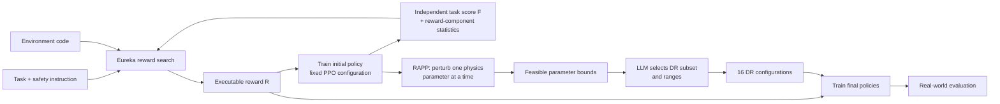

# DrEureka: Language Model Guided Sim-To-Real Transfer

| Field | Value |
| --- | --- |
| Primary source | [arXiv:2406.01967v1](https://arxiv.org/html/2406.01967), 4 June 2024; [RSS 2024 proceedings](https://www.roboticsproceedings.org/rss20/p094.html), DOI `10.15607/RSS.2024.XX.094` |
| Authors | Yecheng Jason Ma, William Liang, Hung-Ju Wang, Sam Wang, Yuke Zhu, Linxi Fan, Osbert Bastani, Dinesh Jayaraman |
| Official supplements | [Project page](https://eureka-research.github.io/dr-eureka/); [code pinned at `1d4e007`](https://github.com/eureka-research/DrEureka/tree/1d4e00700423170717654516f4ef4b24cb0f3a84) |
| Harness relevance | Task reward / evaluation / fixed trainer boundary |
| Evidence tier | Core |

## Main point

With PPO and its task-specific training hyperparameters held fixed, DrEureka shows that task-and-safety instructions plus policy feedback can produce executable rewards, but its headline sim-to-real gains jointly change the reward **and** the transition distribution, so only its reward-isolated ablations support Sam's task-reward knob.

## Mechanism

## Exact parameters

| Parameter | Value | Context | Source locator |
| --- | ---: | --- | --- |
| Sim-to-real design output | `(T_distribution, R) <- Algo(M, l_task)` | The paper separates the reward from the randomized transition distribution and evaluates the resulting policy with a distinct true task objective `F` | Sec. III, Eq. 1-4 |
| Reward-search loop | `N` iterations, `K` reward candidates per iteration | Candidate policies are trained; task score and reward-component statistics are reflected back to the LLM | Algorithm 1 |
| Forward-locomotion instruction targets | `2.0 m/s`; torso `z=0.34 m` | Safety prompt also requests steady orientation, smooth legs, low action rate, and no joint-limit violations | Appendix A1, Prompt 2 |
| Generated forward reward | product of velocity, height, orientation, joint-limit, and smoothness factors | Uses `exp(-|v_x-2|)`, `exp(-5|z-.34|)`, `exp(-5||g-[0,0,-1]||)`, a binary joint-limit factor, and `exp(-.1||a_t-a_{t-1}||)` | Appendix B1, Prompt 12 |
| RAPP scan | one physics parameter changed per rollout; all others at defaults | Feasible values satisfy the task success criterion; returned bounds are the minimum and maximum feasible values | Algorithm 2 |
| Forward RAPP search families | friction `[0,10]`; restitution `[0,1]`; payload and COM `[-10,10]`; strength/gains `[0,2]`; push, DOF properties `[0,10]`; gravity `[-10,10]` | These are search bounds, **not** final DR ranges and **not** part of a reward-only intervention | Appendix D1, Table XII |
| Backbone model | GPT-4 | Only one LLM family is reported | Sec. V, Methods |
| DR candidates | `16` | Every candidate policy is trained and evaluated in the real world; the paper reports best and average | Sec. IV-D; Sec. V, Methods |
| Policy seeds | `3` per DR configuration | Averages and standard deviations combine trials and seeds | Sec. V, Policy Training and Evaluation |
| Trainer | PPO; teacher-student PPO for locomotion | Original task implementation hyperparameters are retained and not tuned for DrEureka | Sec. V, Policy Training and Evaluation |
| Forward task protocol | Unitree Go1, `12` DoF; target `2 m/s`; `5 m` track | Real evaluation reports projected forward velocity and distance | Sec. V, Robots and Tasks |
| Cube task protocol | LEAP hand, `16` DoF; `20 s`; PID at `20 Hz` | Policy observes 16 joint angles plus proprioceptive history and emits 16 target joint angles | Sec. V; Appendix D2 |
| Independent success score: locomotion | `sum_t exp(-(v_x-v_x^t)^2/0.25)` | Fitness used to rank reward candidates and define RAPP feasibility | Appendix A5, Table IV |
| Independent success score: cube | `sum_t clip(omega_z,-0.25,0.25)` | Separate from the generated training reward | Appendix A5, Table IV |
| Independent success score: globe | `sum_t 1` | Equivalent to episode length | Appendix A5, Table IV |
| Reward-only safety ablation | safety: sim `1.70±0.11`, real `1.21±0.39 m/s`; no safety: sim `1.83±0.05`, real `0.0±0.0 m/s` | Both rows omit DR; this is the cleanest reported evidence for the safety-conditioned reward design | Appendix, Table XVI |
| Full-pipeline locomotion result | best `1.83±0.07 m/s`, `5.00±0.00 m`; average `1.66±0.25 m/s`, `4.64±0.78 m` | Joint reward+DR result; Human-Designed is `1.32±0.44 m/s`, `4.17±1.57 m` | Table I |
| Full-pipeline cube result | best `9.39±4.15 rad`; average `4.67±3.55 rad`; Human-Designed `3.24±1.66 rad` | Joint reward+DR result; best and Human-Designed both report `20.00±0.00 s` time-to-fall | Table II |
| Walking-globe result | simulation `10.7±5.20 s`; real `15.4±4.17 s` | Real lab setting uses center-point fall support; simulation cannot model ball deformation faithfully | Table III; Sec. VI-C |
| Ungrounded-DR failure rate | `15/16` unsafe policies | Both no-prior and uninformative-prior variants commonly triggered motor-power protection and were scored zero | Table I footnote |
| DR-search wall clock | DrEureka `3 h`; CEM `10 h`; BayRn `20 h` | Baselines use sequential real-world feedback; DrEureka trains candidates in parallel | Sec. VI-B |
| Public code identity | commit `1d4e00700423170717654516f4ef4b24cb0f3a84` | Latest public `main` observed 30 August 2026; code is supplementary, not the identity of every reported checkpoint | Official repository tree |

## Reward evidence versus randomization evidence

| Claim | Evidence class | Safe interpretation |
| --- | --- | --- |
| Safety language changes the learned behavior | Reward-isolated | Table XVI removes DR in both arms. The safety-conditioned reward sacrifices a little simulated velocity but transfers; the no-safety reward learns an unnatural three-foot/hip-dragging gait and fails immediately in reality. |
| Generated reward can train without the human velocity curriculum | Reward-isolated with fixed Human-Designed DR | Appendix Figure 12 reports better sample efficiency and asymptotic simulation performance than the human reward without its curriculum. The paper does not give numeric endpoints in the text. |
| DrEureka beats Human-Designed on locomotion and cube rotation | Joint reward + DR | Tables I-II change two design variables. They cannot identify a reward-only causal effect. |
| RAPP and LLM sampling improve real deployment | DR-only ablations under a fixed DrEureka reward | In the Table I DR ablations, the reward is fixed and only DR configuration changes. This supports DR design, which is outside Sam's initial fixed-transition contract. |

## What transfers to Sam's harness

- Keep the generated task reward as executable, versioned code with an explicit input signature.
- Feed an independent task metric and per-component reward statistics back to the reward authoring loop. Never use generated reward return as the sole evaluator.
- Express safety and naturalness requirements in the reward-design input, then test them as independent gates. The reward-only ablation shows why simulated task score alone is insufficient.
- Freeze PPO, policy architecture, task distribution, seed count, and training budget across reward candidates. DrEureka's evaluation follows this pattern within each task.
- Log each candidate's task score, component scales, training failures, and behavioral failures. Reward reflection explicitly uses component magnitudes to rescale, rewrite, or delete terms.
- Separate reward experiments from transition-randomization experiments. A valid Sam iteration may reuse the reward-generation loop while holding all DR ranges and physics settings constant.

## What does not transfer

- RAPP, DR subset selection, and DR-range generation change the transition distribution. They violate Sam's initial fixed scene/dynamics/randomization contract unless declared as a separate experiment.
- Tables I-II are not reward-only evidence because DrEureka changes reward and DR jointly.
- Real-world evaluation of all 16 DR policies is not a safe or scalable automatic selection rule. The authors list missing policy selection as a limitation.
- The paper does not create or compose motion references, oracles, state machines, OGMP modes, or reference-conditioned observations.
- A static task/safety prompt is not evidence for iterative natural-language preference steering.
- The paper does not establish robustness to a different LLM, reward-search budget, simulator, or foundation controller.
- Nothing here establishes that RL-Sculptor implements DrEureka or that its generated code is safe to execute without validation.

## Failure modes and caveats

- Reward misspecification can look better in simulation: omitting safety language produced higher simulated velocity but a physically unnatural gait and zero real velocity.
- Post-hoc safety penalties can dominate task terms and cause over-conservative behavior; DrEureka motivates joint generation, but does not prove it eliminates this failure generally.
- Ungrounded DR is dangerous: 15 of 16 policies in each no-prior/uninformative-prior experiment were jerky or triggered motor protection.
- The best DR policy cannot be selected reliably from simulation; all candidates were deployed for evaluation.
- Generated DR parameters remain static during training and do not incorporate real-world failure feedback.
- The implementation is proprioception-only; the paper lists missing visual inputs as a limitation.
- Walking-globe reality differs materially from the rigid-ball simulator, and the real lab evaluation adds a safety tether/center support.
- Only three tasks, two robot platforms, one backbone LLM, and task-specific existing PPO stacks are evaluated.
- The released code is pinned for provenance, but the paper does not publish immutable hashes for the exact trained checkpoints used in every table.

## Evidence ledger

| ID | Claim | Source locator |
| --- | --- | --- |
| E1 | arXiv v1 identity, authors, and 4 June 2024 submission; RSS 2024 publication and DOI | [arXiv record](https://arxiv.org/abs/2406.01967); [RSS proceedings record](https://www.roboticsproceedings.org/rss20/p094.html) |
| E2 | Formal separation of reward `R`, transition distribution, policy learner, and true task objective `F` | [v1 Sec. III, Eq. 1-4](https://arxiv.org/html/2406.01967#S3) |
| E3 | Reward candidates are trained and scored; task score and component statistics drive LLM reflection | [v1 Sec. IV-A, Algorithm 1](https://arxiv.org/html/2406.01967#S4.SS1) |
| E4 | Safety instructions are incorporated during reward generation; exact task prompts specify stability, smoothness, height, orientation, and joint limits | [v1 Sec. IV-B](https://arxiv.org/html/2406.01967#S4.SS2); Appendix A1, Prompts 2-4 |
| E5 | RAPP varies one physics parameter at a time, retains successful values, and returns feasible min/max bounds | [v1 Sec. IV-C, Algorithm 2](https://arxiv.org/html/2406.01967#S4.SS3) |
| E6 | LLM chooses a parameter subset and ranges within RAPP; multiple fixed DR candidates are trained and cannot be selected reliably in simulation | [v1 Sec. IV-D](https://arxiv.org/html/2406.01967#S4.SS4) |
| E7 | GPT-4, 16 DR configurations, PPO, original task hyperparameters, and three seeds per configuration | [v1 Sec. V](https://arxiv.org/html/2406.01967#S5) |
| E8 | Forward-locomotion main comparison and DR ablations; no-prior safety failures | [v1 Table I](https://arxiv.org/html/2406.01967#S6) |
| E9 | Cube-rotation best, average, and Human-Designed results | [v1 Table II](https://arxiv.org/html/2406.01967#S6) |
| E10 | Walking-globe simulation/real duration and center-support boundary | [v1 Sec. VI-C, Table III](https://arxiv.org/html/2406.01967#S6.SS3) |
| E11 | Reward-only safety ablation and observed unnatural-gait failure without the safety instruction | [v1 Appendix, Table XVI and safety-instruction analysis](https://arxiv.org/html/2406.01967#A2) |
| E12 | Exact generated forward and walking-globe reward code and coefficients | [v1 Appendix B1, Prompts 12-14](https://arxiv.org/html/2406.01967#A1.SS2.SSS1) |
| E13 | Task success criteria are separate from generated training rewards | [v1 Appendix A5, Table IV](https://arxiv.org/html/2406.01967#A1.SS1.SSS5) |
| E14 | Reward reflection rewrites functional forms and component scales using task and component statistics | [v1 Appendix B3, Generation 4](https://arxiv.org/html/2406.01967#A1.SS2.SSS3) |
| E15 | Physics parameters and RAPP search ranges for locomotion, cube rotation, and walking globe | [v1 Appendix D, Tables XII-XIV](https://arxiv.org/html/2406.01967#A1.SS4) |
| E16 | Missing vision, static DR, and absent policy-selection mechanism are author-stated limitations | [v1 Sec. VIII](https://arxiv.org/html/2406.01967#S8) |
| E17 | Official project overview, three tasks, public rewards/DR examples, and qualitative failure boundary | [official project page](https://eureka-research.github.io/dr-eureka/) |
| E18 | Public implementation provenance and released pipeline structure | [official code at `1d4e007`](https://github.com/eureka-research/DrEureka/tree/1d4e00700423170717654516f4ef4b24cb0f3a84) |
| E19 | DrEureka, CEM, and BayRn wall-clock comparison and sequential/parallel distinction | [v1 Sec. VI-B](https://arxiv.org/html/2406.01967#S6.SS2) |
| E20 | Reward comparison under fixed Human-Designed DR and curriculum boundary | [v1 Appendix, Figure 12 discussion](https://arxiv.org/html/2406.01967#A2) |
