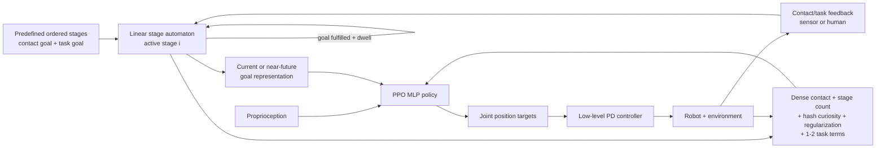

# WoCoCo: Learning Whole-Body Humanoid Control with Sequential Contacts

| Field | Value |
| --- | --- |
| Primary source | [arXiv:2406.06005v2](https://arxiv.org/html/2406.06005v2), 7 November 2024; reviewed PDF SHA-256 `812ced4443bd525bbfbbfe5a0851745f7b8c10dd1e21c60f9cbb518aff695527` |
| Authors | Chong Zhang, Wenli Xiao, Tairan He, Guanya Shi |
| Venue | CoRL 2024; [official project page](https://lecar-lab.github.io/wococo/) labels it an oral |
| Official code | [`LeCAR-Lab/wococo` at `c44d312`](https://github.com/LeCAR-Lab/wococo/tree/c44d31284ba79ee1e87130150c394591c6130e32), committed 7 November 2024 and pinned 30 August 2026 |
| Harness relevance | Reference composition / task reward / evaluation / fixed trainer |
| Evidence tier | Core |

## Main point

With PPO and the control stack fixed inside the paper, WoCoCo couples a manually defined linear contact-stage oracle to dense contact, stage-progress, and hash-count exploration rewards; parkour ablations report a distinct failure when each component is removed, but they do not isolate an oracle-only or reward-only effect under Sam's frozen-trainer contract.

## Mechanism

## Oracle / contact-stage contract

| Element | Paper definition | Consequence for Sam |
| --- | --- | --- |
| Stage | Pair `(g_i^con, g_i^task)` | Oracle manifest must type both predicates, their frames, tolerances, and evidence source |
| Fulfillment | Contact and task goals true simultaneously | Transition logic and reward logic share predicate semantics; version them together |
| Order | Predefined linear sequence `i = 0...I` | This is composition of symbolic goals, not learned branching or motion-reference composition |
| Transition | External sensor/human confirmation, then a predefined dwell | Dwell, debounce, terminal handling, and sensor authority are part of the oracle, not incidental runtime state |
| Policy input | Proprioception plus active/near-future goal representation | Changing lookahead or encoding changes the observation contract, so it is not an oracle-only edit under a strictly frozen MDP |
| Reward input | Contact counts, goal booleans, completed-stage count, and curiosity state | Oracle and reward artifacts need one immutable stage-index/predicate interface |

## Exact parameters

| Parameter | Value | Context | Source locator |
| --- | ---: | --- | --- |
| Stage fulfillment | `F_con AND F_task` | Both contact and task goals must hold | [v2 Sec. 2](https://arxiv.org/html/2406.06005v2#S2) |
| Policy objective | `a_t = pi*(s_t | g^con_{i:I}, g^task_{i:I})` | Extended-MDP formulation | [v2 Sec. 2](https://arxiv.org/html/2406.06005v2#S2) |
| Total reward | `r = (r_WoCoCo + r_reg) + r_task` | Task-agnostic framework plus task terms | [v2 Eq. 1](https://arxiv.org/html/2406.06005v2#S2.E1) |
| WoCoCo reward | `r_WoCoCo = w_con r_con + w_stage r_stage + w_curi r_curi` | Shared form, task-specific weights | [v2 Eq. 2](https://arxiv.org/html/2406.06005v2#S3.E2) |
| Dense contact reward | `n_corr - n_con n_wrong 1(n_stage>0) + 2 n_con^2 F_con F_task` | Wrong-contact penalty is masked during stage 0 | [v2 Eq. 3](https://arxiv.org/html/2406.06005v2#S3.E3) |
| Stage-count reward | `n_stage F_task` | Task-goal gate limits one accumulation exploit | [v2 Eq. 4](https://arxiv.org/html/2406.06005v2#S3.E4) |
| Hash bucket | `BIN2DEC[f_curi(o_curi) > 0]` | Frozen random network; sign bits identify bucket | [v2 Eq. 5](https://arxiv.org/html/2406.06005v2#S3.E5) |
| Paper curiosity reward | `1 / sqrt(bucket visits)` | Paper equation; see code discrepancy below | [v2 Eq. 6](https://arxiv.org/html/2406.06005v2#S3.E6) |
| Reward weights: parkour | contact `120`; stage `160`; curiosity `20,000` | Shared form does not mean shared scale | [v2 App. E, Table 1](https://arxiv.org/html/2406.06005v2#A5.T1) |
| Reward weights: box | contact `40`; stage `160`; curiosity `40,000` | Box loco-manipulation | [v2 App. E, Table 1](https://arxiv.org/html/2406.06005v2#A5.T1) |
| Reward weights: dance | contact `10`; stage `5`; curiosity `5,000` | Clap-and-tap dancing | [v2 App. E, Table 1](https://arxiv.org/html/2406.06005v2#A5.T1) |
| Reward weights: cliff | contact `20`; stage `40`; curiosity `10,000` | Bidirectional cliffside | [v2 App. E, Table 1](https://arxiv.org/html/2406.06005v2#A5.T1) |
| Parkour task term | `w_task=30`; exponential elbow rotation/position errors | One task-specific term | [v2 App. G.1, Eq. 8](https://arxiv.org/html/2406.06005v2#A7.SS1) |
| Box task terms | `w_hand=100`, `w_box=200`; angle gates `pi/6`, `pi/2` | Hand-to-box and box-to-destination distances | [v2 App. G.2, Eq. 9](https://arxiv.org/html/2406.06005v2#A7.SS2) |
| Dance task terms | `w_hand=5`, `w_foot=10`; foot scale `0.1 m` | Arm spread and precise footholds | [v2 App. G.3, Eq. 10](https://arxiv.org/html/2406.06005v2#A7.SS3) |
| Cliff task terms | `w_base=50`, `w_ee=5`; EE distance scale `0.2 m` | Wall-facing and end-effector placement | [v2 App. G.4, Eq. 11](https://arxiv.org/html/2406.06005v2#A7.SS4) |
| Goal lookahead | parkour: future `2`; box/dance: current; cliff subsection: current + next | General appendix sentence instead says every non-parkour task uses current only | [v2 App. H.2](https://arxiv.org/html/2406.06005v2#A8.SS2) |
| Actor and critic | MLP `[512, 256, 128]` | Same reported architecture across policies | [v2 App. H.3](https://arxiv.org/html/2406.06005v2#A8.SS3) |
| Proprioceptive history | `3` control steps | Joint positions, velocities, previous actions | [v2 App. H.1](https://arxiv.org/html/2406.06005v2#A8.SS1) |
| Curiosity network | `1 x 32` hidden units; `16` outputs | `2^16` possible sign buckets | [v2 App. I.2](https://arxiv.org/html/2406.06005v2#A9.SS2) |
| Reported curiosity preprocessing | map ranges to `[0,pi]`, then sine/cosine | Authors report no significant difference among three tested preprocessors | [v2 App. I.1](https://arxiv.org/html/2406.06005v2#A9.SS1) |
| Sim-to-real schedule | no DR to convergence; DR to convergence; then `+20%` regularization every `2,000` iterations until `2x` | Curiosity only in phase 1 | [v2 Sec. 3.2](https://arxiv.org/html/2406.06005v2#S3.SS2) |
| Policy / PD / filter | `50 / 200 / 4 Hz` | Deployment update rates and PD-target low-pass bandwidth | [v2 App. L.1](https://arxiv.org/html/2406.06005v2#A12.SS1) |
| Stability plot | `5` seeds | Parkour only; curves, no tabulated dispersion | [v2 App. C](https://arxiv.org/html/2406.06005v2#A3) |
| Early-DR ablation | progress `<0.6` vs standard `>0.75` | Normalized completed-stage progress on parkour | [v2 App. K.1](https://arxiv.org/html/2406.06005v2#A11.SS1) |
| Public demo stage runtime | `4` end effectors; `10` stages; dwell sampled `[0.4,0.8] s` | Clap-and-dance release only | [`h1_jumpjack.py`](https://github.com/LeCAR-Lab/wococo/blob/c44d31284ba79ee1e87130150c394591c6130e32/legged_gym/legged_gym/envs/base/h1_jumpjack.py#L37-L45); [config](https://github.com/LeCAR-Lab/wococo/blob/c44d31284ba79ee1e87130150c394591c6130e32/legged_gym/legged_gym/envs/h1/h1_jumpjack_config.py#L249-L261) |
| Public demo curiosity | input `29`; hidden `32`; output `16` | Demo additionally stage-rescales inputs and evaluates `1/sqrt(1+count)` after increment | [`curiosity.py`](https://github.com/LeCAR-Lab/wococo/blob/c44d31284ba79ee1e87130150c394591c6130e32/legged_gym/legged_gym/envs/base/curiosity.py#L25-L78) |

## Evaluation evidence

| Question | Evidence | Boundary |
| --- | --- | --- |
| Does dense contact shaping matter? | The 0-1 contact baseline tracks the upper-body pose without jumping | Parkour only; qualitative behavior and learning curves |
| Does stage-progress reward matter? | Without it, the policy intentionally avoids completing the active contact goal | Direct reward-hacking example; no rate or confidence interval |
| Does exploration reward matter? | No-curiosity also stalls; RND finds risky backward leaning; hash-count curiosity trains the demonstrated behavior | Parkour only; comparison changes intrinsic-reward algorithm |
| Is training stable? | Five parkour learning curves from different random initializations | No tabulated mean, variance, interval, or significance test |
| Does the sim-to-real schedule matter? | Early domain randomization reduces converged progress below `0.6` from above `0.75`; no phase 3 produces jerky real hardware behavior | Schedule is a trainer change, not an oracle/reward-only factor |
| Does the method span tasks? | Four humanoid tasks are shown on hardware and one dinosaur task in the reported suite | Demonstrations, not a tabulated cross-task hardware success study |
| How broad is real parkour? | Hardware testing used double-foot contacts and one or two jumps | Single-foot/long-horizon parkour appears in simulation, not matched hardware trials |

## What transfers to Sam's harness

- Represent an oracle candidate as an immutable **stage manifest**: ordered stage IDs, contact predicates, task predicates, coordinate frames, tolerances, lookahead, dwell/debounce, terminal behavior, and feedback authority.
- Compile the manifest into an executable linear automaton and hash both source and compiled forms. Training and evaluation must consume the same artifact.
- Give oracle and reward code one typed runtime interface: `stage_id`, `F_con`, `F_task`, `n_corr`, `n_wrong`, `n_stage`, and sensor validity. Reject missing or stale fields.
- Keep stage composition and reward generation as separate harness outputs even though WoCoCo couples them at runtime. This enables a controlled cross-product: fixed oracle × reward and fixed reward × oracle.
- Treat lookahead as part of the frozen observation contract. If the fixed trainer exposes exactly one current-stage slot, a candidate cannot silently add future goals.
- Test three explicit reward failures: sparse-contact stalling, refusal to advance, and stage-count exploitation. Record objective completion separately from training return.
- Report task progress as an **evaluation metric** only if it is computed independently from generated reward code and immutable predicate definitions.
- Preserve the paper's main design lesson, not its numeric weights: progress shaping must reward leaving safe local stages without making unbounded stage count itself exploitable.
- Useful first fixed-trainer grid: oracle stage partition/order/lookahead × `{sparse, dense-contact}` × `{no progress, bounded progress}`. Freeze PPO, observation/action schemas, scene, controller, regularization, domain randomization, and sample budget.

## What does not transfer

- WoCoCo does not compose a motion dataset or generate kinematically/dynamically feasible motion references. Its “reference” is a symbolic contact/task-goal sequence.
- It does not learn, search, rank, branch, or synthesize contact stages. Humans predefine the sequence and predicates.
- It provides no natural-language steering, preference model, LLM reward generator, VIBE result, or foundation-controller integration.
- The full paper method is not an oracle-only or reward-only intervention: it also changes goal observations, curiosity, domain randomization, regularization schedule, temporal history, and deployment control.
- “Task-agnostic reward” means a shared algebraic form. The paper changes the three main weights across every task and adds task-specific terms.
- Real-world videos are not evidence of a quantified safety envelope, failure probability, or success rate.
- The public repository is not a full reproduction package: its README explicitly limits the release to one clap-and-dance reward/MDP example.

## Failure modes and caveats

- **Stage stalling:** without progress reward, the agent avoids satisfying a stage to preserve easy returns.
- **Sparse-reward stalling:** a binary contact-success term and no-curiosity variant fail to discover jumping.
- **Intrinsic-reward attractor:** RND rewards rare but risky backward leaning.
- **Unknown sequence length:** the authors warn that unbounded stage count may be exploited and suggest heuristic clamping.
- **No feasibility certificate:** the learned controller cannot say when it will fail.
- **External transition authority:** sensor or human feedback is required to switch stages.
- **Heuristic oracle:** stage selection and order are not learned or optimized.
- **Ablation scope:** the reward ablations and five-seed stability analysis cover parkour, not every task.
- **Goal-lookahead inconsistency:** Appendix H says non-parkour policies see only the current stage, then says cliffside sees current and next stages.
- **Paper/code mismatch:** the paper reports non-stage-aware curiosity preprocessing and `1/sqrt(visits)`; the public demo stage-rescales the input, increments its counter, then returns `1/sqrt(1+count)`.
- **Partial code:** the pinned release exposes one dance example and is not evidence that all paper tasks are publicly reproducible.

## Public-code audit

| Item | Pinned implementation | Interpretation |
| --- | --- | --- |
| Sequence state | `contact_sequence[n_env, 4, num_seq]` plus integer `current_contact_goal` | Concrete linear automaton, not branches or learned modes |
| Stage transition | Whole-body predicate latches `current_contact_reached`; dwell timer advances and clips index | Transition semantics belong in the oracle manifest |
| Observation | Active 4-bit phase concatenated with proprioception/global observations | Oracle changes policy input; freeze this channel in Sam's comparison |
| Dense reward | Correct feet + hand state + completion bonus; wrong contacts penalized after the first stage | Release specializes the paper formula to the dance example |
| Progress reward | Current stage index times whole-body fulfillment | Stage and task predicates remain reward inputs |
| Curiosity | 29-D state, symmetry mapping, sine/cosine normalization, 16-bit bucket | Reproducible demo mechanism but not literal identity with the paper equation |
| Release scope | README says clap-and-dance example only | Do not promote code availability into full-task reproduction evidence |

## Evidence ledger

| ID | Claim | Source locator |
| --- | --- | --- |
| E01 | v2 is the reviewed revision; authors and date | [arXiv submission record](https://arxiv.org/abs/2406.06005v2) |
| E02 | Predefined stage pairs, simultaneous goal fulfillment, external feedback, and dwell transition | [v2 Sec. 2](https://arxiv.org/html/2406.06005v2#S2) |
| E03 | Goal-conditioned MDP, reward split, PPO/MLP/Isaac Gym, and PD-target actions | [v2 Sec. 2](https://arxiv.org/html/2406.06005v2#S2) |
| E04 | Dense contact and stage-count equations and rationale | [v2 Sec. 3.1, Eq. 2-4](https://arxiv.org/html/2406.06005v2#S3.SS1) |
| E05 | Random-hash bucket and inverse-visit-count curiosity | [v2 Sec. 3.1, Eq. 5-6](https://arxiv.org/html/2406.06005v2#S3.SS1) |
| E06 | Three-phase sim-to-real schedule and three-step history | [v2 Sec. 3.2](https://arxiv.org/html/2406.06005v2#S3.SS2) |
| E07 | Task suite, hardware demonstrations, and limited real parkour protocol | [v2 Sec. 4](https://arxiv.org/html/2406.06005v2#S4) |
| E08 | Reward ablation failure behaviors and five-seed stability plot | [v2 Sec. 5](https://arxiv.org/html/2406.06005v2#S5); [App. B-C](https://arxiv.org/html/2406.06005v2#A2) |
| E09 | Failure prediction, unknown-length exploit, MoCap, heuristic sequence, and transition-feedback limits | [v2 Sec. 6](https://arxiv.org/html/2406.06005v2#S6) |
| E10 | Per-task WoCoCo weights | [v2 App. E, Table 1](https://arxiv.org/html/2406.06005v2#A5) |
| E11 | Regularization formulas and weights | [v2 App. F, Table 2](https://arxiv.org/html/2406.06005v2#A6) |
| E12 | Four task-specific reward equations and constants | [v2 App. G](https://arxiv.org/html/2406.06005v2#A7) |
| E13 | Goal encodings, lookahead descriptions, proprioception, and MLP sizes | [v2 App. H](https://arxiv.org/html/2406.06005v2#A8) |
| E14 | Curiosity observations, three preprocessors, selected preprocessor, and hash network size | [v2 App. I](https://arxiv.org/html/2406.06005v2#A9) |
| E15 | Domain-randomization ranges | [v2 App. J, Table 3](https://arxiv.org/html/2406.06005v2#A10) |
| E16 | Curriculum ablation progress and jerky hardware failure | [v2 App. K](https://arxiv.org/html/2406.06005v2#A11) |
| E17 | Deployment update/filter rates and corrected robot model | [v2 App. L](https://arxiv.org/html/2406.06005v2#A12) |
| E18 | Public release is one clap-and-dance example | [README at `c44d312`](https://github.com/LeCAR-Lab/wococo/blob/c44d31284ba79ee1e87130150c394591c6130e32/README.md#L65-L85) |
| E19 | Demo stage storage, sampling, dwell transition, and phase observation | [`h1_jumpjack.py` at `c44d312`](https://github.com/LeCAR-Lab/wococo/blob/c44d31284ba79ee1e87130150c394591c6130e32/legged_gym/legged_gym/envs/base/h1_jumpjack.py#L37-L171) |
| E20 | Demo contact, progress, and curiosity reward inputs | [`h1_jumpjack.py` at `c44d312`](https://github.com/LeCAR-Lab/wococo/blob/c44d31284ba79ee1e87130150c394591c6130e32/legged_gym/legged_gym/envs/base/h1_jumpjack.py#L254-L339) |
| E21 | Demo hash normalization, stage rescaling, count update, and reward | [`curiosity.py` at `c44d312`](https://github.com/LeCAR-Lab/wococo/blob/c44d31284ba79ee1e87130150c394591c6130e32/legged_gym/legged_gym/envs/base/curiosity.py#L25-L78) |
| E22 | Demo reward, curiosity, and sequence constants | [`h1_jumpjack_config.py` at `c44d312`](https://github.com/LeCAR-Lab/wococo/blob/c44d31284ba79ee1e87130150c394591c6130e32/legged_gym/legged_gym/envs/h1/h1_jumpjack_config.py#L211-L261) |
| E23 | CoRL 2024 oral label and official media | [official project page](https://lecar-lab.github.io/wococo/) |
