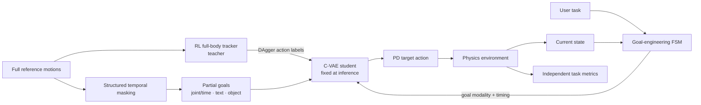

# MaskedMimic: Unified Physics-Based Character Control Through Masked Motion Inpainting

| Field | Value |
| --- | --- |
| Primary source | [arXiv:2409.14393v1](https://arxiv.org/abs/2409.14393v1); ACM TOG 43(6), article 209, [DOI 10.1145/3687951](https://doi.org/10.1145/3687951) |
| Harness relevance | **Reference composition/oracle logic** and **evaluation**; not task-reward search |
| Evidence tier | Core |

## Main point

A finite-state machine can compose time-indexed partial goals for one fixed controller, but the paper does not automate that composition or validate it on hardware.

## Mechanism

**Frozen in Sam's contract:** controller, scene, observations, actions, dynamics, tracking reward, and training budget. The transferable object is the FSM's time-indexed partial-goal schedule.

## Exact parameters

| Parameter | Value | Context | Source locator |
| --- | ---: | --- | --- |
| Future-pose slots | 11 | 10 immediate frames + 1 random long-term pose | Appendix, **Masking** |
| Repeat / resample mask | 98% / 2% | Temporally structured joint/type mask | Appendix, **Masking** |
| Time-gap sampling | 1%; 1–9 frames | Fully masked near-term interval | Appendix, **Masking** |
| High-level-condition gap multiplier | 4× | Applied with text, object, or long-term target | Appendix, **Masking** |
| Object / text masked per episode | 20% / 80% | Modality dropout | Appendix, **Masking** |
| Long-term target-pose supplied | 20% | Episode-level condition | Appendix, **Masking** |
| Pose history | 40 steps, stride 8 | Five historical-pose tokens | §6.3; Appendix, **Prior Construction** |
| Latent dimension | 64 | C-VAE latent | Appendix, **Training hyperparameters** |
| Control / simulation rate | 30 / 120 Hz | Reported experimental runtime | §7, **Experimental Setup** |
| Training scale | 16,384 envs; 4×A100; ≈14 days | ≈30B teacher and 10B student steps | §7; Appendix, **Training hyperparameters** |
| Goal-task trials | 5,000 | Random episodes per task | §8.2, **Goal-Engineering** |
| Object-FSM switch | 2 m | 1 m/s approach; then object bounding-box condition | §8.3, **Object Interaction and Ablation** |

## What transfers to Sam's harness

- Represent an oracle as an executable, closed-loop FSM: `(state, task) -> partial goal + timing`.
- Keep each transition receipt explicit: trigger, active modality, constrained body, target frame, and timeout.
- Treat constraint density as a search variable. The path experiment reports more flexibility improved success/error but reduced user control.
- Evaluate generated oracle logic with task metrics independent from the controller's tracking reward.
- Use negative ablations: removing structured masking cut reported sitting success from 96.9% to 0%.

## What does not transfer

- The paper changes the controller, architecture, reward, datasets, and training scale; Sam's initial contract freezes them.
- MaskedMimic's tracking reward is not evidence for an improved **task reward**.
- User-authored partial goals are not an automated natural-language harness or reward synthesizer.
- Simulation results on a 69-DoF SMPL humanoid do not establish real-robot transfer.
- A learned C-VAE prior is not the same artifact as a deterministic, auditable oracle manifest.

## Failure modes and caveats

- Text control handles simple atomic commands but struggles with long-horizon sequences.
- Reported motions can jitter; backflips and breakdancing remain difficult.
- On irregular terrain, the character often preserves standard walking instead of planning suitable footholds.
- Complex multi-character goal engineering is manual and potentially labor-intensive.
- Dynamic-scene manipulation and multi-agent interaction are future work.
- Quantitative results are author-reported; no independent reproduction is supplied here.

## Evidence ledger

| ID | Claim | Source locator |
| --- | --- | --- |
| E-MM-01 | The system uses an RL full-reference teacher and a masked-input student distilled with DAgger. | §4 **System Overview**; §6.2, Eq. 3 |
| E-MM-02 | Partial goals cover any-joint-any-time constraints, text, objects, and combinations. | §6.1 **Partial Goals** |
| E-MM-03 | Temporally structured masking is a core training mechanism. | §6.3 **Training—Masking**; Appendix **Masking** |
| E-MM-04 | New tasks are executed by FSMs that transition among controller goals. | §7.3 **Tasks**; §8.2 **Goal-Engineering** |
| E-MM-05 | Path following exposes a flexibility-versus-control tradeoff. | §8.2 **Path-Following** |
| E-MM-06 | Sitting composes approach, text, and object conditions with a 2 m switch. | §8.3 **Object Interaction and Ablation** |
| E-MM-07 | Reported flat-terrain test VR tracking is 98.1% success and 58.1 mm MPJPE. | Table 2 |
| E-MM-08 | Reported task success is 96.3% locomotion, 97.8% flat steering, and 88.7% flat reach. | Table 5 |
| E-MM-09 | Full model / no-structured-masking sitting success is 96.9% / 0%. | Table 6 |
| E-MM-10 | The authors report jitter, hard motions, weak foothold planning, and manual goal-design limits. | §9 **Limitations and Future Work** |
| E-MM-11 | Long-horizon text commands fail despite success on atomic commands. | §8.4 **Text Control** |
| E-MM-12 | The implementation scale is 16,384 environments across four A100 GPUs for about two weeks. | §7; Appendix **Training hyperparameters** |
