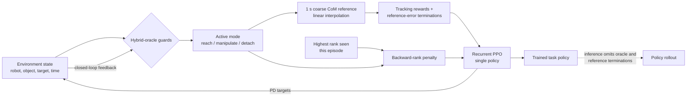

# Preferenced Oracle Guided Multi-mode Policies for Dynamic Bipedal Loco-Manipulation

| Field | Value |
| --- | --- |
| Primary source | [arXiv:2410.01030v3](https://arxiv.org/html/2410.01030v3), 8 October 2025 |
| Publication | IROS 2025, pp. 6600–6606, [DOI 10.1109/IROS60139.2025.11246602](https://ieeexplore.ieee.org/document/11246602) |
| Official artifacts | [Project](https://indweller.github.io/ogmplm/) · [code at verified commit `3f75cdb`](https://github.com/DRCL-USC/ogmp_isaac/tree/3f75cdbfda59853155ff73c430ca58182b9fc3f9) |
| Harness relevance | Reference/oracle logic · task reward · human-authored preference · evaluation · fixed-trainer ablation |
| Evidence tier | Anchor |

## Main point

With the task and single-policy trainer held fixed, adding a history-dependent mode-rank penalty to a manually designed three-mode oracle raised reported soccer-kick success from 28% to 98% in simulation; this supports Sam's two-knob interface, not automatic oracle/reward design or VIBE transfer.

## Mechanism

### Oracle contract

| Component | Paper definition | Loco-manipulation instance |
| --- | --- | --- |
| Oracle | $\Xi=(\mathcal{M},\mathcal{X},\Lambda,f,\mathcal{S})$ | Closed-loop, finite-horizon state-reference generator |
| Feedback | $\lambda_t$ | $[p_t^{robot},p_t^{object},p_t^{target},t]$ |
| Modes | $\mathcal{M}$ | reach = 0; manipulate = 1; detach = 2 |
| Reference state | $\mathcal{X}$ | robot CoM position, orientation, linear/angular velocity; object position/velocity |
| Continuous dynamics | $f$ | Linear interpolation from current state toward the active mode target |
| Switches | $\mathcal{S}$ | Permissible transitions with guards, resets, and invariants; the paper specifies the interface but does not enumerate separate reset/invariant maps |
| Exploration bound | $\rho$-neighborhood | Episode terminates when selected robot/object reference errors exceed configured bounds |

### Released soccer guards

These are implementation evidence at commit `3f75cdb`, not numerical guard values stated in the paper. Let $d_{ro}=\|p^{ball}-p^{robot}\|$ and $d_{rt}=\|p^{robot}-p^{target}\|$.

| Region selected by guards | Condition in released soccer code | Allowed incoming change |
| --- | --- | --- |
| reach | $d_{ro}>0.4$ m and $d_{rt}>0.4$ m | manipulate → reach |
| manipulate | $d_{ro}\leq0.4$ m and $d_{rt}>0.4$ m | reach → manipulate; detach → manipulate |
| detach | $d_{ro}\leq0.4$ m and $d_{rt}\leq0.4$ m | reach → detach; manipulate → detach |
| self/reference refresh | no mode change; phase wraps | reach → reach; manipulate → manipulate; detach → detach |

The combination $d_{ro}>0.4$ m and $d_{rt}\leq0.4$ m is not assigned a destination region in `check_transitions`; the current mode persists. Box guards use object–target distance, and the released flat-box task replaces the reach threshold with $0.05+\sqrt{2}h_{box}/2$ m.

### Preference and recovery

$$
r_{pref}(t)=
\begin{cases}
-1 & m_t < \max_{0\leq\tau\leq t}m_\tau\\
0 & \text{otherwise}
\end{cases}
$$

- Ranks: reach 0; manipulate 1; detach 2.
- Objective weight: -5.0 on the indicator in Table II and the released experiment configuration.
- The penalty applies at every lower-rank step after regression, not only at the switching instant.
- Backward transitions remain legal. A perturbation can force manipulate → reach; the policy is then pressured to recover toward the highest rank already attained.
- Equal ranks are allowed, so the interface can represent multiple equally preferred modes.
- “Task-agnostic” describes the penalty form. The mode set, guards, ranks, reference functions, and success objective remain task authored.

## Exact parameters

| Parameter | Value | Context | Source locator |
| --- | ---: | --- | --- |
| Oracle horizon | 1 s | Receding reference horizon | Sec. IV-B |
| Oracle modes | 3 | reach, manipulate, detach | Sec. IV-A/B |
| Reference construction | linear interpolation | Current-to-target CoM subspace; no joint reference | Sec. IV-B |
| Preference ranks | 0 / 1 / 2 | reach / manipulate / detach | Sec. IV-C |
| Preference indicator weight | -5.0 | Sparse task reward | Table II |
| Base tracking weights | 0.3 / 0.3 / 0.15 / 0.15 | position / orientation / linear velocity / angular velocity | Table II |
| Object reward weights | 0.5 / 1.0 / 1.0 | proximity / position / linear velocity | Table II |
| Ball-rest penalty | -0.5 when speed ≤ 0.05 | Active in reach mode | Table II |
| Regularization weights | 0.1 / 0.1 / 0.1 / -0.1 | torque magnitude / torque rate / joint velocity / default-joint deviation | Table II |
| Robot permissible error | x 0.4, y 0.4, z 0.2 | Reference-based training termination | Sec. IV-C |
| Object permissible error | x 0.4 | Reference-based training termination; paper does not report a y bound | Sec. IV-C |
| Soccer drag | $F_{drag}=-0.5v_{ball}^2$ | Simulation model | Sec. IV-C |
| Policy network | 1 recurrent cell, 128 hidden; MLP [200, 100] | Actor and critic; released config uses one-layer LSTM + ELU | Sec. IV-C; official config |
| PPO implementation | RSL-RL | Remaining parameters called Isaac Lab defaults, without an exact version in the paper | Sec. IV-C |
| Released soccer guards | 0.4 m / 0.4 m | reach / detach thresholds | `soccer_base.yaml`, lines 58–64 |
| Released oracle speed | 0.8 / 1.0 / 1.0 m/s | Berkeley / G1 / H1 soccer variants | `soccer_vary.yaml`, lines 1–23 |
| Released nominal height | 0.515 / 0.74 / 1.05 m | Berkeley / G1 / H1 soccer variants | `soccer_vary.yaml`, lines 1–23 |
| Released training budget | 10,000 iterations | Soccer configuration | `soccer_base.yaml`, lines 66–82 |

The paper says each norm is divided by a corresponding normalizing constant but does not report those constants.

## Evaluation

All values below are reported over 100 soccer-kick episodes with initial joint states randomized in $[-0.05,0.05]$. Success requires the ball at goal and the robot standing in the detached region.

| Policy | Success | Ball contacts | Falls |
| --- | ---: | ---: | ---: |
| Three separately trained mode policies + oracle FSM | 26% | 12.46 | 69% |
| Single policy, no preference reward | 28% | 5.11 | 0% |
| Single policy + preference reward | **98%** | 9.76 | 0% |

| Transition | No preference | Preference |
| --- | ---: | ---: |
| reach → manipulate | 0.022 | 0.036 |
| manipulate → reach | 0.021 | 0.001 |

- The multi-policy baseline has more contacts but fails at policy transitions.
- The single policy uses 0.3× the learnable parameters of the three-policy baseline.
- The preference result isolates the reward knob more cleanly than it tests oracle alternatives; no oracle-composition ablation is reported.

### Morphology and task coverage

| Robot(s) | Task variants reported | Regularization | What is shared |
| --- | --- | --- | --- |
| HECTOR v1 | soccer-stop; move-box | No | Three-mode abstraction and task-reward design |
| Berkeley Humanoid, Unitree G1, Unitree H1 | soccer-kick; move-box | Yes | Oracle class and reported reward definitions/weights |

Policies are trained separately. The released variants change nominal height, oracle speed, episode length, start/target distances, and object size. This is transfer of an abstraction and reward recipe, not one morphology-invariant policy or a fully fixed MDP.

## What transfers to Sam's harness

- Represent `oracle_k` as an immutable hybrid-automaton manifest: modes, ranked preferences, feedback variables, guard predicates, reset/invariant rules, per-mode reference functions, horizon, and output state fields.
- Represent `task_reward_k` independently. The rank-history penalty is a compact reward candidate whose weight and ranking are explicit, auditable parameters.
- Keep recovery edges available; compare hard edge removal with soft rank penalties and measure recovery time after forced regressions.
- Expose the exact reference phase to actor and critic. The paper's policy observes a phase signal; phase-indexed rewards alone would not prove conditioning.
- Freeze trainer, environment, controller, observations/actions, budget, seed protocol, and evaluation while crossing oracle variants with reward variants.
- Log the transition matrix, backward-transition dwell time, success, falls, contacts, and post-training oracle-free performance. These are independent evaluation outputs, not generated rewards.
- Treat “same reward weights” as a portability hypothesis. Record morphology-specific environment/oracle parameters separately from shared reward parameters.

## What does not transfer

- No outer-loop agent selects, composes, or improves the oracle or reward.
- The oracle is procedural state feedback, not a reference-dataset composer, learned motion prior, language model, or vision-conditioned planner.
- No natural-language preference interface, human-in-the-loop iteration, VIBE encoder/tracker integration, or foundation-controller experiment is present.
- No single policy transfers across morphologies; each robot/task pair is trained separately.
- Cross-robot experiments alter morphology and environment configuration, so they are not evidence for Sam's fixed-MDP comparison contract.
- Bounded exploration is an empirical training device here, not a proof that the learned policy reaches a global optimum.
- The method does not establish sim-to-real transfer for these loco-manipulation tasks.

## Failure modes and caveats

- **Oracle exploitation:** without preference, environment–oracle coupling permits a reach → manipulate → reach loop that satisfies local reward structure without completing the intended sequence.
- **Fragile policy switching:** the three-policy baseline falls in 69% of evaluated episodes even after adding initialization randomization to later-mode policies.
- **Guard partition gap:** the released soccer guard implementation has no destination region for “ball far, robot already inside target region.”
- **Limited quantitative breadth:** the main table covers one soccer-kick setup, 100 episodes, and reports no confidence intervals, seed dispersion, or statistical test.
- **Simulation only:** the conclusion lists sim-to-real as ongoing work.
- **Partial task × robot grid:** HECTOR and the three humanoids are not evaluated on the same complete set of soccer variants.
- **Configuration drift:** regularization is disabled for HECTOR and enabled for the other robots; released morphology variants also change oracle and environment parameters.
- **Underspecified defaults:** most PPO hyperparameters and reward normalization constants are not pinned in the paper.
- **Text typo:** Sec. IV-C describes manipulate → reach as rank “2 → 1,” although the stated mapping makes it 1 → 0. The formula and mapping are internally sufficient.
- **Inference boundary:** the oracle and reference-based terminations are removed at inference, so claims about deployed oracle guidance would be incorrect.

## Evidence ledger

| ID | Claim | Source locator |
| --- | --- | --- |
| E1 | v3 is the latest arXiv version; IROS title/authors | [arXiv abstract](https://arxiv.org/abs/2410.01030), submission history and metadata |
| E2 | Oracle-guided optimization uses finite-horizon references and a $\rho$ exploration bound | [v3 Sec. II](https://arxiv.org/html/2410.01030v3#S2), Eqs. 1–2 |
| E3 | Hybrid oracle tuple and environment–oracle coupling | [v3 Sec. III](https://arxiv.org/html/2410.01030v3#S3), Eq. 3 and Remarks 1–2 |
| E4 | Three-mode oracle, feedback, state fields, linear reference, one-second horizon | [v3 Sec. IV-A/B](https://arxiv.org/html/2410.01030v3#S4) |
| E5 | Reward expressions and weights | [v3 Table II](https://arxiv.org/html/2410.01030v3#S4.T2) |
| E6 | Preference rule, recovery rationale, network, observations, bounds, drag | [v3 Sec. IV-C](https://arxiv.org/html/2410.01030v3#S4.SS3) |
| E7 | Task/robot coverage and regularization split | [v3 Table I](https://arxiv.org/html/2410.01030v3#S4.T1) and Sec. V |
| E8 | 100-episode success/contact/fall comparison | [v3 Table III](https://arxiv.org/html/2410.01030v3#S5.T3) |
| E9 | Transition probabilities and preference ablation | [v3 Sec. V-B2](https://arxiv.org/html/2410.01030v3#S5.SS2.SSS2) |
| E10 | Multi-policy comparison and parameter ratio | [v3 Sec. V-B3](https://arxiv.org/html/2410.01030v3#S5.SS2.SSS3) |
| E11 | Inference omits oracle; results are simulation-only | [v3 Sec. V](https://arxiv.org/html/2410.01030v3#S5) and [Conclusion](https://arxiv.org/html/2410.01030v3#S6) |
| E12 | IROS 2025 venue, pages, DOI, official project/code links | [official project](https://indweller.github.io/ogmplm/) |
| E13 | Exact soccer guard predicates and transition assignments | [`stop.py` at `3f75cdb`, lines 101–128](https://github.com/DRCL-USC/ogmp_isaac/blob/3f75cdbfda59853155ff73c430ca58182b9fc3f9/exts/ogmp_isaac/ogmp_isaac/oracles/soccer/stop.py#L101-L128) |
| E14 | Released soccer rewards, thresholds, and network configuration | [`soccer_base.yaml` at `3f75cdb`](https://github.com/DRCL-USC/ogmp_isaac/blob/3f75cdbfda59853155ff73c430ca58182b9fc3f9/exts/ogmp_isaac/config/soccer_base.yaml) |
| E15 | Morphology-specific speed, height, distance, and episode settings | [`soccer_vary.yaml` at `3f75cdb`](https://github.com/DRCL-USC/ogmp_isaac/blob/3f75cdbfda59853155ff73c430ca58182b9fc3f9/exts/ogmp_isaac/config/soccer_vary.yaml) |
| E16 | Preference is implemented as lower-than-max-mode occupancy penalty | [`rewards.py` at `3f75cdb`, lines 68–70](https://github.com/DRCL-USC/ogmp_isaac/blob/3f75cdbfda59853155ff73c430ca58182b9fc3f9/exts/ogmp_isaac/ogmp_isaac/utils/rewards.py#L68-L70) |
| E17 | Flat-box reach threshold scales with box half-diagonal | [`flat_box_env.py` at `3f75cdb`, lines 91–95](https://github.com/DRCL-USC/ogmp_isaac/blob/3f75cdbfda59853155ff73c430ca58182b9fc3f9/exts/ogmp_isaac/ogmp_isaac/tasks/box/flat_box_env.py#L91-L95) |
