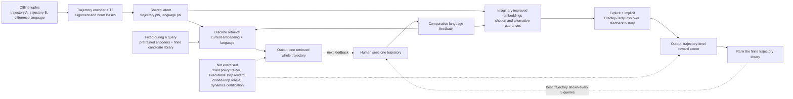

# Trajectory Improvement and Reward Learning from Comparative Language Feedback

| Field | Value |
| --- | --- |
| Primary source | [arXiv:2410.06401v1](https://arxiv.org/html/2410.06401v1), submitted 8 October 2024; sole arXiv revision checked 30 August 2026 |
| Exact public bytes | v1 PDF SHA-256 `cbacf06bbd7260800d312911dda5e920da123f658c1a4dd9c39dc195689d1129`; TeX archive SHA-256 `6004153162993053e44035d6729d0baf891b145b18fb971342ff347f867e40a2` |
| Publication record | CoRL 2024; [PMLR 270:5389–5404](https://proceedings.mlr.press/v270/yang25e.html), published 2025 |
| Official supplement | [Project page](https://liralab.usc.edu/comparative-language-feedback/); untagged code commit [`120990d`](https://github.com/USC-Lira/language-preference-learning/tree/120990d4021689e8a6a992d9c0f6c0c49bf9c18b), dated 21 February 2025; commit-to-experiment identity is not claimed |
| Harness relevance | Human steering; task-reward precursor; finite-library reference selection; evaluation and fixed-trainer boundary |
| Evidence tier | Core |

## Main point

On fixed offline trajectory libraries, aligning language with trajectory differences and fitting explicit plus implicit Bradley–Terry constraints should learn a trajectory-ranking reward from fewer user queries than pairwise comparisons; the paper does not test that scorer as an executable per-step reward or a closed-loop reference oracle in a fixed trainer.

## Mechanism

## Exact parameters

| Parameter | Value | Context | Source locator |
| --- | ---: | --- | --- |
| Simulation horizon | `T=500` | Every Robosuite and Meta-World rollout | [v1 Sec. 5.1](https://arxiv.org/html/2410.06401v1#S5.SS1) |
| Robosuite observation/action | RGB `640×480→224×224`; proprioception `25`; action `4` | Jaco cube-pick task; end effector points down | [v1 Sec. 5.1](https://arxiv.org/html/2410.06401v1#S5.SS1) |
| Meta-World observation/action | RGB `480×320→224×224`; proprioception `20`; action `4` | Sawyer side-button task; end effector points down | [v1 Sec. 5.1](https://arxiv.org/html/2410.06401v1#S5.SS1) |
| Synthetic feature counts | Robosuite `5`; Meta-World `3` | Height, speed/velocity, object distances, and cube-lift success as listed | [v1 App. A](https://arxiv.org/html/2410.06401v1#A1) |
| GPT-3.5-augmented utterances | Robosuite `629 = 480/74/75`; Meta-World `660 = 492/84/84` | Train/validation/test | [v1 Sec. 5.1](https://arxiv.org/html/2410.06401v1#S5.SS1) |
| Unique simulation rollouts | Robosuite `448 = 359/44/45`; Meta-World `324 = 260/32/32` | Train/validation/test | [v1 Sec. 5.1](https://arxiv.org/html/2410.06401v1#S5.SS1) |
| Latent test accuracy | Robosuite `84.9%`; Meta-World `82.9%` | Sign test `psi_l^T(phi_B-phi_A)>0` | [v1 Eq. 12, Sec. 5.1](https://arxiv.org/html/2410.06401v1#S5.SS1) |
| Frozen-T5 test accuracy | Robosuite `76.25%`; Meta-World `73.44%` | Co-finetuning reaches `84.89%` and `82.88%` | [v1 App. C.1, Table 2](https://arxiv.org/html/2410.06401v1#A3.SS1) |
| Trajectory-improvement loop | `N=15`; `100` random seeds | Discrete candidate search | [v1 Sec. 5.1, Fig. 4](https://arxiv.org/html/2410.06401v1#S5.SS1) |
| Synthetic reward-learning repetitions | `3` humans × `3` seeds per environment | Randomly initialized true reward weights | [v1 Sec. 5.1](https://arxiv.org/html/2410.06401v1#S5.SS1) |
| WidowX observation/action | RGB `480×320→224×224`; proprioception `22`; action `7` | `6DOF + gripper` spoon-pick/avoid-pan task | [v1 Sec. 5.2](https://arxiv.org/html/2410.06401v1#S5.SS2) |
| WidowX pretraining trajectories | `321 = 192/64/65` | Train/validation/test | [v1 Sec. 5.2](https://arxiv.org/html/2410.06401v1#S5.SS2) |
| WidowX utterances | `496 = 297/99/100` | GPT-augmented train/validation/test | [v1 Sec. 5.2](https://arxiv.org/html/2410.06401v1#S5.SS2) |
| User-study candidate library | `32` trajectories | Collected after latent pretraining | [v1 Sec. 5.2](https://arxiv.org/html/2410.06401v1#S5.SS2) |
| Participants | `10` (`4` female, `6` male) | One real-robot study | [v1 Sec. 5.2](https://arxiv.org/html/2410.06401v1#S5.SS2) |
| Study 1 cap | `10` iterations | Stop earlier on user satisfaction | [v1 Sec. 5.2](https://arxiv.org/html/2410.06401v1#S5.SS2) |
| Study 2 protocol | `20` queries; rate every `5`; order split `5/5` | Comparative language versus pairwise comparison | [v1 Sec. 5.2](https://arxiv.org/html/2410.06401v1#S5.SS2) |
| Mean subjective-score difference | `+23.9%` | Average over reported post-study attributes, language versus comparison | [v1 Sec. 5.2](https://arxiv.org/html/2410.06401v1#S5.SS2) |
| Mean response-time difference | `−11.3%` | Per query; language time includes typing | [v1 Sec. 5.2](https://arxiv.org/html/2410.06401v1#S5.SS2) |
| Rating-curve AUC test | `p<0.05` | Test name, exact statistic, and effect size are not reported | [v1 Sec. 5.2](https://arxiv.org/html/2410.06401v1#S5.SS2) |
| Satisfaction counts | Time-efficient `9/10` vs `1/10`; convenient `6/10` vs `8/10`; adaptable `8/10` vs `3/10` | Language versus comparison; categories not mutually exclusive | [v1 Table 1](https://arxiv.org/html/2410.06401v1#S5.SS2) |
| Code identity | `120990d4021689e8a6a992d9c0f6c0c49bf9c18b` | Untagged `master` HEAD checked 30 August 2026; commit dated 21 February 2025 | [official commit](https://github.com/USC-Lira/language-preference-learning/commit/120990d4021689e8a6a992d9c0f6c0c49bf9c18b) |
| Released reward scorer | One bias-free linear layer | The paper only says neural network; release initialization uses `std=0.001` | [`pref_based_learning.py` lines 32–53](https://github.com/USC-Lira/language-preference-learning/blob/120990d4021689e8a6a992d9c0f6c0c49bf9c18b/lang_pref_learning/pref_learning/pref_based_learning.py#L32-L53) |
| Implicit contrast count | Paper: unspecified `k`; README example: `20`; parser default: `10` | No source binds either code value to every reported experiment | [v1 Eq. 8](https://arxiv.org/html/2410.06401v1#S4.SS2.SSS2); [code lines 595–610](https://github.com/USC-Lira/language-preference-learning/blob/120990d4021689e8a6a992d9c0f6c0c49bf9c18b/lang_pref_learning/pref_learning/pref_based_learning.py#L595-L610) |
| Released runtime pins | Python `3.8`; Torch `1.12.1+cu113`; Transformers `4.35.1` | Model aliases and downloaded data/checkpoints remain unpinned | [README and requirements](https://github.com/USC-Lira/language-preference-learning/tree/120990d4021689e8a6a992d9c0f6c0c49bf9c18b) |

The paper leaves normalization weights `a,b`, implicit sample count `k`, reward-network architecture, optimizer, and several training hyperparameters without numerical values.

## What transfers to Sam's harness

| Paper interface | Harness consequence |
| --- | --- |
| One shown trajectory + comparative language | Store the exact trajectory identity, text, user/session provenance, encoder identity, and prior feedback history as steering evidence. |
| Difference-aligned latent space | A candidate steering compiler can map language to a typed trajectory-difference proposal; validate direction and magnitude outside the embedding model. |
| Discrete trajectory retrieval | Treat the result only as a new reference candidate. Before admission, add immutable bytes, cadence, root-frame semantics, ordered provenance, dynamics certification, and an executable oracle with guards/recovery if composition is intended. |
| Explicit and implicit Bradley–Terry constraints | Use them as evidence for revising `task_reward_k`, not as the task reward itself. Compile and validate a per-step executable reward separately. |
| Whole feedback history for reward learning | Preserve cumulative lineage; do not make each reward revision depend only on the latest utterance. |
| Cross-entropy, selected-trajectory reward, user rating, and response time | Keep generated-reward fit, objective task metrics, and interface burden separate. Run actual policy training and independent evaluation under the frozen harness contract. |

## What does not transfer

- The learned `r_xi(phi(tau))` scores whole-trajectory embeddings and ranks a finite set. No experiment installs it as `R(s,a)` or trains a policy with it; it is not an executable `task_reward_k`.
- `phi_tau + psi_l` is an imaginary latent vector in reward learning, not a rollout, reference clip, dynamics-feasible motion, or Tier-D certificate.
- The trajectory-improvement path retrieves one whole trajectory. It supplies no phase clock, segment composition, state guards, branches, transition windows, terminal behavior, or recovery logic; it is not `oracle_k`.
- Simulation rollouts were generated by policies trained under randomized feature weights. The paper does not hold Sam's policy trainer, controller, tracking reward, and budget fixed while changing only reward or reference artifacts.
- Human-study “best trajectories” are selected from 32 prerecorded candidates. The result is not online robot-policy adaptation or hardware validation of a newly trained controller.
- The current project page also summarizes a later active-querying IJRR extension. Active querying is future work—not an implemented mechanism—in arXiv v1.
- No result establishes generalization to unseen objects, safety, dynamics feasibility of retrieved candidates, or RL-Sculptor implementation.

## Failure modes and caveats

- **History-free trajectory retrieval:** each improvement decision ignores older feedback; the authors report loops among good but non-optimal trajectories and failure to reach the optimum.
- **Finite-library ceiling:** the authors conjecture that the 32-trajectory user-study library omitted trajectories some users wanted.
- **Grounding scope:** feedback about objects absent from latent-space pretraining is unsupported.
- **Random queries:** reward-learning queries are sampled uniformly; the original paper implements no active selection.
- **Chosen-utterance assumption:** the implicit loss assumes the utterance a user selected yields a larger improvement than sampled alternatives. Multiple valid aspects, synonyms, or arbitrary salience can violate that ordering.
- **Small, subjective study:** ten participants completed one robot/task setup. The paper reports only `p<0.05` for rating-curve AUC, without the test, statistic, effect size, or multiplicity treatment.
- **Non-monotone and variable responses:** language ratings fell from query 5 to 10; language response time had higher between-user variance; pairwise comparison was rated more convenient.
- **Equation/implementation ambiguity:** Eq. 2 prints `||psi_l-1||^2` while its prose and code constrain `||psi_l||` toward one. Eq. 4 is called cosine similarity but its denominator is `||phi'|| ||phi^0||`; the release instead offers distance/cosine/projection to `phi^0+psi_l`, with different experiment paths selecting different metrics.
- **Unbound hyperparameters:** `a`, `b`, and `k` are not numerically specified in the paper. The README's `k=20` example conflicts with the parser default `10`.
- **Partial reproduction surface:** the untagged post-paper code tree supplies no model checkpoint, immutable data digest, or exact experiment manifest; its reward-learning README command names a `train_pref_learning` module absent from the pinned tree.

## Evidence ledger

| ID | Claim | Source locator |
| --- | --- | --- |
| E01 | Exact v1 identity, authors, submission time, sole revision, and CoRL 2024 comment | [arXiv abstract record](https://arxiv.org/abs/2410.06401v1) |
| E02 | PMLR publication record, volume, pages, and publication year | [PMLR paper page](https://proceedings.mlr.press/v270/yang25e.html) |
| E03 | Finite-horizon problem; per-step human reward; offline paired-trajectory/language pretraining | [v1 Sec. 3](https://arxiv.org/html/2410.06401v1#S3) |
| E04 | Difference alignment, normalization objective, pretrained T5, and freeze-then-co-finetune procedure | [v1 Sec. 4.1, Eqs. 1–3](https://arxiv.org/html/2410.06401v1#S4.SS1) |
| E05 | Language-guided discrete trajectory retrieval and optional RL/MPC alternative | [v1 Sec. 4.2.1, Eq. 4](https://arxiv.org/html/2410.06401v1#S4.SS2.SSS1) |
| E06 | Imaginary improved embedding, explicit/implicit Bradley–Terry terms, history sum, and chosen-feedback assumption | [v1 Sec. 4.2.2, Eqs. 5–9](https://arxiv.org/html/2410.06401v1#S4.SS2.SSS2) |
| E07 | Synthetic linear reward, noisy feature-choice model, and hand-crafted simulation feature sets | [v1 Sec. 5.1 and App. A](https://arxiv.org/html/2410.06401v1#S5.SS1) |
| E08 | Simulation tasks, observations/actions, utterance and rollout splits, and `T=500` | [v1 Sec. 5.1](https://arxiv.org/html/2410.06401v1#S5.SS1) |
| E09 | Latent accuracy and frozen-versus-co-finetuned T5 ablation | [v1 Sec. 5.1](https://arxiv.org/html/2410.06401v1#S5.SS1); [Table 2](https://arxiv.org/html/2410.06401v1#A3.SS1) |
| E10 | `N=15`, 100 seeds, improvement below optimum, and looping explanation | [v1 Sec. 5.1, Fig. 4](https://arxiv.org/html/2410.06401v1#S5.SS1) |
| E11 | Three synthetic humans, three seeds each, trajectory-distribution cross-entropy, selected-trajectory true reward, and pairwise baseline | [v1 Sec. 5.1, Fig. 5](https://arxiv.org/html/2410.06401v1#S5.SS1) |
| E12 | Explicit-plus-implicit loss ablation | [v1 Sec. 5.1, Fig. 6](https://arxiv.org/html/2410.06401v1#S5.SS1) |
| E13 | WidowX contract, pretraining corpora, 32-candidate study library, participant count, and study protocols | [v1 Sec. 5.2](https://arxiv.org/html/2410.06401v1#S5.SS2) |
| E14 | Subjective score, response time, convenience/adaptability/time-efficiency counts | [v1 Sec. 5.2 and Table 1](https://arxiv.org/html/2410.06401v1#S5.SS2) |
| E15 | AUC significance claim and rating decline from query 5 to 10 | [v1 Sec. 5.2, Fig. 10](https://arxiv.org/html/2410.06401v1#S5.SS2) |
| E16 | Object-grounding limitation, uniform random queries, and active learning as future work | [v1 Sec. 6](https://arxiv.org/html/2410.06401v1#S6) |
| E17 | Higher response-time variance for comparative language | [v1 App. C.2](https://arxiv.org/html/2410.06401v1#A3.SS2) |
| E18 | Official page separates the CoRL paper/code from the later IJRR paper/code | [author project page](https://liralab.usc.edu/comparative-language-feedback/) |
| E19 | Exact untagged official code commit, install versions, mutable data link, and released examples | [official repository at `120990d`](https://github.com/USC-Lira/language-preference-learning/tree/120990d4021689e8a6a992d9c0f6c0c49bf9c18b) |
| E20 | Released alignment and norm implementations | [`learn_features.py` lines 170–195](https://github.com/USC-Lira/language-preference-learning/blob/120990d4021689e8a6a992d9c0f6c0c49bf9c18b/lang_pref_learning/feature_learning/learn_features.py#L170-L195) |
| E21 | Released distance/cosine/projection selectors and `phi+psi` target | [`find_nearest_traj.py` lines 19–54](https://github.com/USC-Lira/language-preference-learning/blob/120990d4021689e8a6a992d9c0f6c0c49bf9c18b/lang_pref_learning/model_analysis/find_nearest_traj.py#L19-L54) |
| E22 | Released linear scorer, cumulative explicit/implicit losses, other-feature contrast sampling, and parser defaults | [`pref_based_learning.py` lines 32–283](https://github.com/USC-Lira/language-preference-learning/blob/120990d4021689e8a6a992d9c0f6c0c49bf9c18b/lang_pref_learning/pref_learning/pref_based_learning.py#L32-L283) |
| E23 | Pinned tree lacks the README-named reward-learning module and model checkpoints | [official tree and README at `120990d`](https://github.com/USC-Lira/language-preference-learning/tree/120990d4021689e8a6a992d9c0f6c0c49bf9c18b) |
