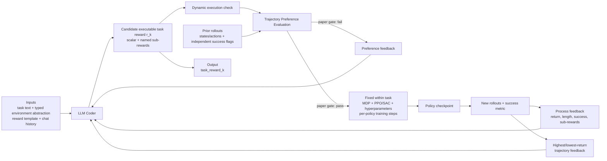

# A Large Language Model-Driven Reward Design Framework via Dynamic Feedback for Reinforcement Learning

| Field | Value |
| --- | --- |
| Primary source | [arXiv:2410.14660v1](https://arxiv.org/html/2410.14660v1), 18 October 2024; sole arXiv revision; reviewed PDF SHA-256 `8ce886f51e0ce0659eb1943701f7707d049c4e770e290d52c5c727f67d9f140b` |
| Authors | Shengjie Sun, Runze Liu, Jiafei Lyu, Jing-Wen Yang, Liangpeng Zhang, Xiu Li |
| Venue | [Knowledge-Based Systems 326 (2025), 114065](https://www.sciencedirect.com/science/article/pii/S0950705125011104); DOI `10.1016/j.knosys.2025.114065` |
| Official code | [`ShengjieSun419/CARD` at `6e1df1c`](https://github.com/ShengjieSun419/CARD/tree/6e1df1c6046229501ba2be55c28526760a842e89), committed 15 July 2025; the public repository has one commit and no tag |
| Harness relevance | Task reward / evaluation / fixed trainer |
| Evidence tier | Core |

## Main point

With task-specific PPO/SAC settings held fixed, CARD uses success-labelled prior trajectories to critique LLM-written reward code and reports better-or-comparable performance to human rewards on 10 of 12 simulated manipulation tasks, but the pinned public scripts train every candidate after TPE even when it fails, so skip-training is a paper mechanism rather than a reproduced release capability.

## Mechanism

The paper gate skips RL when TPE fails. At the pinned commit, both Meta-World and ManiSkill2 one-step scripts call `train_and_eval` regardless of `pass_flag`; the flag changes feedback and whether new trajectories enter the history.

## Reward-design and evaluation contract

| Element | Paper definition | Consequence for Sam |
| --- | --- | --- |
| Candidate | Python reward returning a scalar plus named sub-rewards | Hash source and compiled artifact; type every input and diagnostic output |
| Correctness check | Execute generated code; discard and re-query on syntax/runtime failure | Execution is not a safety or semantic-validity certificate |
| Process feedback | Evaluation return, episode length, success rate, cumulative sub-rewards over training | Keep the success metric independently implemented and immutable |
| Trajectory feedback | Highest- and lowest-return rollouts with sampled states, reward, sub-rewards, and success | Preserve exact rollout bytes, environment identity, policy hash, and sampling indices |
| TPE score | Fraction of successful trajectories whose mean per-step candidate return exceeds the maximum failed-trajectory value | It is a proposal gate, not a task-success certificate; require both outcome classes |
| Paper training gate | Train if TPE accuracy is at least `delta`; otherwise return preference feedback | Bind the gate decision before launch and prove a rejected candidate did not train |
| Improvement state | Full dialogue history: system, generation, and feedback prompts | Store prompt/model/version/temperature and every reward parent as lineage |
| Frozen comparison surface | Same PPO or SAC algorithm and task hyperparameters across reward methods | This supports reward comparison within a task, not matched total search compute |

## Exact parameters

| Parameter | Value | Context | Source locator |
| --- | ---: | --- | --- |
| Main LLM | `GPT-4-1106-preview` | Text2Reward, Eureka, and CARD zero-shot comparison | [v1 Sec. 5.1](https://arxiv.org/html/2410.14660v1#S5.SS1) |
| Sampling temperature | `0.7` | All paper tasks | [v1 App. B.2](https://arxiv.org/html/2410.14660v1#A2.SS2) |
| Code-generation retry cap | `10` | Stop after `max_try_num` failed dynamic checks | [v1 App. B.2](https://arxiv.org/html/2410.14660v1#A2.SS2) |
| Main refinement depth | `2` iterations | Initial generation plus two introspection rounds gives three LLM queries | [v1 Sec. 5.1 and 5.3](https://arxiv.org/html/2410.14660v1#S5.SS1) |
| TPE threshold `delta` | `0.8` | Candidate is accepted when preference accuracy reaches the threshold | [v1 Sec. 5.1; App. B.2, Table 8](https://arxiv.org/html/2410.14660v1#A2.T8) |
| Trajectories collected | `100` per iteration | Pool used for later TPE | [v1 App. B.2, Table 8](https://arxiv.org/html/2410.14660v1#A2.T8) |
| Process-feedback sampling interval | `100` Meta-World; `25` ManiSkill2 | Paper table wording | [v1 App. B.2, Table 8](https://arxiv.org/html/2410.14660v1#A2.T8) |
| Trajectory-feedback samples | `10` points | Per selected trajectory | [v1 App. B.2, Table 8](https://arxiv.org/html/2410.14660v1#A2.T8) |
| Task suite | `6` Meta-World + `6` ManiSkill2 | Twelve simulated manipulation tasks | [v1 Sec. 5.1; App. B.1](https://arxiv.org/html/2410.14660v1#A2.SS1) |
| Learning-curve seeds | `5` | Mean and standard deviation in main and ablation figures | [v1 Figs. 2–6](https://arxiv.org/html/2410.14660v1#S5.F2) |
| Parallel environments | training `8`; inference `5` | All tasks and methods | [v1 App. B.2](https://arxiv.org/html/2410.14660v1#A2.SS2) |
| Hardware | `1` NVIDIA RTX 3090; `8` CPU cores | Per task | [v1 Sec. 5.1; App. B.2](https://arxiv.org/html/2410.14660v1#S5.SS1) |
| PPO tasks | ManiSkill2 LiftCube, PickCube | Stable-Baselines3 PPO | [v1 App. B.2, Table 6](https://arxiv.org/html/2410.14660v1#A2.T6) |
| PPO fixed settings | LR `3e-4`; MLP `2x256`; steps/update `3200`; epochs `15`; batch `400`; `gamma=.85`; target KL `.05`; GAE `.95`; clip `.2`; episode `100` | Same settings across reward methods | [v1 App. B.2, Table 6](https://arxiv.org/html/2410.14660v1#A2.T6) |
| SAC tasks | All Meta-World; remaining four ManiSkill2 tasks | Stable-Baselines3 SAC | [v1 App. B.2, Table 7](https://arxiv.org/html/2410.14660v1#A2.T7) |
| SAC fixed settings | LR `3e-4`; MLP `3x256` MW / `2x256` MS; target update `2/1`; train frequency `1/8`; `tau=5e-3`; gradient steps `1/4`; learning starts `4000`; batch `512/1024`; `gamma=.99/.95`; temperature `.1/.2`; episode `500/200` | Values are Meta-World / ManiSkill2 where paired | [v1 App. B.2, Table 7](https://arxiv.org/html/2410.14660v1#A2.T7) |
| Per-policy training budget | Meta-World `1M`; ManiSkill2 `1M` for LiftCube, TurnFaucet, OpenCabinetDoor and `2M` for PickCube, PushChair, OpenCabinetDrawer | Candidate-policy training steps | [v1 App. B.2, Table 9](https://arxiv.org/html/2410.14660v1#A2.T9) |
| Reported per-run wall time | MW `0.5h`; MS: `0.5, 0.9, 1.3, 1.4, 4.1, 2.1h` in the task order above | Excludes multiplicative seeds and introspection iterations | [v1 App. B.2, Table 9](https://arxiv.org/html/2410.14660v1#A2.T9) |
| LLM queries | L2R `2`; Text2Reward `1`; Eureka `96`; CARD `3` | Main token comparison accounting | [v1 Sec. 5.3](https://arxiv.org/html/2410.14660v1#S5.SS3) |
| Average tokens | L2R `2,310.7`; Text2Reward `1,724.1`; Eureka `662,882.5`; CARD `14,181.7` | Average across twelve tasks; unequal replication protocol | [v1 Table 2](https://arxiv.org/html/2410.14660v1#S5.T2) |
| Average execution-error rate | L2R `6%`; Text2Reward `48%`; Eureka `17%`; CARD `12%` | Aggregate paper table | [v1 Table 3](https://arxiv.org/html/2410.14660v1#S5.T3) |
| Release runtime pins | Python `3.8`; PyTorch `1.11.0+cu113`; Stable-Baselines3 `1.8.0`; pip `24.0`; pandas `1.5.3`; matplotlib `3.4`; kiwisolver `1.0.1`; protobuf `4.25`; chromadb `0.4.0` | Several other packages remain unpinned | [`install.sh` at `6e1df1c`](https://github.com/ShengjieSun419/CARD/blob/6e1df1c6046229501ba2be55c28526760a842e89/install/install.sh#L1-L32) |

## Evaluation evidence

| Question | Evidence | Boundary |
| --- | --- | --- |
| Does CARD perform against reward baselines? | Authors report better-or-comparable performance to human rewards on `10/12` tasks and above the human-reward “Oracle” on `3/12`; curves show five-seed means and standard deviations | No result table, tolerance for “comparable,” confidence interval, or significance test |
| Does TPE reduce cost? | The paper’s algorithm can skip training after a failed preference check; CARD uses 3 LLM queries and reports `14,181.7` average tokens versus Eureka’s 96 queries and `662,882.5` | Total search compute is not matched; pinned public scripts do not skip candidate training |
| Do refinement iterations help? | Across nine ablation tasks, iteration 2 is best or comparable on `7/9` | Iteration 3 materially hurts Handle Press Side and Turn Faucet |
| Do all feedback types matter? | Removing process, trajectory, or preference feedback lowers performance on three Meta-World tasks | Three-task ablation only; curves, not tabulated effect sizes |
| Does model choice matter? | GPT-4-1106-preview outperforms GPT-3.5-turbo-1106 on three Meta-World tasks | Proprietary dated snapshots; no open-model result |
| Does the correctness check eliminate invalid code? | CARD’s reported aggregate execution-error rate is `12%`, lower than Eureka’s `17%` and Text2Reward’s `48%` | Comparison uses 16 runs for L2R/Text2Reward but generated versions from iterative runs for Eureka/CARD |
| Is the feedback causally useful? | Door Unlock case study adds/removes reward terms; iteration 1 has no effect, iteration 2 adds success shaping and success rises | One qualitative task-level trace; multiple code changes prevent term-level attribution |

## What transfers to Sam's harness

- Make `task_reward_k` an immutable executable artifact with typed, whitelisted observation/action inputs, a scalar output, named component diagnostics, source hash, compiler/runtime identity, and parent reward ID.
- Re-score a candidate on immutable prior rollouts before spending a training budget. Store state, action, termination, task-success label, goal state, environment/adapter identity, cadence, and policy hash.
- Treat TPE as a **proposal gate**. Require both successful and failed trajectories, compute the exact declared statistic, bind `delta`, and fail closed on missing or non-finite evidence.
- Keep environment success independent from generated reward code. The TPE label and final task metric must share an immutable evaluator, not a success test invented by the candidate.
- Feed component-level process traces and selected rollout slices to the reward proposer, but preserve complete machine-readable receipts so text formatting cannot become the authority.
- Freeze scene, observations, actions, dynamics, foundation controller, tracking reward, PPO/SAC configuration, seeds, per-policy steps, checkpoint rule, and accepted-candidate budget. Record rejected/skipped candidates separately.
- Evaluate accepted rewards on fresh seeds and holdout perturbations. Offline preference ordering on the proposal pool is not the final objective metric.
- Replace CARD’s in-process `exec` with an admitted reward language or isolated trusted compiler/runtime. Validate bounded outputs, purity, allowed dependencies, shapes, determinism, and negative cases before launch.

## What does not transfer

- CARD does not select, order, transition, synthesize, or certify reference motions. Its trajectories are reward-evaluation data, not a reference-composition oracle.
- It provides no natural-language human steering experiment, foundation-controller integration, VIBE result, physical robot result, or cross-MDP replication.
- “Oracle” is the benchmark’s human-written reward, not an optimal controller, privileged reference oracle, or proof of task optimality.
- The paper fixes RL algorithm and hyperparameters within each task comparison; it does not hold one parameterized MDP or one total outer-loop compute budget fixed across all methods.
- TPE verifies reward ordering only on collected trajectories. It does not prove that training the candidate produces a better policy or that ordering generalizes off the stored rollout distribution.
- The paper’s skip-training claim is not implemented by the pinned one-step scripts, which train whether `pass_flag` is true or false.
- The public repository is not evidence of safe executable-reward handling or a turnkey reproduction of all reported results.

## Failure modes and caveats

- **Invalid generated code:** undefined variables, template violations, type errors, and dimension errors remain common; CARD reports a `12%` aggregate execution-error rate.
- **Over-refinement:** a third iteration reduces performance on Handle Press Side and Turn Faucet after a useful reward has already been found.
- **Linear token growth:** the authors state token use grows linearly with refinement iterations.
- **Known-perception assumption:** callable environment information must be available a priori; the paper leaves vision-language reward generation to future work.
- **Success-label dependence:** TPE avoids a dense ground-truth reward but still requires an authoritative binary task-success label and prior trajectories containing both outcomes.
- **Proposal-pool overfitting:** process, trajectory, and preference feedback expose the same success signal used to steer reward changes; no untouched holdout gate is reported.
- **Release one-class bug:** if the stored set contains only successes, only failures, or is empty, `trajectories_return_check` assigns accuracy `1.0` and passes the candidate.
- **Paper/code statistic mismatch:** the paper equation discounts each trajectory by `gamma^t`; the release sums undiscounted rewards, divides by length, and accepts when at least `80%` of successful trajectories exceed the maximum failed value.
- **Release gate mismatch:** both benchmark scripts run policy training after TPE regardless of failure; only feedback selection and trajectory-pool update are gated.
- **ManiSkill2 replay mismatch:** the release applies recorded actions to one live environment without restoring stored states or resetting per recorded trajectory, so this path is not literal offline candidate scoring on the stored trajectories.
- **Unsafe execution boundary:** validation and training call Python `exec` on generated code inside the simulator process and test only a sampled transition and return type.
- **Partial/broken release paths:** the Meta-World query script imports an absent `metaworld_exp` module, and `install.sh` enters an absent `run_maniskill` directory.
- **Unequal cost samples:** token use averages 16 runs for L2R/Text2Reward but only one for Eureka/CARD; error-rate sampling also differs by method.
- **Simulation-only evidence:** all twelve tasks are Meta-World or ManiSkill2; the paper reports no real-robot, safety-envelope, or perturbation-recovery study.

## Public-code audit

| Item | Pinned implementation | Interpretation |
| --- | --- | --- |
| Public identity | One `main` commit, `6e1df1c6046229501ba2be55c28526760a842e89`, dated 15 July 2025; no tag | Pin the full SHA; no release tag identifies paper checkpoints |
| TPE comparator | For each stored success, mean undiscounted candidate reward must exceed the largest failed mean; pass at `correct_rate >= threshold` | Relaxed empirical test, not literal Eq. 1 all-pairs discounted ordering |
| Missing outcome class | Any empty success or failure class sets `correct_rate=1.0` | Sam must fail closed; absence of comparison evidence is not success |
| Meta-World rescoring | Calls candidate reward on stored `action`, `obs`, and `goal_position` | Closest release path to offline counterfactual reward scoring |
| ManiSkill2 rescoring | Steps a live environment with recorded actions; stored states are not installed | Environment trajectory can diverge from the recorded rollout |
| Training gate | Comment says evaluate regardless of pass; `train_and_eval` is unconditional | Advertised cost-saving skip is not an implemented public path |
| Trajectory update | New trajectories are appended only when TPE passes | The flag affects future evidence even though current training already ran |
| Dynamic check | `exec`, one sampled action in train/eval environments, scalar/tuple type assertions | Detects some crashes; does not establish purity, boundedness, safety, or semantic alignment |
| Reproduction path | Missing Meta-World import target and missing installer directory | Pinned repository needs repair before end-to-end reproduction |

## Evidence ledger

| ID | Claim | Source locator |
| --- | --- | --- |
| E01 | v1 is the sole arXiv revision; title, authors, submission date, and arXiv DOI | [arXiv submission record](https://arxiv.org/abs/2410.14660v1) |
| E02 | Journal venue, article number, and DOI | [official ScienceDirect record](https://www.sciencedirect.com/science/article/pii/S0950705125011104) |
| E03 | Coder input/output contract and dynamic correctness check | [v1 Sec. 4.1](https://arxiv.org/html/2410.14660v1#S4.SS1) |
| E04 | Process feedback fields and formatting | [v1 Sec. 4.2.1](https://arxiv.org/html/2410.14660v1#S4.SS2.SSS1) |
| E05 | Highest/lowest-return trajectory feedback and sampled state/reward fields | [v1 Sec. 4.2.2](https://arxiv.org/html/2410.14660v1#S4.SS2.SSS2) |
| E06 | TPE motivation, discounted mean-per-step order definition, success labels, and preference examples | [v1 Sec. 4.2.3, Eq. 1](https://arxiv.org/html/2410.14660v1#S4.SS2.SSS3) |
| E07 | Conditional training/feedback loop, first-iteration exception, and empirical threshold statistic | [v1 Sec. 4.4](https://arxiv.org/html/2410.14660v1#S4.SS4); [Algorithm 1](https://arxiv.org/html/2410.14660v1#alg1) |
| E08 | Twelve tasks, baselines, GPT-4 snapshot, fixed PPO/SAC settings, `delta=.8`, two iterations, and compute | [v1 Sec. 5.1](https://arxiv.org/html/2410.14660v1#S5.SS1) |
| E09 | Five-seed success curves and reported comparison with human rewards | [v1 Sec. 5.2, Figs. 2–3](https://arxiv.org/html/2410.14660v1#S5.SS2) |
| E10 | Query accounting and aggregate token totals | [v1 Sec. 5.3, Table 2](https://arxiv.org/html/2410.14660v1#S5.SS3) |
| E11 | Iteration-count ablation, convergence claim, and two third-iteration regressions | [v1 Sec. 5.4, Fig. 4](https://arxiv.org/html/2410.14660v1#S5.SS4) |
| E12 | Three-feedback ablation on three Meta-World tasks | [v1 Sec. 5.4, Fig. 5](https://arxiv.org/html/2410.14660v1#S5.F5) |
| E13 | GPT-4 versus GPT-3.5 ablation on three Meta-World tasks | [v1 Sec. 5.4, Fig. 6](https://arxiv.org/html/2410.14660v1#S5.F6) |
| E14 | Execution-error protocol, failure causes, and aggregate rates | [v1 Sec. 5.5, Table 3](https://arxiv.org/html/2410.14660v1#S5.SS5) |
| E15 | Door Unlock two-iteration reward changes and qualitative outcome | [v1 Sec. 5.6, Fig. 7](https://arxiv.org/html/2410.14660v1#S5.SS6) |
| E16 | LLM/retry settings, complete PPO/SAC parameters, trajectory settings, training steps, and wall times | [v1 App. B.2, Tables 6–9](https://arxiv.org/html/2410.14660v1#A2.SS2) |
| E17 | Per-task token totals and unequal token-sampling protocol | [v1 App. B.3, Table 10](https://arxiv.org/html/2410.14660v1#A2.SS3) |
| E18 | Per-task execution-error rates and method-specific sampling protocol | [v1 App. B.4, Table 11](https://arxiv.org/html/2410.14660v1#A2.SS4) |
| E19 | Generated reward signature, named components, allowed-package prompt, and introspection instructions | [v1 App. C, Tables 12–13](https://arxiv.org/html/2410.14660v1#A3) |
| E20 | LiftCube preference-feedback traces and successive reward-code changes | [v1 App. D.2, Tables 18–21](https://arxiv.org/html/2410.14660v1#A4.SS2) |
| E21 | Linear token-growth and known-perception limitations | [v1 App. E](https://arxiv.org/html/2410.14660v1#A5) |
| E22 | Official repository identity, KBS/arXiv links, run recipe, and Text2Reward/Eureka acknowledgement | [README at `6e1df1c`](https://github.com/ShengjieSun419/CARD/blob/6e1df1c6046229501ba2be55c28526760a842e89/README.md#L1-L93) |
| E23 | Release TPE statistic, one-class behavior, undiscounted scoring, and feedback examples | [`utils.py` at `6e1df1c`](https://github.com/ShengjieSun419/CARD/blob/6e1df1c6046229501ba2be55c28526760a842e89/code_generation/self_reflection/utils.py#L249-L328) |
| E24 | Meta-World TPE call, unconditional training, gated feedback, and accepted-trajectory update | [`metaworld_exp_one_step.py` at `6e1df1c`](https://github.com/ShengjieSun419/CARD/blob/6e1df1c6046229501ba2be55c28526760a842e89/code_generation/self_reflection/metaworld_exp_one_step.py#L361-L448) |
| E25 | ManiSkill2 live-environment TPE call, unconditional training, and gated trajectory update | [`maniskill_exp_one_step.py` at `6e1df1c`](https://github.com/ShengjieSun419/CARD/blob/6e1df1c6046229501ba2be55c28526760a842e89/code_generation/self_reflection/maniskill_exp_one_step.py#L523-L613) |
| E26 | Generated code is executed in-process and validated on sampled transitions and return types | [`metaworld_exp_one_step.py` at `6e1df1c`](https://github.com/ShengjieSun419/CARD/blob/6e1df1c6046229501ba2be55c28526760a842e89/code_generation/self_reflection/metaworld_exp_one_step.py#L107-L133); [`generation.py`](https://github.com/ShengjieSun419/CARD/blob/6e1df1c6046229501ba2be55c28526760a842e89/code_generation/self_reflection/generation.py#L43-L84) |
| E27 | Release reproducibility gaps: absent imported Meta-World module and absent installer target | [`query_llm_metaworld.py` at `6e1df1c`](https://github.com/ShengjieSun419/CARD/blob/6e1df1c6046229501ba2be55c28526760a842e89/code_generation/self_reflection/query_llm_metaworld.py#L1-L10); [`install.sh`](https://github.com/ShengjieSun419/CARD/blob/6e1df1c6046229501ba2be55c28526760a842e89/install/install.sh#L14-L31); [pinned tree](https://github.com/ShengjieSun419/CARD/tree/6e1df1c6046229501ba2be55c28526760a842e89) |
