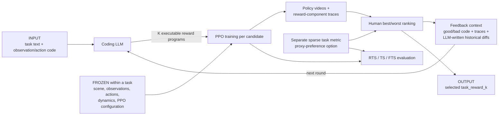

# ICPL: Few-shot In-Context Preference Learning via LLMs

| Field | Value |
| --- | --- |
| Primary source | [RLJ/RLC 2026 pre-proceedings PDF](https://rlj.cs.umass.edu/2026/papers/Paper25.pdf), retrieved 30 August 2026, SHA-256 `58c7ec8c7412af61aa8de26b02416258e9ba9b74937db544484e3f4dcbcbdbc1`; [arXiv:2410.17233v3](https://arxiv.org/abs/2410.17233v3), revised 3 April 2025, PDF SHA-256 `94c4347334940f8d53d7df32372e8eab5ad98bcb54044faa01d410f438dbd0d1` |
| Authors | Chao Yu, Qixin Tan, Hong Lu, Jiaxuan Gao, Xinting Yang, Yu Wang, Yi Wu, Eugene Vinitsky |
| Venue | Reinforcement Learning Journal 7 / RLC 2026; the [publisher page](https://rlj.cs.umass.edu/2026/papers/Paper25.html) labels the file pre-proceedings and warns that minor changes may follow |
| Official project/code | [Project page](https://sites.google.com/view/few-shot-icpl/home); [`icpl-research/ICPL` at untagged main commit `a23c3bc`](https://github.com/icpl-research/ICPL/tree/a23c3bc0bbd29ad21ac33e29260f0ab8eb58c435), pushed 30 September 2024 and verified as public `main` HEAD on 30 August 2026 |
| Harness relevance | Task reward / preference steering / evaluation / fixed trainer |
| Evidence tier | Core |

## Main point

With the per-task world and candidate trainer nominally fixed, ICPL performs five rounds of six executable reward-program trials and uses best/worst behavior preferences plus reward-component traces to propose the next rewards; this is direct evidence for a task-reward outer loop, but not for reference composition, natural-language steering, an untouched holdout evaluator, or safe execution of generated code.

## Mechanism

## Interface and evidence boundary

| Surface | Paper mechanism | Consequence for Sam |
| --- | --- | --- |
| Reward candidate | TorchScript-style Python returning total reward plus named components | Preserve a typed manifest and compile trusted code; do not execute raw model text |
| Candidate feedback | Best and worst reward code, component values, historical reward traces, and LLM-generated diffs | Store each parent, ranking, trace, prompt, and semantic diff as immutable lineage |
| Human steering | Best/worst choices over final-policy videos | Useful comparative steering; the paper explicitly leaves explanatory text feedback to future work |
| Fixed system | One task's environment interface and PPO candidate-training path are reused across rewards | Match scene, observations, actions, dynamics, initialization, trainer, budget, seeds, and checkpoints explicitly in Sam's manifest |
| Evaluation | Sparse task metric is separate from generated reward code | In proxy trials the same metric selects good/bad candidates and reports performance; add untouched holdouts |
| Reference/oracle | None | No evidence for motion composition, reference selection, guards, modes, or recovery logic |

## Exact parameters

| Parameter | Value | Context | Source locator |
| --- | ---: | --- | --- |
| Search rounds | `N=5` | Iterative reward-refinement rounds | [RLJ §4.2, PDF p. 5](https://rlj.cs.umass.edu/2026/papers/Paper25.pdf) |
| Executable rewards per round | `K=6` | Non-executable generations are resampled until six execute | [RLJ §§4.1–4.2, PDF pp. 4–5](https://rlj.cs.umass.edu/2026/papers/Paper25.pdf) |
| Scheduled candidate trainings | `30 = K x N` | Minimum full policy trainings per search, before retries and final evaluation | [RLJ §§4.1–4.2](https://rlj.cs.umass.edu/2026/papers/Paper25.pdf) |
| Human-query count | `Q=(K-1) x 2N - 1 = 49` | Pairwise comparisons to choose round best/worst and final best | [RLJ §5.1, PDF pp. 5–6](https://rlj.cs.umass.edu/2026/papers/Paper25.pdf) |
| Baseline query budgets | `49, 150, 1,500, 15,000` | PrefPPO, PEBBLE, and SURF | [RLJ §5.1 and Table 1, PDF pp. 6–7](https://rlj.cs.umass.edu/2026/papers/Paper25.pdf) |
| Proxy-preference LLM | `GPT-4-0613` | Coding and difference model in synthetic trials | [RLJ §5.3, PDF p. 6](https://rlj.cs.umass.edu/2026/papers/Paper25.pdf) |
| Human-trial LLM | `GPT-4o` | Human-in-the-loop trials; no dated model snapshot is given | [RLJ §5.3, PDF p. 6](https://rlj.cs.umass.edu/2026/papers/Paper25.pdf) |
| IsaacGym testbed | `9` tasks | Cartpole, BallBalance, Quadcopter, Anymal, Humanoid, Ant, FrankaCabinet, ShadowHand, AllegroHand | [RLJ §5.2, PDF p. 6](https://rlj.cs.umass.edu/2026/papers/Paper25.pdf) |
| Observation/action dimensions | `(4,1), (48,12), (21,12), (48,12), (108,21), (60,8), (23,9), (211,20), (88,16)` | Listed in the same task order above | [arXiv v3 App. D, Table 6](https://arxiv.org/html/2410.17233v3#A4) |
| Score hierarchy | `RTS=max fixed-interval metric; round=max of 6 RTS; TS=max of 5 rounds; FTS=max TS over 5 experiments` | Best-of-candidates, rounds, and repeated experiments | [RLJ §5.2, PDF p. 6](https://rlj.cs.umass.edu/2026/papers/Paper25.pdf) |
| Independent experiments | `5` per method | Paper reports FTS plus dispersion and later adds mean-TS results | [RLJ §§5.2, 5.5 and Tables 1, 2, 5](https://rlj.cs.umass.edu/2026/papers/Paper25.pdf) |
| Reported query reduction | `at least 30x` | Claimed against tabula-rasa PbRL at equivalent or better task scores | [RLJ §5.4, PDF p. 7](https://rlj.cs.umass.edu/2026/papers/Paper25.pdf) |
| ICPL FTS across nine tasks | `499, 499, -0.0195, -0.007, 12.04, 9.227, 0.9999, 13.231, 25.030` | Same task order as above | [RLJ Table 1, PDF p. 7](https://rlj.cs.umass.edu/2026/papers/Paper25.pdf) |
| Human study | `7` training participants; `20` comparison voters | Five participants handled IsaacGym tasks, two handled the new task | [RLJ §5.6, PDF p. 9](https://rlj.cs.umass.edu/2026/papers/Paper25.pdf) |
| HumanoidJump vote | ICPL `17/20`; OpenLoop `3/20` | Random-order video comparison after five experiments of six rounds and six samples | [RLJ §5.6.2 and Table 4, PDF pp. 10–11](https://rlj.cs.umass.edu/2026/papers/Paper25.pdf) |
| Compute | `1 x A100`; `<1 day` full proxy experiment; `16.4 h` ICPL Humanoid run | Human experiments took two to three days because each feedback round waits for training | [RLJ §5.3](https://rlj.cs.umass.edu/2026/papers/Paper25.pdf); [arXiv v3 Apps. E–F](https://arxiv.org/html/2410.17233v3#A5) |
| Release defaults | model `gpt-4o`; temperature `1.0`; rounds `5`; samples `6`; PPO iterations `3000`; final evals `5` | Pinned code behavior, not a complete reproduction manifest | [`config.yaml` at `a23c3bc`](https://github.com/icpl-research/ICPL/blob/a23c3bc0bbd29ad21ac33e29260f0ab8eb58c435/icpl/cfg/config.yaml#L11-L34) |
| Release LLM endpoint | `https://api.openai-proxy.com/v1` | Hard-coded client base URL despite the README describing OpenAI API use | [`icpl.py` at `a23c3bc`, lines 1–10](https://github.com/icpl-research/ICPL/blob/a23c3bc0bbd29ad21ac33e29260f0ab8eb58c435/icpl/icpl.py#L1-L10) |
| Release dependency constraints | package `1.0`; `torch<=2.0.0`; `gym==0.23.1`; unpinned `openai`, NumPy, and OmegaConf | README requires Python >=3.8, while `setup.py` says >=3.7 | [`setup.py` at `a23c3bc`](https://github.com/icpl-research/ICPL/blob/a23c3bc0bbd29ad21ac33e29260f0ab8eb58c435/setup.py#L3-L32); [README](https://github.com/icpl-research/ICPL/blob/a23c3bc0bbd29ad21ac33e29260f0ab8eb58c435/README.md#L5-L20) |

## Evaluation evidence

| Question | Evidence | Boundary |
| --- | --- | --- |
| Does preference feedback add value beyond sampling? | Full ICPL is top-two on 8/9 tasks; OpenLoop draws the same `K x N` count without feedback; reward-trace, diff, bad-example, and OpenLoop ablations are reported | High variance remains; the ablation does not isolate every feedback component independently |
| Does reward quality improve over rounds? | Average RTS rises for Ant and ShadowHand, the two tasks chosen for having the largest OpenLoop gaps | This is a selected two-task analysis, not monotonicity evidence across all nine tasks |
| Is proxy feedback query-efficient? | ICPL uses 49 comparisons; the paper reports at least 30x fewer queries than PbRL baselines | Baselines mix PPO and SAC and receive dense labels, while ICPL uses sparse metric selection |
| Does real human feedback work? | Authors report ICPL-real above OpenLoop in 3/5 IsaacGym tasks; mean improvement is reported as 18.4% | Seven training participants, one assigned task each; video judgments can be inaccurate |
| Does subjective preference escape a minimal metric? | `17/20` voters prefer ICPL's two-leg HumanoidJump over OpenLoop; qualitative progression rejects a one-leg metric exploit | One simulated task and one final pair; no objective naturalness, safety, or dynamics-feasibility gate |
| Are objective metrics independent? | Sparse metrics are implemented separately from generated rewards and hidden from the LLM | In proxy trials those metrics drive candidate selection and final reporting, so they are search objectives rather than holdouts |

## What transfers to Sam's harness

- Treat reward refinement as an outer loop: `task_reward_k -> fixed training -> rollouts/traces -> preference -> task_reward_(k+1)`.
- Require a typed reward result with a total and named components. Record units, frames, coefficients, temperatures, and allowed inputs.
- Preserve every candidate, execution result, best/worst label, reward trace, prompt, LLM-produced diff, and parent edge. Do not rely on mutable chat context.
- Compare feedback-driven search with OpenLoop at the same candidate count, trainer, seeds, compute, and checkpoint schedule.
- Let behavior comparisons steer only the reward artifact. If Sam uses text steering, test `ranking only` versus `ranking + explanation` as a new experiment.
- Keep search metrics and report-only holdouts separate. Do not let generated code or preference prompts modify the evaluator.
- Parse model output as data, statically validate a bounded reward DSL, and compile project-owned code. The release's direct Python path is not an admissible execution boundary.

## What does not transfer

- No reference motion, dataset composition, phase clock, reference oracle, state machine, guard, transition, or recovery mechanism is studied.
- Humans select indices; the paper names explanatory text feedback as future work. This is not evidence for natural-language steering.
- The cross-method comparison does not freeze one trainer: ICPL and PrefPPO use PPO, while PEBBLE and SURF use SAC.
- The proxy task metric is separate from generated reward code but is used for search and reporting. It is not an untouched holdout objective.
- The paper does not prove identical initialization, seeds, package versions, or matched compute for every candidate and baseline.
- All task results are simulation evidence. They do not establish sim-to-real reward transfer or compatibility with SONIC, VIBE, or another fixed controller.
- No result implies that RL-Sculptor implements ICPL.

## Failure modes and caveats

- **Video-only ambiguity:** Anymal was removed from human trials because random-command following was hard to judge from video; direction and pose also bias speed judgments.
- **Metric exploitation:** a one-leg “leg-lift jump” satisfies a minimal height metric but does not look human; subjective preference can reject it, but no independent naturalness gate is supplied.
- **Initial-diversity dependence:** the authors state that task performance depends qualitatively on the LLM's initial reward diversity.
- **Small human sample:** seven people produced training preferences and twenty rated one final HumanoidJump pair.
- **Training latency:** each round trains new policies; the paper reports several-hour waits and two-to-three-day human experiments.
- **Best-of-N optimism:** FTS takes maxima across checkpoints, six candidates, five rounds, and five experiments. The RLJ version explicitly says it represents the strongest candidate, not an average run.
- **Metric reuse:** proxy sparse reward chooses good/bad candidates and supplies the reported task score; reward search can overfit that metric.
- **High stochastic variance:** the paper reports substantial LLM/run dispersion and recommends repeated experiments.
- **Mixed baselines:** trainer family and proxy-label density differ across methods, so headline query ratios are not a reward-only fixed-trainer causal estimate.
- **Unsandboxed release:** the code extracts a generated Python function, appends it to an environment module, and launches training in a subprocess after only signature/executability checks.
- **Hard-coded proxy endpoint:** the release sends LLM prompts through `api.openai-proxy.com`, while its README tells users only to configure an OpenAI API key; use of that endpoint is not part of Sam's trusted boundary.
- **Mutable dependencies:** `GPT-4o`, `openai`, NumPy, Hydra/OmegaConf, IsaacGym assets, and several vendored dependencies lack an immutable environment lock.
- **Public-version drift:** the RLJ pre-proceedings and arXiv v3 tables are not byte- or value-identical; for example, PEBBLE-49 Quadcopter is `-0.901` in RLJ Table 1 and `-1.191` in arXiv v3 Table 1.

## Evidence ledger

| ID | Claim | Source locator |
| --- | --- | --- |
| E01 | arXiv title, authors, v1–v3 history, and current v3 date | [arXiv v3 record](https://arxiv.org/abs/2410.17233v3) |
| E02 | RLJ volume/year, RLC presentation, and pre-proceedings warning | [RLJ Paper 25 record](https://rlj.cs.umass.edu/2026/papers/Paper25.html) |
| E03 | RDPP fixed-learning-algorithm interface and ICPL generate/train/rank/refine loop | [RLJ §§3–4 and Figure 1, PDF pp. 3–5](https://rlj.cs.umass.edu/2026/papers/Paper25.pdf) |
| E04 | Executable-candidate resampling, `K=6`, `N=5`, PPO training, and three automatic-feedback components | [RLJ §§4.1–4.3, PDF pp. 4–5](https://rlj.cs.umass.edu/2026/papers/Paper25.pdf) |
| E05 | Query definition/formula, budgets, nine tasks, metric hierarchy, five experiments, LLMs, and A100 setup | [RLJ §§5.1–5.3, PDF pp. 5–6](https://rlj.cs.umass.edu/2026/papers/Paper25.pdf) |
| E06 | Proxy-preference setup, main task scores, at-least-30x claim, and modified Eureka comparison | [RLJ §5.4 and Table 1, PDF pp. 6–7](https://rlj.cs.umass.edu/2026/papers/Paper25.pdf) |
| E07 | Reward-trace/diff/bad/OpenLoop ablations, best-of-N disclosure, two-task iteration analysis, and mean-TS table | [RLJ §5.5 and Tables 2, 5, PDF pp. 7–11](https://rlj.cs.umass.edu/2026/papers/Paper25.pdf) |
| E08 | Human-participant counts, five IsaacGym results, reported 27.4%/18.4% averages, and video-ranking limits | [RLJ §5.6.1 and Table 3, PDF p. 9](https://rlj.cs.umass.edu/2026/papers/Paper25.pdf) |
| E09 | HumanoidJump metric exploit, qualitative progression, five-by-six-by-six OpenLoop protocol, and `17/20` vote | [RLJ §5.6.2 and Table 4, PDF pp. 9–11](https://rlj.cs.umass.edu/2026/papers/Paper25.pdf) |
| E10 | Video ambiguity, text-feedback gap, initial-diversity dependence, small sample, and retraining latency | [RLJ §6 Limitations, PDF p. 11](https://rlj.cs.umass.edu/2026/papers/Paper25.pdf) |
| E11 | Full prompt contract, ICPL pseudocode, executable resampling, and history construction | [arXiv v3 Apps. A–B](https://arxiv.org/html/2410.17233v3#A1) |
| E12 | Exact task observation/action dimensions and sparse metrics | [arXiv v3 App. D, Table 6](https://arxiv.org/html/2410.17233v3#A4) |
| E13 | `16.4 h` Humanoid cost, human setup lasting two to three days, demographic details, and documented judgment errors | [arXiv v3 Apps. E–F](https://arxiv.org/html/2410.17233v3#A5) |
| E14 | Official project method, query calculation, evaluation summary, and demonstrations | [official project page](https://sites.google.com/view/few-shot-icpl/home) |
| E15 | Exact official code revision inspected; repository self-identifies as official and has no public tag | [commit `a23c3bc`](https://github.com/icpl-research/ICPL/commit/a23c3bc0bbd29ad21ac33e29260f0ab8eb58c435); [README](https://github.com/icpl-research/ICPL/blob/a23c3bc0bbd29ad21ac33e29260f0ab8eb58c435/README.md#L1-L14) |
| E16 | Release defaults for LLM alias, temperature, feedback flags, rounds, samples, PPO iterations, and final evaluations | [`config.yaml` at `a23c3bc`](https://github.com/icpl-research/ICPL/blob/a23c3bc0bbd29ad21ac33e29260f0ab8eb58c435/icpl/cfg/config.yaml#L11-L34) |
| E17 | TorchScript-style total-plus-component reward interface and environment-attribute input rule | [`reward_signature.txt`](https://github.com/icpl-research/ICPL/blob/a23c3bc0bbd29ad21ac33e29260f0ab8eb58c435/icpl/utils/prompts/reward_signature.txt); [`code_output_tip.txt`](https://github.com/icpl-research/ICPL/blob/a23c3bc0bbd29ad21ac33e29260f0ab8eb58c435/icpl/utils/prompts/code_output_tip.txt) |
| E18 | Release extracts the first function, injects generated code into an environment module, launches policy training, and retries failed candidates | [`icpl.py` lines 243–420](https://github.com/icpl-research/ICPL/blob/a23c3bc0bbd29ad21ac33e29260f0ab8eb58c435/icpl/icpl.py#L243-L420); [`extract_task_code.py`](https://github.com/icpl-research/ICPL/blob/a23c3bc0bbd29ad21ac33e29260f0ab8eb58c435/icpl/utils/extract_task_code.py#L84-L105) |
| E19 | Release assembles preference/history prompts, selects proxy max/min, and evaluates the best code under five seeds | [`icpl.py` lines 556–766](https://github.com/icpl-research/ICPL/blob/a23c3bc0bbd29ad21ac33e29260f0ab8eb58c435/icpl/icpl.py#L556-L766) |
| E20 | Package version, Python requirement, and partially pinned dependencies | [`setup.py` at `a23c3bc`](https://github.com/icpl-research/ICPL/blob/a23c3bc0bbd29ad21ac33e29260f0ab8eb58c435/setup.py#L3-L32); [README installation](https://github.com/icpl-research/ICPL/blob/a23c3bc0bbd29ad21ac33e29260f0ab8eb58c435/README.md#L5-L33) |
| E21 | Release constructs its OpenAI client with a hard-coded third-party proxy base URL | [`icpl.py` at `a23c3bc`, lines 1–10](https://github.com/icpl-research/ICPL/blob/a23c3bc0bbd29ad21ac33e29260f0ab8eb58c435/icpl/icpl.py#L1-L10) |
