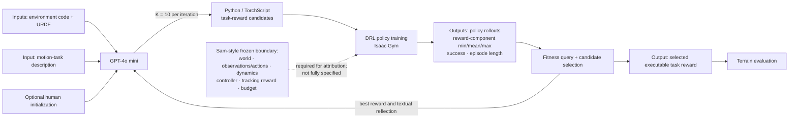

# STRIDE: Automating Reward Design, Deep Reinforcement Learning Training and Feedback Optimization in Humanoid Robotics Locomotion

| Field | Value |
| --- | --- |
| Primary source | [arXiv:2502.04692v3](https://arxiv.org/abs/2502.04692v3), submitted 12 February 2025; [PDF](https://arxiv.org/pdf/2502.04692v3) SHA-256 `9ce5f177a62818fc25f8112dd7af633d9802419c491e91a9f0ffa568a8016907`; [source archive](https://export.arxiv.org/e-print/2502.04692v3) SHA-256 `a200c875b5e6b70bdb86ca15f27d51f15686c64b6f1075e670c926a50a66aac7` |
| Public code | No official repository is linked in v3; the pinned source archive contains paper source and figures, not a runnable STRIDE implementation or final reward programs |
| Harness relevance | **Executable task reward** and **evaluation**; no reference composition/oracle mechanism |
| Evidence tier | Supporting |

## Main point

In the reported Isaac Gym experiments, a GPT-4o-mini best-of-10 reward-code/reflection loop produces higher author-reported Max Success Scores than the paper's EUREKA baseline, but the missing implementation, trainer/fitness specification, and matched-budget receipts prevent a reproducible fixed-trainer causal claim.

## Mechanism

The feedback path changes reward code and coefficients. It does not generate, select, or compose references.

## Exact parameters

| Parameter | Value | Context | Source locator |
| --- | ---: | --- | --- |
| Coding model | `GPT-4o mini` | Exact snapshot/version is not reported | §5, opening paragraph |
| Robot | `16 DoF` | Custom SolidWorks humanoid exported to URDF | §4.3, **Humanoid Robot Description** |
| Terrains | `3` | Flat, wave, random uniform | §5.1, **Environments** |
| Search runs | `10` per environment | Called independent runs | §5, opening paragraph |
| Search iterations | `3` per run | Reported experimental search depth | §5, opening paragraph |
| Samples | `K = 10` per iteration | Reward-function programs sampled from the LLM | §5; Algorithm 1 |
| Candidate-policy repeats | `5` | Max Success Score is the maximum task-completion rate across five independent DRL runs | §5.1, **Evaluation Metrics** |
| Simulator | Isaac Gym | Version, trainer algorithm, policy architecture, step budget, and optimizer settings are not reported | §4.5; §5.1 |
| Baseline generator | EUREKA with `GPT-4` | Exact GPT-4 version and matched generation/training budget are not reported | §5.1, **Baselines** |
| Reward output | scalar total + named component dictionary | Prompt requires TorchScript-compatible `Tuple[Tensor, Dict[str, Tensor]]` | Appendix A, Prompts 1 and 4 |
| Table 1 success rates | EUREKA `[0.1, 0.4, 0.0]`; STRIDE `[0.2, 0.5, 0.3]`; human-init `[0.7, 0.7, 0.7]` | Iterations 1–3; the table does not disambiguate code-generation success from task completion | Table 1 |
| Running targets in the supplied task prompt | hip `60–80°` forward / `−10 to −20°` back; knee `90–120°` swing / `20–40°` stance; ankle `10–15°` plantar / `0–5°` dorsal; shoulder `45–60°`; elbow `90–120°`; torso `20–25°`; step `2.5–3 m` | Task-specific Bolt-like priors embedded in Prompt 2 | Appendix A, Prompt 2 |

## Evidence-to-boundary comparison

| Question for Sam's harness | What STRIDE supplies | Boundary |
| --- | --- | --- |
| Can the harness emit executable task rewards? | A TorchScript-oriented scalar-plus-components contract and an LLM search loop | No released implementation or final generated reward is available to execute or audit |
| Is the policy trainer fixed while rewards vary? | The formal RDP separates world `M`, learning algorithm `A_M`, reward `R`, and policy fitness `F` | The experiment does not report the trainer, policy, optimizer, budget, seeds, or exact fitness function |
| Is evaluation independent of the generated reward? | `F` is conceptually separate from `R` | Max Success Score and Table 1 success are underdefined; independence is not demonstrated |
| Does concise human steering change only the reward? | A human can request priorities such as stability over speed | No user protocol, steering translation, trial count, or safety metric is reported |
| Does the paper inform reference composition/oracles? | None | References, phase clocks, modes, guards, and transitions are outside the method |

## What transfers to Sam's harness

- Treat the proposed reward as a typed, executable artifact: scalar total, named terms, coefficient/temperature values, required observations, and a content hash.
- Keep the RDP separation explicit: immutable world/trainer `M, A_M`; mutable task reward `R`; independent evaluator `F`.
- Feed candidate diagnostics back to the proposer: component min/mean/max, low variance, dominant magnitude, stagnation, task success, and episode length.
- Validate and sandbox generated code before training. The paper explicitly reports that zero-shot candidates may be non-executable.
- Preserve every candidate, execution error, training receipt, evaluator result, and selection decision; the paper's pseudocode and figures are insufficient provenance.
- Compare seed-level distributions under matched budgets. Do not select evidence by a maximum across runs as the sole outcome.

## What does not transfer

- STRIDE supplies no reference dataset composition, closed-loop oracle, state machine, phase clock, guard, transition, or recovery mechanism.
- The experiment does not verify an improvement with Sam's controller, tracking reward, observations/actions, dynamics, trainer, and budget fixed.
- Prompt 2 is task-specific and embeds detailed sprint biomechanics; it does not support the paper's broad “no task-specific prompts or templates” claim.
- Simulation on one described 16-DoF morphology and three terrains is not evidence for hardware transfer or cross-morphology generality.
- “Human init.” is not a validated human-steering interface, preference study, or safety guarantee.
- Nothing here establishes that RL-Sculptor implements STRIDE or that untrusted generated reward code is safe to run.

## Failure modes and caveats

- Initial LLM rewards may be non-optimal or non-executable; Figure 2's log also depicts multiple execution errors.
- Algorithm 1 places `Return` inside the iteration loop and does not clearly preserve a global best across rounds, while §5 says three iterations were run.
- The paper reports 10 independent runs per environment and defines Max Success Score over five DRL runs, but does not specify their nesting, seeds, or compute matching.
- STRIDE uses GPT-4o mini while the EUREKA baseline is described as GPT-4; method and model effects are not isolated.
- The headline “around 250% average improvement in efficiency and task performance” is not reconciled with the body, which reports `3×` on wave terrain and about `250% of` EUREKA on random-uniform terrain without an efficiency formula.
- Table 1's “success rate” and Figure 8's “correlation” are not operationally defined. The fitness function is symbolic rather than executable in the paper.
- No official code, environment snapshot, final rewards, raw run data, statistical test, hardware evaluation, or independent reproduction is supplied.

## Evidence ledger

| ID | Claim | Source locator |
| --- | --- | --- |
| E-ST-01 | v3 is the active 12 February 2025 version; the abstract claims around 250% average improvement. | [arXiv submission history and abstract](https://arxiv.org/abs/2502.04692v3) |
| E-ST-02 | The RDP separates world `M`, reward space, learning algorithm `A_M`, and policy fitness `F`. | [v3 §3, Definition 3.1](https://arxiv.org/html/2502.04692v3) |
| E-ST-03 | Environment code and task text condition Python reward generation, policy training, scoring, and textual refinement. | [v3 §4.2 and Figure 1](https://arxiv.org/html/2502.04692v3) |
| E-ST-04 | The described custom humanoid has 16 DoF and its URDF/state variables enter reward generation. | [v3 §4.3](https://arxiv.org/html/2502.04692v3) |
| E-ST-05 | Algorithm 1 samples `K` rewards, evaluates them, selects an argmax, reflects, and prints `Return` before the loop ends. | [v3 Algorithm 1](https://arxiv.org/html/2502.04692v3) |
| E-ST-06 | Reflection can rescale, rewrite, remove, or add terms using component statistics and global metrics. | [v3 §4.4; Appendix A, Prompt 3](https://arxiv.org/html/2502.04692v3) |
| E-ST-07 | Prompts require TorchScript compatibility and a scalar reward plus named component dictionary. | [v3 Appendix A, Prompts 1 and 4](https://arxiv.org/html/2502.04692v3) |
| E-ST-08 | Experiments name GPT-4o mini, 10 independent runs per environment, three iterations, and 10 samples per iteration. | [v3 §5, opening paragraph](https://arxiv.org/html/2502.04692v3) |
| E-ST-09 | Evaluation uses Isaac Gym on flat, wave, and random-uniform terrain; EUREKA with GPT-4 is the baseline. | [v3 §5.1](https://arxiv.org/html/2502.04692v3) |
| E-ST-10 | Max Success Score selects the maximum task-completion rate across five independent DRL runs; code-generation success is also named. | [v3 §5.1, Evaluation Metrics](https://arxiv.org/html/2502.04692v3) |
| E-ST-11 | The body reports `3×` EUREKA on wave terrain and about `250% of` EUREKA's best Max Success Score on random-uniform terrain. | [v3 §5.2, Figures 5–7](https://arxiv.org/html/2502.04692v3) |
| E-ST-12 | Table 1 gives per-iteration success rates for EUREKA, STRIDE, and human-initialized STRIDE. | [v3 Table 1](https://arxiv.org/html/2502.04692v3) |
| E-ST-13 | Human initialization accepts a desired improvement such as stability over speed; Figure 8 is the only reported correlation analysis. | [v3 §5.3 and Figure 8](https://arxiv.org/html/2502.04692v3) |
| E-ST-14 | Prompt 2 embeds detailed Bolt-like joint, torso, and step-length targets. | [v3 Appendix A, Prompt 2](https://arxiv.org/html/2502.04692v3) |
| E-ST-15 | The v3 source archive contains TeX, bibliography/style files, and figure assets, with no runnable STRIDE code, final rewards, or repository URL. | [v3 source archive](https://export.arxiv.org/e-print/2502.04692v3) |
| E-ST-16 | The authors state that zero-shot initial rewards are not always optimal or executable. | [v3 §4.4](https://arxiv.org/html/2502.04692v3) |
