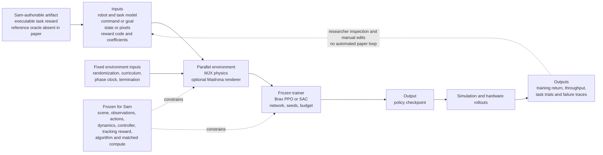

# MuJoCo Playground

| Field | Value |
| --- | --- |
| Primary source | [arXiv:2502.08844v1](https://arxiv.org/html/2502.08844v1), submitted 12 February 2025 |
| Code pin | Project-linked [`google-deepmind/mujoco_playground@8a4b4642`](https://github.com/google-deepmind/mujoco_playground/tree/8a4b4642d8eba8a80ac99ed125cb62c16e1457ad), package `0.2.0`, inspected 30 August 2026; its README identifies [`google/brax@1ed3be22` `learner.py`](https://github.com/google/brax/blob/1ed3be220c9fdc9ef17c5cf80b1fa6ddc4fb34fa/brax/training/learner.py) as the paper's exact learning script, but the paper does not bind its environment code or checkpoints to a commit |
| Harness relevance | Executable task-reward baseline; evaluation; fixed trainer; reference-oracle boundary only |
| Evidence tier | Baseline |

## Main point

MuJoCo Playground supplies a fast, explicit MJX/Brax baseline with five-seed reward and throughput studies plus small hardware trials, but it neither composes references nor searches rewards, and most suite-wide results measure the optimized return rather than an independent task evaluator.

## Mechanism

## Exact parameters

| Parameter | Value | Context | Source locator |
| --- | ---: | --- | --- |
| Environment families | `3`: DM Control Suite, locomotion, manipulation | MJX task suite | Sec. II |
| Locomotion actor observation | projected gravity; base linear/angular velocity; joint position/velocity; previous action; optional joystick command | Humanoids additionally observe sine and cosine of each foot's phase | App. B.2.1 |
| Locomotion action | joystick: `q_des,t = q_default + k_a a_t`; other tasks: `q_des,t = q_des,t-1 + k_a a_t` | Desired joint positions feed `tau = k_p(q_des-q)-k_d qdot` | App. B.2.1, Eq. 1 |
| Locomotion reward | `16` listed terms; weighted sum; final total clipped non-negative | Includes command tracking, phase/foot terms, posture, torque, energy, action-rate and termination terms; numerical weights are not tabulated | App. B.2.3, Table VI |
| Actor / critic | MLP `512, 256, 128`, Swish | Asymmetric critic also receives clean signals, contacts, perturbations and torques | App. B.2.4 |
| Default locomotion PPO | `100M` steps; `8,192` envs; unroll `20`; `32` minibatches; `4` updates/batch; discount `0.97`; learning rate `3e-4`; entropy cost `1e-2` | Brax PPO baseline | App. E.2 |
| G1 joystick PPO | `400M` steps; `32,768` envs; unroll `32`; discount `0.98`; learning rate `1e-4`; actor `512,256,64`; critic `256,256,256,256` | Task-specific override; `16` evaluations and one reset per evaluation | App. E.2 |
| Simulation replication | `5` seeds on one A100 | DM Control, locomotion and manipulation reward curves; throughput tables use the same seed count | Apps. A.2--A.3, B.3--B.4, C.2--C.3 |
| G1 throughput | `106,093 +/- 131` PPO steps/s | One A100, five seeds; table labels the interval as a 95th-percentile confidence interval | App. B.4, Table VII |
| Locomotion deployment | policy `50 Hz`; estimator `500--2,000 Hz` | ONNX policy and model-based state estimation | App. B.5 |
| LEAP cube reorientation | `10` trials; rotations `[3,27,8,2,15,3,4,1,3,5]`; median `3.5`, mean `7.1` | Real target tolerance `0.4 rad`; simulation `0.1 rad`; policy `20 Hz` | Sec. IV-C.1, Table I; App. C.4 |
| Franka block success | `35` trials; success `85.7 +/- 12.2%`; position error `5.28 +/- 3.26 cm`; rotation error `3.32 +/- 1.59 deg` | Mean and 95% CI; success requires `<=3 cm` and `<=10 deg`; policy uses 7-D torque at `200 Hz` | Sec. IV-C.2, Table II; App. C.5 |
| Pixel PickCube reward | `clip(sum_i r_t,i - max(r_1,...,r_t-1), 0)` for dense progress terms | Sparse lift/target rewards remain; completion terminates the episode | App. C.6 |
| Pixel PickCube train / test | `64x64` RGB; `3` actions; `5M` PPO steps; `1,024` envs; `10 min` on one RTX 4090; `12/12` hardware successes at `15 Hz` | Action is Y, Z and binary gripper; start position spans `20 cm` | Sec. IV-C.3; Apps. C.6 and E.3 |
| Pixel pipeline profile | with-pixel FPS `403,000` Cartpole / `36,900` Panda; full PPO `31,300` / `15,600`; update share `91%` / `57%` | Five runs on RTX 4090; processing, not rollout collection, is the measured bottleneck | Sec. IV-D.1; App. D, Tables XV--XVI |
| MJX limits | JIT compilation `1--3 min`; contact cost scales with possible contacts | Madrona vision training is described as early-stage | Sec. VI |
| Public code snapshot | Playground commit `8a4b4642d8eba8a80ac99ed125cb62c16e1457ad`, package `0.2.0`; paper learner `google/brax@1ed3be220c9fdc9ef17c5cf80b1fa6ddc4fb34fa` | Inspection pin only; no claimed environment-code/checkpoint identity | Official repository README and `pyproject.toml` |

## What transfers to Sam's harness

- Use Playground as a parameterized-MDP baseline only after pinning the exact environment, model bytes, simulator/backend, observation/action contract, controller, randomization, curriculum, termination, PPO implementation, precision mode, seed set and step budget.
- Treat the PickCube progress gate as one executable task-reward candidate: reward only positive improvement over the best earlier dense score, while keeping sparse completion and the independent evaluator fixed.
- Keep phase observations and phase-shaped foot targets inside the frozen controller/environment contract. They are an explicit clock, not evidence for a reference selector, transition guard or recovery oracle.
- Report both environment steps and wall-clock time. Compilation, rendering and policy-update shares can otherwise make equal-step and equal-time comparisons answer different questions.
- Replace suite-wide training-return curves with reward-independent task, safety and stability metrics when comparing generated rewards. Preserve the paper's small hardware trial metrics only as secondary checks.
- Record observed failure traces. The wedged cube, workspace exit and force-limit pause are more useful to reward revision than return alone.

## What does not transfer

- The paper does not select, sequence or compose reference clips; implement guards or recovery transitions; or learn an oracle. Humanoid phase shaping is not reference composition.
- The paper states that reward design is iterative, but it does not generate, repair, rank or automatically revise executable rewards.
- Locomotion rewards mix command tracking, phase shaping and regularization. Their coefficients cannot be relabeled as Sam's mutable task reward without first separating the frozen tracking reward.
- Domain randomization, curriculum, observations, actions, PD control, privileged critic inputs, termination, network architecture, PPO and training budget are fixed-trainer choices, not either authorable harness knob.
- Reward curves show optimization progress under each environment's own reward. They are not evidence that one reward produces better objective behavior than another.
- The hardware results do not establish broad reliability: locomotion is qualitative, LEAP has 10 trials, block reorientation has 35, and PickCube has 12 with a restricted plane and start range.
- The 2026 code pin is a reproducibility inspection snapshot, not the experiment-producing environment version; it now exposes a different renderer/backend surface than arXiv v1.

## Failure modes and caveats

- Reward specification remains manual. The authors motivate fast retraining because policies can obtain reward through irregular behavior; no automated correction loop is evaluated.
- LEAP reorientation most often stalls when the cube wedges between fingers and palm; index and thumb can also interlock because the low-cost hand flexes.
- Franka block policies can push the block outside the reachable workspace. Early policies also moved it fast enough to exceed the robot's force limit; torque penalties were added afterward.
- JAX static shapes make contact computation scale with all possible contacts, and JIT compilation adds 1--3 minutes before measured training.
- Cross-simulator rendering comparisons are explicitly rough: only hardware and timestep are aligned across inherently different systems.
- Current official code warns that TF32 on Ampere GPUs can destabilize training and that its current `train_jax_ppo.py` yields slightly different results from the pinned Brax paper script.
- The architecture prose states `512,256,128` actor and critic layers, while the default locomotion PPO table lists a `128,128,128,128` policy; exact task-specific tables and code must therefore be pinned rather than merging the two descriptions.
- Five-seed reward/throughput plots quantify run variation, but most sim-to-real claims lack matched baselines or confidence intervals; a few perfect small-sample results should not be read as failure probability zero.

## Evidence ledger

| ID | Claim | Source locator |
| --- | --- | --- |
| E1 | v1 metadata, authors, date and framework abstract. | [arXiv v1 metadata](https://arxiv.org/abs/2502.08844v1) |
| E2 | The paper frames reward design as iterative and difficult to automate, making time-to-robot important. | [Sec. I](https://arxiv.org/html/2502.08844v1) |
| E3 | MJX physics, optional Madrona rendering and environment families form the integrated training stack. | [Secs. II--III](https://arxiv.org/html/2502.08844v1) |
| E4 | Locomotion observations, phase encoding, absolute/relative joint targets and PD mapping are defined. | [App. B.2.1](https://arxiv.org/html/2502.08844v1) |
| E5 | Domain randomization, the weighted clipped reward, asymmetric critic and MLP are specified. | [Apps. B.2.2--B.2.4, Table IX](https://arxiv.org/html/2502.08844v1) |
| E6 | Default and robot-specific PPO hyperparameters, including the G1 contract, are tabulated. | [App. E.2](https://arxiv.org/html/2502.08844v1) |
| E7 | Locomotion policies run at 50 Hz with a 500--2,000 Hz estimator. | [App. B.5](https://arxiv.org/html/2502.08844v1) |
| E8 | LEAP observation/action, randomization, 200M + 100M-step schedule, noise injection and 20 Hz deployment are defined. | [App. C.4](https://arxiv.org/html/2502.08844v1) |
| E9 | Ten LEAP trials report consecutive rotations and the wedging/interlocking failures. | [Sec. IV-C.1, Table I](https://arxiv.org/html/2502.08844v1) |
| E10 | Franka block task, torque control, delays, curriculum, safety limits and training selection are specified. | [Sec. IV-C.2; App. C.5](https://arxiv.org/html/2502.08844v1) |
| E11 | Thirty-five block trials report success and pose errors; workspace and force-limit failures are disclosed. | [Sec. IV-C.2, Table II; App. C.5 summary](https://arxiv.org/html/2502.08844v1) |
| E12 | Pixel PickCube uses progress-gated dense reward, visual randomization, delay, a restricted action plane and 12 hardware trials. | [Sec. IV-C.3; App. C.6](https://arxiv.org/html/2502.08844v1) |
| E13 | DM Control, locomotion and manipulation reward/throughput studies use five seeds; exact throughput values are tabulated. | [Apps. A.2--A.3, B.3--B.4, C.2--C.3](https://arxiv.org/html/2502.08844v1) |
| E14 | Pixel stepping and PPO component profiles use five RTX 4090 runs; the cross-simulator comparison is explicitly rough. | [Sec. IV-D.1; App. D](https://arxiv.org/html/2502.08844v1) |
| E15 | JIT latency, static-shape contact scaling and early-stage vision training are stated limitations. | [Sec. VI](https://arxiv.org/html/2502.08844v1) |
| E16 | The official project page links the paper and repository and identifies the public framework. | [Official project](https://playground.mujoco.org/) |
| E17 | The pinned current repository declares package 0.2.0, warns about Ampere TF32 and current-script drift, and points to the paper learner. | [Official code commit](https://github.com/google-deepmind/mujoco_playground/tree/8a4b4642d8eba8a80ac99ed125cb62c16e1457ad) |
| E18 | The official README's paper-script target resolves to the exact Brax learner commit. | [Brax learner commit](https://github.com/google/brax/blob/1ed3be220c9fdc9ef17c5cf80b1fa6ddc4fb34fa/brax/training/learner.py) |
