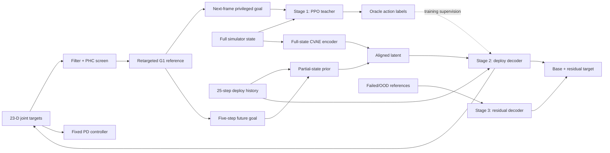

# UniTracker: Learning Universal Whole-Body Motion Tracker for Humanoid Robots

| Field | Value |
| --- | --- |
| Primary source | [arXiv:2507.07356v3](https://arxiv.org/html/2507.07356v3), 18 September 2025 |
| Supplement | [Official project page](https://yinkangning0124.github.io/Humanoid-UniTracker/) |
| Harness relevance | Reference interface; fixed tracker; evaluation |
| Evidence tier | Core |

## Main point

UniTracker reports 91.82% success on its AMASS training corpus using a privileged-teacher/CVAE tracker, but it does not test Sam's oracle-composition or task-reward knobs under a fixed trainer.

## Mechanism

## Exact parameters

| Parameter | Value | Context | Source locator |
| --- | ---: | --- | --- |
| Curated training references | 8,179 motions | AMASS after object-interaction, short-clip, and PHC filtering | Sec. II-B |
| Short-clip exclusion | <10 frames | Dataset admission rule | Sec. II-B |
| Retargeting correspondences | 16 links | SMPL-to-G1 optimization | Sec. II-B |
| Robot / controlled action | 29 DoF / 23 targets | Six wrist joints are locked; actions are PD joint-position targets | Secs. II-A, III-A |
| Early termination | projected-gravity x or y >0.8; mean link error >0.5 m | Teacher training | Sec. II-C |
| Deploy history | 25 steps | Joint state, root angular velocity, gravity, previous actions | Sec. II-D |
| Future reference window | 5 steps | Root/global goal plus body positions | Sec. II-D |
| Selected CVAE settings | latent 64; KL coefficient 0.1; future window 5 | Best overall configuration in the reported ablation | Table II; Sec. III-C |
| Parallel simulation environments | 8,192 | Isaac Gym training | Sec. III-A |
| Reported all-train-set result | SR 91.82 +/- 0.114; MPKPE 82.57 +/- 0.097 | Units for MPKPE are not stated in Table II | Table II |
| Level-2 noise result | SR 86.78 +/- 0.212 | DAgger without CVAE: 79.58 +/- 0.066; noise magnitude is not defined | Table III |

Tracking-objective weights in Table I: keypoints `1.6`, feet `2.1`, body rotation `0.5`, joint position `0.75`, joint velocity `0.5`, body linear velocity `0.5`, body angular velocity `0.5`, action rate `-0.5`, torque `-1e-6`, slippage `-1.0`, termination `-200.0`.

## What transfers to Sam's harness

- Define a reference manifest down to admission filters, retargeted links, root-frame transforms, history length, future window, and playback index.
- Treat the next-frame teacher goal and five-frame deploy goal as two distinct reference-consumption contracts; do not silently substitute one for the other.
- Keep Table I's whole-body tracking objective inside the frozen foundation-tracker boundary. Add Sam's task reward separately.
- Score oracle/reward variants with independent SR, world-frame MPKPE, velocity distance, acceleration distance, and global-heading drift.
- Include hard/OOD clips in evaluation because the universal tracker explicitly requires a separate adaptation path for some references.

## What does not transfer

- “Oracle policy” here means a teacher with privileged simulator observations. It is not an OGMP state machine, clip composer, or closed-loop reference policy.
- CVAE architecture, DAgger distillation, residual adaptation, observation windows, termination, and domain randomization are controller/trainer choices; changing them would violate Sam's initial fixed-MDP comparison.
- Table I is a motion-tracking objective. The paper does not test task-reward generation or improvement.
- A single reference trajectory and future window are not evidence for multi-mode switching, predicate transitions, or human steering.
- RL-Sculptor does not implement UniTracker merely because this paper is represented in the graph.

## Failure modes and caveats

- The universal policy can fail on rare, highly dynamic, or out-of-distribution sequences near the robot's physical limits; Stage 3 changes the policy by training a residual decoder.
- Giving the actor the explicit reference made it ignore the latent variable and behave like standard DAgger in the reported ablation.
- Larger latent dimensions were harder to train and did not improve the reported result.
- Table II's headline aggregate is labeled “All AMASS Train Dataset.” Held-out evidence is an illustrated unseen crescent kick and supplemental examples, not an aggregate held-out benchmark.
- Noise levels 1 and 2 have no stated physical magnitude. PPO settings, randomization ranges, reward-curriculum schedule, and numeric adaptation time are also absent from v3.
- Hardware evidence is demonstrative video/text; v3 gives no aggregate real-world success rate or confidence interval.

## Evidence ledger

| ID | Claim | Source locator |
| --- | --- | --- |
| E1 | UniTracker has privileged-teacher, CVAE-distillation, and residual-adaptation stages. | [Fig. 2; Sec. I](https://arxiv.org/html/2507.07356v3#S1.F2) |
| E2 | Filtering yields 8,179 motions; retargeting optimizes 16 corresponding links. | [Sec. II-B](https://arxiv.org/html/2507.07356v3#S2.SS2) |
| E3 | The teacher consumes full simulator state and next-frame reference differences; termination uses 0.8 and 0.5 m thresholds. | [Sec. II-C](https://arxiv.org/html/2507.07356v3#S2.SS3) |
| E4 | The tracking objective contains seven tracking terms, three regularizers/penalties, and termination. | [Table I](https://arxiv.org/html/2507.07356v3#S2.T1) |
| E5 | Deployment uses 25-step history, five future reference steps, and a full-state encoder aligned to a partial-state prior. | [Sec. II-D](https://arxiv.org/html/2507.07356v3#S2.SS4) |
| E6 | Stage 3 freezes the universal policy and adds an RL-trained residual decoder for failed references. | [Sec. II-E](https://arxiv.org/html/2507.07356v3#S2.SS5) |
| E7 | Table II reports baseline comparisons and architecture/KL/window/latent ablations on the AMASS training set. | [Table II](https://arxiv.org/html/2507.07356v3#S2.T2) |
| E8 | Evaluation uses 8,192 Isaac Gym environments and four independent metric families; hardware is a 29-DoF G1 with 23 controlled DoFs. | [Sec. III-A](https://arxiv.org/html/2507.07356v3#S3.SS1) |
| E9 | Direct actor reference input suppresses latent guidance; an unseen crescent kick and global-drift example are qualitative generalization evidence. | [Sec. III-C](https://arxiv.org/html/2507.07356v3#S3.SS3) |
| E10 | Noise robustness is reported at three ordinal levels without defining their magnitudes. | [Table III](https://arxiv.org/html/2507.07356v3#S3.T3) |
| E11 | Fast adaptation is said to converge faster than scratch, but no tabular time or iteration count is supplied. | [Sec. III-E](https://arxiv.org/html/2507.07356v3#S3.SS5) |
| E12 | The official page shows universal-policy, fast-adaptation, text-to-motion, and video-estimation demonstrations. | [Official project page](https://yinkangning0124.github.io/Humanoid-UniTracker/) |
