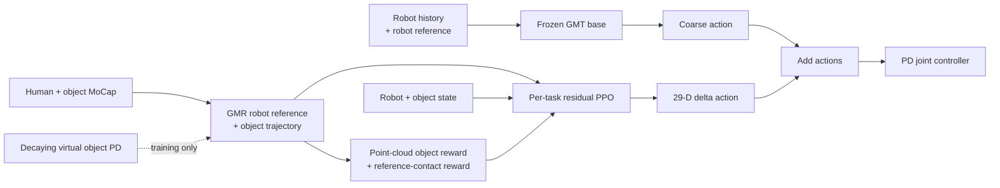

# ResMimic: From General Motion Tracking to Humanoid Whole-body Loco-Manipulation via Residual Learning

| Field | Value |
| --- | --- |
| Primary source | [arXiv:2510.05070v2](https://arxiv.org/html/2510.05070v2), 8 October 2025 |
| Supplement | [Official code, commit `fa20d98`](https://github.com/amazon-far/ResMimic/tree/fa20d98dbbf9b5b903db20435d90a4964bcf09d9) |
| Harness relevance | Reference composition; task reward; evaluation boundary |
| Evidence tier | Core |

## Main point

Across four MuJoCo sim-to-sim tasks, task-specific residual PPO over a GMT base averaged 92.5% success versus 10% for direct GMT, but the experiment changes policy inputs and training aids as well as rewards, so it does not isolate Sam's two knobs under a fixed trainer.

## Mechanism

## Exact parameters

| Parameter | Value | Context | Source locator |
| --- | ---: | --- | --- |
| GMT pretraining corpus | >15,000 clips; ~42 h | AMASS + OMOMO after filtering | Sec. III-B1 |
| Robot/action dimension | 29 | G1 joint targets and residual action | Secs. III-B2, III-C2 |
| Proprioceptive history | `t-10:t` | Robot observation window | Sec. III-B2 |
| Robot and object reference window | `t-10:t+10` | Past/current/future reference | Secs. III-B2, III-C2 |
| Lost-contact termination | >10 consecutive frames | Required body-object contact | Sec. III-C3 |
| Evaluation tasks | 4 | Kneel, Carry, Squat, Chair | Sec. IV-A1 |
| Mean MuJoCo success | 92.5% | ResMimic; direct GMT 10%, scratch 0%, fine-tune 7.5% | Table I |
| Random-pose real trials | 11 | Non-blind box lifting; outcome count is not reported | Fig. 4 |
| Maximum shown payload | 5.5 kg | Chair in qualitative real-world demonstration | Sec. IV-C |
| Surface samples in released code | 1,024; seed 2024 | Example implementation, not specified in paper | `g1_hoi.py:190-200` at `fa20d98` |
| Released object reward | Kernel `exp(-10 * mean point error)`; configured weight 2.0 | Paper writes a sum; base environment later applies its standard timestep scaling | `g1_hoi_config.py:59-83`; `g1_hoi.py:694-706,784-786` |
| Released object-far threshold | 0.3 | Example early termination | `g1_hoi_config.py:59-61` |
| Released final-layer Xavier gain | 0.01 | Near-zero residual initialization | `g1_hoi_config.py:91-97` |

## What transfers to Sam's harness

- Represent a reference as a synchronized tuple: robot trajectory, object trajectory, and per-link contact mask.
- Candidate task reward: object-surface point error plus reference-gated contact-force terms.
- Test each reward with independent object, motion, joint, and success metrics; do not score it with its own generated reward.
- Treat retargeting defects as explicit oracle failures: penetration, floating contact, and impossible object dynamics.
- Compare reward/oracle variants with the policy architecture, observations, controller, dynamics, training budget, and termination rules frozen.

## What does not transfer

- Residual-policy architecture, added object observations, GMT pretraining, virtual forces, and early termination are outside Sam's initial two-knob contract.
- Table I is not causal evidence for the point-cloud or contact reward alone; ResMimic bundles those choices with residual learning and curriculum assistance.
- The paper's “oracle contact” is a per-frame geometric label, not an OGMP state machine or a learned oracle.
- Real-world evidence is qualitative; the 11-trial figure does not report a success rate.

## Failure modes and caveats

- Kinematic retargeting can create penetration or floating contact; the initial policy may knock over the object and learn to retreat.
- Heavy objects destabilize early training; virtual assistance changes training dynamics and must not be smuggled into a fixed-MDP comparison.
- Numeric `N`, `lambda_o`, `sigma_c`, contact `lambda`, `sigma_o`, virtual-controller gains/decay, PPO settings, success threshold, evaluation rollout count, and random seeds are absent from v2.
- Ablations for the virtual controller and contact reward are qualitative figures, not a numeric factorial study.
- The released example code supplies some point-cloud and initialization values, but it should not be treated as a complete reconstruction of every paper mechanism.

## Evidence ledger

| ID | Claim | Source locator |
| --- | --- | --- |
| E2 | GMT action plus per-task residual action is trained with PPO. | [Secs. III-A, III-C2](https://arxiv.org/html/2510.05070v2#S3.SS1) |
| E3 | AMASS + OMOMO provide >15,000 clips (~42 h). | [Sec. III-B1](https://arxiv.org/html/2510.05070v2#S3.SS2.SSS1) |
| E4 | Observations use `t-10:t`; references use `t-10:t+10`; actions are 29-D. | [Secs. III-B2, III-C2](https://arxiv.org/html/2510.05070v2#S3.SS2.SSS2) |
| E5 | Residual references pair retargeted robot and recorded object trajectories. | [Sec. III-C1](https://arxiv.org/html/2510.05070v2#S3.SS3.SSS1) |
| E6 | A decayed virtual object PD controller addresses noisy references and heavy objects. | [Sec. III-C2](https://arxiv.org/html/2510.05070v2#S3.SS3.SSS2) |
| E7 | Point-cloud object reward, reference-contact reward, and extra termination rules are defined. | [Sec. III-C3](https://arxiv.org/html/2510.05070v2#S3.SS3.SSS3) |
| E8 | Mean MuJoCo SR is 92.5% versus 10%, 0%, and 7.5% for three baselines. | [Table I](https://arxiv.org/html/2510.05070v2#S3.T1) |
| E9 | Evaluation uses four tasks and five metric families. | [Sec. IV-A](https://arxiv.org/html/2510.05070v2#S4.SS1) |
| E10 | The virtual-controller and contact-reward ablations are qualitative. | [Sec. IV-D](https://arxiv.org/html/2510.05070v2#S4.SS4) |
| E11 | Real-world results include 4.5 kg and 5.5 kg payload demonstrations. | [Sec. IV-C](https://arxiv.org/html/2510.05070v2#S4.SS3) |
| E13 | Official code samples 1,024 surface points with seed 2024. | [`g1_hoi.py:190-200`](https://github.com/amazon-far/ResMimic/blob/fa20d98dbbf9b5b903db20435d90a4964bcf09d9/legged_gym/legged_gym/envs/g1/g1_hoi.py#L190-L200) |
| E14 | Official config fixes the point reward weight, termination threshold, and residual gain. | [`g1_hoi_config.py:59-97`](https://github.com/amazon-far/ResMimic/blob/fa20d98dbbf9b5b903db20435d90a4964bcf09d9/legged_gym/legged_gym/envs/g1/g1_hoi_config.py#L59-L97) |
| E15 | Official runner adds residual and base actions before stepping the environment. | [`on_policy_dagger_runner.py:286-290`](https://github.com/amazon-far/ResMimic/blob/fa20d98dbbf9b5b903db20435d90a4964bcf09d9/rsl_rl/rsl_rl/runners/on_policy_dagger_runner.py#L286-L290) |
| E16 | Official code computes mean point error and an `exp(-10 * error)` kernel. | [`g1_hoi.py:694-706,784-786`](https://github.com/amazon-far/ResMimic/blob/fa20d98dbbf9b5b903db20435d90a4964bcf09d9/legged_gym/legged_gym/envs/g1/g1_hoi.py#L694-L706) |
