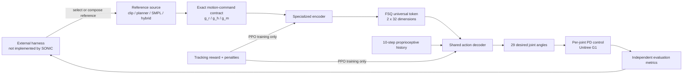

# SONIC: Supersizing Motion Tracking for Natural Humanoid Whole-Body Control

| Field | Value |
| --- | --- |
| Primary source | [arXiv:2511.07820v4](https://arxiv.org/html/2511.07820v4), revised 2026-08-13; published in *Science Robotics* 11(117), eaed4592, 2026, [DOI 10.1126/scirobotics.aed4592](https://doi.org/10.1126/scirobotics.aed4592) |
| Official artifacts checked | [Project](https://nvlabs.github.io/GEAR-SONIC/); [code snapshot](https://github.com/NVlabs/GR00T-WholeBodyControl/tree/a0732b642c0333077e127a2f56ab0014c196bca4); [model-card snapshot](https://huggingface.co/nvidia/GEAR-SONIC/tree/6733128a3d8a523b1418b06bca3cdf61c8b0987f); [Zenodo archive](https://doi.org/10.5281/zenodo.21273312) |
| Harness relevance | Fixed trainer; reference composition; task reward; evaluation |
| Evidence tier | Anchor |

## Main point

SONIC shows that a fixed 29-DoF Unitree G1 PPO tracker can consume interchangeable robot, human, or hybrid motion-reference formats through one 64-dimensional token interface; it does **not** show an agent that searches reference composition or reward design.

## Mechanism

## Controller and reference contract

| Boundary | Paper-defined value | Consequence for a frozen-trainer harness |
| --- | --- | --- |
| Robot command $g_r$ | Robot joint positions and velocities; 10 future frames; 0.1 s frame interval | A composed robot reference must preserve joint order, units, local-frame convention, cadence, and horizon. |
| Human command $g_h$ | 3D SMPL human joint positions; 10 future frames; 0.02 s frame interval | Human references use a different temporal contract; they are not interchangeable byte-for-byte with robot references. |
| Hybrid command $g_m$ | Current head and hand keypoints plus lower-body robot motion; 10 future lower-body frames; 0.1 s frame interval | Sparse teleoperation is partial observation, not a full-body reference. |
| Coordinate convention | State quantities in the robot-local frame; 6D rotations | Cropping or composition must preserve root and heading semantics. |
| Actor state | Ten-step history of joint pose, joint velocity, root angular velocity, gravity in root frame, and previous action | The playback clock and the exact history installed in the actor are part of the trainer contract. |
| Shared latent | Two FSQ tokens; each has 32 dimensions and 32 scalar levels in the default configuration | The resulting 64-dimensional token is a controller interface, not an oracle or natural-language policy. |
| Control output | 29 target joint positions, tracked by joint-level PD controllers | Changing embodiment, action order, PD gains, or controller timing changes the trainer. |
| Current deployment wrapper | One `MotionSequence` stores frame-indexed joint positions, velocities, root poses, and optional SMPL data; an encoder-mode field selects the encoder | Pin the motion bytes, encoder, decoder, observation config, timing, and gains as one immutable bundle. This wrapper is official code evidence, not a result evaluated separately in the paper. |

## Training and reward structure

- Joint objective: PPO loss + robot-reference reconstruction + cross-encoder token alignment + human-to-robot cycle consistency.
- Actor: noisy, deployment-available proprioception and motion commands.
- Critic: privileged base linear velocity, full link poses/orientations, and noise-free observations.
- Sampling: fixed-duration bins weighted by capped failure rates, blended with uniform coverage.
- Reward: one generic, engineered tracking reward reused across applications—not the absence of reward engineering.

| Reward term | Scale or threshold | Weight |
| --- | ---: | ---: |
| Root position match | exponential, 0.3 m scale | 0.5 |
| Root orientation match | exponential, 0.4 scale | 0.5 |
| Root-relative body-link position | exponential, 0.3 m scale | 1.0 |
| Root-relative body-link orientation | exponential, 0.4 scale | 1.0 |
| Body-link linear velocity | exponential, 1.0 scale | 1.0 |
| Body-link angular velocity | exponential, 3.14 scale | 1.0 |
| Head, wrists, ankles position | exponential, 0.1 m scale | 2.0 |
| Action-rate penalty | squared action difference | -0.1 |
| Joint-limit violation | indicator per joint | -10.0 |
| Undesired contact | force > 1 N outside ankles/wrists | -0.1 |
| Wrist/head anti-shake | angular speed > 1.5 | -0.005 |
| Feet acceleration | squared ankle acceleration | -0.0000025 |

## Exact parameters

| Parameter | Value | Context | Source locator |
| --- | ---: | --- | --- |
| Target robot | Unitree G1, 29 actuated joints | Paper experiments | §3.5; Supplement §S1.2 |
| Policy sizes swept | 1.2M, 16M, 42M parameters | Scaling experiment | §2.1, Fig. 2A–C |
| Full-data policy | 42M parameters | All real-world experiments | §3.5 |
| Training motion | 317,189 clips; 611 h; 100M+ frames at 50 Hz | Retargeted and filtered training split | §3.1, Table 2 |
| Raw motion collection | approximately 700 h | Before retargeting/filtering | §3.1 |
| Training compute | 128 GPUs for 7 days; approximately 21k GPU-hours | Largest run | §2.1 |
| Training iterations | 50,000 | All scaling comparisons | §2.1 |
| Environments | 4,096 per GPU | PPO rollout | Table S2 |
| Rollout length | 24 steps per environment | PPO rollout | Table S2 |
| PPO epochs / minibatches | 5 / 4 | Update | Table S2 |
| Discount / GAE | $\gamma=0.99$ / $\lambda=0.95$ | PPO | Table S2 |
| Actor / critic LR | $2\times10^{-5}$ / $1\times10^{-3}$ | PPO | Table S2 |
| Encoder MLP | [2048, 1024, 512, 512] | Each of robot, human, hybrid encoders | Table S1 |
| Action decoder and critic MLP | [4096, 4096, 2048, 2048, 1024, 1024, 512, 512] | Shared controller and critic | Table S1 |
| Reference decoder MLP | [2048, 1024, 512, 512] | Auxiliary robot-motion reconstruction | Table S1 |
| Quantizer | FSQ-32-32; 2 tokens | Default paper configuration | §3.6, Table 3B |
| Proprioceptive history | 10 steps | Actor temporal context | §3.2, States |
| Future reference frames | 10 per encoder | Robot, human, and hybrid commands | Table S1 |
| Reference intervals | robot/hybrid 0.1 s; human 0.02 s | Future command sampling | Table S1 |
| Policy / command / input / planner rates | 50 / 500 / 100 / 10 Hz | Onboard multi-rate deployment | §3.5; Supplement §S1.2 |
| Policy forward pass | 1–2 ms | TensorRT + CUDA Graph on Jetson Orin | Supplement §S1.2 |
| Planner segments | 0.8–2.4 s | Training and interactive generation | §2.2; §3.3 |
| Planner replanning | as often as 100 ms | Also immediate on command change | §2.2 |
| Planner runtime | <5 ms laptop; approximately 12 ms Jetson Orin | Interactive planner | §2.2 |
| Adaptive bin size | 1 s | Motion sampling | Table S2 |
| Adaptive sampler | failure cap $\beta=200$; blend $\alpha=0.1$ | Motion sampling | Table S2 |
| Failure threshold | root height or end-effector height error >0.25 m | Tracking success metric | §2.1, Evaluation Protocol |

## What transfers to Sam's harness

- Freeze a **trainer bundle**, not only network weights: embodiment, simulator, action order, PD settings, control rate, encoder, decoder, observation config, history, and command horizon.
- Put the reference knob upstream of the exact $g_r/g_h/g_m$ boundary. Reject a composition when cadence, root frame, heading, joint order, or required future frames do not re-verify.
- Use the paper's reward vector as a named baseline. Any reward change requires a new training run; it is not an inference-time control.
- Keep reference composition distinct from SONIC's adaptive sampler. The former changes admitted motions or their structure; the latter changes how often fixed bins are rehearsed.
- Treat the kinematic planner as one candidate reference generator. SONIC says the tracker is source-agnostic, but every generator must still emit the command contract the selected encoder expects.
- Evaluate success/failure on every rollout before reporting pose errors; pose metrics are calculated only for successfully tracked motions in the paper.
- Pin the official release variant. As of 2026-08-30, default, low-latency, and v1.1 checkpoints have different lookahead and normalization contracts and must not be mixed.

## What does not transfer

- SONIC does not implement prompt-conditioned reference search, reward search, human language steering, or a closed evaluation-to-design loop.
- Its kinematic planner is a short-horizon motion generator, not an OGMP state-machine oracle or a learned oracle over mode compositions.
- The universal token is a motion-control interface, not evidence that arbitrary reference compositions are dynamically feasible.
- Results on one 29-DoF Unitree G1 do not establish embodiment-independent control.
- “Without manual reward engineering” means without a new reward per downstream task; Table S3 still contains 12 engineered tracking and regularization terms.
- The paper does not establish that SONIC-scale training can run on Apple Silicon. Its reported stack uses Isaac Lab, NVIDIA GPUs, TensorRT, and CUDA Graphs.

## Failure modes and caveats

- The authors report no formal treatment of safety or long-duration energy efficiency; extreme conditions or highly dynamic motions can cause loss of balance.
- Tracker comparisons are not data-matched: baselines used different datasets and retargeting pipelines, so results mix algorithm, data, and scale effects.
- MPJPE-L, velocity, and acceleration errors exclude early-terminated failures; success rate must accompany them.
- Public BONES-SEED data (288 h) are only part of the 611 h training split and 700 h source collection.
- Full-scale reproduction is expensive: 128 GPUs, 7 days, and approximately 21k GPU-hours.
- Paper results, current `main`, and current model variants are different artifacts. Reproduction requires an exact checkpoint/config/code revision, not the label “SONIC.”
- NVIDIA funded the work; the authors were employees, and NVIDIA filed a related patent application.

## Evidence ledger

| ID | Claim | Source locator |
| --- | --- | --- |
| E01 | v4 is the latest arXiv version as of 2026-08-30; journal DOI and publication record | [arXiv metadata](https://arxiv.org/abs/2511.07820), submission history and journal reference; [publisher DOI](https://doi.org/10.1126/scirobotics.aed4592) |
| E02 | State, command, action, reward, and domain-randomization contracts | [Paper v4](https://arxiv.org/html/2511.07820v4), §3.2 |
| E03 | Multi-encoder, FSQ, decoder, and joint training losses | [Paper v4](https://arxiv.org/html/2511.07820v4), §3.2, Fig. 6, Eqs. 1–4 |
| E04 | Architecture, PPO settings, and temporal horizons | [Paper v4](https://arxiv.org/html/2511.07820v4), Supplement Tables S1–S2 |
| E05 | Exact tracking and penalty reward terms | [Paper v4](https://arxiv.org/html/2511.07820v4), Supplement Table S3 |
| E06 | Data scale and train/test splits | [Paper v4](https://arxiv.org/html/2511.07820v4), §3.1, Table 2 |
| E07 | Scaling, baseline, and sim-to-real results | [Paper v4](https://arxiv.org/html/2511.07820v4), §2.1, Fig. 2 |
| E08 | Planner representation, generation, and command filtering | [Paper v4](https://arxiv.org/html/2511.07820v4), §§2.2 and 3.3 |
| E09 | VLA token-vs-pose evidence | [Paper v4](https://arxiv.org/html/2511.07820v4), §2.5, Table 1 |
| E10 | Safety, energy, extreme-motion, and comparison limitations | [Paper v4](https://arxiv.org/html/2511.07820v4), §2.6 and §3.7 |
| E11 | Unified `MotionSequence` deployment interface and multi-rate loops | [Paper v4](https://arxiv.org/html/2511.07820v4), Supplement §S1.2 |
| E12 | Current official release variants must pair encoder, decoder, and observation config | [NVIDIA model card, revision 6733128](https://huggingface.co/nvidia/GEAR-SONIC/blob/6733128a3d8a523b1418b06bca3cdf61c8b0987f/README.md) |
| E13 | Official training code exposes robot and SMPL motion-library paths and multiple encoder configurations | [NVIDIA code, commit a0732b6](https://github.com/NVlabs/GR00T-WholeBodyControl/blob/a0732b642c0333077e127a2f56ab0014c196bca4/docs/source/user_guide/training.md) |
| E14 | The authors deposited an archival code/data snapshot | [Zenodo 10.5281/zenodo.21273312](https://doi.org/10.5281/zenodo.21273312) |
