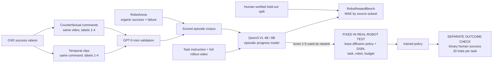

# RoboReward: General-Purpose Vision-Language Reward Models for Robotics

| Field | Value |
| --- | --- |
| Primary source | [arXiv:2601.00675v2](https://arxiv.org/html/2601.00675v2), revised 8 January 2026; latest public version verified 31 August 2026; PDF SHA-256 `601200a96f8e30137cd3166d6d330ff9ff2ceb0de6a4c43949d808e6e9c0d29a` |
| Authors | Tony Lee, Andrew Wagenmaker, Karl Pertsch, Percy Liang, Sergey Levine, Chelsea Finn |
| Author artifacts | [HELM project/leaderboard v0.0.1](https://crfm.stanford.edu/helm/robo-reward-bench/v0.0.1/); [dataset at `469b9af`](https://huggingface.co/datasets/teetone/RoboReward/tree/469b9af76e8539e8d2ac553b081307738fd92ca5); [4B checkpoint at `4dec8af`](https://huggingface.co/teetone/RoboReward-4B/tree/4dec8af8d89d214de7028d70f9f9aee3b3a44c3d); [8B checkpoint at `3a185b4`](https://huggingface.co/teetone/RoboReward-8B/tree/3a185b4fce2b1253643105be1f234ae618b9732f) |
| Harness relevance | Evaluation / external episodic task reward / fixed trainer; negative and near-miss construction |
| Evidence tier | Core |

## Main point

RoboReward 8B reports `0.665` group-wise MAE on `2,831` human-verified real-robot episodes and `50%`/`80%` success after `6,000`-step RL on two tasks, but its output is a learned episodic video score—not executable task-reward code, an objective success measure, or an oracle.

## Mechanism

## Exact parameters

| Parameter | Value | Context | Source locator |
| --- | ---: | --- | --- |
| Reward interface | task instruction + full-episode video -> integer in `{1,2,3,4,5}` | End-state progress only; not a per-step state/action reward | [Sec. 3](https://arxiv.org/html/2601.00675v2#S3) |
| Progress rubric | `1` no success; `2` minimal; `3` partial; `4` near; `5` perfect | Score 4 misses one minor requirement; score 3 misses a major or multiple requirements | [Sec. 4.2](https://arxiv.org/html/2601.00675v2#S4.SS2) |
| Corpus size | `54,135` | `45,072` train; `6,232` validation; `2,831` test | [Sec. 4.3](https://arxiv.org/html/2601.00675v2#S4.SS3); [App. A.1](https://arxiv.org/html/2601.00675v2#A1.SS1) |
| Benchmark scope | `2,831` episodes; `14` embodiment types; mixed exocentric/egocentric views | Human-verified test split; models ranked by group-wise MAE | [Introduction](https://arxiv.org/html/2601.00675v2#S1); [Sec. 5.1](https://arxiv.org/html/2601.00675v2#S5.SS1) |
| OXE sampling | Up to `1,200` episodes per source dataset | Reduces repetition; included demonstrations receive score 5 before augmentation | [Sec. 4.1](https://arxiv.org/html/2601.00675v2#S4.SS1) |
| RoboArena contribution | `7,337` train; `1,000` validation; `1,000` test | Organic policy successes/failures on a DROID/Franka-based platform; original `[0,100]` progress is mapped to `1-5` | [Sec. 4.1](https://arxiv.org/html/2601.00675v2#S4.SS1); [App. A.1, Table 4](https://arxiv.org/html/2601.00675v2#A1.SS1) |
| Counterfactual augmentation | Same video; new commands with labels `{1,2,3,4}` | Original successful command remains score 5; commands form a strict `1<2<3<4<5` ladder | [App. A.2](https://arxiv.org/html/2601.00675v2#A1.SS2) |
| Temporal augmentation | Clipped video; original command; labels `{1,2,3,4}` | Earlier endpoints create grounded partial-progress outcomes | [Sec. 4.2](https://arxiv.org/html/2601.00675v2#S4.SS2); [App. A.2](https://arxiv.org/html/2601.00675v2#A1.SS2) |
| Augmentation models | `gpt-5-mini-2025-08-07`; `Qwen3-4B-Instruct-2507` | GPT-5 mini analyzes/plans/validates; Qwen3 generates one imperative command per score | [App. A.2.2](https://arxiv.org/html/2601.00675v2#A1.SS2.SSS2) |
| Augmentation video sampling | `1 FPS`, including final frame | Used by video analysis and validation | [App. A.2.2-A.2.3](https://arxiv.org/html/2601.00675v2#A1.SS2.SSS2) |
| Generated-command limit | Under `25` words | One imperative ASCII command per score; constrained against duplication and entailment | [App. A.2.2](https://arxiv.org/html/2601.00675v2#A1.SS2.SSS2) |
| Split rule | Original task descriptions disjoint across train/validation/test | Partition occurs before episodes are assigned; no scene- or embodiment-disjoint split is reported | [Sec. 4.3](https://arxiv.org/html/2601.00675v2#S4.SS3) |
| Human verification | `1` reviewer per test example | Reviewer accepts/rejects the video-task-label triple; mismatches are discarded before subsampling | [App. A.3](https://arxiv.org/html/2601.00675v2#A1.SS3) |
| Reward-model bases | Qwen3-VL `4B` and `8B` | Vision backbone frozen; fusion and LLM layers trained | [Sec. 4.3](https://arxiv.org/html/2601.00675v2#S4.SS3) |
| Reward-model training | `3` epochs; batch `32`; warmup `0.05`; weight decay `0.05`; max grad norm `1.0` | Cosine decay; learning rate `3e-6` (4B) and `5e-6` (8B); best validation-MAE checkpoint selected | [Sec. 4.3](https://arxiv.org/html/2601.00675v2#S4.SS3) |
| Simulated reward-type test | `3` Robomimic tasks; `3` seeds | DSRL-NA fine-tunes a pretrained diffusion policy; true simulator success reports policy performance | [Sec. 3, Fig. 2](https://arxiv.org/html/2601.00675v2#S3.F2); [App. B.1](https://arxiv.org/html/2601.00675v2#A2.SS1) |
| Reward-accuracy association | `r=0.83` | Held-out reward MAE versus converged true success across model checkpoints and three simulation tasks | [Sec. 3, Fig. 3](https://arxiv.org/html/2601.00675v2#S3.F3) |
| Real-robot setting | WidowX 250 `6-DoF`; `2` unseen tasks | DSRL-SAC fine-tunes a BridgeData V2-pretrained multi-task diffusion policy | [Sec. 5.2](https://arxiv.org/html/2601.00675v2#S5.SS2) |
| Real-robot budget | `6,000` environment steps; maximum `70` steps/episode | Same DSRL hyperparameters across reward conditions; replay buffer warm-started with `20` base-policy rollouts | [Sec. 5.2](https://arxiv.org/html/2601.00675v2#S5.SS2); [App. B.4](https://arxiv.org/html/2601.00675v2#A2.SS4) |
| Real-robot reporting | `20` success trials per task/condition | No repeated RL-training seeds or confidence intervals are reported | [Sec. 5.2, Table 2](https://arxiv.org/html/2601.00675v2#S5.SS2) |

## Measured evidence

| Setting | Reported result | Source locator |
| --- | --- | --- |
| RoboRewardBench, 22 VLMs | RoboReward 8B rank `1`, MAE `0.665`; GPT-5 mini `0.691`; RoboReward 4B rank `4`, `0.845`; Gemini Robotics-ER 1.5 rank `11`, `0.906` | [Sec. 5.1, Table 1](https://arxiv.org/html/2601.00675v2#S5.SS1); [App. B.2, Table 7](https://arxiv.org/html/2601.00675v2#A2.SS2) |
| Same-base supervision | Qwen3-VL 8B `0.892` -> RoboReward 8B `0.665`; Qwen3-VL 4B `1.032` -> RoboReward 4B `0.845` | [Sec. 5.1](https://arxiv.org/html/2601.00675v2#S5.SS1) |
| RoboArena subset | RoboReward 8B `0.768`; RoboReward 4B `0.806`; Gemini Robotics-ER 1.5 `1.002` | [Sec. 5.1, Table 1](https://arxiv.org/html/2601.00675v2#S5.SS1) |
| 4B data-mixture ablation | Full `0.845/0.806`; no negative augmentation `1.450/0.797`; no clipping `1.075/0.813` | Overall/RoboArena MAE; [Sec. 5.3, Table 3](https://arxiv.org/html/2601.00675v2#S5.SS3) |
| Pick-and-place monkey | base `5%`; human reward `75%`; RoboReward 8B `50%`; Gemini Robotics-ER 1.5 `10%` | Success over 20 trials after training; [Sec. 5.2, Table 2](https://arxiv.org/html/2601.00675v2#S5.SS2) |
| Open drawer | base `10%`; human reward `90%`; RoboReward 8B `80%`; Gemini Robotics-ER 1.5 `45%` | Success over 20 trials after training; [Sec. 5.2, Table 2](https://arxiv.org/html/2601.00675v2#S5.SS2) |

## Public artifact boundary

- The official project links a versioned HELM leaderboard, the `54,135`-row dataset, and 4B/8B Qwen3-VL checkpoint repositories. The pinned 8B model card specifies the task-video prompt and five-level output contract.
- These releases support offline scoring and model inspection. They do **not** make RoboReward executable task-reward code over simulator state/action fields, an oracle, or a reference-composition mechanism.

## What transfers to Sam's harness

- Use a frozen task-video progress scorer as one **diagnostic channel**: pin model bytes, prompt, frame sampler, final-frame policy, rubric, and output parser in the evaluation manifest.
- Keep an objective channel outside the optimized artifact. If a learned scorer supplies training reward or candidate-selection feedback, final claims still require predeclared task success/progress plus contact, stability, naturalness, and failure metrics that do not consume that scorer's output.
- Build evaluator challenge sets from both organic failures and matched counterfactuals: same video/different command tests instruction grounding; same command/earlier endpoint tests progress and temporal sensitivity.
- Keep augmented siblings in one split and partition before generation. Also group by scene, task family, embodiment, and source when testing portability; the paper guarantees only original-task-description separation.
- Report more than mean absolute error: per-level confusion, catastrophic false-positive/false-negative rates, calibration, per-task and per-embodiment results, abstention/visibility failures, and downstream objective success.
- Promote a scorer only after targeted tests for secure grasp versus approach, actual drawer displacement, release versus hovering, and other small state changes that VLMs can narrate incorrectly.
- Record search use separately from reporting use. A scorer that proposes or selects oracle/reward revisions is no longer an independent final evaluator.

## What does not transfer

- RoboReward does not generate, edit, compile, or validate executable task-reward code.
- It does not compose references, discover modes, select a phase window, expose a playback clock, or implement a closed-loop oracle.
- Its model output is a sparse full-episode score. The paper does not establish dense per-step credit, long-horizon multi-stage evaluation, or controller-state compatibility.
- A VLM score is not ground truth. If optimized directly, it is part of the training objective and cannot also establish objective improvement.
- The two-task real-robot result does not establish portability across parameterized MDPs, policy architectures, robots, or trainers.
- No result implies that RL-Sculptor implements RoboReward.

## Failure modes and caveats

- **Reported high-impact errors:** Gemini Robotics-ER 1.5 assigns `5/5` to a closed-drawer failure, `2/5` to a successful drawer opening, and `5/5` when a monkey appears to hover above rather than rest on a towel. The paper attributes these errors to missed fine temporal/spatial state and hallucinated success events.
- **Non-uniform generalization:** RoboReward 8B is best overall but reports MAE `1.394` on UTokyo xArm Bimanual and `0.890` on Stanford HYDRA; the best HYDRA model reports `0.495`.
- **Verification limit:** Each benchmark example is accepted by one human reviewer; no inter-rater agreement, calibration set, or adjudication protocol is reported.
- **Teacher dependence:** Training labels are generated and filtered with related GPT-5 mini stages. Only the test split receives human verification, and generated labels are explicitly not guaranteed correct.
- **Metric limit:** Group-wise MAE collapses error direction and severity. It does not separately expose the false-positive failures most dangerous when a policy optimizes the scorer.
- **Real-robot comparison confound:** The human condition uses binary `{0,1}` success while both VLMs use progress `{1,...,5}`. Reward form and scale therefore differ, even though DSRL settings are matched.
- **Uncertainty gap:** Real-robot success is measured over 20 final trials, but the paper reports no repeated RL-training seeds or confidence intervals for either task.
- **Correlation limit:** `r=0.83` is an association across checkpoints and three simulated tasks, without a confidence interval; it is not a universal or causal guarantee that lower offline MAE will improve RL.
- **Split limit:** Original task descriptions are disjoint, but scene-, source-, and embodiment-disjoint evaluation is not reported.
- **Scope limit:** The authors identify longer-horizon, multi-stage reward modeling and credit assignment as future work.
- **Source wording inconsistency:** The introduction calls all `54,135` examples automatically generated, while the dataset table and method say the same total also contains original OXE demonstrations and organically scored RoboArena episodes.

## Evidence ledger

| ID | Claim | Source locator |
| --- | --- | --- |
| E01 | Title, six authors, v2 date, active arXiv identity, and project URL | [arXiv v2 record](https://arxiv.org/abs/2601.00675v2) |
| E02 | The paper restricts the learned signal to full-episode rewards and compares binary, continuous, and five-level progress in three Robomimic tasks | [Sec. 3 and Fig. 2](https://arxiv.org/html/2601.00675v2#S3) |
| E03 | Held-out reward accuracy and downstream true success have reported Pearson correlation `r=0.83` | [Sec. 3 and Fig. 3](https://arxiv.org/html/2601.00675v2#S3.F3) |
| E04 | OXE provides subsampled successful demonstrations; RoboArena provides organic successes/failures with human `[0,100]` progress mapped to `1-5` | [Sec. 4.1](https://arxiv.org/html/2601.00675v2#S4.SS1) |
| E05 | Counterfactual task relabeling and temporal clipping create instruction-conditioned negatives and partial-progress near-misses without fabricating video | [Sec. 4.2](https://arxiv.org/html/2601.00675v2#S4.SS2) |
| E06 | A fixed five-level final-state rubric and VLM rejection filter validate augmentation; the authors call generation high-cost and labels imperfect | [Sec. 4.2](https://arxiv.org/html/2601.00675v2#S4.SS2) |
| E07 | Exact split sizes, original-task-disjoint split, frozen vision backbone, trainable fusion/LLM layers, and fine-tuning hyperparameters | [Sec. 4.3](https://arxiv.org/html/2601.00675v2#S4.SS3) |
| E08 | RoboRewardBench prompts 22 VLMs with task plus video and ranks their five-level predictions by group-wise MAE | [Sec. 5.1 and Table 1](https://arxiv.org/html/2601.00675v2#S5.SS1) |
| E09 | RoboReward 8B/4B, Qwen bases, GPT-5 models, and Gemini Robotics-ER results, including non-uniform subset errors | [Sec. 5.1](https://arxiv.org/html/2601.00675v2#S5.SS1); [App. B.2, Tables 7 and 10](https://arxiv.org/html/2601.00675v2#A2.SS2) |
| E10 | WidowX, diffusion-policy/DSRL setup, reward conditions, two tasks, 6,000-step budget, 70-step episode cap, and zero-shot VLM use | [Sec. 5.2](https://arxiv.org/html/2601.00675v2#S5.SS2) |
| E11 | Twenty-trial task success for the base policy and policies trained with human, RoboReward 8B, and Gemini Robotics-ER rewards | [Sec. 5.2, Table 2](https://arxiv.org/html/2601.00675v2#S5.SS2) |
| E12 | The 4B data-mixture ablation quantifies full, no-negative-augmentation, and no-clipping MAE | [Sec. 5.3, Table 3](https://arxiv.org/html/2601.00675v2#S5.SS3) |
| E13 | The discussion reports non-uniform generalization and names long-horizon, multi-stage tasks as future work | [Sec. 6](https://arxiv.org/html/2601.00675v2#S6) |
| E14 | Dataset-source table gives `54,135` total examples and exact per-source split counts, including RoboArena | [App. A.1, Table 4](https://arxiv.org/html/2601.00675v2#A1.SS1) |
| E15 | Augmentation uses GPT-5 mini and Qwen3-4B, strict `1<2<3<4<5` construction, 1-FPS frames, a 25-word command cap, and rejection on inconsistency | [App. A.2](https://arxiv.org/html/2601.00675v2#A1.SS2) |
| E16 | One human reviewer verifies each test triple; rejected examples are discarded before the `2,831`-example benchmark is subsampled | [App. A.3](https://arxiv.org/html/2601.00675v2#A1.SS3) |
| E17 | Qualitative false positives and negatives expose hallucinated grasps, drawer motion, and placement | [App. B.3 and Fig. 6](https://arxiv.org/html/2601.00675v2#A2.SS3) |
| E18 | Real-world DSRL follows fixed hyperparameters and warm-starts its replay buffer with 20 base-policy rollouts | [App. B.4](https://arxiv.org/html/2601.00675v2#A2.SS4) |
| E19 | The official project links the versioned leaderboard, dataset, and 4B/8B checkpoints | [Official HELM project](https://crfm.stanford.edu/helm/robo-reward-bench/v0.0.1/) |
| E20 | The pinned dataset card exposes split sizes and task/video/reward/validation fields; the pinned 8B model card exposes the five-level inference prompt | [Dataset at `469b9af`](https://huggingface.co/datasets/teetone/RoboReward/blob/469b9af76e8539e8d2ac553b081307738fd92ca5/README.md); [8B card at `3a185b4`](https://huggingface.co/teetone/RoboReward-8B/blob/3a185b4fce2b1253643105be1f234ae618b9732f/README.md) |
