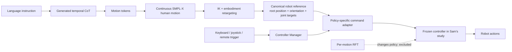

# FRoM-W1: Towards General Humanoid Whole-Body Control with Language Instructions

| Field | Value |
| --- | --- |
| Primary source | [arXiv:2601.12799v1](https://arxiv.org/pdf/2601.12799v1), 19 January 2026 |
| Source bytes | TeX archive SHA-256 `e5e138b55a8909bae356e2c33103bed8bba8f2b10de56915b1fe3b227f9e1a28` |
| Official code | [`457d84d44e638c1070473dd48cedde19752cad09`](https://github.com/OpenMOSS/FRoM-W1/tree/457d84d44e638c1070473dd48cedde19752cad09), 5 June 2026 |
| Harness relevance | Reference composition; human steering; evaluation; fixed-trainer boundary |
| Evidence tier | Core |

## Main point

FRoM-W1 exposes a candidate reference-oracle boundary—language instruction → generated CoT → human motion → retargeted robot root/joint trajectory → policy-specific command—but its reported per-motion RFT improvements require changing the controller, so only the generation, retargeting, and adapter front end fits Sam's fixed-trainer study.

## Mechanism

## Exact parameters

| Parameter | Value | Context | Source locator |
| --- | ---: | --- | --- |
| Public report | arXiv v1 | Only public arXiv version in the submission history | arXiv submission history |
| H-GPT base | Llama-3.1 8B | The paper separately calls the overall H-GPT model “9B” without reconciling the count | Sec. 3.1, Implementation Details; Introduction contributions |
| HumanML3D-X tokenizer | codebook 512 × 512; temporal downsampling 4 | Shared by H-GPT with and without CoT | Sec. 3.1, Implementation Details |
| LoRA | rank 32; scale 16; dropout 0.05 | Applied to all linear projection layers; embeddings and LM head stay trainable | Sec. 3.1, Implementation Details |
| Reported H-GPT training | 8 GPUs; VQ-VAE batch 512 for 30,000 epochs; LM minibatch 8 for 600 epochs | Values are transcribed as reported; “30,000 epochs” is not clarified | Sec. 3.1, Implementation Details |
| CoT target | 1–2 first-person sentences | GPT-4o prompt asks for a concise temporal action plan grounded in a rendered video and description | Appendix A.1 |
| Motion-X corpus | 81,084 clips | Video-estimated and motion-capture whole-body data with text labels | Sec. 3.1, Data Scaling with Motion-X |
| Motion-X tokenizer | 1,024 codes; code dimension 2,048 | Selected by reconstruction performance for H-GPT++ | Sec. 3.1, Data Scaling with Motion-X |
| Benchmark repeats | 3 runs; mean ± 95% CI | HumanML3D-X and δHumanML3D-X | Tables 1–2 |
| HumanML3D-X FID | no CoT 0.229 ± 0.029; CoT 0.255 ± 0.008 | CoT is worse on the in-distribution primary metric | Table 1 |
| δHumanML3D-X FID | rephrasing 0.455 → 0.355; noising 0.830 → 0.602 | Without CoT → with CoT | Table 2 |
| Manual CoT tests | 50 complex; 50 abstract instructions | Comparative observation; no ground-truth motion or per-model absolute score | Sec. 3.1, CoT Generation Performance |
| Canonical controller reference | root position, root orientation, target joint angles | Retargeter output consumed by the whole-body policy | Sec. 2.3.1–2.3.2 |
| Student reference keypoints | 3: head and both hands | Default simplified student goals; teacher tracks more keypoints | Sec. 2.3.2, RL Pre-Training |
| RPT embodiment mapping | 24-joint SMPL → H1 19 DoF; G1 21 DoF | Hand joints are excluded from RL training | Sec. 3.2, RL Pre-Training |
| RPT parallelism | 4,096 environments per robot | PPO with RSL-RL in IsaacGym | Sec. 3.2, RL Pre-Training |
| RFT evaluation | 30 random AMASS motions | Pretraining, training from scratch, and per-motion fine-tuning compared | Sec. 3.2, RL Fine-Tuning |
| RFT onset | substantial change around 500 steps | Reported from step-scaling curves | Figure 10 |
| H1 RFT | MPJPE 140.439 → 118.362; SR 98.835% → 99.734% | Pre-trained → fine-tuned | Figure 9 source data |
| G1 RFT | MPJPE 102.402 → 90.0223; SR 97.918% → 98.185% | Pre-trained → fine-tuned | Figure 9 source data |
| Code snapshot | top-level `457d84d`; retarget `9178cdf`; human2humanoid `475dcf7`; RoboJuDo `806850e` | Exact Git tree reviewed | Official code tree |
| Public model/data snapshots | model `c3c1622`; dataset `763ae97` | Exact Hugging Face revisions reviewed | Official model and dataset repositories |

## What transfers to Sam's harness

- Define the oracle output as a canonical, time-indexed robot reference: root position, root orientation, ordered joint targets, source instruction, generated plan, and full transform provenance.
- Keep language interpretation, reference generation, embodiment retargeting, and controller adaptation as explicit stages. Gate each stage independently.
- Treat a high-level instruction or mode trigger as steering of the reference/oracle layer, not as a hidden mutation of the low-level policy.
- Adapt one admitted reference into the exact command schema expected by a frozen controller; validate joint order, root frame, timing, and available reference fields before training.
- Evaluate semantic alignment separately from kinematic feasibility and policy tracking. The paper's CoT ablation shows that in-distribution FID and perturbed-instruction robustness can move in opposite directions.
- Stress-test initial-pose stability and motion-rate discontinuities before admitting a generated reference.

## What does not transfer

- Per-motion RFT changes policy parameters, executes additional PPO/DAgger training, and changes compute. It violates Sam's initial fixed-controller, fixed-trainer, fixed-budget contract.
- FRoM-W1's teacher privileges, observation space, tracking reward, domain randomization, and hand-joint handling belong to the frozen trainer/controller side, not the two authorable knobs.
- The paper's imitation, stability, and regularization terms are tracking rewards. They are not evidence for Sam's authorable task-reward design.
- RoboJuDo's runtime policy switching and output blending are not evidence of a validated OGMP predicate, branch, preference-conditioned oracle, or shared training/evaluation manifest.
- Retargeting does not establish immutable artifact identity, root-frame preservation across compositions, dynamics certification, or Tier-D feasibility.
- Qualitative real-robot examples do not establish a controlled hardware success rate; the paper gives no trial counts for Figures 12–14.
- The paper does not establish that FRoM-W1, VIBE, or any of its mechanisms are implemented in RL-Sculptor.

## Failure modes and caveats

- Generated actions can be semantically misaligned, dynamically unstable, or self-colliding.
- Reference initial-pose instability and rapid body/joint change reduce tracking success.
- Filtering AMASS helps in-distribution tracking but does not improve tracking of noisier H-GPT references; the authors' robustness explanation is speculative.
- CoT worsens HumanML3D-X FID while improving perturbed-instruction FID. The manual complex/abstract evaluation has no ground truth and permits ties.
- Motion-X video estimates and VLM-generated labels have distribution and quality defects; more data does not outperform the cleaner HumanML3D-X training set.
- Extreme squats and fast forward motion can work in simulation yet fail on hardware.
- Low-inertia wrist/head joints can oscillate in simulation; the proposed mitigation removes or freezes those DoFs, changing the controller/training contract.
- The report names one RTX 4090 workstation in Sec. 3.3 but dual RTX 5090 32 GB GPUs in Appendix B.1; the evaluated inference setup is not reconciled.
- The report calls H-GPT 9B but specifies an 8B base model; the extra parameter count is not explained.
- At code commit `457d84d`, H1/G1 teacher checkpoints are marked TBD and the AMASS-G1 download is “coming soon,” despite the broad open-source claim.

## Evidence ledger

| ID | Claim | Source locator |
| --- | --- | --- |
| F01 | The only arXiv release is v1, submitted 19 January 2026. | arXiv submission history |
| F02 | The task is composed as instruction → human motion → retargeted robot reference → policy actions. | Figure 1; Sec. 2.1 |
| F03 | H-GPT generates a temporal CoT, then motion tokens conditioned on instruction plus CoT. | Sec. 2.2.1–2.2.3; Figure 2 |
| F04 | The tokenizer discretizes motion with VQ-VAE; the LLM uses a joint text/motion vocabulary. | Sec. 2.2.2–2.2.3 |
| F05 | Base model, tokenizer, LoRA, and training parameters are reported. | Sec. 3.1, Implementation Details |
| F06 | Motion-X has 81,084 clips; a 1,024 × 2,048 tokenizer is selected, but data quality limits scaling. | Sec. 3.1, Data Scaling with Motion-X; Table 3 |
| F07 | Retargeting produces root position/orientation plus ordered robot joint targets. | Sec. 2.3.1; Figure 3 |
| F08 | RPT trains a privileged teacher and DAgger student; RFT specializes both to one target motion. | Sec. 2.3.2; Figure 4 |
| F09 | Canonical references are adapted to controller-specific commands; controller inputs and runtime triggers are normalized. | Sec. 2.3.3; Appendix B.2; Figure 15 |
| F10 | CoT worsens HumanML3D-X FID from 0.229 to 0.255. | Table 1; Sec. 3.1 Results |
| F11 | CoT improves δHumanML3D-X rephrasing and noising FID. | Table 2; Sec. 3.1 Results |
| F12 | Complex/abstract instruction evaluation is manual, ground-truth-free, and tie-permitting. | Sec. 3.1, CoT Generation Performance |
| F13 | RPT uses fixed reference-tracking penalties, 4,096 environments, and a 24-joint-to-robot mapping without hands. | Sec. 3.2, RL Pre-Training |
| F14 | Thirty AMASS motions and step sweeps quantify per-motion RFT improvements. | Figures 9–10; Sec. 3.2, RL Fine-Tuning |
| F15 | Initial-pose stability, motion rate, noisy generated references, and filtering affect tracking. | Sec. 3.2, RL Pre-Training; Figures 7–8 |
| F16 | Real failures include instruction/action mismatch, self-collision, extreme squats, and fast motion across the sim-to-real gap. | Sec. 3.3; Figure 14 |
| F17 | Low-inertia joints can oscillate; freezing or removing them is the proposed mitigation. | Appendix B.3 |
| F18 | The conclusion calls for better semantic alignment, deployable motions, and trackers robust to noisy generated references. | Sec. 5 |
| F19 | The exact official code tree and three submodule commits are pinned. | Official code commit `457d84d` |
| F20 | The code snapshot marks teacher checkpoints TBD and AMASS-G1 data unavailable. | Official code README at `457d84d` |
| F21 | The official model repository is pinned at revision `c3c1622`. | Official Hugging Face model repository |
| F22 | The official dataset repository is pinned at revision `763ae97`. | Official Hugging Face dataset repository |
| F23 | Sec. 3.3 says RTX 4090; Appendix B.1 says dual RTX 5090 32 GB. | Sec. 3.3 Setup; Appendix B.1 Inference Server |
| F24 | The reviewed arXiv v1 TeX archive is pinned by SHA-256. | arXiv v1 e-print archive |
