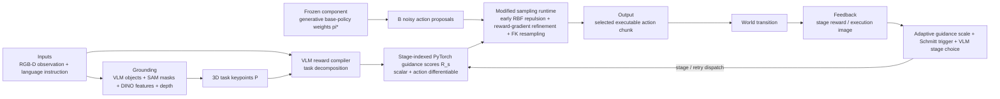

# VLS: Steering Pretrained Robot Policies via Vision-Language Models

| Field | Value |
| --- | --- |
| Primary source | [arXiv:2602.03973v1](https://arxiv.org/html/2602.03973v1), submitted 3 February 2026; sole public revision checked 30 August 2026; [DOI 10.48550/arXiv.2602.03973](https://doi.org/10.48550/arXiv.2602.03973) |
| Exact public bytes | [v1 PDF](https://arxiv.org/pdf/2602.03973v1), SHA-256 `8cb3c52f2ca3504b3876bdcef960ba51c69763055aa63fe52eff38b3d3c6ebd3`; [v1 TeX archive](https://export.arxiv.org/e-print/2602.03973v1), SHA-256 `9f485671e7c2f34b38100bc7c5b884822af0d534e35b61e88674dd120ec4c2ba` |
| Official artifacts | [Project page](https://vision-language-steering.github.io/webpage/) pinned to source commit [`110c5aa`](https://github.com/Vision-Language-Steering/webpage/tree/110c5aa937db24f17fe69af2b28887edaea6d557); untagged [code commit `b6e87ed`](https://github.com/Vision-Language-Steering/code/tree/b6e87edc217a2a7682caadba285677fc79eb6f81), committed 29 March 2026. Neither artifact binds the reported runs to that post-paper code commit |
| Harness relevance | Human steering; executable-reward precursor; evaluation; fixed-controller boundary. No reference composition/oracle artifact |
| Evidence tier | Supporting |

## Main point

VLS reports that VLM-generated differentiable action-proposal rewards raise a frozen LeRobot `pi_0.5` policy from `23.69%` to `36.81%` overall success on LIBERO-PRO, but the method changes the policy's denoising runtime and never trains a policy with those rewards, so it is not an admissible `task_reward_k` or reference oracle under Sam's fixed-trainer contract.

## Mechanism

## Harness boundary

| Layer | Paper artifact | Classification for Sam |
| --- | --- | --- |
| Reference composition / oracle | No immutable motion reference, playback clock, source selection, transition trajectory, or recovery clip. The Schmitt logic switches action-guidance reward stages inside the controller runtime | Hysteresis is a useful state-machine pattern, but VLS is not an `oracle_k` candidate |
| Executable task reward | The VLM emits differentiable PyTorch scalars over partially denoised action proposals and 3D keypoints | Executable code exists, but it is an inference-time guidance potential, not the task reward consumed by policy training |
| Controller and trainer | Base-policy weights stay frozen; RBF forces, reward gradients, MCMC-like inner updates, FK resampling, and stage dispatch reshape its sampled action distribution | Outside the fixed controller/runtime. “Training-free” is weaker than Sam's frozen-trainer contract |
| Human steering | Language changes the generated stage rewards at test time | Supporting language-to-program evidence only; no interactive human-feedback study or metrics-to-artifact outer loop |
| Evaluation | OOD success, steering baselines, component ablations, runtime scaling, and real-robot trials | Useful protocol components, but inference compute is not held fixed and the real-robot “success rate” awards partial credit |

## Exact parameters

| Parameter | Value | Context | Source locator |
| --- | ---: | --- | --- |
| Inner refinement count | diffusion `4`; flow matching `1` | Updates per denoising step in Algorithm 1 | Alg. 1, line 6 |
| LIBERO-PRO scope | `4` suites x `10` tasks; `20` episodes per task for each of task and position perturbations | Goal, Spatial, Long-10, Object | Table I caption |
| LIBERO-PRO overall SR | base `23.69%`; VLS `36.81%`; `+13.12` percentage points | LeRobot `pi_0.5`, mean over task and position columns | Table I |
| LIBERO-PRO task / position means | task `23.13% -> 38.50%`; position `24.25% -> 35.13%` | Same frozen LeRobot `pi_0.5` comparison | Table I |
| CALVIN evaluation | `600` episodes per task | Error bars are standard deviation; seed hierarchy is not reported | Fig. 3 caption |
| CALVIN VLS SR | movable objects `94%`; articulated parts `87%` | Reported as `7.4x` and `9.6x` over the base policy | Fig. 3 |
| Component ablation | `50` episodes per task; `K=10` | Full VLS versus removal of gradient, FK, or RBF terms | Fig. 4 left |
| Gradient ablation SR | no gradient `17.3%`; full VLS `88%` | Largest reported component effect | Fig. 4 left |
| Gradient ablation episode length | no gradient `178.6`; full VLS `61` | Average environment steps | Fig. 4 left |
| Full-VLS inference time | `1189 ms` | `K=10` ablation plot; hardware is not identified | Fig. 4 left |
| Particle-count sweep | `K=[1,2,5,10]`; SR `[88,88,90,90]%`; latency `[665,799,953,1239] ms` | `door_left`, `50` episodes | Fig. 4 right |
| Real-robot trials and score | `20` trials per task; correct grasp `50%`; full completion `100%` | Franka Emika; the plotted metric is graded credit | Fig. 5 caption |
| Real-robot aggregate SR | in-distribution `50% -> 69%`; OOD `42% -> 69%` | Frozen `pi_0.5` to VLS | Fig. 5 |
| Novel-mug SR | base `0%`; VLS `40%` | Object-shift condition | Sec. V-B; Fig. 5 |

The paper leaves `lambda_max`, `R_high`, `R_low`, RBF `epsilon`, reward scales, VLM identity, prompt bytes, camera calibration, checkpoint digests, simulator/dependency versions, and the reported-run seed manifest unspecified. Its text promises these details in an appendix, but the v1 source excludes the appendix and the four appendix files contain headings only.

## What transfers to Sam's harness

- Treat vision/language-to-reward as a compiler interface: typed observation/action inputs, named units, exact prompt/model provenance, immutable emitted code, deterministic tests, and an independent task metric.
- Reuse the two-threshold hysteresis pattern only after redirecting its output to an admissible reference choice or transition. Bind states, guards, retry behavior, thresholds, and reference identities in one immutable oracle manifest.
- Preserve the paper's ablation structure: generated reward, continuous gradient effect, particle exploration, stage control, and compute each need separate arms.
- Test task and observation shifts with the same controller, scene, seed protocol, and matched budget. Report candidate-versus-fixed-baseline harm, not only aggregate gain.
- Record inference cost alongside success. Figure 4 shows latency rising from `665` to `1239 ms` as particles rise from `1` to `10` while SR moves only from `88%` to `90%`.
- Fail closed on generated reward code. Static schema/AST checks, an operation allowlist, bounded execution, immutable bytes, and negative-path tests are prerequisites for any `task_reward_k` candidate.

## What does not transfer

- No result concerns reference selection, ordering, cadence, root-frame semantics, transition clips, recovery coverage, or a reference-conditioned policy observation.
- `R_s` is not an RL task reward: it scores candidate action chunks during inference and changes the action sampler directly.
- Freezing `pi*` parameters does not preserve Sam's fixed controller. VLS changes denoising updates, sample count, resampling, runtime latency, and stage dispatch.
- Language is not shown steering either allowed harness artifact through an evaluation-to-revision loop; it conditions a third runtime wrapper.
- The reported success gains do not establish reward independence, matched inference compute, statistical significance, cross-seed reliability, or transfer to a fixed policy-training MDP.

## Failure modes and caveats

- **Reported:** batch sampling, MCMC updates, and FK resampling add high inference latency; progress-aware reward generation and efficiency remain future work.
- **Reward/compiler gap:** reward quality depends on task decomposition, grounding, and generated code, but the paper provides no reward-validity, calibration, adversarial, or independent-metric audit.
- **Underspecified control:** the numerical stage thresholds and guidance scale are absent. Equation 10 is also scale/sign sensitive; the released code uses a different normalized, parameterized sigmoid schedule.
- **Evidence gap:** LIBERO-PRO and real-robot results give no seed hierarchy, confidence intervals, or hypothesis tests. CALVIN gives standard-deviation bars but no numerical dispersion table.
- **Metric caveat:** the Franka “success rate” gives `0.5` credit for grasping the correct object, so `69%` is not a binary completion rate.
- **Release gap:** v1's promised appendix is absent. The official code is an untagged post-paper snapshot with no manifest tying it, its prompts, model APIs, policy checkpoints, or result files to the paper's runs.
- **Execution safety:** the released `exec_safe` permits imports, blocks only the substring `__`, and executes VLM-generated Python with `exec`; dummy-tensor validation does not make that code bounded or side-effect free.

## Evidence ledger

| ID | Claim | Source locator |
| --- | --- | --- |
| E01 | Exact title, authors, DOI, v1 timestamp, 11-page extent, and sole public revision | [arXiv record](https://arxiv.org/abs/2602.03973v1) |
| E02 | VLS freezes base-policy parameters but reshapes the inference-time action distribution under OOD observation-language input | [Paper v1, Secs. I and III-C](https://arxiv.org/html/2602.03973v1#S3.SS3) |
| E03 | VLM object selection, SAM masks, DINO features, depth reprojection, and clustering produce 3D task keypoints | [Paper v1, Sec. IV-A1](https://arxiv.org/html/2602.03973v1#S4.SS1.SSS1) |
| E04 | The VLM decomposes stages and emits scalar, action-differentiable PyTorch reward functions; the VLM stays off graph | [Paper v1, Sec. IV-A2 and Eq. 7](https://arxiv.org/html/2602.03973v1#S4.SS1.SSS2) |
| E05 | RBF proposal repulsion, reward-gradient refinement, and FK reward-weighted resampling modify denoising | [Paper v1, Sec. IV-B, Eqs. 8-9](https://arxiv.org/html/2602.03973v1#S4.SS2) |
| E06 | Guidance strength is adapted from the current versus first-chunk stage reward | [Paper v1, Sec. IV-C1 and Eq. 10](https://arxiv.org/html/2602.03973v1#S4.SS3.SSS1) |
| E07 | Two reward thresholds dispatch advance, maintain, or reinforce, followed by a VLM stage decision | [Paper v1, Sec. IV-C2 and Eq. 11](https://arxiv.org/html/2602.03973v1#S4.SS3.SSS2) |
| E08 | Algorithm 1 specifies four inner updates for diffusion, one for flow, hybrid guidance, stage update, and first-particle return | [Paper v1, Algorithm 1](https://arxiv.org/html/2602.03973v1#S4.I1) |
| E09 | LIBERO-PRO task/position protocol and all per-suite and aggregate success values | [Paper v1, Table I](https://arxiv.org/html/2602.03973v1#S5.T1) |
| E10 | CALVIN task groups, `600` episodes per task, comparative successes, and reported relative gains | [Paper v1, Fig. 3](https://arxiv.org/html/2602.03973v1#S5.F3) |
| E11 | Exact component-ablation and `K`-scaling success, episode-length, and latency plots | [Paper v1, Fig. 4](https://arxiv.org/html/2602.03973v1#S5.F4) |
| E12 | Franka task definitions, 20-trial protocol, partial-credit metric, aggregate results, and novel-mug result | [Paper v1, Fig. 5 and Sec. V-B](https://arxiv.org/html/2602.03973v1#S5.F5) |
| E13 | Authors report inference latency and identify progress-aware rewards and efficiency as future work | [Paper v1, Sec. VI](https://arxiv.org/html/2602.03973v1#S6) |
| E14 | Exact reviewed PDF bytes | [Versioned PDF](https://arxiv.org/pdf/2602.03973v1) |
| E15 | Exact reviewed source bytes; `main.tex` comments out appendix inputs and `00README.json` ignores four heading-only appendix files | [Versioned source archive](https://export.arxiv.org/e-print/2602.03973v1) |
| E16 | Current code defaults and thresholds are distinct from the paper's symbolic contract | [Official code `configs/config.yaml`, lines 24-52 at `b6e87ed`](https://github.com/Vision-Language-Steering/code/blob/b6e87edc217a2a7682caadba285677fc79eb6f81/configs/config.yaml#L24-L52) |
| E17 | Current loader blocks only `__`, permits imports, and calls `exec` on generated guidance text before dummy-input validation | [Official code `guidance_utils.py`, lines 28-114 at `b6e87ed`](https://github.com/Vision-Language-Steering/code/blob/b6e87edc217a2a7682caadba285677fc79eb6f81/utils/guidance_utils.py#L28-L114) |
| E18 | The untagged post-paper tree contains mutable/local checkpoint references and ablation configs, but no run manifest or result artifact that binds the reported experiments to the commit | [Official code tree at `b6e87ed`](https://github.com/Vision-Language-Steering/code/tree/b6e87edc217a2a7682caadba285677fc79eb6f81) |
