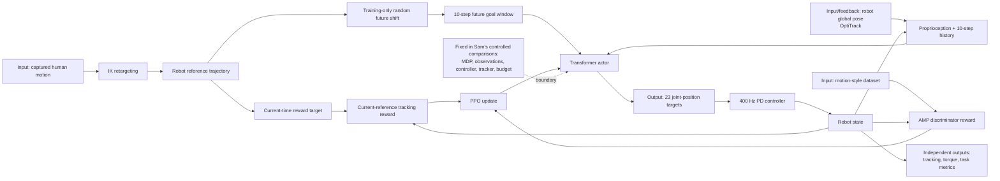

# CLOT: Closed-Loop Global Motion Tracking for Whole-Body Humanoid Teleoperation

| Field | Value |
| --- | --- |
| Primary source | [arXiv:2602.15060v2](https://arxiv.org/html/2602.15060v2), 20 February 2026; latest public arXiv version verified 30 August 2026 |
| Authors | Tengjie Zhu, Guanyu Cai, Zhaohui Yang, Guanzhu Ren, Haohui Xie, Junsong Wu, ZiRui Wang, Jingbo Wang, Xiaokang Yang, Yao Mu, Yichao Yan |
| Official supplements | [Project page](https://zhutengjie.github.io/CLOT.github.io/); [code at commit `efcea1c`](https://github.com/zhutengjie/CLOT/tree/efcea1cf252d4164ece4d90b6d0e3211b5f1814f); [released motion data](https://huggingface.co/datasets/Zhutengjie/human_motion) |
| Harness relevance | Reference composition / task reward / evaluation / fixed trainer |
| Evidence tier | Core |

## Main point

CLOT trains a global motion tracker with a future-shifted reference in the actor observation but the unshifted current reference in the tracking reward; its recovery ablation reports smoother corrections with pre-shift, but the broader full-system ablation does not separately identify pre-shift and AMP effects.

## Mechanism

## Exact parameters

| Parameter | Value | Context | Source locator |
| --- | ---: | --- | --- |
| Policy action | `23` joint-position targets | Hand/finger targets use direct PD tracking; the paper describes Adam Pro as `31 DoF` excluding hands | Sec. III-A; abstract |
| Actor goal window | `g[t+1:t+10]` | Ten future reference goals | Sec. III-D |
| Actor history | `H=10` | Recent proprioception, body-position features, and actions | Sec. III-D; Appendix Table VI |
| Observation pre-shift | `delta in [0,T_max_pre]` | Future shift affects the actor reference window; reward remains aligned to time `t`; disabled at inference | Sec. III-E.1, Eq. 3 |
| Reported pre-shift example | `2.0 s` | Transformer succeeds while the MLP falls in the architecture ablation | Fig. 7 |
| Tracking kernel | `exp(-err/sigma)` | `sigma` is adapted during training; the paper does not report its final value | Sec. III-D, Eq. 2 |
| Composite objective | `lambda_style r_amp + lambda_task r_task`; `r_amp=log D_phi(s_t)` | AMP discriminator regularizes motion style; neither lambda value is reported | Sec. III-E.3, Eq. 4–6 |
| Selected positive reward weights | body position `1.2`; VR keypoints `1.6`; feet position `1.5`; body orientation `1.5`; joint position/velocity `1.0/1.0`; air time `160`; alive `0.2` | Full vector also includes contact, angular/linear velocity, and limit rewards | Appendix Table V |
| Selected penalty weights | action rate `-0.1`; action smoothness `-0.2`; slip `-2`; joint position/velocity/torque limits `-10` each; collision `-30`; early termination `-200` | These are reward coefficients, not independent evaluation thresholds | Appendix Table V |
| Motion corpus | about `20 h` | Paper training corpus, curated for contacts and humanoid kinematic constraints | Sec. III-B; abstract |
| Released corpus | about `10 h` | Public README at pinned code commit; not the complete paper corpus | Official README, lines 74–75 |
| Transformer | model `192`; `4` heads; FFN `768`; `3` blocks; ReLU + layer norm | Both actor and critic | Appendix Table IX |
| AMP discriminator | `4` MLP layers; `1024` hidden units; ReLU + layer norm | Separate from Transformer actor/critic | Appendix Table IX |
| Training compute | `8` RTX 4090 GPUs for about `1 week`; abstract says `>1300 GPU h` | MJLab simulation | Appendix B-A; abstract |
| Deployment rates | body capture `120 Hz`; fingers `60 Hz`; policy `50 Hz`; PD `400 Hz` | Intel Core i7-14700KF executes policy | Sec. III-F |
| Simulation test set | `30 min` held-out motion | Walking, running, dancing, squatting, turning, jumping; Unitree G1 and Adam Pro in MuJoCo | Sec. IV-A |
| G1 CLOT vs TWIST2 | `E_mgbp .056/5.094`; `E_mlbp .061/.340`; `E_mgrp .054/5.164`; `E_mdp .158/.364`; `M_jt 6.604/6.270`; `sigma_mjt 1.806/11.203` | Lower is better; table does not state units | Table II |
| Adam full vs Transformer-only | `.116/.410`, `.107/.170`, `.122/.405`, `.136/.291`, `12.404/12.896`, `8.906/18.214` in the same metric order | Full row jointly adds pre-shift and motion-prior machinery; it is not a one-factor AMP ablation | Table II; Sec. IV-A.2 |
| Pre-shift recovery: AMJT | std `.990` vs `1.107`; smoothness `5.485` vs `7.015` | With vs without pre-shift under abrupt reference changes | Table III |
| Pre-shift recovery: AMDV | std `3.468` vs `5.059`; smoothness `20.442` vs `28.242` | With vs without pre-shift under abrupt reference changes | Table III |
| Real task outcomes | T1 CLOT `27/30`, `25 s`; MPC `20/30`, `22 s`; T2 `24/30`, `82 s`; T3 `26/30`, `42 s` | Only desktop manipulation T1 has the MPC baseline | Table IV |
| Long-horizon test | `30 min`, errors sampled at `1 Hz` | Paper text reports bounded distributions but no numerical mean/error values | Sec. IV-B.2; Fig. 8 |

## Reward and reference interface

- **Two reference clocks:** the actor sees a randomly future-shifted window during training; the reward always uses the original current-time target. The shift is removed at inference.
- **Closed-loop runtime:** retargeted operator motion provides commands; measured robot global pose supplies feedback. This is localization feedback, not an OGMP-style mode oracle.
- **Task reward:** tracking terms, physical penalties, and AMP style reward are combined during PPO training. AMP requires a learned discriminator and a motion-style dataset.
- **Independent evaluation:** global/local body error, root error, joint error, mean torque, torque variability, success rate, and completion time are reported outside the training reward.

## What transfers to Sam's harness

- Record **observation reference**, **reward reference**, clock, window, and shift separately in every execution manifest. A single `reference_id` cannot identify CLOT's two training-time trajectories.
- Stress-test oracle compositions at clip joins and mode transitions with abrupt-reference recovery metrics: joint torque/velocity peaks, fluctuation, tracking error, and fall/termination reason.
- Preserve the current-time objective while varying a reference candidate only if the authorized oracle interface already controls the policy's reference window. Otherwise the experiment changes observations, not only composition.
- Treat the paper's reward table as a candidate decomposition, not a verdict on coefficients. Evaluate generated rewards with independent task success, global/local tracking, torque, and smoothness metrics.
- Pin the motion bytes and root-frame convention. CLOT's value proposition depends on global-frame feedback; a local-frame crop is not an equivalent reference.

## What does not transfer

- Observation pre-shift is **not automatically an allowed reference-only edit** under Sam's frozen-observation contract. It changes the actor's training inputs and sampling distribution.
- AMP is not a standalone executable task-reward function. It adds a learned discriminator, style data, discriminator optimization, and trainer state.
- The Transformer, PPO setup, adaptive sampling, domain randomization, PD gains, OptiTrack feedback, and training budget are trainer/MDP components. CLOT does not justify changing them in a two-knob comparison.
- CLOT does not discover mode graphs, select clips, compose an oracle, accept language steering, or establish a VIBE integration.
- A global teleoperation feedback loop is not evidence that RL-Sculptor implements a closed-loop reference oracle.

## Failure modes and caveats

- The paper reports that direct global tracking objectives can produce reward conflict, aggressive correction, excessive torque, unsafe behavior, and suboptimal local minima.
- The aggregate Adam comparison uses `Transformer-only` versus the full system; it does not independently quantify AMP and pre-shift across all reported metrics. Table III isolates pre-shift only for abrupt-error recovery statistics.
- The paper gives `delta in [0,T_max_pre]` but no exact `T_max_pre` or shift probability in the method. Appendix Table VIII lists “Observation Pre-shift” range `[1,2]` without units or an unambiguous mapping to `delta`.
- The pinned Adam release config declares an offset range `[0.5,1.5] s`; the G1 config disables `motion_time_advance`. Released defaults are implementation evidence, not proof of the exact paper checkpoints.
- The public README says about `10 h` of data are uploaded, versus about `20 h` used by the paper. Full-corpus reproduction is therefore not established by the cited release.
- Global closure depends on external OptiTrack localization. The conclusion leaves lightweight global localization and VR tracking to future work.
- Table II omits units for the six simulation metrics. The paper's prose says all G1 tracking errors improve by more than an order of magnitude, but the table ratios for local-body and joint-position error are smaller; use table values.
- Real comparisons are narrow: TWIST2 is compared only in G1 simulation, MPC only on T1, and T2/T3 have no baseline. External-kick evidence is qualitative.
- The 30-minute section provides no numerical summary in rendered paper text; do not cite commented LaTeX values as published evidence.

## Evidence ledger

| ID | Claim | Source locator |
| --- | --- | --- |
| E1 | v2 is the latest public arXiv version; v1 submitted 13 Feb and v2 revised 20 Feb 2026 | [arXiv record, submission history](https://arxiv.org/abs/2602.15060) |
| E2 | Goal-conditioned MDP, 23-dimensional PD targets, PPO objective | [v2 Sec. III-A](https://arxiv.org/html/2602.15060v2#S3.SS1) |
| E3 | About 20 hours of curated motion and IK retargeting | [v2 Sec. III-B–C](https://arxiv.org/html/2602.15060v2#S3.SS2) |
| E4 | Actor goal/history layout and exponential tracking kernel | [v2 Sec. III-D](https://arxiv.org/html/2602.15060v2#S3.SS4) |
| E5 | Pre-shift changes only the observed future window; current-time reward remains aligned; mechanism is training-only | [v2 Sec. III-E.1, Eq. 3](https://arxiv.org/html/2602.15060v2#S3.SS5.SSS1) |
| E6 | Transformer actor/critic and AMP composite reward/discriminator objective | [v2 Sec. III-E.2–3, Eq. 4–6](https://arxiv.org/html/2602.15060v2#S3.SS5.SSS2) |
| E7 | OptiTrack/Hi5, policy, and PD runtime rates | [v2 Sec. III-F](https://arxiv.org/html/2602.15060v2#S3.SS6) |
| E8 | Complete positive and penalty reward coefficient vector | [v2 Appendix Table V](https://arxiv.org/html/2602.15060v2#A1.T5) |
| E9 | Complete actor observation dimensions | [v2 Appendix Table VI](https://arxiv.org/html/2602.15060v2#A1.T6) |
| E10 | Curriculum row gives “Observation Pre-shift” sigma `5e-6` and range `[1,2]`, without units | [v2 Appendix Table VIII](https://arxiv.org/html/2602.15060v2#A1.T8) |
| E11 | Transformer/discriminator dimensions | [v2 Appendix Table IX](https://arxiv.org/html/2602.15060v2#A1.T9) |
| E12 | Fixed Adam Pro PD gain table | [v2 Appendix Table X](https://arxiv.org/html/2602.15060v2#A1.T10) |
| E13 | Eight RTX 4090 GPUs for about one week | [v2 Appendix B-A](https://arxiv.org/html/2602.15060v2#A2.SS1) |
| E14 | Held-out simulation protocol and CLOT/TWIST2/full-system rows | [v2 Sec. IV-A; Table II](https://arxiv.org/html/2602.15060v2#S4.T2) |
| E15 | Pre-shift abrupt-error recovery results | [v2 Table III; Fig. 6](https://arxiv.org/html/2602.15060v2#S4.T3) |
| E16 | At a 2.0 s pre-shift, Transformer tracks while the MLP falls | [v2 Fig. 7; Sec. IV-A.2](https://arxiv.org/html/2602.15060v2#S4.SS1.SSS2) |
| E17 | T1–T3 real-task success and completion times | [v2 Table IV](https://arxiv.org/html/2602.15060v2#S4.T4) |
| E18 | Thirty-minute run sampled at 1 Hz; bounded-error claim has no numerical text summary | [v2 Sec. IV-B.2; Fig. 8](https://arxiv.org/html/2602.15060v2#S4.SS2.SSS2) |
| E19 | Formal definitions of independent tracking and torque metrics | [v2 Appendix B-B](https://arxiv.org/html/2602.15060v2#A2.SS2) |
| E20 | Future work targets cheaper global localization and VR motion tracking | [v2 Sec. V](https://arxiv.org/html/2602.15060v2#S5) |
| E21 | Official release contains about 10 hours, uses 8×48 GB RTX 4090 defaults, and exposes Transformer/AMP variants | [official README at `efcea1c`, lines 74–125](https://github.com/zhutengjie/CLOT/blob/efcea1cf252d4164ece4d90b6d0e3211b5f1814f/README.md#L74-L125) |
| E22 | Adam release enables pre-shift with a declared `[0.5,1.5] s` offset range | [official Adam config](https://github.com/zhutengjie/CLOT/blob/efcea1cf252d4164ece4d90b6d0e3211b5f1814f/humanoidverse/config/domain_rand/main_adam.yaml#L112-L120) |
| E23 | G1 release declares the same offset range but disables `motion_time_advance` | [official G1 config](https://github.com/zhutengjie/CLOT/blob/efcea1cf252d4164ece4d90b6d0e3211b5f1814f/humanoidverse/config/domain_rand/main_g1.yaml#L115-L123) |
