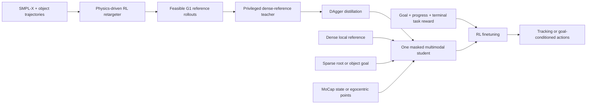

# ULTRA: Unified Multimodal Control for Autonomous Humanoid Whole-Body Loco-Manipulation

| Field | Value |
| --- | --- |
| Primary source | [arXiv:2603.03279v1](https://arxiv.org/pdf/2603.03279v1), 3 March 2026 |
| Supplement | [Official project page](https://ultra-humanoid.github.io/) |
| Harness relevance | Reference composition; task reward; evaluation; fixed-trainer boundary |
| Evidence tier | Core |

## Main point

On 20 selected MuJoCo motions per setting, RL finetuning of ULTRA's distilled student changed OOD goal success from 5/20 to 9/20 with point clouds and from 4/20 to 12/20 with position-only input; this is evidence for testing progress-plus-goal task rewards after fixing the controller, not evidence for replacing Sam's trainer.

## Mechanism

## Exact parameters

| Parameter | Value | Context | Source locator |
| --- | ---: | --- | --- |
| Public source version | v1 | Only arXiv version available in the reviewed source | arXiv submission history |
| OMOMO object subset | 4 box-shaped objects | Other objects require dexterous hands | Experimental Results, Experimental Setup |
| Retargeted corpus expansion | approximately 6x | Anisotropic trajectory scaling plus object resizing | Experimental Results, Experimental Setup |
| Retargeter mismatch termination | 20 frames | Falls, excessive deviation, or contact mismatch | Method, General Motion Tracking for Neural Retargeting |
| Teacher reference lookahead | next 1 and 16 frames | Two reference observations are concatenated | Appendix Table `teacher-obs` |
| Teacher observation | 4,052 dimensions | Simulated state, reference, residual, interaction graph | Appendix Table `teacher-obs` |
| Student observation | 1,496 dimensions | Includes masks and 64-point point cloud | Appendix Table `student-obs` |
| Student latent | 64 dimensions | Shared multimodal skill latent | Appendix, Student Policy Architecture |
| Fusion transformer | 2 layers; 4 heads; token 256; FFN 1,024; dropout 0 | Modality-token fusion | Appendix, Student Policy Architecture |
| Distillation batch geometry | 4,096 envs; horizon 8; batch 4,096; 2 mini-epochs | DAgger-style student training | Appendix, Distillation Training |
| DAgger rollout schedule | teacher through epoch 500; full student by epoch 1,500 | Linear teacher-to-student transition | Appendix, Distillation Training |
| Distillation learning rate | 2e-4 initially; 5e-5 by epoch 5,500 | Warmup ends at epoch 500 | Appendix, Distillation Training |
| KL loss weight | 0.001 to 0.1 | Cosine ramp after epoch 500 | Appendix Table `distill-loss` |
| RL/distillation split | 1/4 of environments remain on distillation | PPO updates the deployable prior-only student | Appendix, RL Finetuning Training |
| Policy-gradient warmup | 100 epochs | Critic remains active throughout | Appendix, RL Finetuning Training |
| Deployment control rate | approximately 59 Hz | Control-frequency inverse 17 | Appendix Table `sim-config` |
| Tracking success threshold | no fall; per-frame global MPJPE < 0.3 m and object-position error < 0.3 m | IsaacGym tracking evaluation | Experimental Results, General Motion Tracking |
| Goal success threshold | no fall; terminal state within 0.3 m of goal | Goal-conditioned evaluation | Experimental Results, Goal-Conditioned Following |
| Sim-to-sim evaluation size | 20 selected motions per setting | IsaacGym training, MuJoCo evaluation | Table `ultra_succ` |
| Real tracking success | 19/26 (73%) | Unitree G1; MoCap used for evaluation | Table `real_world` |
| Real sparse-goal success | MoCap: 8/10 vertical, 9/10 lateral; egocentric: 5/10 vertical, 6/10 lateral | Two trials per task | Table `real_world` |

## What transfers to Sam's harness

- Treat reference generation as an auditable transform: source motion, embodiment mapping, physics rollout, augmentation, and admitted output identity.
- Keep dense reference, sparse goal, and perception availability explicit in the oracle contract; do not hide mode selection inside the controller.
- Candidate task reward: visible-target goal proximity + clipped progress + terminal success, with fixed smoothness and termination terms.
- Evaluate reference quality independently with penetration, foot skating, contact floating, and tracking errors before policy return.
- Test task-reward changes on held-out goals and in a second simulator; report counts and denominators.

## What does not transfer

- ULTRA changes observations, policy architecture, teacher/student training, tracking reward, and domain randomization. Those are frozen in Sam's initial harness experiments.
- ULTRA's tracking reward is not Sam's authorable task reward; its coefficients are evidence for the paper only.
- The paper does not provide numerical coefficients or all thresholds for its RL-finetuning task reward.
- An augmented reference is a new artifact. ULTRA does not establish RL-Sculptor's immutable lineage or Tier-D certification.
- The results do not show that ULTRA, VIBE, or any ULTRA mechanism is implemented in RL-Sculptor.
- Goal-conditioned comparisons are ablations of ULTRA; tracking-only baselines are declared inapplicable.

## Failure modes and caveats

- Severe point-cloud occlusion can remove critical geometric cues.
- MoCap marker occlusion can create object-pose jitter and drift, then unstable tracking.
- Large, discontinuous, inconsistent, or contact-infeasible operator goals degrade performance.
- Direct RL from partial student observations can collapse because early contact failures dominate rollouts.
- Unified all-task training reduces ID tracking success relative to tracking-only distillation, while largely preserving OOD performance.
- The sim-to-sim goal ablation uses 20 selected motions per setting. Real results use two trials per task.
- Real failures include friction mismatch, point-cloud extraction failure, and disturbances beyond the learned recovery margin.

## Evidence ledger

| ID | Claim | Source locator |
| --- | --- | --- |
| U01 | ULTRA has retargeting, teacher tracking, distillation, and deployment stages. | Paper Figure 1 and Method opening |
| U02 | Conditioning is either dense time-indexed reference or sparse terminal root/object goal. | Problem Formulation, Task Interface |
| U03 | Retargeting uses relaxed end-effector tracking, interaction/contact rewards, and simulator dynamics. | Method, General Motion Tracking for Neural Retargeting |
| U04 | A privileged teacher tracks retargeted G1 rollouts under deployment actuation and randomized physics. | Method, Dense Motion Tracking for Teacher Policy |
| U05 | The student uses availability masks and DAgger-style teacher querying. | Method, Multimodal Student Policy |
| U06 | RL finetuning mixes distillation and goal-reaching environments. | Method, Multimodal Student Policy, RL finetuning |
| U07 | Four box-shaped objects and two scaling transforms yield an approximately 6x corpus. | Experimental Results, Experimental Setup |
| U08 | Unified, teacher, direct-RL, distilled, and tracking baselines are compared on ID/OOD tracking. | Table `tracking_main` |
| U09 | OOD success changes from 5/20 to 9/20 (points) and 4/20 to 12/20 (position) after RL finetuning. | Table `ultra_succ` |
| U10 | Hardware success counts are reported for tracking and sparse goals. | Table `real_world` |
| U11 | Teacher tracking terms are multiplicative; task reward is visibility-gated goal, progress, terminal, termination, and smoothness. | Appendix Tables `teacher-reward-track`, `teacher-reward-smooth`, and `reward` |
| U12 | Student architecture, DAgger schedule, latent loss schedule, and RL split are specified. | Appendix, Additional Details on Student Policy |
| U13 | Severe point-cloud occlusion, marker occlusion, and infeasible goals are stated limitations. | Appendix, Limitations |
| U14 | Real failures include friction gaps, point-cloud extraction failures, and excess disturbances. | Experimental Results, Real-World Deployment, Failure analysis |
| U15 | The official page labels the work IROS 2026 and demonstrates dense, sparse, and egocentric modes. | Official project page |
| U16 | Retargeting is evaluated with penetration, foot skating, and contact-floating metrics. | Table `interaction_quality` and Motion Retargeting, Metrics |
| U17 | Unified training trades lower ID tracking for largely preserved OOD tracking. | General Motion Tracking, All-task training induces a motion prior |
| U18 | Teacher observation is 4,052 dimensions with 1- and 16-frame reference lookahead. | Appendix Table `teacher-obs` |
| U19 | Simulation runs at approximately 59 Hz control frequency with 4,096 environments. | Appendix Table `sim-config` |
