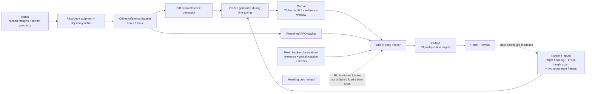

# Learning Whole-Body Humanoid Locomotion via Motion Generation and Motion Tracking

| Field | Value |
| --- | --- |
| Primary source | [arXiv:2604.17335v2](https://arxiv.org/html/2604.17335v2), 12 July 2026; [source archive](https://arxiv.org/e-print/2604.17335v2) SHA-256 `4c031fe7d58c41357d3c23b18e8576a5989a25c540d85149c4a89e38c06513a0` |
| Supplement | [Official project page](https://wholebodylocomotion.github.io/) and [poster](https://wholebodylocomotion.github.io/static/pdfs/poster.pdf) |
| Public artifact | Project-page repository at commit [`0516ff4`](https://github.com/wholebodylocomotion/wholebodylocomotion.github.io/tree/0516ff422de21448ad74b430968ec3bb98e4d35e); no controller or training code linked |
| Harness relevance | Reference composition; task reward; evaluation; fixed-trainer boundary |
| Evidence tier | Core |

## Main point

With the same fine-tuned tracker at evaluation, replacing fixed references with terrain- and heading-conditioned online references raised mean simulated success from `0.859/0.805/0.845` to `0.987/0.990/0.997` for box climbing, vaulting, and stair ascent, respectively; the paper's separate closed-loop tracker fine-tuning is effective but falls outside Sam's fixed-trainer intervention.

## Mechanism

## Exact parameters

| Parameter | Value | Context | Source locator |
| --- | ---: | --- | --- |
| Initial / augmented motion data | `~5 min / ~1 h` | Retargeted skills, then terrain augmentation and policy-based physical refinement | Sec. III-A |
| Initial skill geometry | box up/down `50 cm`; hurdle `35 cm`; stair step `~20 cm` | One representative clip per terrain skill, plus omnidirectional walking | Sec. III-A |
| Augmented reference ranges | boxes `35-75 cm`; hurdles `25-45 cm`; stair steps `15-20 cm` | Offline pre-training dataset | Sec. III-A.2 |
| Tracker optimization | PPO in IsaacLab; `1 x RTX 4090` | One whole-body tracker | Sec. III-B.1 |
| Tracker reference fields | base linear/angular velocity `R^3` each; joint position/velocity `R^23` each; `9 x 3` key-body positions | Reference state | Sec. III-B.1 |
| Tracker proprioceptive history | `5` frames | Base angular velocity, projected gravity, joints, previous `23-D` action | Sec. III-B.1 |
| Terrain scan / action | `17 x 11 / 23-D` | Height samples / target joint positions | Sec. III-B.1 |
| Generator horizon | `0.5 s`, `25` frames | Future root, joint, and body-link features | Sec. III-B.2 |
| Generator output fields | root position `R^3`; orientation `R^4`; joints `R^23`; links `R^(23x3)` | Each generated reference sequence | Sec. III-B.2 |
| Generator conditions | target heading; terrain scan; past `2` motion frames | Training; closed loop uses the past two robot-state frames | Secs. III-B.2, III-C |
| Denoising steps | `2` | Fine-tuning and deployment latency setting | Sec. III-C |
| Fine-tuning terrain ranges | stairs `15-25 cm`; hurdles `25-55 cm`; boxes/pyramid steps `30-85 cm` | Also varies widths, yaw, pitch, and target heading | Sec. III-C |
| Heading task reward | `1.5 <v_b^b,d_b> / ||v_b^b||` | Added to fixed imitation and regularization groups during fine-tuning | Table I |
| Generator cadence | fine-tuning `2 Hz`; deployment update every `0.25 s` (`4 Hz`) | `0.5 s` receding horizon | Sec. III-D |
| Generator inference | `~0.02 s` | TensorRT on onboard Jetson Thor | Sec. III-D |
| Evaluation population | `500` robots per task/setting | Randomized initial poses and joint positions | Sec. IV-B; Fig. 4 |
| Mean success, fixed reference | box `0.859 +/- 0.252`; vault `0.805 +/- 0.231`; stair `0.845 +/- 0.300` | Same fine-tuned tracker, static task reference | Table III |
| Mean success, online generator | box `0.987 +/- 0.014`; vault `0.990 +/- 0.026`; stair `0.997 +/- 0.005` | Terrain- and direction-conditioned references | Table III |

## What transfers to Sam's harness

- Candidate oracle contract: `g(target_heading, terrain_scan, recent_robot_state) -> finite reference window`; re-query it on a pinned receding-horizon clock.
- Admit references only after retargeting, root-frame checks, contact/terrain alignment, and dynamics evidence. The authors explicitly filter raw retargeted and kinematically augmented trajectories through a tracking policy before reuse.
- Run a reference-only ablation with one immutable tracker: fixed clip versus online/composed reference on the same obstacle grid, initial-state distribution, budget, and objective success metric.
- Treat generated-reference distribution shift as a preflight axis: discontinuity, penetration, foot slide, timing mismatch, and tracker residual should be logged independently of reward.
- Candidate task-reward term: heading alignment. The executable version must define target-vector normalization and zero-speed behavior before admission.

## What does not transfer

- Closed-loop RL fine-tuning changes the tracker. It is evidence for generator-tracker co-adaptation, not an oracle-only gain under Sam's fixed trainer.
- Adding the `17 x 11` terrain scan, two-frame state history, or a new reference schema changes observations/interfaces if the frozen controller does not already consume them.
- The diffusion generator is a learned continuous reference policy, not an OGMP linear phase-window automaton and not evidence that RL-Sculptor implements learned or branching oracle behavior.
- The paper does not establish that raw generated kinematics are dynamically feasible; its tracker is the physical filter.
- Hardware videos show capability examples, not a measured deployment success rate.

## Failure modes and caveats

- Generated references can contain foot sliding, temporal discontinuities, and other artifacts; pairing them directly with a tracker trained on smooth offline references can fail.
- Fixed references become brittle when terrain changes require different timing or motion style, despite limited local tolerance from the terrain-aware tracker.
- LiDAR elevation-map degradation from sensing noise can substantially reduce locomotion performance.
- Table III isolates reference source only after the tracker has already been fine-tuned with the generator; it does not show plug-in compatibility with an arbitrary frozen foundation tracker.
- The heading reward divides by `||v_b^b||`; v2 states no epsilon or zero-speed convention.
- The paper does not report the goal-radius success threshold, training seeds, confidence intervals, PPO hyperparameters, generator architecture widths, or noise magnitudes.
- The official repository exposes the project page, poster, and media only; no implementation was available to verify executable details at commit `0516ff4`.

## Evidence ledger

| ID | Claim | Source locator |
| --- | --- | --- |
| E1 | v2 metadata, authors, date, accepted-manuscript status, and exact source archive. | [arXiv v2](https://arxiv.org/abs/2604.17335v2); [e-print](https://arxiv.org/e-print/2604.17335v2) |
| E2 | The three stages are data curation, independent pre-training, and tracker fine-tuning with a frozen generator. | [Sec. III; Fig. 2](https://arxiv.org/html/2604.17335v2#S3) |
| E3 | Dataset sources, physical refinement, augmentation process, durations, and terrain ranges. | [Sec. III-A](https://arxiv.org/html/2604.17335v2#S3.SS1) |
| E4 | PPO tracker observations, history, height scan, actions, and single-GPU setup. | [Sec. III-B.1](https://arxiv.org/html/2604.17335v2#S3.SS2.SSS1) |
| E5 | Diffusion output schema, horizon, conditioning, training losses, and input perturbation. | [Sec. III-B.2](https://arxiv.org/html/2604.17335v2#S3.SS2.SSS2) |
| E6 | Closed-loop state feedback, two denoising steps, frozen-generator tracker fine-tuning, task reward, and terrain randomization. | [Sec. III-C](https://arxiv.org/html/2604.17335v2#S3.SS3) |
| E7 | Exact imitation, regularization, and heading task-reward equations. | [Table I](https://arxiv.org/html/2604.17335v2#S3.T1) |
| E8 | Onboard sensing/compute, TensorRT latency, prediction horizon, and deployment update cadence. | [Sec. III-D](https://arxiv.org/html/2604.17335v2#S3.SS4) |
| E9 | Fixed-reference versus online-generator success rates, task geometries, metric definitions, and 500-robot evaluation. | [Table III; Sec. IV-B.1](https://arxiv.org/html/2604.17335v2#S4.T3) |
| E10 | Five-task comparison reports consistent gains from tracker fine-tuning and attributes them to generated-reference distribution mismatch. | [Fig. 4; Sec. IV-B.2](https://arxiv.org/html/2604.17335v2#S4.SS2.SSS2) |
| E11 | Hardware demonstrations include boxes, stairs, hurdles, mixed terrains, transitions, and qualitative local navigation. | [Sec. IV-A](https://arxiv.org/html/2604.17335v2#S4.SS1) |
| E12 | The stated limitation is dependence on LiDAR elevation mapping; sensing noise can substantially degrade performance. | [Sec. V](https://arxiv.org/html/2604.17335v2#S5) |
| E13 | The official poster summarizes the closed-loop frozen-generator design and tabulated headline results. | [Official poster](https://wholebodylocomotion.github.io/static/pdfs/poster.pdf) |
| E14 | The official project repository at the pinned commit contains the page, poster, and media, but no controller or training implementation. | [Project-page repository at `0516ff4`](https://github.com/wholebodylocomotion/wholebodylocomotion.github.io/tree/0516ff422de21448ad74b430968ec3bb98e4d35e) |
