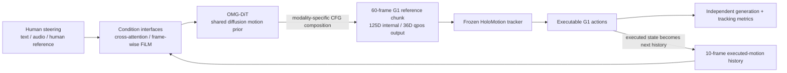

# OMG: Omni-Modal Motion Generation for Generalist Humanoid Control

| Field | Value |
| --- | --- |
| Primary source | [arXiv:2606.10340v1](https://arxiv.org/html/2606.10340v1), submitted 2026-06-09; [DOI 10.48550/arXiv.2606.10340](https://doi.org/10.48550/arXiv.2606.10340) |
| Official artifacts checked | [Project](https://tsinghua-mars-lab.github.io/OMG/); [code snapshot](https://github.com/Tsinghua-MARS-Lab/OMG/tree/1f2aebd58532631c48b9a09a1580d2bf2c5afd14); [model snapshot](https://huggingface.co/THU-MARS/OMG/tree/06a88419da9f9125d0b5480cc10966741a189358); [dataset snapshot](https://huggingface.co/datasets/THU-MARS/OMG-Data/tree/6e0dfbc1c5298bff14d4e2b1459ad678af0a38e7) |
| Harness relevance | Reference composition; human steering; evaluation; fixed trainer |
| Evidence tier | Core |

## Main point

OMG shows that an upstream diffusion planner can compose text, audio, and human-reference guidance into two-second Unitree G1 reference chunks while a pretrained HoloMotion tracker remains downstream; it does **not** optimize Sam's oracle or task reward from evaluation feedback.

## Mechanism

## Reference and steering contract

| Boundary | Paper-defined value | Consequence for Sam's frozen-trainer harness |
| --- | --- | --- |
| Planner input | 10 executed-motion frames plus any available text, audio, or 22-joint human reference | Steering belongs upstream of the tracker. Preserve availability masks and modality timing. |
| Planner output | 60 future frames at 30 FPS; 125D canonical G1 features decoded to 36D G1 qpos | An admitted oracle must preserve embodiment, root frame, feature statistics, cadence, horizon, and qpos order. |
| Global conditions | History and frozen T5-Base text tokens enter every DiT block through cross-attention | Text is a generator condition, not an RL reward or low-level policy input. |
| Frame-aligned conditions | 35D audio and 66D human-reference features enter through per-layer FiLM | Compositions require frame alignment and per-frame masks; concatenating raw clips is insufficient. |
| Composition | Null prediction plus weighted text, audio, and human-reference guidance directions | Guidance weights are explicit steering parameters that can be exposed as oracle parameters. |
| Low-level execution | Pre-existing HoloMotion tracker consumes generated references | Freeze the exact tracker artifact and runtime when evaluating planner/reference changes. |
| Feedback path | Executed motion history conditions the next plan; the paper does not use downstream metric feedback to redesign the generator | This is receding-horizon state feedback, not Sam's evaluation-to-design harness loop. |

## Exact parameters

| Parameter | Value | Context | Source locator |
| --- | ---: | --- | --- |
| Processed pretraining corpus | 1,174.66 h; 364.5K clips | OMG-Data after retargeting, annotation, and filtering | Appendix, “Dataset Composition,” table |
| Motion cadence | 30 FPS | Training, generation, and default evaluation | Appendix, “Motion Representation and Canonicalization” |
| History / prediction horizon | 10 / 60 frames | 0.33 s history; 2 s future | Appendix, “Motion Representation and Canonicalization” |
| Internal motion vector | 125D = 3 root position + 6 root rotation + 29 joint DOF + 29×3 link positions | Canonical, root-centric G1 representation | Appendix, “Motion Representation” |
| External G1 artifact | 36D = 3 root position + 4 root quaternion + 29 joint DOF | Common benchmark output | Appendix, “Evaluated Tasks and Motion Format” |
| Language encoder | Frozen T5-Base; maximum length 50; 768D output | Global cross-attention tokens | Appendix, “Language”; official config |
| Text modality dropout | 0.3 | Enables null/conditional branches | Appendix, “Language” |
| Audio condition | 35D; 32 FFT bands + RMS + ZCR + flux/centroid; dropout 0.1 | Frame-wise FiLM at 30 Hz | Appendix, “Audio” |
| Human-reference condition | 66D = 22 joints × 3D; dropout 0.5 | Frame-wise FiLM | Appendix, “Human Reference Motion” |
| DDIM sampling | 50 steps; η = 0 | Cosine schedule, x-prediction | Appendix, “Denoising Objective and Sampling” |
| Default single-condition CFG | 2.5 | Global guidance scale | Appendix, “Classifier-Free Guidance and Composition” |
| Composed text / audio CFG | 3.0 / 1.5 | Zero-shot text-plus-audio composition | Same |
| Human-reference CFG | 2.0 | Default human-reference guidance | Same |
| DiT-B | 50M; width 512; 10 layers; 8 heads | Smallest reported backbone | Appendix model-scale table |
| DiT-L | 300M; width 1,152; 14 layers; 18 heads | Default evaluation backbone unless specified | Same; pretraining table |
| DiT-XL | 500M; width 1,536; 13 layers; 24 heads | Largest reported backbone | Same |
| Pretraining | AdamW; LR 6×10⁻⁵; batch 1,024; max 100K steps; bf16 | 8 A800 GPUs; reported under 10 h | Appendix pretraining table |
| Accelerated planner latency | 51.7 ± 1.5 ms | DiT-B, 60-frame text chunk, A800, TensorRT FP16 + DiT cache; five steady-state runs | Appendix runtime table |
| Human-reference result | 18.84 mm MPJPE; 47.83 mm g-MPJPE; 0.39% fall | DiT-XL target generation / tracker-executed failure benchmark | Human-reference benchmark table |
| Paper 300M checkpoint | step 55,000; SHA-256 `df4ce9aeced84fd96a39583c7f6e2c5773b76f942cb43012c6c51dd9eb806806` | Official paper checkpoint at model revision `06a88419…` | Official `SHA256SUMS` |

## What transfers to Sam's harness

- Treat OMG-DiT as a **candidate oracle/reference generator**, not as the trainer.
- Freeze one execution bundle: G1 embodiment, HoloMotion checkpoint, observation/action order, planner statistics, cadence, tracker rate, and simulator/runtime version.
- Make composition explicit: condition set, availability masks, temporal alignment, CFG branch weights, random seed, and generated reference bytes.
- Expose text/audio/human-reference conditions as human-steerable oracle parameters. Record them separately from task-reward text.
- Replan from observed execution history if testing closed-loop reference generation. Distinguish this state feedback from the outer metrics-to-design loop.
- Use both target-motion and tracker-executed metrics. A reference can match the command yet still fall, violate joint limits, or track poorly.
- Preserve root-frame semantics through crops and compositions; OMG canonicalizes to the last history frame's root position and yaw.
- Reuse the paper's CFG sweep as a concrete design lesson: stronger guidance improves one alignment metric only up to a point and can worsen global error.

## What does not transfer

- No task-reward synthesis, reward search, or reward ablation is evaluated.
- No outer-loop agent uses metrics to revise reference composition or reward code.
- OMG changes and trains the upstream generator; it is not evidence that every candidate can be evaluated under a fully fixed training pipeline without retraining.
- The paper focuses on Unitree G1 and HoloMotion. It does not establish embodiment-, controller-, or MDP-independent transfer.
- Zero-shot text-plus-audio composition is demonstrated qualitatively; the paper gives no quantitative composition benchmark.
- “Physically executable” does not certify arbitrary generated references. The paper reports falls and joint-limit violations, and its data filter is threshold-based simulation screening.

## Failure modes and caveats

- Training data mainly cover flat ground; uneven and in-the-wild terrain remain open.
- The generator is not jointly adapted with the tracker, and execution feedback is not incorporated into generation beyond observed history; the authors name both as future work.
- Human-reference CFG shows a tradeoff: scale 1.5 gives 218.9 mm g-MPJPE, while scale 2.0 lowers root-relative MPJPE to 71.0 mm but worsens g-MPJPE to 343.9 mm.
- Baselines with non-G1 outputs are converted or retargeted to G1 before evaluation; results include conversion-pipeline effects.
- The public artifact documentation is inconsistent at the inspected revisions: the GitHub README links `checkpoints/300m/...`, while the model tree and checksum manifest place the paper checkpoint at `checkpoints/paper/300m/...`.
- The paper's reported real-time deployment uses an off-board RTX 4090 and an onboard NVIDIA Orin; it is not evidence for the same latency on Apple Silicon.

## Evidence ledger

| ID | Claim | Source locator |
| --- | --- | --- |
| E01 | Metadata, DOI, and v1-only submission history | [arXiv record](https://arxiv.org/abs/2606.10340), lines 8–27 |
| E02 | Generator–tracker factorization and fixed HoloMotion downstream tracker | [Paper v1](https://arxiv.org/html/2606.10340v1), §3.1 |
| E03 | 125D root-centric representation and diffusion objective | [Paper v1](https://arxiv.org/html/2606.10340v1), §3.2; appendix “Motion Representation and Canonicalization” |
| E04 | Cross-attention, FiLM, modality dimensions, masks, and dropout probabilities | [Paper v1](https://arxiv.org/html/2606.10340v1), §3.3; appendix “Omni-Modal Condition Encoders” |
| E05 | Modality-specific CFG equation and default scales | [Paper v1](https://arxiv.org/html/2606.10340v1), appendix “Classifier-Free Guidance and Composition” |
| E06 | Data composition and simulation-in-the-loop filter | [Paper v1](https://arxiv.org/html/2606.10340v1), §2; appendix “Details on OMG-Data” |
| E07 | Generation and tracker-executed metrics, splits, and sample counts | [Paper v1](https://arxiv.org/html/2606.10340v1), §4.1; appendix “Evaluation Protocols” |
| E08 | Human-reference benchmark values | [Paper v1](https://arxiv.org/html/2606.10340v1), “Human-reference-conditioned motion benchmark” table |
| E09 | Text benchmark values and scaling comparison | [Paper v1](https://arxiv.org/html/2606.10340v1), “Text-conditioned motion benchmark” table |
| E10 | Audio benchmark values | [Paper v1](https://arxiv.org/html/2606.10340v1), “Audio-conditioned motion benchmark” table |
| E11 | Few-shot text and Pico adaptation results | [Paper v1](https://arxiv.org/html/2606.10340v1), §4.3 and paired finetuning tables |
| E12 | Zero-shot text-plus-audio claim is supported with qualitative examples, not a numeric table | [Paper v1](https://arxiv.org/html/2606.10340v1), §4.4 and qualitative appendix |
| E13 | Flat-ground, tracker adaptation, and execution-feedback limitations | [Paper v1](https://arxiv.org/html/2606.10340v1), “Limitations” |
| E14 | Human-reference CFG sweep and non-monotonic global error | [Paper v1](https://arxiv.org/html/2606.10340v1), appendix “Analysis on Classifier-Free Guidance,” table |
| E15 | Real-time acceleration stack and latency | [Paper v1](https://arxiv.org/html/2606.10340v1), appendix “Runtime Acceleration Analysis” |
| E16 | Perceptive-locomotion adaptation protocol and result | [Paper v1](https://arxiv.org/html/2606.10340v1), appendix “Perceptive Locomotion” |
| E17 | Public pipeline modes and temporal condition-sequence syntax | [Official code, commit `1f2aebd`](https://github.com/Tsinghua-MARS-Lab/OMG/blob/1f2aebd58532631c48b9a09a1580d2bf2c5afd14/docs/generation.md) |
| E18 | Released condition and diffusion configuration | [Motion-generator config](https://github.com/Tsinghua-MARS-Lab/OMG/blob/1f2aebd58532631c48b9a09a1580d2bf2c5afd14/configs/generation/model/motion_generator.yaml); [diffusion config](https://github.com/Tsinghua-MARS-Lab/OMG/blob/1f2aebd58532631c48b9a09a1580d2bf2c5afd14/configs/generation/diffusion/guided_x0.yaml) |
| E19 | Paper-checkpoint paths and SHA-256 values at model revision `06a88419…` | [Official checksum manifest](https://huggingface.co/THU-MARS/OMG/blob/06a88419da9f9125d0b5480cc10966741a189358/SHA256SUMS) |
| E20 | OMG-Data public snapshot is pinned at revision `6e0dfbc1…` | [Official dataset snapshot](https://huggingface.co/datasets/THU-MARS/OMG-Data/tree/6e0dfbc1c5298bff14d4e2b1459ad678af0a38e7) |
| E21 | README checkpoint links omit the `paper/` directory present in the model snapshot | [Official README, commit `1f2aebd`](https://github.com/Tsinghua-MARS-Lab/OMG/blob/1f2aebd58532631c48b9a09a1580d2bf2c5afd14/README.md#L69-L79); [model snapshot](https://huggingface.co/THU-MARS/OMG/tree/06a88419da9f9125d0b5480cc10966741a189358/checkpoints/paper) |
| E22 | The real bridge builds planner history from live G1 lowstate and sends planned futures to the onboard tracker | [Official real-time deployment guide, commit `1f2aebd`](https://github.com/Tsinghua-MARS-Lab/OMG/blob/1f2aebd58532631c48b9a09a1580d2bf2c5afd14/docs/realtime_g1.md#L5-L18) |
