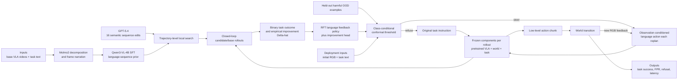

# Learning What to Say to Your VLA: Mostly Harmless Vision Language Action Model Steering

| Field | Value |
| --- | --- |
| Primary source | [arXiv:2606.12299v1](https://arxiv.org/html/2606.12299v1), submitted 10 June 2026; [DOI 10.48550/arXiv.2606.12299](https://doi.org/10.48550/arXiv.2606.12299) |
| Exact-version pin | [Versioned PDF](https://arxiv.org/pdf/2606.12299v1), SHA-256 `fa4dd25e486992ec12456d89120256bca93f2401eea37af0b397b6e5077f402e`; [TeX source](https://export.arxiv.org/e-print/2606.12299v1), SHA-256 `4c83b87ed733f214e15fb0bb7fd0824fa2e4fcd4032cb096732944484827ed0e` |
| Official public artifact | [Project-page snapshot `ade2637`](https://github.com/hyunjjoe/hyunjjoe.github.io/tree/ade26372286f790bf5a4a6eb19d6b2652f46dadd/LanguagePolicy), committed 11 June 2026; its Code control is a disabled “coming soon” placeholder, so no paper implementation is pinned |
| Harness relevance | Human steering; evaluation; frozen-controller boundary. No executable reference oracle and no task-reward synthesis |
| Evidence tier | Supporting |

## Main point

With the base VLA frozen, the paper reports that conformal refusal raises pooled simulation success from `70.93%` for always-on steering to `75.96%` and cuts harmful-steering FPR from `38.92%` to `9.31%`; this supports a fallback-gated language wrapper, not either of Sam's two authorable artifacts.

## Mechanism

## Harness boundary

| Layer | Paper artifact | Classification for Sam |
| --- | --- | --- |
| Reference composition / oracle | No motion reference, phase clock, automaton, guard, transition, or recovery-reference output; the LFP emits language strings | Not an `oracle_k` candidate |
| Executable task reward | A fixed trajectory-level `r(xi; task) in {0,1}` scores search and evaluation; no executable reward implementation, reward terms, or reward revision is supplied | Not a `task_reward_k` mechanism |
| Controller and trainer | The pretrained `pi_0.5` VLA is frozen, but Qwen LoRA adapters and an improvement MLP are newly trained | A third learned wrapper; outside the two-knob frozen experiment unless declared as a new experiment family |
| Human steering | Natural language is the high-level action interface, but training feedback comes from VLM/LLM proposals and task outcomes, not an evaluated human-to-oracle/reward translation loop | Supporting interface evidence only |
| Evaluation | Candidate-versus-base improvement, task success, harmful-steering FPR, refusal, OOD splits, and latency | Directly useful evaluation pattern |

## Exact parameters

| Parameter | Value | Context | Source locator |
| --- | ---: | --- | --- |
| Base controllers | `pi_0.5-LIBERO`; `pi_0.5-DROID` | Simulation and zero-shot Franka hardware respectively; frozen during language steering | Sec. 5.1 |
| LFP backbone | Qwen3-VL-4B-Instruct | Greedy decoding; LoRA fine-tuning | Sec. 5.1 |
| Narration teacher / corpus | Molmo2-8B; `50` base-VLA videos per task | Task decomposition, then per-frame narration | Sec. 5.1; App. 7.1 |
| Local-search teacher | GPT-5.4, high reasoning; `16` sequence perturbations | Whole-sequence verb, noun, and mixed paraphrases | App. 7.1 |
| Simulation search rollouts | `25` per sequence, retain top `8`, then `75` more | Independent steered/base initializations from the same distribution | App. 7.1 |
| Hardware search rollouts | `10` per sequence, retain top `8`, then `20` more | Same improvement estimator | App. 7.1 |
| RFT demonstrations | `50` successful on-policy demonstrations per task | Selected language sequence | App. 7.1 |
| Calibration samples | `20` per perturbation combination | Simulation and hardware; held-out negative-improvement examples | App. 7.1 |
| Main conformal target | `alpha = 0.10` | Harmful-class false-positive target | Sec. 5.3 |
| Finite-sample threshold | `k = ceil((m+1)(1-alpha))`; `q = s^0_(k)`; `q = +infinity` if `k > m` | `m` harmful calibration examples; steer when score is at least `q` | App. 7.2, Eq. 8 |
| Deployment cadence | every `5` LIBERO steps; every `8` DROID steps | Query LFP at every VLA replan | App. 7.1 |
| SFT LoRA | rank `64`; alpha `128`; dropout `0` | Targets `q,k,v,o,gate,up,down_proj` | App. Table 3 |
| SFT optimization | AdamW; LR `1e-5`; WD `0.01`; batch `1`; `1` epoch; bf16 | No gradient accumulation | App. Table 3 |
| RFT optimization | AdamW; LR `1e-5`; WD `0`; batch `1`; `1` epoch; bf16 | Initialized from SFT LoRA; frozen base model | App. Table 4 |
| Improvement head | final hidden state -> MLP `d -> 64 -> 1`; ReLU; dropout `0.1` | Per-dimension z-score features; frozen RFT backbone | App. Table 5 |
| Head optimization | Adam; LR `1e-3`; WD `1e-3`; MSE; up to `200` epochs; `20%` validation | Early stopping | App. Table 5 |
| Simulation evaluation | `10` tasks x `4` visual conditions x `5` semantic conditions = `200` combinations; `50` rollouts each | `10,000` pooled episodes; binary success with standard error | Secs. 5.1-5.3 |
| Hardware evaluation | `30` trials per task-condition | Four training tasks, visual/semantic perturbations, and two novel tasks | Secs. 5.1-5.2 |
| Refusal success | always steer `70.93%`; zero-threshold refusal `74.96%`; conformal `75.96%` | `10,000` pooled simulation rollouts | Sec. 5.3, Fig. 6 |
| Harmful-steering FPR | simulation `38.92% -> 9.31%`; hardware `61.11% -> 2.22%` | Zero-threshold RFT to conformal policy at `alpha=0.10` | Sec. 5.3, Table 1 |
| Search ablation SR | static open-loop `71.3 +/- 0.5`; phrase-level closed-loop `70.4 +/- 0.5`; trajectory-level closed-loop `75.0 +/- 0.4` | Simulation, pooled perturbation combinations | Sec. 5.4, Table 2 |
| Composite latency | base `68 ms` / `14.7 Hz`; LFP `204 ms`; composite `274 ms` / `3.6 Hz` | `50` replans, single NVIDIA A6000 Ada; `5` environment steps at `20 Hz` per replan | App. Table 13 |

## What transfers to Sam's harness

- Borrow the **refusal pattern**, not the LFP artifact: compare a candidate with the exact baseline, predict benefit, and fall back when support is weak.
- Treat harmful-intervention FPR, true-negative rate, refusal rate, and task success as separate evaluation outputs. Success alone hides how often a candidate damages a previously successful baseline.
- Define improvement against the same initial-state/task distribution and preserve candidate/base provenance. The paper estimates both terms with closed-loop rollouts.
- If a refusal gate is studied for `oracle_k` or `task_reward_k`, bind its calibration distribution, threshold, fallback artifact, and exchangeability claim to the run manifest.
- Record intervention cadence. Closed-loop language at every replan produced recovery that a single static prompt did not.
- Keep objective task success independent from any generated training reward. This paper's binary outcome is an external search/evaluation signal, not a learned dense reward.

## What does not transfer

- Language strings are neither immutable reference trajectories nor executable reference-oracle state machines.
- The paper does not generate, revise, or expose executable task-reward code. It leaves the binary success monitor and hardware adjudication procedure unspecified.
- Freezing the base VLA is weaker than Sam's complete frozen-trainer contract: the method trains a new LFP and improvement head and changes inference latency/cadence.
- The direct VLA-fine-tuning baseline changes the controller and is not an allowed Sam-harness comparison arm.
- The conformal result is not a global safety guarantee. It controls harmful-class FPR only under calibration/deployment exchangeability and with labels derived from empirical improvement.
- The paper does not show an outer loop that uses independent metrics to revise either `oracle_k` or `task_reward_k`.

## Failure modes and caveats

- A VLA may ignore language or lack the required low-level skill; steering can then be ineffective or harmful.
- Uncalibrated RFT loses `1.3` percentage points to the base VLA in Visual-Scene and drops Microwave semantic success from `66.7%` to `46.7%`; conformal refusal recovers those reported cases.
- Calibration labels use Monte Carlo `Delta-hat`, not exact expected improvement. The guarantee is conditional on those empirical labels and exchangeability with deployment.
- Local paraphrase search covers only a small neighborhood of one narrated sequence; the authors identify the large language space as unresolved.
- Seven of 13 novel Compose tasks (`16-22`) have `0%` success for every method. On task `15`, RFT reaches `30%` versus `40%` for the base VLA and `46%` for direct fine-tuning.
- The “one-fifth” data claim counts `10` versus `50` successful on-policy fine-tuning rollouts; it does not count the LFP's `50` narrated videos per task, teacher-model calls, or interactive-search rollouts.
- Closed-loop recovery is demonstrated qualitatively with one adversarial cube replacement; no repeated recovery rate is reported.
- The language wrapper adds `206 ms` per replan in the reported stack and reduces replanning from `14.7` to `3.6 Hz`.
- The official page still marks code “coming soon”; no implementation, checkpoint, dependency lock, simulator version, reward monitor, or exact API snapshot can be matched to the reported runs.

## Evidence ledger

| ID | Claim | Source locator |
| --- | --- | --- |
| E01 | Exact title, authors, DOI, v1 timestamp, and sole public revision | [arXiv record](https://arxiv.org/abs/2606.12299v1) |
| E02 | Language-as-action MDP, frozen VLA composition, receding-horizon execution, and binary trajectory reward | [Paper v1, Sec. 3 and Eq. 1](https://arxiv.org/html/2606.12299v1#S3) |
| E03 | Candidate improvement is expected steered reward minus expected base-instruction reward | [Paper v1, Sec. 4 and Eq. 2](https://arxiv.org/html/2606.12299v1#S4) |
| E04 | Narrated videos create the task-relevant proposal distribution and SFT policy | [Paper v1, Sec. 4.1](https://arxiv.org/html/2606.12299v1#S4.SS1) |
| E05 | Whole-sequence semantic perturbation, Monte Carlo selection, and rejection fine-tuning | [Paper v1, Sec. 4.1, Eqs. 4-5](https://arxiv.org/html/2606.12299v1#S4.SS1) |
| E06 | Initial-observation improvement regression and zero-threshold fallback | [Paper v1, Sec. 4.1, Eq. 6](https://arxiv.org/html/2606.12299v1#S4.SS1) |
| E07 | Harmful-class conformal quantile, exchangeability assumption, infinity convention, and FPR bound | [Paper v1, App. 7.2, Eqs. 8-9](https://arxiv.org/html/2606.12299v1#S7.SS2) |
| E08 | Frozen `pi_0.5` variants, Qwen LFP, Molmo narration, 50 videos, 16 candidates, and evaluation environments | [Paper v1, Sec. 5.1](https://arxiv.org/html/2606.12299v1#S5.SS1) |
| E09 | Exact search rollout counts, RFT demonstrations, calibration count, teacher mode, hardware, and replan cadence | [Paper v1, App. 7.1](https://arxiv.org/html/2606.12299v1#S7.SS1) |
| E10 | SFT, RFT, and improvement-head architectures and optimization settings | [Paper v1, Tables 3-5](https://arxiv.org/html/2606.12299v1#S7.T3) |
| E11 | Binary-success protocol, 200 simulation combinations, 50 rollouts per combination, 30 hardware trials, and data-scaling comparison | [Paper v1, Sec. 5.2](https://arxiv.org/html/2606.12299v1#S5.SS2) |
| E12 | Refusal variants, 10,000-rollout success values, alpha sweep, confusion metrics, and exact FPR results | [Paper v1, Sec. 5.3 and Table 1](https://arxiv.org/html/2606.12299v1#S5.SS3) |
| E13 | Static-open-loop, phrase-level, and trajectory-level closed-loop search ablation | [Paper v1, Sec. 5.4 and Table 2](https://arxiv.org/html/2606.12299v1#S5.SS4) |
| E14 | Authors' limits on language control authority and local paraphrase search | [Paper v1, Sec. 6](https://arxiv.org/html/2606.12299v1#S6) |
| E15 | Per-condition simulation successes, including the Visual-Scene harm and calibrated recovery | [Paper v1, Table 10](https://arxiv.org/html/2606.12299v1#S7.T10) |
| E16 | Novel-composition task failures and seven all-zero tasks | [Paper v1, Table 11](https://arxiv.org/html/2606.12299v1#S7.T11) |
| E17 | Per-task hardware results, including Microwave semantic degradation and calibrated recovery | [Paper v1, Table 12](https://arxiv.org/html/2606.12299v1#S7.T12) |
| E18 | Base/LFP/composite latency over 50 replanning steps | [Paper v1, Table 13](https://arxiv.org/html/2606.12299v1#S7.T13) |
| E19 | Qualitative mid-task perturbation and closed-loop corrective utterance | [Paper v1, Fig. 7 and Sec. 5.4](https://arxiv.org/html/2606.12299v1#S5.F7) |
| E20 | Exact reviewed PDF bytes | [Versioned PDF](https://arxiv.org/pdf/2606.12299v1) |
| E21 | Exact reviewed TeX-source bytes | [Versioned source archive](https://export.arxiv.org/e-print/2606.12299v1) |
| E22 | Official project snapshot is under review and exposes a disabled “Code (coming soon)” control | [Project source at `ade2637`, lines 209-227](https://github.com/hyunjjoe/hyunjjoe.github.io/blob/ade26372286f790bf5a4a6eb19d6b2652f46dadd/LanguagePolicy/index.html#L209-L227) |
| E23 | The paper defines and reports binary task success but supplies no executable success/reward monitor or hardware adjudication protocol | [Paper v1, Sec. 3 and Sec. 5.2](https://arxiv.org/html/2606.12299v1#S3) |
