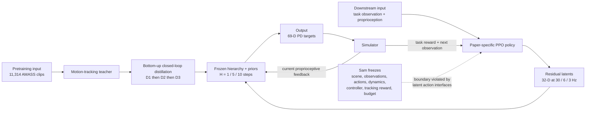

# MotionPyramid: Hierarchical Motion Representation and Residual Interfaces

| Field | Value |
| --- | --- |
| Primary source | [arXiv:2606.20705v1](https://arxiv.org/abs/2606.20705v1), submitted 15 June 2026 |
| Exact-version pin | [Versioned PDF](https://arxiv.org/pdf/2606.20705v1), SHA-256 `acdac8bc5fe63e2abce0dc7a86e3d7cab01ddd1cb42eb10c0fb33531ef0b03dc` |
| Public implementation | No code or project repository is linked in v1; Appendix C.1 refers conditionally to “any released code” |
| Harness relevance | Fixed-trainer boundary; evaluation; reference-composition hypothesis |
| Evidence tier | Supporting |

## Main point

With downstream task reward, observations, policy architecture, optimizer, initial-state distribution, and budget held constant, MotionPyramid reports that coarse latent interfaces learn earlier and move more smoothly but lose final precision; its nested residual interface improves the paper's three task curves, but both mechanisms change the action interface and decision process, so they are not evidence that Sam's reference oracle or task reward improves a fixed trainer.

## Mechanism

## Exact parameters

| Parameter | Value | Context | Source locator |
| --- | ---: | --- | --- |
| Motor-command dimension | `69` | Raw joint/PD target interface | Sec. 2, opening |
| Pyramid horizons | `H1=1`, `H2=5`, `H3=10` | One coarse decision recursively covers the listed simulator steps | Sec. 2; App. A.2 |
| Interface decision rates | `30`, `6`, `3 Hz` | Decimated control rate; not physics integration rate | Sec. 2 |
| Latent dimension | `32` at all three levels | Fixed, Mixture, and Residual Interfaces | Sec. 2.5; Tables 4–5 |
| Motion-pretraining split | `11,314` clips | AMASS-Train tracking supervision | Sec. 3.1 |
| AMASS-Train success | raw `94.3%`; z1 `96.1%`; z2 `92.0%`; z3 `81.0%` | Frozen-interface tracking comparison | Table 2 |
| AMASS-Train smoothness cost | raw `675.3`; z1 `499.4`; z2 `350.1`; z3 `229.2` | `J_norm`, lower is smoother | Table 2 |
| AMASS-Train global MPJPE | raw `58.4`; z1 `68.6`; z2 `90.5`; z3 `181.0 mm` | Lower is better | Table 2 |
| Prior-sampling protocol | `256` rollouts × `10 s` per level | Environment height termination disabled | Table 3 |
| Low-root proxy threshold | `<0.15 m` | Counts: z1 `158/256`; z2 `13/256`; z3 `2/256` | Table 3 |
| PPO core settings | gamma `0.99`; GAE lambda `0.95`; clip `0.2`; gradient clip `50` | Adam; observation clip `[-5,5]`; SiLU | Appendix B |
| Downstream update | `32` rollout steps; `6` PPO epochs | `512` parallel environments; default batch `1,024` | Appendix B; Table 6 |
| Actor / critic MLP | `(2048,1024,512)` | Separate networks for downstream RL | Appendix B |
| Learned-interface LR | actor `2e-5`; critic `2e-5` | z1, z2, z3, and Mixture policies | Table 4 |
| Mixture selector | MLP `(512,256)` over horizons `{1,5,10}` | Joint SMDP actor update | Appendix B |
| Mixture boundary cost | `0.02` after task reward `>0.85`; ramp `0.1` | Evaluation still reports unpenalized reward unless stated | Appendix B; App. A.8 |
| Decoder LR / architecture | `3e-5`; task encoder `(1536,1024,512)`; latent head `(2048,1024,512)` | D1 action head instead uses `(3096,2048,1024)` | Table 5 |
| KL schedules | z1 `0.01 -> 0.001`; z2 `0.03 -> 0.01`; z3 `0.04 -> 0.015` | VAE-style decoder distillation | Table 5 |
| Smoothness regularizer | AR(1) weight `0.005`; phi `0.99` | Decoder distillation | Appendix B |
| Downstream tasks | speed target `[0,5] m/s`, change every `100–200` steps; reach change every `50–100` steps; strike uses right-hand contact | Three simulated task families | Appendix B |
| Compute | `8 × RTX 4090 24 GB`; downstream run uses `4` GPUs | PyTorch `2.7`, CUDA `12.8`, Isaac Lab | Appendix C; Table 6 |

## What transfers to Sam's harness

- Evaluation design: keep task reward, observation space, policy architecture, optimizer, initial-state distribution, simulator, and budget fixed when comparing a reference/oracle intervention.
- Independent metrics: report success, global/local pose error, joint smoothness, low-root collapse, and task-specific precision rather than only authored reward.
- Reference hypothesis only: test a hierarchical oracle that chooses coarse, segment, or frame-scale reference edits while the existing controller-facing action interface stays unchanged.
- Preserve closed-loop execution: every temporally extended reference mode should read the current physical state at child boundaries rather than emit an open-loop action sequence.
- Treat horizon choice as a named oracle parameter and measure the speed–precision frontier at `1`, `5`, and `10` control steps before expanding the search.

## What does not transfer

- The learned latent action spaces, frozen decoders/priors, SMDP rollout storage, adaptive selector, residual heads, and multi-rate policy schedule alter the controller/action/trainer interface. They are outside Sam's two initial knobs.
- Latent interpolation and residual addition are not composition of immutable reference trajectories, an OGMP state machine, or an external oracle.
- The paper does not generate or optimize a task reward, accept human-language steering, or run a recursive harness.
- The paper's fixed-reward comparison isolates action-interface resolution, not reference composition or reward design.
- The reported compute stack is CUDA/Isaac Lab on multiple RTX 4090s; it is not evidence of Apple-MPS compatibility or single-machine reproducibility.

## Failure modes and caveats

- Coarser interfaces lower the final tracking ceiling: z3 falls to `81.0%` success and `181.0 mm` global MPJPE even while producing the lowest smoothness cost.
- Evaluation covers only speed, reach, and strike in simulation; dexterous, long-horizon, and real-robot behavior are not tested.
- Main downstream curves omit seed error bars due to compute cost; statistical variability is not quantified.
- The three horizons are manually specified. Level count, horizon length, and residual routing are not learned.
- Interpolation, transition, and composition are qualitative representation probes, not quantitative composition benchmarks.
- Figures use the latest available long-running checkpoint unless otherwise specified; no checkpoint hash is reported.
- v1 links no public code or project page, preventing implementation-to-paper revision pinning.

## Evidence ledger

| ID | Claim | Source locator |
| --- | --- | --- |
| MP-E01 | Exact title, authors, v1 date, arXiv identifier, and submission history. | [arXiv v1](https://arxiv.org/abs/2606.20705v1) |
| MP-E02 | The hierarchy maps 32-D latent decisions through horizons `1/5/10` to a 69-D command at `30/6/3 Hz`, with current-state feedback at child boundaries. | [Sec. 2 and Sec. 2.2](https://arxiv.org/html/2606.20705v1#S2) |
| MP-E03 | A tracking teacher supervises bottom-up closed-loop distillation; lower decoders are frozen before the next level is trained. | [Secs. 2.1–2.3](https://arxiv.org/html/2606.20705v1#S2.SS1) |
| MP-E04 | Downstream fixed-interface policies predict residuals around frozen prior means and optimize likelihood over the residual. | [Sec. 2.4](https://arxiv.org/html/2606.20705v1#S2.SS4) |
| MP-E05 | Mixture of Interfaces selects one of three horizons online and uses a 32-D residual action. | [Sec. 2.5, Mixture of Interfaces](https://arxiv.org/html/2606.20705v1#S2.SS5) |
| MP-E06 | Residual Interfaces refresh high/middle/low commands every `10/5/1` steps and optimize only downstream actor, critic, and residual heads. | [Sec. 2.5, Residual Interfaces](https://arxiv.org/html/2606.20705v1#S2.SS5) |
| MP-E07 | Downstream comparisons hold task reward, observations, architecture, optimizer, initial states, and training budget fixed. | [Sec. 3.2](https://arxiv.org/html/2606.20705v1#S3.SS2) |
| MP-E08 | Success, pose errors, and smoothness for raw and three fixed interfaces are reported numerically. | [Table 2](https://arxiv.org/html/2606.20705v1#S3.T2) |
| MP-E09 | Prior sampling uses 256 ten-second rollouts per level and reports path, speed, action variation, root height, and low-root counts. | [Table 3 and Sec. 3.3](https://arxiv.org/html/2606.20705v1#S3.SS3) |
| MP-E10 | Interpolation, transition, and composition are explicitly qualitative representation probes. | [Sec. 3.4 and App. A.11](https://arxiv.org/html/2606.20705v1#S3.SS4) |
| MP-E11 | The authors limit task breadth, note missing seed error bars, name manually selected horizons, and call editing results qualitative. | [Sec. 5](https://arxiv.org/html/2606.20705v1#S5) |
| MP-E12 | Exact PPO settings, downstream network sizes, fixed log standard deviations, and learning rates are tabulated. | [Appendix B, Table 4](https://arxiv.org/html/2606.20705v1#A2) |
| MP-E13 | Decoder dimensions, horizons, MLPs, KL schedules, and AR(1) regularization are tabulated. | [Appendix B, Table 5](https://arxiv.org/html/2606.20705v1#A2.T5) |
| MP-E14 | The paper uses 11,314 AMASS clips, 512 downstream environments, and the speed/reach/strike task settings. | [Sec. 3.1 and Appendix B](https://arxiv.org/html/2606.20705v1#S3.SS1) |
| MP-E15 | Temporally extended policies use SMDP reward accumulation, discounting, GAE, PPO likelihoods, and option-boundary rollout storage. | [Apps. A.5–A.10](https://arxiv.org/html/2606.20705v1#A1.SS5) |
| MP-E16 | Hardware, software, GPU allocation, rollout settings, and checkpoint practice are disclosed. | [Appendix C and Table 6](https://arxiv.org/html/2606.20705v1#A3) |
| MP-E17 | The assets section names AMASS, Isaac Lab, and PyTorch but only conditionally discusses “any released code”; no repository is linked in v1. | [Appendix C.1](https://arxiv.org/html/2606.20705v1#A3.SS1) |
