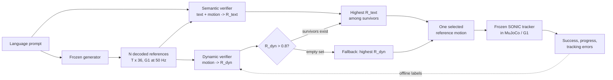

# TEXEDO: Test Time Scaling for Controller-aware Language-conditioned Humanoid Motion Generation

| Field | Value |
| --- | --- |
| Primary source | [arXiv:2606.22998v2](https://arxiv.org/html/2606.22998v2), revised 2026-06-23; current version checked 2026-08-31 |
| Official artifacts checked | [Project](https://jianuocao.github.io/TEXEDO/); [code snapshot](https://github.com/JianuoCao/TEXEDO/tree/8c5beb5e18fcf9ce24ff1df61899e731fdae225a); [checkpoints](https://huggingface.co/JianuoCao/TEXEDO-Checkpoint); [dataset](https://huggingface.co/datasets/JianuoCao/TEXEDO) |
| Harness relevance | Reference composition; evaluation; fixed trainer |
| Evidence tier | Core |

## Main point

With FSQ-GPT and the SONIC Unitree G1 tracker frozen, TEXEDO samples 32 reference trajectories, admits candidates with predicted dynamic score above 0.8, and selects the most text-aligned survivor; on its in-distribution test set this raises tracking success from 0.873 to 0.984 and VLM-Judge score from 5.722 to 6.054, but it does not revise a state-conditioned oracle or policy-training reward.

## Mechanism

## Reference-selection contract

| Boundary | Paper-defined value | Consequence for a frozen-MDP harness |
| --- | --- | --- |
| Candidate input | Decoded whole-body motion only; generator internals are not required | Put the harness boundary at a versioned, data-only reference artifact. |
| Motion ABI | Per frame: root position (3), root quaternion in wxyz order (4), 29 G1 joint positions; 50 Hz | Pin units, quaternion convention, joint order, cadence, and exact bytes before scoring or execution. |
| Controller grounding | Offline SONIC-in-MuJoCo rollouts provide success, tracking quality, and progress labels | A feasibility model is tied to the exact controller, embodiment, simulator, termination rule, and cadence that produced its labels. |
| Fast feasibility score | A four-layer temporal Transformer predicts success, tracking quality, and progress from the candidate motion | The surrogate is a screening tool; it is not a dynamics certificate for a new controller or composition. |
| Admission rule | Keep candidates with $R_{\mathrm{dyn}}(m)>0.8$ | Physical feasibility is an admission gate, not a term that semantic quality may trade away. |
| Selection objective | Maximize $R_{\mathrm{text}}(\ell,m)$ inside the admitted set | Task or language alignment is optimized only after feasibility passes. |
| Empty-set behavior | Select the largest $R_{\mathrm{dyn}}$ when no candidate passes; reported on 1.18% of test prompts | Record fallback activation explicitly; the returned motion is not thereby certified feasible. |
| Output | One finite, open-loop reference trajectory $m^*$ | This is upstream reference selection, not an online state-conditioned oracle with transitions or recovery. |
| Paper's “Oracle” baseline | Roll out all $N$ candidates in SONIC and pick the true best in the same pool | This is a privileged selection upper bound, not Sam's reference oracle $O_k$. |

## Feasibility objective

An offline rollout yields success $y_s$, normalized tracking quality $q_d$, and completed fraction $q_g$. The paper labels it with

$$
Q^*=y_s\frac{1+0.4q_d}{1.4}+(1-y_s)0.6q_gq_d.
$$

Because $0.6<1/(1+0.4)$, every **binary-label** success scores above every failure. The learned $R_{\mathrm{dyn}}$ substitutes predicted heads $(\hat p_s,\hat q_d,\hat q_g)$ into the same form; its ordering remains empirical rather than certified.

## Exact parameters

| Parameter | Value | Context | Source locator |
| --- | ---: | --- | --- |
| Robot / controller / simulator | Unitree G1 / frozen SONIC / MuJoCo | Offline labels and deployment target | §IV-A; Appendix C-A and D |
| Motion representation | 36 dimensions at 50 Hz | Root position 3, quaternion 4, joints 29 | Appendix B-A, Motion representation |
| Candidate budget | $N=1\ldots32$; main comparison $N=32$ | Test-time scaling | Fig. 3; Table 1 |
| Feasibility threshold | $\theta=0.8$ | Validation-selected admission gate | §III-C, Eq. 5 |
| Empty-set fallback frequency | 1.18% | Test prompts with no predicted-feasible candidate | §III-C |
| $Q^*$ weights | $\alpha=0.4$, $\beta=0.6$ | Success-first label and surrogate fusion | Appendix C-A, Model structure |
| Early termination | anchor-height 0.25 m; anchor-tilt 0.8; end-effector-height 0.25 m | Success and progress labels | Appendix E, Eqs. 10–12 |
| Dynamic-verifier input | 94 features; z-score then clip to $[-10,10]$ | 7 root, 29 joint position, 29 velocity, 29 acceleration | Appendix C-A, Model structure |
| Dynamic-verifier backbone | 4 causal Transformer layers; width 256; 4 heads | Motion-only feasibility surrogate | Appendix C-A, Model structure |
| Verifier loss weights | $\lambda_d=0.6$, $\lambda_g=0.8$ | Dynamics and failed-rollout progress heads | Appendix C-A, Eq. 9 |
| Held-out prompt set | 9,116 prompts | 3,265 test motions, each with 2–5 instructions | Appendix B-A, Table 4 |
| OOD prompt set | 50 BONES-SEED prompts | Unseen prompt composition | §IV-C |
| Real-robot prompt set | 30 prompts | Locomotion, gestures, and combinations | §IV-D; Appendix D |
| Candidate generation | 2.62 s for 32 | FSQ-GPT batch on one A100-SXM4 40 GB | §IV-A, Inference-time budget |
| Verifier scoring | 15.12 ms dynamic; 11.93 ms semantic for 32 | Same GPU | §IV-A, Inference-time budget |
| End-to-end selection | approximately 3.5 s at $N=32$ | Generation plus selection | §IV-A, Inference-time budget |

## Evaluation

| Test | Base | TEXEDO | Relevant evidence |
| --- | ---: | ---: | --- |
| In-distribution, VLM-Judge | 5.722 | 6.054 | Table 1 |
| In-distribution, success | 0.873 | 0.984 | Table 1 |
| In-distribution, $E_{\mathrm{mpjpe}}$ | 44.34 mm | 39.09 mm | Table 1 |
| In-distribution, $Q^*$ | 0.829 | 0.926 | Table 1 |
| OOD BONES-SEED, VLM-Judge | 4.116 | 4.401 | Table 3 |
| OOD BONES-SEED, success | 0.860 | 0.980 | Table 3 |
| OOD BONES-SEED, $Q^*$ | 0.804 | 0.942 | Table 3; prose reports 0.943 |
| Unseen Kimodo, success | 0.937 | 0.954 | Table 2 |
| Unseen Kimodo, VLM-Judge | 4.823 | 5.381 | Table 2 |
| Physical G1 | — | 30/30 successful | Appendix D, Table 11; no matched real-robot Base row |

Verifier fidelity is measured separately: the success head reports AUROC 0.979, AUPRC 0.997, and failure recall 0.930; within-prompt Kendall $\tau$ between predicted $R_{\mathrm{dyn}}$ and rollout $Q^*$ is 0.656 over 9,116 held-out prompts. Tracking errors are averaged over successful rollouts only, so success and progress must accompany them.

## What transfers to Sam's harness

- Keep the parameterized MDP, trainer, controller, and budget frozen while proposing different reference artifacts.
- Make feasibility a fail-closed **admission decision** before optimizing task fit. Do not hide it inside a weighted score that a high semantic/task score can offset.
- Bind every feasibility model to the exact MDP/controller contract and label protocol. A controller change requires new rollouts and revalidation.
- Use a data-only interface: `candidate reference -> feasibility score + task-fit score -> selected reference`, with exact artifact hashes and a receipt containing the threshold, candidate pool, scores, fallback state, selected hash, and model/version identities.
- Treat a learned verifier as a cheap Tier-K screen. Re-run the selected artifact through the fixed MDP for Tier-D evidence before claiming executability.
- Keep evaluator signals independent of the generated policy reward. TEXEDO's $Q^*$ is a selector-training target, not a task reward used to train SONIC.
- For a composed or state-conditioned oracle, apply compatibility checks to every admitted mode/window **and** validate the complete transition graph in closed loop; TEXEDO validates only whole open-loop clips.

## What does not transfer

- TEXEDO does not generate transition guards, mode graphs, recovery logic, or a current-state-conditioned oracle.
- It selects one reference before execution; it does not revise the reference from rollout failure during the same task.
- Its semantic verifier and $Q^*$ do not design or optimize the policy-training task reward.
- The paper's “Oracle” is exhaustive candidate rollout, not the reference oracle $O_k$ in RL-Sculptor.
- G1/SONIC results do not establish feasibility for another MDP, controller, embodiment, contact model, or cadence.
- The 30/30 hardware result does not isolate improvement against a matched $N=1$ hardware baseline.

## Failure modes and caveats

- Selection cannot recover a motion absent from the candidate pool. More candidates trade latency for coverage.
- The empty-set fallback deliberately returns the least-bad predicted candidate even when none passes the 0.8 gate; it must not be labeled feasible.
- Dynamic feasibility is tracker-specific. The authors state that changing the tracker requires new rollout labels and verifier adaptation.
- Failure recall of 0.930 and Kendall $\tau=0.656$ show useful but imperfect surrogate fidelity; the score is not a safety certificate.
- MPJPE, velocity error, and acceleration error exclude failed rollouts, creating survivorship conditioning.
- The paper's OOD table reports $Q^*=0.942$ for TEXEDO while the adjacent prose says 0.943.
- At official commit `8c5beb5`, `pipeline/select_best_of_n.py` does **not** implement Eq. 5: it linearly combines dynamic reward and z-normalized semantic distance. The released pipeline therefore does not directly reproduce the paper's hard gate and fallback.
- The public reproduction guide says the physics-rollout labels needed to retrain the dynamic verifier are not released; the checkpoint is provided, and the controller-aware data-collection pipeline remains a repository TODO.

## Evidence ledger

| ID | Claim | Source locator |
| --- | --- | --- |
| E01 | v2 is the current arXiv version and was revised 2026-06-23 | [arXiv metadata](https://arxiv.org/abs/2606.22998), submission history |
| E02 | Generator and tracker remain frozen; decoded motions form the generator-agnostic reference interface | [Paper v2](https://arxiv.org/html/2606.22998v2), §§III and III-A |
| E03 | Offline SONIC rollouts produce success, tracking-quality, and progress labels; $Q^*$ is success-first | [Paper v2](https://arxiv.org/html/2606.22998v2), §III-B, Eqs. 1–2; Appendix C-A |
| E04 | Selection filters at $R_{\mathrm{dyn}}>0.8$, reranks by semantics, and falls back to max dynamic score | [Paper v2](https://arxiv.org/html/2606.22998v2), §III-C, Eq. 5 |
| E05 | G1/SONIC/MuJoCo setup, baselines, metrics, and A100 timing | [Paper v2](https://arxiv.org/html/2606.22998v2), §IV-A |
| E06 | Main in-distribution comparison and single-verifier trade-off | [Paper v2](https://arxiv.org/html/2606.22998v2), §IV-B, Table 1, Figs. 3–4 |
| E07 | Zero-shot Kimodo and BONES-SEED OOD results | [Paper v2](https://arxiv.org/html/2606.22998v2), §IV-C, Tables 2–3 |
| E08 | Motion ABI, corpus splits, generator settings, and sampling parameters | [Paper v2](https://arxiv.org/html/2606.22998v2), Appendix B, Tables 4–6 |
| E09 | Dynamic-verifier architecture, fidelity, ordering theorem, and reward ablation | [Paper v2](https://arxiv.org/html/2606.22998v2), Appendix C-A, Tables 7–9 |
| E10 | Termination thresholds, success/progress, successful-only tracking errors, and VLM-Judge construction | [Paper v2](https://arxiv.org/html/2606.22998v2), Appendix E |
| E11 | Thirty selected references execute successfully on the physical G1 | [Paper v2](https://arxiv.org/html/2606.22998v2), §IV-D; Appendix D, Table 11 |
| E12 | Candidate-pool, latency, and tracker-adaptation limits | [Paper v2](https://arxiv.org/html/2606.22998v2), §VI Limitations |
| E13 | Current official selection code uses linear score fusion rather than the paper's hard gate | [Official code, commit 8c5beb5](https://github.com/JianuoCao/TEXEDO/blob/8c5beb5e18fcf9ce24ff1df61899e731fdae225a/pipeline/select_best_of_n.py#L27-L46) |
| E14 | Public data omit the rollout labels required to retrain the dynamic verifier; the checkpoint is supplied | [Official reproduction guide, commit 8c5beb5](https://github.com/JianuoCao/TEXEDO/blob/8c5beb5e18fcf9ce24ff1df61899e731fdae225a/docs/REPRODUCE.md#L55-L68) |
