# Causal Reward World Models: Zero-shot Reward Design for Automated Skill Generation

| Field | Value |
| --- | --- |
| Primary source | [arXiv:2606.23280v1](https://arxiv.org/abs/2606.23280v1), submitted 22 June 2026 |
| Exact-version pin | [Versioned PDF](https://arxiv.org/pdf/2606.23280v1), SHA-256 `29f76671a6bca94b998e668c4bc7ec032034ca30ec5cdaea316519b2321c06ae`; TeX source SHA-256 `1b470403a069f9e592669f970e998454889dee3b3ae1eb7ca1a5b232d13b78f4` |
| Public implementation | [Official project commit `beb8486`](https://github.com/Yy12136/CRWM/tree/beb848695831adf2549157174512e0155f65bcf4): Code/HuggingFace remain “coming soon”; the complete tree contains project-page assets, not CRWM code, weights, data, generated rewards, tests, or a runtime lock |
| Harness relevance | Executable task reward; independent evaluation; fixed-trainer boundary. No reference-composition or oracle mechanism |
| Evidence tier | Core |

## Main point

After `4,200` offline policy-training runs, CRWM reports mean held-out Dexterity success `0.85` versus `0.09` when the same one-pass reward generator receives only an LLM-inferred topology; this is evidence for a task-reward prior, not reference composition, and it is not yet reproducible under Sam’s exact fixed trainer because target-candidate selection, seeds, runtime pins, code, models, and data are missing.

## Mechanism

```mermaid
flowchart LR
    O[Offline inputs<br/>14 tasks; 3-8 reward components;<br/>30 weight settings/spec] --> P[Policy-training interventions<br/>4,200 runs x 3,000 iterations]
    F[Frozen within each comparison<br/>MDP, observations, actions, dynamics,<br/>policy learner and budget] --> P
    P -->|offline feedback: weights + final fitness| L[LimiX<br/>M_prior + M_conf]
    P -->|offline feedback: per-step<br/>structural-variable trajectories| J[Joint distillation<br/>EMD + Soft Fusion + DAGMA]
    L --> J
    J --> C[Output 1<br/>reward-relevant causal skeleton]
    C --> S[2-means threshold<br/>source-target-effect triplets]
    T[Target inputs<br/>task text + raw observation contract] --> G[One-pass LLM<br/>causal pruning]
    S --> G
    G --> R[Output 2<br/>executable Python task reward]
    R --> M[Fixed target trainer<br/>Sam must separately freeze controller,<br/>tracking reward and reference oracle]
    M --> Q[Policy + rollouts]
    Q --> E[Independent outputs<br/>task SR / offline reward AUC]
    E -->|report only; no prompt or reward<br/>refinement when ESI = 0| Z[Metrics]
```

## Exact parameters

| Parameter | Value | Context | Source locator |
| --- | ---: | --- | --- |
| Reward components | `3-8` per task | Proposed by Eureka/URDP before name normalization | Sec. IV-A |
| Macro interventions | default `N=30`; tested `10,20,30` | Uniform weight sampling; bounds are not reported | Sec. IV-A; App. B-C |
| DAGMA | `alpha=1`; `lambda` initialized `0.1` | `lambda` changes in the ALM outer loop | Sec. IV-B; App. B-C |
| Soft Fusion | `gamma=1.0`; tested `0.1,1.0,5.0` | `1.0` reports the best sensitivity result | Eq. 7; App. B-C |
| Edge extraction | one-dimensional `2`-means | Threshold is the midpoint of noise/signal centroids | Sec. IV-C |
| Main models | `deepseek-v3-2-251201`; LimiX | No API revision, sampling seed, or LimiX checkpoint pin | Sec. V opening |
| Dexterity split | `20 = 14 train + 6 held out` | Held-outs are the six Figure 6 tasks | Sec. V-D, Fig. 6 |
| Candidate batch | `16` rewards; deployment `ESI=0` | Fixed-set evaluation is excluded from ESI if it does not alter the prompt/reward | Secs. V-C–V-D |
| Offline construction | `140 x 30 = 4,200` policy runs | `3,000` iterations/run; `8 x A800`; `80` parallel; about `50 x 1 h` batches | App. B-D, Table IV |
| Mean held-out SR | full `0.85`; no prior `0.36`; no EMD `0.35`; rigid fusion `0.38`; LLM prior `0.09` | Same Causal-ARD pipeline, six tasks | Sec. V-E |
| Selected held-out SR | CatchOver2Underarm `0.92`; LiftUnderarm `0.87` | CRWM `ESI=0`; URDP uses `1-4`; Eureka `4` | Sec. V-D |
| ManiSkill2 SR | PickCube `0.64`; OpenCabinet text `0.89`; TurnFaucet `0.80` | CRWM rebuilt on all 20 Dexterity tasks; only component-covered targets | Sec. V-F |
| Physical trajectory set | `25` success + `25` failure per task, `3` tasks | Paper says `625` pairs without clarifying per-task versus total | Sec. V-G |
| Physical reward AUC | CRWM `99.6/95.3/94.5%`; ZS-LLM `62.5/47.9/51.3%` | PickCube/LiftUnderarm/Scissors; offline reward ordering, not policy control | Table I |
| Baseline failure rate | Eureka `21.2/10.4%`; URDP `12.6/4.7%` | Optimization Collapse / Specification Gaming; CRWM rate not tabulated | Table II |

## What transfers to Sam's harness

- Treat the causal topology as an immutable, hash-pinned input to `task_reward_k`; do not let it alter `oracle_k`, observations, actions, controller, tracking reward, dynamics, or budget.
- Version the normalized reward-component ontology and its task-specific name mapping. Fail closed when a generated term lacks an exact observation-contract binding.
- Use causal paths as a pre-generation allowlist or review signal. The paper does not validate causal edge weights as universally calibrated reward coefficients.
- Record offline prior-building compute, target candidate-policy runs, and final-policy evaluation separately; `ESI=0` alone is not a compute budget.
- Pre-register candidate aggregation, policy seeds, checkpoints, success definitions, and uncertainty. Do not select a reward with the metric later reported as untouched evaluation.
- Keep objective task success and offline success-versus-failure AUC independent from the generated reward.
- Convert generated reward logic into Sam’s bounded, pure, validated reward interface. The paper’s direct Python execution is not an admissible safety boundary.

## What does not transfer

- The paper has no reference motion, phase clock, composition grammar, guard, recovery transition, OGMP state machine, or reference-conditioned actor/critic.
- CRWM is a reward-relevant DAG over a closed normalized variable pool, not the complete environment world model or a dynamics-feasibility certificate.
- “Zero-shot” means no feedback-driven reward mutation after generation. It does not mean zero target evaluation or zero amortized training.
- The experiments do not establish parity under Sam’s exact fixed scene, controller, tracking reward, optimizer, simulator versions, or training budget.
- CASBOT evidence measures offline reward ordering on human trajectories; it does not show real-robot policy learning, execution, or dual-hand sim-to-real transfer.
- The public project snapshot is not an implementation release, so the printed method cannot be independently matched to executed code.

## Failure modes and caveats

- Component-pool coverage is a hard boundary: fluid, deformable-object, or other absent primitives require new variables and new task data.
- The theory is a locally linear approximation-gap argument. It assumes zero-mean transient modulation independent of the previous state, despite the implemented modulator being state-conditioned, and explicitly disclaims exact physical causal recovery.
- Main results omit the rule for selecting or aggregating `16` reward candidates, policy/reward-search seed counts, uncertainty intervals, and significance tests.
- The `0.89` ManiSkill task is called `OpenCabinetDoor` in prose but `OpenCabinetDrawer`/`OpenCabinetDrawer-v1` in the figure and supplement.
- `25 x 25` success/failure combinations imply `625` pairs per task, but the paper says `625` pairs after describing three tasks and does not resolve the scope.
- The supplementary DAG ablation is captioned as six-task evidence but tabulates only Kettle, CatchAbreast, and CatchOver2Underarm.
- Table II reports failure prevalence only for Eureka and URDP; denominators, adjudication criteria, uncertainty, and CRWM prevalence are absent.
- The paper directly emits executable Python but documents no sandbox, AST allowlist, purity check, resource bound, or fail-closed validator.
- The official project commit has no algorithm code, checkpoint, dataset, reward artifacts, environment manifest, tests, or dependency versions.

## Evidence ledger

| ID | Claim | Source locator |
| --- | --- | --- |
| E01 | Exact title, authors, v1 timestamp, sole public revision, and reviewed paper-byte hashes. | [arXiv v1](https://arxiv.org/abs/2606.23280v1) |
| E02 | ARD holds MDP and policy learner outside the optimized reward artifact and scores the resulting policy with fitness `F`. | [Sec. III, Eq. 2](https://arxiv.org/html/2606.23280v1#S3) |
| E03 | Weight interventions produce macro weight/fitness records and micro structural-variable trajectories from `3-8` components. | [Sec. IV-A](https://arxiv.org/html/2606.23280v1#S4.SS1) |
| E04 | LimiX yields `M_raw`; directed topology and normalized magnitude form `M_prior` and `M_conf`. | [Sec. IV-A, Eq. 3](https://arxiv.org/html/2606.23280v1#S4.SS1) |
| E05 | Joint loss combines transition reconstruction, DAGMA, and Soft Fusion; EMD builds state-dependent `M_inst`. | [Sec. IV-B, Eqs. 4-6](https://arxiv.org/html/2606.23280v1#S4.SS2) |
| E06 | Confidence-weighted Frobenius loss calibrates the coarse prior instead of hard-masking it. | [Sec. IV-B, Eq. 7](https://arxiv.org/html/2606.23280v1#S4.SS2) |
| E07 | Two-means thresholds edges, triplets enter a prompt, and one LLM call emits Python reward code. | [Sec. IV-C](https://arxiv.org/html/2606.23280v1#S4.SS3) |
| E08 | The full prompt requires a path to `score`, zeros rejected components, and omits variables absent from observations. | [App. B-A](https://arxiv.org/html/2606.23280v1#A2.SS1) |
| E09 | Shared names, zero-padding, cross-task voting, compositional coverage, and pool-expansion boundary. | [App. B-B](https://arxiv.org/html/2606.23280v1#A2.SS2) |
| E10 | Exact `N`, `lambda`, and `gamma` settings and sensitivity values. | [App. B-C](https://arxiv.org/html/2606.23280v1#A2.SS3) |
| E11 | `14/6` holdout, `16` candidates, ESI definition, selected SR values, and baseline ESIs. | [Secs. V-C–V-D](https://arxiv.org/html/2606.23280v1#S5.SS4) |
| E12 | Full and four structural-ablation mean SR values. | [Sec. V-E](https://arxiv.org/html/2606.23280v1#S5.SS5) |
| E13 | Component-covered ManiSkill transfer values and Door/Drawer naming conflict. | [Sec. V-F](https://arxiv.org/html/2606.23280v1#S5.SS6) |
| E14 | Human-trajectory protocol and exact offline AUC table. | [Sec. V-G, Table I](https://arxiv.org/html/2606.23280v1#S5.SS7) |
| E15 | Optimization Collapse and Specification Gaming examples and baseline frequencies. | [Sec. VI, Table II](https://arxiv.org/html/2606.23280v1#S6) |
| E16 | `4,200`-run offline construction budget and hardware. | [App. B-D, Table IV](https://arxiv.org/html/2606.23280v1#A2.SS4) |
| E17 | Authors’ limits: pretraining cost, pool coverage, and missing dual-hand real-world validation. | [App. C](https://arxiv.org/html/2606.23280v1#A3) |
| E18 | Locally linear assumptions, excess-risk theorem, and explicit no-exact-recovery boundary. | [Supp. S-B.2](https://arxiv.org/html/2606.23280v1#A2.SS2a) |
| E19 | Exact official project snapshot; Code/HuggingFace placeholders and no implementation artifacts. | [Official commit](https://github.com/Yy12136/CRWM/tree/beb848695831adf2549157174512e0155f65bcf4) |
| E20 | DAGMA removal values appear for only three tasks despite a six-task caption. | [Supp. S-D](https://arxiv.org/html/2606.23280v1#A4) |
