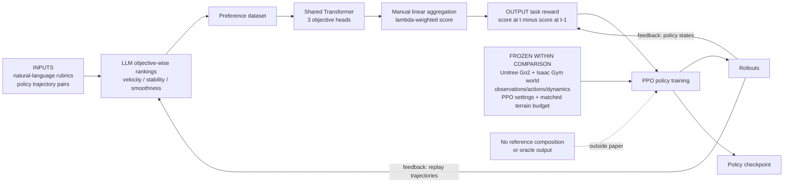

# MAPL: Multi-Objective Preference Learning for Robot Locomotion

| Field | Value |
| --- | --- |
| Primary source | [arXiv:2606.25398v1](https://arxiv.org/html/2606.25398v1), 24 June 2026; source archive SHA-256 `8ce6faab1e094823dab7fcf8c4ced43ba939c4c326a8ea15e4dbf53f93bf4115` |
| Official public record | [CAMP Lab registry at `7624ed2`](https://github.com/camp-lab-purdue/camp-lab-purdue.github.io/blob/7624ed21aba13a83682d50c6b9b8f8399da3c37c/_bibliography/papers.bib#L440-L450); pinned PDF SHA-256 `31ba53f8f5497f1c67ac505b2f442ad1532af17df6a9fca0840796e0288b507b`; no MAPL implementation is listed |
| Harness relevance | Task reward / human-language specification / evaluation / fixed-trainer boundary; not reference composition |
| Evidence tier | Core |

## Main point

Under shared PPO settings on four simulated Unitree Go2 terrains, MAPL reports that three separately elicited LLM preference objectives plus score-difference shaping match or exceed its expert-reward baseline, but the paper does not establish an immutable plug-in task reward because the reward model changes during training, its weights are manual and terrain-specific, and the headline evaluation reuses expert-reward components.

## Mechanism

## Exact parameters

| Parameter | Value | Context | Source locator |
| --- | ---: | --- | --- |
| Preference objectives | `3`: velocity, stability, smoothness | Same objective set across terrains; separate prompts and reward heads | Sec. IV-A–C |
| Downsampled trajectory | `6` states | Exact prompt input length; original trajectory horizon and sampling interval are not reported | App. B.1–B.3 |
| LLM request batch | `20` trajectory pairs | Each objective prompt returns one JSON array | App. B.1–B.3 |
| Preference labels | prompt `0/1/2`; loss definition `0/1/0.5` | First/second/tie; v1 does not specify the `2 -> 0.5` conversion | Sec. III; App. B.1–B.3 |
| Velocity rubric | linear:yaw importance `3:1`; trot only as a tiebreaker | Inputs are base x-y velocity, yaw rate, x-y-yaw command, and four foot contacts | App. B.1 |
| Stability rubric | target base height `0.34 m` | Also uses vertical velocity and roll/pitch angular velocity | App. B.2 |
| Smoothness rubric | action change + stumble signals | Stumble dominates small action-smoothness differences | App. B.3 |
| Scoring model update ratio | `1:100` versus policy updates | Defers LLM calls until visitation changes | Sec. IV-C |
| Aggregate score | `sum_i lambda_i sigma_i(s_t)` | Shared Transformer with one head per objective | Eq. 5 |
| Executed reward | `sigma(s_t) - sigma(s_{t-1})` | Score-difference reward; no terminal convention is specified | Eq. 6; Algorithm 1 |
| Aggregation weights | flat/wave `1.5/1.0/0.1`; stair/obstacle `1.5/1.0/0.25` | Velocity/stability/smoothness; manually selected and terrain-dependent | Sec. V-A |
| Main preference data | `500` trajectory pairs per reward model | Five policy seeds per reward method | Sec. V-B |
| Component-ablation data | `2,000` trajectory pairs per reward model | Three-seed ablation; same pair count across subsets | Sec. V-C; Fig. 4 |
| Buffer sensitivity | `100/200/500/1,000` trajectories | Plane; `1,000` is highest in the plotted expert evaluation reward | Fig. 4; Sec. V-D |
| Query sensitivity | `1/3/5/7` repeats per ranking | Plane; curves are nearly identical for `>=3`; default repeat count is not stated | Fig. 4; Sec. V-D |
| Main LLM | `GPT-5-mini` | Exact model snapshot, provider parameters, and decoding seed are not reported | Sec. V-A–B |
| LLM backbone ablation | `GPT-5-mini`; `Claude Sonnet 4.6`; `Gemini-2.5-Flash` | Three-seed Plane velocity-reward comparison | Fig. 4 |
| Reward Transformer | embed `256`; layers `2`; attention heads `4`; FFN `512`; dropout `0.1` | Batch `32`; `80` epochs; manually tuned | App. Table III |
| Reward-model LR schedule | `4e-5 @ 20`; `3e-5 @ 70`; `8e-5 @ 80` | Learning rate and epoch applied | App. Table III |
| PPO batch / minibatch / epochs | `98,304 / 24,576 / 5` | `4,096 x 24` rollout batch; `4,096 x 6` minibatch | App. Table IV |
| PPO coefficients | clip `0.2`; entropy `0.01`; gamma `0.99`; GAE lambda `0.95`; target KL `0.01` | Adaptive learning rate; shared across environments | App. Table IV |
| Main plotted budgets | plane `1,500`; stair `2,500`; wave `1,500`; obstacle `2,000` iterations | Figure-axis horizons; comparisons are matched within terrain | Fig. 3 |
| Evaluation tracking scales | linear `0.25`; angular `0.25` | Gaussian velocity rewards | Eqs. 7–8 |
| Velocity-error protocol | commands `0.4–1.0 m/s`; `500`-step rollout; `20`-step averages | Lateral and yaw commands fixed to zero | Sec. V-H; Fig. 5 |
| Ranking-accuracy sample | `100` trajectory pairs | Compared with expert-reward rankings | Sec. V-I |
| MAPL ranking accuracy | velocity `88%`; stability `76%`; smoothness `98%` | MOMQ; MOSQ is `67/67/98%`; overall SOSQ/LAPP are `63/68%` | Table II |

## What transfers to Sam's harness

- Treat the learned reward as an immutable, typed `task_reward_k` artifact: feature schema, three rubrics, raw preference responses, tie conversion, training data hashes, Transformer weights, aggregation vector, score-difference rule, and software/model provenance.
- Test decomposed preference heads against one global preference judgment. Preserve per-head scores as diagnostics; keep objective metrics outside both the learned reward and candidate-selection signal.
- Freeze one reward artifact for each matched policy run. Re-training the reward model every 100 policy updates is MAPL's reported algorithm, but it violates a per-run immutable-reward comparison unless every update is an explicit, pinned harness iteration.
- Translate human steering only into objective text or aggregation weights, then record the resulting reward lineage. MAPL makes that interface plausible; it does not test human edits or steering fidelity.
- Reproduce the paper's reward-component, score-versus-difference, buffer-size, and query-repeat ablations under the same controller, world, seeds, and policy-update budget.

## What does not transfer

- MAPL has no reference motion, composition rule, transition guard, recovery oracle, or mode-selection mechanism.
- MAPL replaces the environment reward with a learned whole-locomotion objective. Its velocity, stability, and smoothness terms overlap the tracking reward that Sam's initial contract freezes; they are not authorable task-reward terms unless that boundary is explicitly changed in a separate experiment.
- It learns a neural scoring model; it does not emit auditable reward code. Model inference is an admissible task reward only if Sam's frozen trainer already supports that exact typed, immutable artifact.
- The paper's online reward-model refresh adds a second learner and LLM feedback loop. Calling this only a reward coefficient change would erase a material training-system change.
- Terrain curriculum, its success threshold, scene generation, PPO, and policy architecture are fixed experimental conditions rather than reward knobs; MAPL does not justify changing them inside Sam's initial search loop.
- The paper does not test human feedback. Its natural-language rubrics are author-written, fixed across runs, and contain embodiment-specific quantities and concepts.
- Terrain-specific smoothness weights, a `0.34 m` height target, trot preference, action-difference features, and stumble detection are reward engineering choices; the evidence supports reuse of one prompt set across terrains, not absence of specification work.
- The expert tracking reward is used as the evaluation return and as ground truth for ranking accuracy. Those results are not evidence against reward overfitting on an independent objective evaluator.
- Simulation-only Unitree Go2 results do not establish hardware transfer, another embodiment, another trainer, or another observation/action contract.

## Failure modes and caveats

- Reported ablation: each single objective converges poorly; velocity plus stability shows no improvement; the full three-objective reward is nearly `2x` the best two-term variant in the plotted expert evaluation return.
- Reported ablation: removing score difference degrades MAPL on all terrains, while adding it to LLM Reward or LAPP can plateau early or destabilize training.
- LLM rankings are stochastic. One query learns slightly slower early; repeats beyond three show no visible gain in the Plane sensitivity plot.
- Linear objective aggregation is the paper's stated limitation. Interaction effects are not modeled.
- Equation 6 subtracts the previous score without gamma even though PPO uses `gamma=0.99`; v1 gives no terminal/reset handling or policy-invariance argument.
- The prompt tells the LLM to encode ties as `2`, while Sec. III trains with tie target `0.5`; no released code documents the conversion.
- The velocity prompt says a very small tracking error should be slightly preferred to perfect tracking, which conflicts with its surrounding smaller-error rule.
- The scoring function is written as `sigma(s)`, but smoothness supervision uses action changes and stumble features; v1 does not specify the runtime feature tensor or history construction.
- Curriculum success threshold, `D_max`, original trajectory duration, sampling cadence, default majority-vote count, reward normalization, terminal reward, policy architecture, control rate, and total LLM/compute budget are not reported.
- Isaac Gym, Legged-Gym, RSL-RL, and GPT-5-mini are named without versions or commits. As of 30 August 2026, the official lab record exposes a PDF but no MAPL implementation.
- Headline return comparisons are curves with smoothing and standard error, not numerical tables or statistical tests. Main results use five seeds; ablations use three.

## Evidence ledger

| ID | Claim | Source locator |
| --- | --- | --- |
| E1 | v1 title, authors, DOI, sole submission date, and active arXiv record | [arXiv v1 metadata](https://arxiv.org/abs/2606.25398v1) |
| E2 | The two-loop algorithm converts trajectory pairs into objective-wise preferences, a learned scorer, score-difference reward, and PPO updates | [Fig. 1 and Algorithm 1](https://arxiv.org/html/2606.25398v1#S1.F1); [Sec. III](https://arxiv.org/html/2606.25398v1#S3) |
| E3 | Velocity, stability, and smoothness are the three natural-language objective rubrics reused across terrains | [Sec. IV-A](https://arxiv.org/html/2606.25398v1#S4.SS1) |
| E4 | Separate LLM rankings, repeated-query majority vote, shared Transformer parameters, three heads, and 100-times-slower scorer updates | [Secs. IV-B–C](https://arxiv.org/html/2606.25398v1#S4.SS2) |
| E5 | Manual linear objective aggregation and the score-difference reward are defined | [Sec. IV-D, Eqs. 5–6](https://arxiv.org/html/2606.25398v1#S4.SS4) |
| E6 | Unitree Go2/Isaac Gym terrains, Gaussian tracking metrics, expert-reward terms, curriculum, and difficulty weighting | [Sec. V-A](https://arxiv.org/html/2606.25398v1#S5.SS1); [Table I](https://arxiv.org/html/2606.25398v1#S5.T1) |
| E7 | All baselines share PPO/RSL-RL; exact MAPL lambda ratios and GPT-5-mini are reported | [Sec. V-A](https://arxiv.org/html/2606.25398v1#S5.SS1) |
| E8 | Main comparison uses 500 trajectory pairs and five policy seeds; qualitative returns and figure-axis budgets are reported | [Sec. V-B](https://arxiv.org/html/2606.25398v1#S5.SS2); [Fig. 3](https://arxiv.org/html/2606.25398v1#S4.F3) |
| E9 | Three-seed Figure 4 covers component, LLM-backbone, buffer, and query ablations; the component study uses 2,000 pairs and reports the full reward near twice the best two-term result | [Sec. V-C](https://arxiv.org/html/2606.25398v1#S5.SS3); [Fig. 4](https://arxiv.org/html/2606.25398v1#S5.F4) |
| E10 | Buffer sizes, query repeats, inconsistent LLM answers, and the `>=3` repeat result are reported | [Sec. V-D](https://arxiv.org/html/2606.25398v1#S5.SS4); [Fig. 4](https://arxiv.org/html/2606.25398v1#S5.F4) |
| E11 | Five-seed ablation compares every method with and without score difference | [Sec. V-E](https://arxiv.org/html/2606.25398v1#S5.SS5); [Fig. 6](https://arxiv.org/html/2606.25398v1#S5.F6) |
| E12 | Stability distributions and three-seed lambda sensitivity are figure-reported | [Secs. V-F–G](https://arxiv.org/html/2606.25398v1#S5.SS6); [Figs. 7–8](https://arxiv.org/html/2606.25398v1#S5.F7) |
| E13 | Forward-command range, 500-step rollout, 20-step averaging, and qualitative velocity-error ordering | [Sec. V-H](https://arxiv.org/html/2606.25398v1#S5.SS8); [Fig. 5](https://arxiv.org/html/2606.25398v1#S5.F5) |
| E14 | Exact ranking accuracies and the 100-pair expert-reward comparison protocol | [Sec. V-I and Table II](https://arxiv.org/html/2606.25398v1#S5.SS9) |
| E15 | The authors identify linear aggregation as a limitation and multimodal feedback as future work | [Sec. VI](https://arxiv.org/html/2606.25398v1#S6) |
| E16 | Exact manually tuned Transformer architecture and learning-rate schedule | [Appendix Table III](https://arxiv.org/html/2606.25398v1#A0.T3) |
| E17 | Exact PPO hyperparameters shared across environments | [Appendix Table IV](https://arxiv.org/html/2606.25398v1#A0.T4) |
| E18 | Six-state velocity features, `3:1` tracking rubric, trot tiebreaker, 20-pair requests, and prompt labels | [Appendix B.1](https://arxiv.org/html/2606.25398v1#A0.SS2.SSS1) |
| E19 | Six-state stability features and the `0.34 m` base-height target | [Appendix B.2](https://arxiv.org/html/2606.25398v1#A0.SS2.SSS2) |
| E20 | Six-state action-change and stumble features for smoothness | [Appendix B.3](https://arxiv.org/html/2606.25398v1#A0.SS2.SSS3) |
| E21 | The exact v1 source archive is 3,698,572 bytes with the recorded SHA-256 | [arXiv v1 source bundle](https://export.arxiv.org/e-print/2606.25398v1) |
| E22 | The pinned official lab registry classifies MAPL as a preprint and links only a PDF, not an implementation | [CAMP Lab registry at `7624ed2`](https://github.com/camp-lab-purdue/camp-lab-purdue.github.io/blob/7624ed21aba13a83682d50c6b9b8f8399da3c37c/_bibliography/papers.bib#L440-L450) |
| E23 | The pinned official-lab PDF is 4,223,359 bytes with the recorded SHA-256 | [PDF at `7624ed2`](https://github.com/camp-lab-purdue/camp-lab-purdue.github.io/blob/7624ed21aba13a83682d50c6b9b8f8399da3c37c/assets/pdf/26chen_mapl.pdf) |
