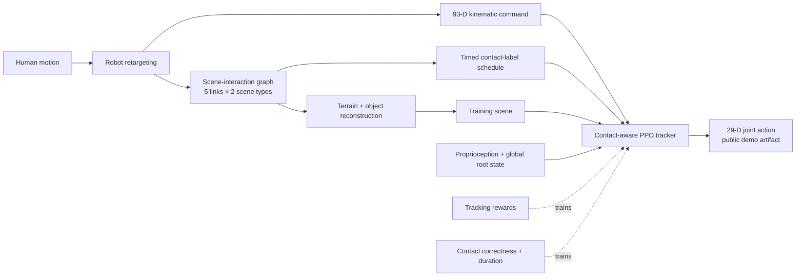

# SceneBot: Contact-Prompted General Humanoid Whole Body Tracking with Scene-Interaction

| Field | Value |
| --- | --- |
| Primary source | [arXiv:2606.27581v1](https://arxiv.org/html/2606.27581v1), 25 June 2026 |
| Public artifact | [Official demo/runtime repository](https://github.com/Ericcsr/scenebot/tree/430c29c1801aceb813506d86f3a8cffeba250df3), commit `430c29c1801aceb813506d86f3a8cffeba250df3` |
| Harness relevance | Reference composition; task reward; evaluation; fixed-trainer boundary |
| Evidence tier | Core |

## Main point

SceneBot reports that pairing each reference frame with robot-link × scene-type contact labels raises scene-interaction success over reference-only SONIC on 20 unseen sequences per category, but this interface transfers to Sam's oracle only when the frozen controller already consumes the contact channel; otherwise it changes the fixed MDP/controller contract.

## Mechanism

## Exact parameters

| Parameter | Value | Context | Source locator |
| --- | ---: | --- | --- |
| Interaction key links | left/right wrist, left/right foot, pelvis | Robot-side nodes | Sec. 3.1; App. A |
| Scene types | terrain, object | Immovable vs. movable scene nodes | Sec. 3.1; App. A |
| Kinematic command | `93` dimensions | Lower-body joint targets, head/wrist 6D poses, global root errors | Sec. 3.2 |
| Contact duration clip | `0.5 s` | Prevents refusal to release an object | Sec. 3.2; App. B |
| Contact reward weights | correctness `0.5`; duration `0.5` | Added to six motion-tracking rewards | App. B, Table 2 |
| Tracking reward weights | root ori/pos `0.5/0.5`; four body-link terms `1.0` each | Exponential motion tracking | App. B, Table 2 |
| Penalties | action rate `-0.1`; joint limit `-10`; undesired contact `-0.1` | Undesired contact threshold is `1 N` | App. B, Table 2 |
| Dataset | `7.5 h`, `2,092` clips | Object `974`; flat `783`; terrain `297`; sit `38` | Abstract; Fig. 5 |
| Evaluation set | `20` unseen sequences/category | Free, object, terrain, sit; MuJoCo sim-to-sim | Sec. 4.2 |
| SceneBot success | `100 / 95 / 100 / 100%` | Free / object / terrain / sit | App. C, Table 3 |
| SONIC success | `100 / 5 / 15 / 0%` | Same protocol | App. C, Table 3 |
| No-label success | `100 / 0 / 60 / 95%` | Removes contact labels during training | App. C, Table 3 |
| Local-state success | `100 / 20 / 45 / 90%` | Removes global root position and velocity | App. C, Table 3 |
| State estimator | `200 Hz` | SuperOdometry + pelvis IMU fusion | Sec. 3.3 |
| Real state-estimation test | `0.032 m`, `0.018 rad`, `0.092 m/s`, `80%` | Mean root position/orientation/velocity error; success over 10 experiments | Sec. 4.6 |
| Public demo policy | obs `160`; contact `10`; action `29`; control/sim `0.02/0.005 s` | Pinned runtime artifact; not proven identical to the paper-evaluation checkpoint | `policy_meta.json` at commit `430c29c` |
| Public ONNX identity | `c0a3caf00809d1ccb26aad6358f2b107098462deccac755e406e522134103d04` | SHA-256 declared in metadata and verified against the 33,910,590-byte file | `policy_meta.json` and pinned ONNX blob |

## What transfers to Sam's harness

- Oracle candidate: an immutable, time-aligned manifest of `(reference frame, per-link contact label, scene type)` rather than kinematics alone.
- Composition invariant: preserve link identity, scene type, global root frame, contact timing, and release timing across crops and mode joins.
- Reward hypothesis: asymmetric desired-contact correctness plus clipped contact duration, but admit it as Sam's task reward only if contact success is outside the frozen tracking reward; keep contact precision/recall, grasp retention, falls, root error, and release latency as independent metrics.
- Ablation plan: under one contact-capable frozen controller, compare reference-only, contact-schedule-only, reward-only, and both-knob conditions on identical scenes, sequences, seeds, and budgets.
- Data-quality gate: reject or separately label references with foot sliding or physically inconsistent root/object motion before inferring an oracle.

## What does not transfer

- Adding a contact observation to a controller that lacks one changes the frozen observation/policy contract; SceneBot is then a future controller instantiation, not a harness-only intervention.
- Hindsight scene reconstruction changes scene assets. Under Sam's initial fixed-scene contract it belongs in offline dataset preparation, not the harness search space.
- PPO settings, global-state inputs, state estimation, mismatch termination, and the heuristic object-stabilizing force are trainer/runtime changes outside the two initial knobs.
- The paper trains contact correctness and duration as tracker rewards. Reclassifying or editing them as Sam's authorable task reward can violate the contract that holds the tracking reward fixed.
- SceneBot supplies a low-level contact interface, not the autonomous high-level oracle that chooses contact schedules; that planner is explicitly future work.
- Labels identify robot link × broad scene type, not a particular object instance or contact pose. The paper does not resolve multi-object oracle ambiguity.
- The reported reward and contact-conditioned full system do not isolate a reward-only gain under an otherwise unchanged tracker.

## Failure modes and caveats

- Scene reconstruction is sensitive to retargeting artifacts such as foot sliding and to motions without physical consistency guarantees.
- Candidate-edge velocity/acceleration thresholds, plateau-merging tolerances, force-closure test details, and contact-mismatch timeout are not numerically specified in v1.
- Reconstructed objects may begin off the floor; training uses a heuristic "magic force" until a stable force-closure grasp forms.
- Success definitions are binary and task-specific; v1 reports no independent training seeds, confidence intervals, or uncertainty over the 20-sequence evaluations.
- The real-world quantitative study is 10 trials of one box-and-stage state-estimation scenario, not a broad hardware reliability estimate.
- As of 30 August 2026, the official page still marks code and data "Coming Soon." A public repo exposes the browser deployment runtime, a compiled ONNX policy, and stitched motion assets, but not the paper's PPO training, hindsight reconstruction, or released training dataset.

## Evidence ledger

| ID | Claim | Source locator |
| --- | --- | --- |
| E1 | v1 title, authors, DOI, and 25 June 2026 submission. | [arXiv v1](https://arxiv.org/abs/2606.27581v1) |
| E2 | A high-level decision maker supplies reference motion plus robot-side per-link contact labels; the policy is intentionally low-level, not vision-task-level. | [Sec. 1](https://arxiv.org/html/2606.27581v1#S1) |
| E3 | The graph uses five robot links, terrain/object scene types, temporal edges, and motion-derived pruning before 2.5D terrain/object reconstruction. | [Sec. 3.1](https://arxiv.org/html/2606.27581v1#S3.SS1); [App. A](https://arxiv.org/html/2606.27581v1#A1) |
| E4 | The controller inputs, 93-D command, asymmetric correctness reward, duration clipping, mismatch termination, and stabilizing force are defined. | [Sec. 3.2](https://arxiv.org/html/2606.27581v1#S3.SS2) |
| E5 | Exact motion/contact reward equations, weights, penalties, and the 1 N undesired-contact threshold are tabulated. | [App. B, Table 2](https://arxiv.org/html/2606.27581v1#A2.T2) |
| E6 | Training uses 7.5 hours; the data figure reports 974 object, 783 flat, 297 terrain, and 38 sit clips. | [Abstract](https://arxiv.org/html/2606.27581v1#S0); [Fig. 5](https://arxiv.org/html/2606.27581v1#S4.F5) |
| E7 | Evaluation uses four MuJoCo sim-to-sim categories and 20 unseen motion/scene pairs per category. | [Sec. 4.2](https://arxiv.org/html/2606.27581v1#S4.SS2) |
| E8 | Exact joint, root-position, root-orientation, and success results for SceneBot, SONIC, and ablations are reported. | [App. C, Table 3](https://arxiv.org/html/2606.27581v1#A3.T3) |
| E9 | Removing global state cuts terrain/object success to 45/20%; contact-label ablations expose grasp and terrain-switch failures. | [Secs. 4.3–4.4](https://arxiv.org/html/2606.27581v1#S4.SS3) |
| E10 | Reconstructed OMOMO scenes outperform a tuned OmniRetarget baseline; exact numerical values are figure-only. | [Sec. 4.5](https://arxiv.org/html/2606.27581v1#S4.SS5) |
| E11 | The 200 Hz estimator and 10-trial root-state errors/success are reported. | [Sec. 3.3](https://arxiv.org/html/2606.27581v1#S3.SS3); [Sec. 4.6](https://arxiv.org/html/2606.27581v1#S4.SS6) |
| E12 | Retargeting quality, foot sliding, and physically inconsistent video/generated motions limit reconstruction. | [Sec. 5](https://arxiv.org/html/2606.27581v1#S5) |
| E13 | Free, terrain, object, and sit success are defined with task-specific binary conditions. | [App. D](https://arxiv.org/html/2606.27581v1#A4) |
| E14 | Autonomous perceptive high-level control is future work. | [Sec. 6](https://arxiv.org/html/2606.27581v1#S6) |
| E15 | The official page exposes an interactive demo but labels data and code as coming soon. | [Pinned project page](https://github.com/Ericcsr/scenebot/blob/430c29c1801aceb813506d86f3a8cffeba250df3/index.html#L125-L151) |
| E16 | The pinned public repository documents a deployment demo/runtime, policy bundle, and stitched motion rather than the paper's training/reconstruction pipeline. | [Pinned README](https://github.com/Ericcsr/scenebot/blob/430c29c1801aceb813506d86f3a8cffeba250df3/README.md#L1-L17); [layout](https://github.com/Ericcsr/scenebot/blob/430c29c1801aceb813506d86f3a8cffeba250df3/README.md#L229-L258) |
| E17 | The public demo metadata fixes observation/action/contact dimensions, cadences, and ONNX SHA-256. | [Pinned policy metadata](https://github.com/Ericcsr/scenebot/blob/430c29c1801aceb813506d86f3a8cffeba250df3/mujoco_wasm/dist-desktop/scenebot/policy_meta.json) |
| E18 | The public runtime expands five stored contact channels into the ten-channel policy observation. | [Pinned contact runtime](https://github.com/Ericcsr/scenebot/blob/430c29c1801aceb813506d86f3a8cffeba250df3/mujoco_wasm/src/scenebot/contact_utils.js#L17-L29) |
| E19 | The pinned 33,910,590-byte ONNX blob matches the SHA-256 declared by the public metadata. | [Pinned ONNX artifact](https://github.com/Ericcsr/scenebot/blob/430c29c1801aceb813506d86f3a8cffeba250df3/mujoco_wasm/dist-desktop/scenebot/policy.onnx) |
