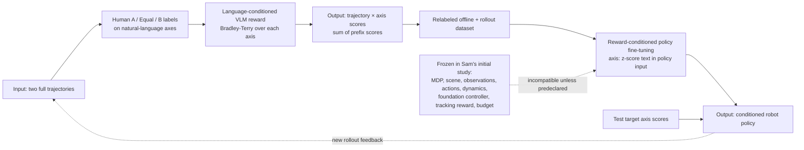

# Freeform Preference Learning for Robotic Manipulation

| Field | Value |
| --- | --- |
| Primary source | [arXiv:2606.32027v3](https://arxiv.org/html/2606.32027v3), 1 August 2026; PDF SHA-256 `3abfaaa7…`; TeX-source SHA-256 `b7106307…` |
| Public artifacts | [Method code](https://github.com/freeform-pl/fpl/tree/dfb62a85374d6cd6d312ab86b7fa030161da0ce9) at `dfb62a85374d6cd6d312ab86b7fa030161da0ce9`; [real-world collection code](https://github.com/freeform-pl/fpl_real/tree/17cffe62d4c0dc3474a3bc1ae221046cf839c129) at `17cffe62d4c0dc3474a3bc1ae221046cf839c129`; [project-page source](https://github.com/freeform-pl/fpl.website/tree/8aac1a63be52a832a1f9adbde2809af3fa3cbc59) at `8aac1a63be52a832a1f9adbde2809af3fa3cbc59`; all untagged, checked 30 August 2026 |
| Harness relevance | Task reward; human steering; evaluation; fixed-trainer boundary; no reference-composition mechanism |
| Evidence tier | Core |

## Main point

FPL reports a 38-point real-world average gain by replacing one overall preference with per-axis language preferences **and** training a policy that consumes the learned axis-score vector; it supports axis-decomposed reward authoring, but not a task-reward-only claim under Sam's fixed trainer.

## Mechanism

## Exact parameters

| Parameter | Value | Context | Source locator |
| --- | ---: | --- | --- |
| Preference record | full trajectory pair; variable `K_ij` language axes; binary label per axis | Axes may be predefined or annotator-written; equal labels are dropped | Sec. 3.1; App. 8; App. 9.1 |
| Reward loss | summed axis-conditioned Bradley-Terry NLL | One scalar score per `(trajectory, axis)` | Sec. 3.1, Eq. 3 |
| Trajectory reward | `Σ_i gφ(o_1:i, l_k)` | Sum of per-prefix scores over observation history | Sec. 3.1, Eq. 4 |
| Policy loss | action log-likelihood conditioned on all selected axis-score pairs | Offline reward-conditioned supervised policy extraction, not environment-return maximization | Sec. 3.2, Eq. 5 |
| Reward backbone | paper: `Qwen 3.5 VL 4B`; code: `Qwen/Qwen3-VL-4B-Instruct` | Frozen vision encoder; full fine-tuning elsewhere; two camera streams | App. 9.1; pinned `train_reward_model.py` |
| Reward sequence | `20` frames; `128×128×3`; batch `32`; LR `1e-5` | Shared real-world settings | App. 9.1, Table 4 |
| Frame stride | toast `20`; table `20`; shorts `60`; cube `10` | Task-specific reward-model input sampling | App. 9.1, Table 4 |
| Reward-model selection | best validation accuracy within first `500` epochs | V3 reports no held-out accuracy value | App. 9.1 |
| Reward conditioning | per-axis `(r-μ)/σ`, rounded to `0.1` | Serialized into the policy's text prompt | Sec. 3.2; App. 9.2 |
| Real policy | `π0.5`; flow head; action chunk `16`; execute `8` | Wrist + third-person views and conditioned task prompt | App. 9.2 |
| Paper policy training | full fine-tune; `30,000` steps; batch `32` | Pinned launcher instead invokes a `60,000`-step preset | App. 9.2; pinned public config |
| Simulation conditioning noise | `0.2` after standardization | Fixed `K` reward heads and float-vector conditioning; not used in real world | App. 9.3 |
| Evaluation replication | real: `20` rollouts/method; simulation: `3` seeds | Mean ± standard error | Sec. 5.1 |
| Real average | FPL `0.75±0.04`; best baseline `0.37±0.04` | Reported absolute gain `0.38`; metric naming is inconsistent across paper/project page | App. 11, Table 8; Fig. 3; official project page |
| Simulation FPL | object success `0.84±0.09`; normal/inverted throughput `1.19±0.01 / 1.24±0.01` | Same policy is reconditioned for inverted peg direction | Table 1; App. Tables 5–7 |
| Plate-toast feedback | `295` pairs; `>1,477` axis judgments; `41` labels | Freeform annotation reported `1.85×` faster per label | Sec. 5.3; App. 8 |
| Compute | one H100; simulation generally RTX 4500 | GPU-hours and total run count unreported | App. 10 |

## What transfers to Sam's harness

- Human-steering schema: store the exact trajectory pair, axis text, A/B/equal label, annotator/session provenance, and immutable bytes. Keep axes separate instead of forcing one overall judgment.
- Task-reward candidate: expose named, independently inspectable reward components for completion, speed, smoothness, damage, hygiene, or placement quality. Compile any accepted combination into Sam's existing executable reward interface before launch.
- Budgeted feedback loop: query comparisons on informative failures, but pre-bind pair-selection, annotation, training, and rollout budgets across experiment arms.
- Evaluation contract: score the underlying task, damage, hygiene, smoothness, and safety with independent metrics. Never use the learned reward as its own validator.
- Calibration test: compare scalarized overall preference, decomposed axes with a fixed aggregation, and decomposed axes plus policy conditioning as separate interventions. Only the middle arm can test Sam's task-reward knob under a fixed conditioning-free controller.

## What does not transfer

- FPL does not select, crop, order, transition between, or recover reference motions. Its “compositionality” is behavior composition, not reference composition or an oracle.
- The learned VLM scores complete trajectories and relabels a dataset. It is not, as published, a bounded executable per-step task reward for Sam's unchanged trainer.
- Adding axis-score text/vector inputs, full-fine-tuning `π0.5`, changing the foundation controller, or adding replay rollouts changes Sam's frozen trainer/observation/data contract.
- Test-time score prompting is supported only by a policy trained to consume that interface. It is not a harness-only steering channel for an arbitrary frozen controller.
- The 38-point headline compares full pipelines. No reported arm isolates a task-reward-only substitution while holding policy inputs, policy extraction, data, and optimization fixed.

## Failure modes and caveats

- **Manual targets:** reward outputs are unbounded; safe, effective, in-distribution target values are not selected automatically. The evaluated policy accepts only a selected fixed set of axes.
- **False boundedness statement:** Appendix 9.2 says z-scoring makes rewards bounded. `(r-μ)/σ` remains unbounded; rounding to one decimal is not clipping.
- **Reward evidence:** the dense-credit claim is one qualitative setup-table rollout. V3 reports no held-out reward accuracy, calibration, adversarial optimization, distribution-shift, or reward-hacking test.
- **Metric ambiguity:** Appendix Table 8 says “success rate”; the official project page says “average real-world task progress.” The complete scoring rubric and blind-rating protocol are absent.
- **Human-study gap:** annotator count, agreement, demographics, and repeat-annotation uncertainty are unreported. Real-world uncertainty uses 20 rollouts per method, not independent policy-training seeds.
- **Public recipe drift:** the pinned reward launcher uses non-cumulative `qwen_open`, one epoch, and stride 10; the paper specifies prefix-score summation, per-task strides, and selection within 500 epochs. The pinned policy preset uses 60,000 rather than 30,000 steps.
- **Runtime pin gap:** the official environment installs Transformers from mutable Git main. Repository commits alone do not reproduce the evaluated software stack.
- **Human cost:** authors acknowledge that preference collection remains more expensive than fully unsupervised learning.

## Public-artifact audit

| Artifact | Exact pin | Boundary |
| --- | --- | --- |
| Paper | v3 PDF `3abfaaa7…`; source `b7106307…` | Exact reviewed bytes |
| Method code | `dfb62a85374d6cd6d312ab86b7fa030161da0ce9` | Public simulation/reward/policy pipeline; no release tag |
| Collection code | `17cffe62d4c0dc3474a3bc1ae221046cf839c129` | A/Equal/B freeform UI and rollout collection; no release tag |
| Project-page source | `8aac1a63be52a832a1f9adbde2809af3fa3cbc59` | Immutable source for the public headline metric label; no release tag |
| Reward launcher | same method commit | Does not match v3 cumulative architecture or reported training horizon |
| Policy launcher | same method commit | Invokes a 60,000-step preset versus 30,000 in v3 |
| Environment | same method commit | Most versions fixed; Transformers Git revision is not fixed |

## Evidence ledger

| ID | Claim | Source locator |
| --- | --- | --- |
| E01 | V3 metadata and exact reviewed PDF/source hashes. | [arXiv v3](https://arxiv.org/abs/2606.32027v3) |
| E02 | Full-trajectory, variable-axis preference record and axis-conditioned Bradley-Terry loss. | [Sec. 3.1, Eq. 3](https://arxiv.org/html/2606.32027v3#S3.SS1) |
| E03 | Observation-history reward is the sum of per-prefix scores. | [Sec. 3.1, Eq. 4](https://arxiv.org/html/2606.32027v3#S3.SS1) |
| E04 | Representative axes, reward-conditioned supervised policy objective, and offline/online use. | [Sec. 3.2, Eq. 5](https://arxiv.org/html/2606.32027v3#S3.SS2) |
| E05 | Cumulative preference/replay loop and evolving axis curriculum. | [Sec. 3.2, Algorithm 1](https://arxiv.org/html/2606.32027v3#S3.SS2) |
| E06 | Standardized test targets, unbounded raw outputs, manual target selection, and fixed-axis limit. | [Sec. 3.2](https://arxiv.org/html/2606.32027v3#S3.SS2); [Sec. 6](https://arxiv.org/html/2606.32027v3#S6) |
| E07 | Tasks, DROID embodiment, observations/control, 20 real rollouts, three simulation seeds, and reported statistic. | [Sec. 5.1](https://arxiv.org/html/2606.32027v3#S5.SS1) |
| E08 | Complete real-world means/standard errors and 38-point average gap. | [App. Table 8](https://arxiv.org/html/2606.32027v3#S11.T8) |
| E09 | Complete simulation and detailed normal/inverted results. | [App. 11.1, Tables 5–7](https://arxiv.org/html/2606.32027v3#S11.SS1) |
| E10 | Fast-right-peg composition and same-policy target steering. | [Sec. 5.2](https://arxiv.org/html/2606.32027v3#S5.SS2) |
| E11 | Qualitative temporal credit-assignment comparison. | [Sec. 5.3, Fig. 6](https://arxiv.org/html/2606.32027v3#S5.SS3) |
| E12 | Dataset counts, collection UI, label diversity, evolving criteria, and annotation speed. | [App. 8](https://arxiv.org/html/2606.32027v3#S8) |
| E13 | Reward architecture, hyperparameters, validation selection, and equal-label handling. | [App. 9.1, Table 4](https://arxiv.org/html/2606.32027v3#S9.SS1) |
| E14 | Reward serialization, `π0.5` recipe, simulation variant, and compute. | [App. 9.2–9.3](https://arxiv.org/html/2606.32027v3#S9.SS2) |
| E15 | Baselines alter supervision, extraction, or filtering; no reward-only frozen-trainer arm. | [App. 9.4](https://arxiv.org/html/2606.32027v3#S9.SS4) |
| E16 | Authors' stated human-cost, target-selection, and fixed-axis limits. | [Sec. 6](https://arxiv.org/html/2606.32027v3#S6) |
| E17 | Official method repository and exposed pipeline/data surface. | [Pinned method code](https://github.com/freeform-pl/fpl/tree/dfb62a85374d6cd6d312ab86b7fa030161da0ce9) |
| E18 | Public reward launcher/model selection differs from v3's reported recipe. | [Pinned launcher](https://github.com/freeform-pl/fpl/blob/dfb62a85374d6cd6d312ab86b7fa030161da0ce9/real_world/scripts/train_qwen.sh#L11-L21) |
| E19 | Public policy pipeline invokes `pi05_droid_finetune` without a step override. | [Pinned policy launcher](https://github.com/freeform-pl/fpl/blob/dfb62a85374d6cd6d312ab86b7fa030161da0ce9/real_world/scripts/infer_then_train_pi05.sh#L46-L58) |
| E20 | Invoked public policy preset uses 60,000 steps, batch 32, and horizon 16. | [Pinned config](https://github.com/freeform-pl/fpl/blob/dfb62a85374d6cd6d312ab86b7fa030161da0ce9/real_world/openpi/src/openpi/training/config.py#L898-L922) |
| E21 | Transformers is installed from mutable Git main. | [Pinned environment](https://github.com/freeform-pl/fpl/blob/dfb62a85374d6cd6d312ab86b7fa030161da0ce9/real_world/conda_environment_real.yaml#L1-L33) |
| E22 | Official real-world UI and collection implementation. | [Pinned collection code](https://github.com/freeform-pl/fpl_real/tree/17cffe62d4c0dc3474a3bc1ae221046cf839c129) |
| E23 | Official page calls the aggregate “Average real-world task progress.” | [Pinned project-page source](https://github.com/freeform-pl/fpl.website/blob/8aac1a63be52a832a1f9adbde2809af3fa3cbc59/index.html#L235-L247) |
