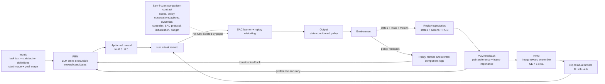

# CoRe: Combined Rewards with Vision-Language Model Feedback for Preference-Aligned Reinforcement Learning

| Field | Value |
| --- | --- |
| Primary source | [arXiv:2607.01721v1](https://arxiv.org/abs/2607.01721v1), submitted 2 July 2026 |
| Exact-version pin | [Versioned PDF](https://arxiv.org/pdf/2607.01721v1), SHA-256 `624655fd3a8ba0c9049a58f0dce260c749ee9b87a42ef93af33a057e819eee16` |
| Public implementation | [Author repository at `d663cabc38e6d6f39ac5e1e4327d94f17f84fa59`](https://github.com/nihx9919/CoRe/tree/d663cabc38e6d6f39ac5e1e4327d94f17f84fa59), current default-branch HEAD inspected 30 August 2026; no release tag |
| Harness relevance | Task reward; human-steering input surface; evaluation; fixed-trainer boundary; no reference composition |
| Evidence tier | Core |

## Main point

With SAC hyperparameters held common but reward learning, replay relabeling, visual rendering, critic state, and some baseline pretraining not held fixed, CoRe reports `99.0%` mean success on seven MetaWorld tasks from a formal-plus-residual reward; this supports testing reward composition, not a causal claim under Sam's fixed trainer or evidence for human steering or reference-oracle design.

## Mechanism

## Exact parameters

| Parameter | Value | Context | Source locator |
| --- | ---: | --- | --- |
| Formal-reward search | `5` searches; `4` candidates/search | GPT-4.1 mini generates executable code | Sec. 4.1; App. B.1 |
| FRM selection | Maximize candidate preference-prediction accuracy | Segment return is the sum of per-step candidate rewards | Sec. 3.1, Eqs. 2–3 |
| Preference labels | `(0,1)`, `(1,0)`, `(0.5,0.5)` | Prefer segment 1, segment 0, or tie | Sec. 3.1 |
| RRM query inputs | Task text, start image, goal image, two videos | Incomparable outputs are excluded | Sec. 3.2, Eq. 4 |
| RRM loss | `L_reward + 5 L_KL` | Preference cross-entropy plus frame-importance prior | Sec. 3.2, Eqs. 5–6; Table 7 |
| Reward composition | Each component clipped to `[-0.5,0.5]`; sum | Scalar reward used for policy learning | Sec. 4.1 |
| Reward generators | GPT-4.1 mini; Gemini 2.0 Flash | Paper experiment models for FRM and preference labels | Sec. 4.1; App. B.1 |
| Reward-model ensemble | `3`; tanh output | MetaWorld: 4-layer CNN; SoftGym: ResNet-18 | App. B.1 |
| Reward optimizer | Adam, LR `3e-4` | Batch `32` for CNN and `8` for ResNet | App. B.1 |
| Segment / queried frames | MetaWorld segment `20`, queried frames `3`; SoftGym segment `3` | Only MetaWorld downsampling is stated explicitly | App. B.1; Table 7 |
| Train steps | MetaWorld `500,000`; cloth `15,000`; rope/water `100,000` | Per-task training budgets | Table 7 |
| Initial-FR steps | MetaWorld `19,000`; cloth `250`; rope/water `9,000` | Initial formal-reward phase | Table 7 |
| FRM update period `M` | MetaWorld `25,000`; cloth `2,500`; rope/water `25,000` steps | Replay is relabeled after accepted updates | Algorithm 1; Table 7 |
| VLM query period `N` | MetaWorld `4,000`; cloth `1,000`; rope/water `5,000` steps | Uniform segment-pair sampling | Table 7 |
| Queries/session | MetaWorld `20`; SoftGym `10` | Maximum feedback: `500 / 150 / 200` for MetaWorld / cloth / rope-water | Table 7 |
| Policy learner | SAC; discount `0.99`; target EMA `0.005` | Fold-cloth MLP `3 x 1024`, batch `1024`, LR `5e-4`; others `2 x 256`, batch `512`, LR `3e-4` | Table 8 |
| Simulation evaluation | `7` MetaWorld + `3` SoftGym tasks; `3` seeds | Success rate for MetaWorld; episode return for SoftGym | Fig. 3; Table 1 |
| Mean MetaWorld success | CoRe `99.0%` | Paper-reported average over seven tasks | Sec. 4.2 |
| VLM video-label outcomes | `51.5%` correct, `15.0%` incorrect, `33.5%` no preference | Averaged over ten tasks against task-completion ordering | Sec. 4.3, Fig. 4 |
| Importance-weight alignment | Spearman `rho=0.48` | VLM frame weights versus task progress | Sec. 4.3 |
| Reward-progress alignment | CoRe `0.88`; RRM `0.77`; RRM without importance `0.56` | Mean Spearman correlation over ten expert trajectories | Sec. 4.3 |
| Feedback budget | `0.5K` MetaWorld; `0.15K` cloth; `0.2K` rope/water labels | Paper reports `3–40x` fewer labels than selected baselines | Table 3; Sec. 4.2 |
| Mean run cost | `2.00M` tokens; `$0.37`; `2.15 h` | Average over ten tasks; hardware is not reported there | Table 4 |
| Real-robot evaluation | `5` UR5 tasks; `20` trials/method/task | Direct deployment without fine-tuning after task-specific simulation retraining | Sec. 4.4; Table 5 |
| Visual disturbance | Sweep `97.3 -> 91.7%`; Hammer `98 -> 96%` | Randomly moving red-cube distractor | App. D.3, Table 11 |

## What transfers to Sam's harness

- Treat the reward as two named, independently inspectable terms: executable formal code for explicit task knowledge and a residual model for omitted visual preferences.
- Score reward candidates against an evaluator separate from candidate-training return; retain task success as an independent reporting metric so preference alignment cannot replace task validity.
- Pin every reward dependency: prompt, state/action signature, start/goal images, renderer, model snapshot, preference data, reward-model weights, mixture coefficient, and code bytes.
- If online reward updates are studied, bind update periods, replay relabeling, and any critic reset into the fixed experiment protocol. Otherwise materialize a frozen reward before each matched-budget policy run.
- Report task success/return, reward–progress correlation, VLM correct/incorrect/abstain rates, feedback count, API cost, robustness, and seed dispersion.
- Validate and sandbox generated Python before admission. The released implementation directly writes, imports, and executes generated reward code.
- Task text and goal images are a possible steering surface, but a human nudge must map only to a new immutable reward artifact and must be evaluated separately; CoRe does not test that loop.

## What does not transfer

- CoRe does not select, sequence, transition, or recover reference motions; it supplies no evidence for reference composition or oracle logic.
- Preference labels come from a VLM and are checked against task-completion order, not human judgments. The paper does not demonstrate human steering, preference calibration, or iterative user correction.
- RRM is not a standalone Python reward: it requires simulator RGB, task-specific rendering, online VLM queries, an image-reward ensemble, a preference buffer, replay relabeling, and a critic reset.
- The comparison is not a strict fixed-trainer experiment. Several baselines use PEBBLE unsupervised pretraining while CoRe trains directly; the reward-model view hides the robot/pickers, and MetaWorld initial states/cameras are modified.
- Real-robot transfer uses task-specific simulation reconfiguration and retraining, so it is not evidence for portability across a frozen scene/dynamics tuple.
- The pinned code is not the exact paper configuration without edits: its default RRM model is `gemini-2.5-flash-lite`, whereas the paper reports Gemini 2.0 Flash.
- The README launch scripts load checked-in initial FRM files (`use_FRM_online=False`) rather than reproducing the paper's initial task-completion candidate search; later preference-alignment updates remain in the training loop.

## Failure modes and caveats

- Task-completion-only reward selection can exploit the metric: the paper's Hammer example strikes the nail with the handle.
- FRM has limited expressiveness on deformable tasks and is sensitive to task difficulty and noisy labels; gains remain limited for Hammer and Fold Cloth.
- RRM struggles on complex long-horizon tasks under limited feedback; `15.0%` of video labels are wrong and `33.5%` abstain by the paper's task-completion proxy.
- VLM frame importance is only moderately correlated with task progress (`rho=0.48`); using it directly as reward is reported to have high variance, so CoRe uses it only as an auxiliary KL constraint.
- Video-LLaVA-7B failed to provide sufficiently reliable preferences; stronger proprietary models improved single-module results only modestly while increasing reported API cost by roughly `6–9x`.
- The paper's “human intent” claim is proxy-based: no humans label the CoRe preferences, and no inter-rater or calibration study is reported.
- Different pretraining and CoRe-specific replay/critic operations prevent attribution to scalar reward composition alone under Sam's fixed-trainer contract.
- The FRM ablation prose conflicts with Table 2: it calls the starting Sweep/Dial results `30%` and assigns `93.3% / 79.3%` to one alignment, while the table reports `36.0% / 34.7%` for `FRM^0` and those improved values for `FRM^2`.
- Simulation uses only three seeds and the twenty-trial real table reports no confidence intervals or significance tests; the wall-clock cost table does not name its hardware.
- The authors identify iterative model-query cost, model bias/inaccuracy, robustness, scalability, and generalization to unstructured real scenes as open limitations.
- The official repository has no tagged release and diverges from the paper's VLM default and initial-FRM search path; the reported results are therefore not pinned to an executable release manifest.
- Generated code is dynamically imported and executed. The paper and pinned repository do not document a sandbox, allowlist, static validator, or immutable promotion boundary.

## Evidence ledger

| ID | Claim | Source locator |
| --- | --- | --- |
| CORE-E01 | Exact title, authors, v1 date, arXiv ID, and active version history. | [arXiv v1 record](https://arxiv.org/abs/2607.01721v1) |
| CORE-E02 | FRM generates executable candidates from task/interface context and policy feedback, then selects by segment-preference accuracy; task-completion selection can reward hammer-handle exploitation. | [Sec. 3.1, Eqs. 2–3 and Fig. 2](https://arxiv.org/html/2607.01721v1#S3.SS1) |
| CORE-E03 | RRM queries a VLM with text, start/goal images, and video pairs; incomparable pairs are excluded; frame weights regularize preference reward learning through KL. | [Sec. 3.2, Eqs. 4–6](https://arxiv.org/html/2607.01721v1#S3.SS2) |
| CORE-E04 | Paper models, five-by-four search, interpolation/softmax, clipping-and-sum rule, rendering choices, metrics, and three-run protocol. | [Sec. 4.1](https://arxiv.org/html/2607.01721v1#S4.SS1) |
| CORE-E05 | CoRe co-trains policy and rewards, periodically queries preferences, accepts formal rewards by Eq. 2, and relabels the replay buffer after both reward updates. | [Algorithm 1](https://arxiv.org/html/2607.01721v1#alg1) |
| CORE-E06 | Exact FRM search count/model and RRM architecture, ensemble, activation, optimizer, batch sizes, sampling, and MetaWorld segment downsampling. | [Appendix B.1](https://arxiv.org/html/2607.01721v1#A2.SS1) |
| CORE-E07 | Domain-specific reward-learning steps, update/query periods, queries, segment sizes, feedback caps, KL weight, and batches. | [Table 7](https://arxiv.org/html/2607.01721v1#A2.T7) |
| CORE-E08 | SAC policy networks, learning rates, batches, temperature, target-update period, Adam betas, discount, and EMA. | [Table 8](https://arxiv.org/html/2607.01721v1#A2.T8) |
| CORE-E09 | Ten-task final results and three-seed learning-curve protocol; CoRe's seven-task MetaWorld mean is reported as `99.0%`. | [Figure 3 and Table 1](https://arxiv.org/html/2607.01721v1#S4.T1) |
| CORE-E10 | FRM iteration, RRM importance, and combined-reward ablations across ten tasks; the alignment prose and Table 2 disagree on the starting values and iteration label. | [Table 2 and Sec. 4.3](https://arxiv.org/html/2607.01721v1#S4.T2) |
| CORE-E11 | Label and image counts for CoRe and visual-reward baselines. | [Table 3](https://arxiv.org/html/2607.01721v1#S4.T3) |
| CORE-E12 | Mean token, API-dollar, and wall-clock costs across ten tasks. | [Table 4](https://arxiv.org/html/2607.01721v1#S4.T4) |
| CORE-E13 | Video/image preference outcomes, importance-weight correlation, direct-weight noise, and learned-reward correlations with expert task progress. | [Sec. 4.3 and Figs. 4–6](https://arxiv.org/html/2607.01721v1#S4.SS3) |
| CORE-E14 | Five-task UR5 metrics, zero-fine-tuning deployment protocol, twenty repeats, and results. | [Sec. 4.4 and Table 5](https://arxiv.org/html/2607.01721v1#S4.T5) |
| CORE-E15 | Iterative query cost, model bias/inaccuracy, robustness, scalability, and unstructured-scene generalization limitations. | [Sec. 5 and Impact Statement](https://arxiv.org/html/2607.01721v1#S5) |
| CORE-E16 | Stronger-model cost/performance, open-source VLM substitution, and moving-distractor results. | [Appendix D, Tables 9–11](https://arxiv.org/html/2607.01721v1#A4) |
| CORE-E17 | Task-specific policy/image observations, action spaces, transparent renderers, camera changes, and modified MetaWorld initial state. | [Appendix A](https://arxiv.org/html/2607.01721v1#A1) |
| CORE-E18 | Pinned repository identifies itself as official and defaults to GPT-4.1 mini plus Gemini 2.5 Flash Lite. | [README at `d663cabc`](https://github.com/nihx9919/CoRe/blob/d663cabc38e6d6f39ac5e1e4327d94f17f84fa59/README.md#L24-L36) |
| CORE-E19 | README launch scripts set `use_FRM_online=False` for the published tasks. | [MetaWorld launcher](https://github.com/nihx9919/CoRe/blob/d663cabc38e6d6f39ac5e1e4327d94f17f84fa59/run_meta.sh#L1-L16) |
| CORE-E20 | Generated responses are written as Python modules, dynamically imported, and initial candidates can launch training subprocesses; preference-aligned candidates are also dynamically imported. | [FRM implementation at `d663cabc`](https://github.com/nihx9919/CoRe/blob/d663cabc38e6d6f39ac5e1e4327d94f17f84fa59/FRM/reward_code.py#L138-L202) |
| CORE-E21 | Pinned trainer enables RRM after a pre-phase, relabels replay, resets the critic, and fuses weighted FRM/RRM outputs before SAC updates. | [Training loop at `d663cabc`](https://github.com/nihx9919/CoRe/blob/d663cabc38e6d6f39ac5e1e4327d94f17f84fa59/train_CoRe.py#L407-L538) |
| CORE-E22 | With online initialization disabled, the trainer imports a checked-in initial FRM; scheduled later calls still execute preference-aligned FRM generation. | [Trainer initialization and alignment loop at `d663cabc`](https://github.com/nihx9919/CoRe/blob/d663cabc38e6d6f39ac5e1e4327d94f17f84fa59/train_CoRe.py#L145-L166) |
