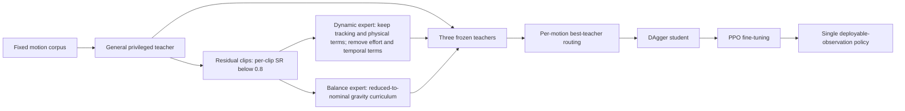

# Athena-WBC: Capability-Aligned Policy Experts for Long-Tail Humanoid Whole-Body Control

| Field | Value |
| --- | --- |
| Primary source | [Current arXiv v3 record](https://arxiv.org/abs/2607.04837v3), withdrawn 2026-08-24; mechanism extraction uses [archived v2](https://arxiv.org/abs/2607.04837v2), revised 2026-07-07 |
| Source pin | v2 PDF SHA-256 `ce14fd2a8569b9016316883b3190e00eafa41b6349cb2bedcaea9314e2723b5a`; v2 source archive SHA-256 `e1bbf1519bad0b205cdf5442d9c17ad79c623635215ae754ab441d4c84a7a5ac` |
| Public implementation | No code or project URL is linked in v2; no code revision can be pinned |
| Harness relevance | Task-reward hypothesis and independent evaluation; reference routing is analogy only; the reported pipeline changes the trainer |
| Evidence tier | Supporting, **quarantined** |

> **Evidence stop:** arXiv v3 says unresolved authorization and data-governance concerns affect the experimental dataset and reported results, and instructs readers not to rely on the work. Numerical results below are historical v2 reports, not admissible evidence.

## Main point

Archived v2 reports that capability-specific reward and curriculum changes recover different motion failures, but v3 withdrawal makes the performance claims unusable; only the mechanism sketch remains a hypothesis to test independently.

## Mechanism

The paper changes reward composition, curriculum, observations, policy count, distillation, and fine-tuning. It is not a fixed-trainer experiment.

## Exact parameters

| Parameter | Value | Context | Source locator |
| --- | ---: | --- | --- |
| Teacher-evaluation rollouts per clip | 10 | Residual mining and routing | v2 §3.1, Eq. `success_rate` |
| Residual failure threshold | SR < 0.8 | Fewer than 80% successful rollouts | v2 §3.1, Eq. `residual_failure_set_gen` |
| Frozen teacher bank | 3 policies | General, dynamic, balance | v2 §3.1, Eq. `policy_set` |
| Dynamic-expert reward | tracking + physical constraints | Effort and temporal-control terms set to zero | v2 §3.1, Eq. `caps_reward_family` |
| Expert / student actor observations | 1,837 / 2,081 dims | Privileged expert versus deployable student | v2 Table 1 |
| Total training set | 55,482 clips; 175.88 h | Four component corpora | v2 §4.1 |
| Main parallel rollout budget | 16,384 environments | 8 GPUs × 2,048 environments | v2 §4.1 |
| Main non-finetuned horizon | 40,000 iterations | Same budget for baseline, NoSmooth, and teachers | v2 §4.1 |
| Evaluation replication | 3 training seeds; 5 rollouts/clip/seed | Deterministic actor mean under standard domain randomization | v2 §4.2 |
| Success thresholds | 0.20 m root height; 0.50 rad yaw; 0.50 m max key-body error | Any violating frame fails the rollout | v2 §4.2, Eq. `success_rate_threshold` |
| PPO optimizer / learning rate | Adam / 2×10⁻⁵, adaptive | Shared ablation setting | v2 Appendix A, Table `ppo-hparams` |
| PPO clip / discount / GAE | 0.2 / 0.99 / 0.95 | Shared ablation setting | v2 Appendix A, Table `ppo-hparams` |
| Desired KL / epochs / minibatches | 0.01 / 5 / 4 | Shared ablation setting | v2 Appendix A, Table `ppo-hparams` |
| Value / entropy coefficients | 50.0 / 0.005 | Shared ablation setting | v2 Appendix A, Table `ppo-hparams` |
| Reconstruction / token / cycle coefficients | 1.0 / 1.0 / 1.0 | Shared ablation setting | v2 Appendix A, Table `ppo-hparams` |
| Maximum gradient norm | 0.1 | Shared ablation setting | v2 Appendix A, Table `ppo-hparams` |
| Diagnostic manifests | 1,000 dynamic; 1,000 balance clips | 133 and 396 motion families, respectively | v2 Appendix D |
| Gravity curriculum floor and schedule | **Not reported** | Only α ∈ [α_min, 1] is specified | v2 §3.1, Eq. `gravity_curriculum` |
| Grad-CAPS weight | **Not reported** | λ_reg appears symbolically | v2 §3.1, Eq. `ppo_gradcaps_loss` |
| Adaptive-sampler β, D_max, ε, ρ | **Not reported** | Form is given without values | v2 Appendix B, Eqs. `score_ema`–`clip_rollout_prob` |
| DAgger / fine-tuning schedules | **Not reported** | Auxiliary weight, critic warm-up, actor unfreeze, and action-noise magnitudes omitted | v2 §§3.3–3.4 |

## What transfers to Sam's harness

- **Task-reward candidate, not evidence:** separate hard physical-feasibility penalties from soft effort/temporal preferences. Test removal or reweighting only inside the authorable task reward; keep the tracking reward and trainer fixed.
- **Evaluation:** STC/TIS expose threshold sensitivity. MPJPE-W exposes errors on motion-defining joints. Compute them outside the generated reward.
- **Reference/oracle analogy:** per-reference rollout scores could rank alternative oracle/reference compositions. Athena routes *teachers*, not references, so this is a new hypothesis.
- **Negative control:** compare data-only reallocation against reward-only changes under the same immutable execution manifest and budget.

## What does not transfer

- The paper is not evidence that any performance gain is real; v3 explicitly withdraws the results.
- Athena changes teacher observations, gravity, adaptive sampling, policy count, DAgger, fine-tuning, and training stages. Those changes violate Sam's fixed-trainer contract.
- Motion-level best-teacher routing is supervision routing. It is not OGMP oracle logic or reference composition.
- The paper changes reward-level effort and temporal terms; it does not justify changing Sam's frozen tracking reward.
- No public code, weights, dataset manifest, or robot platform is available to verify an implementation claim.

## Failure modes and caveats

- **Withdrawn evidence:** dataset authorization/data governance affects the reported results.
- **Reference confounding:** v2 says failures may arise from retargeting defects, data artifacts, or physical infeasibility.
- **Incomplete coverage:** v2 reports less than 100% training-set coverage.
- **Coverage/generalization trade-off:** RL fine-tuning reportedly improves held-out metrics while degrading several training long-tail metrics.
- **Residual low-frequency sway:** larger CAPS/Grad-CAPS weights reportedly did not remove it.
- **Reproduction gap:** essential curriculum, regularization, sampler, DAgger, and fine-tuning values are omitted.
- **Baseline scope:** SONIC is reimplemented on a different 80 kg platform; v2 says absolute results are not comparable to released SONIC weights.
- **Compute scope:** the authors say saturation behavior is untested.
- **Deployment gap:** no systematic quantitative real-robot results; the platform was unreleased.
- **Engineering cost:** multiple teachers, mining, routing, distillation, and fine-tuning add coupled choices outside a two-knob harness.

## Evidence ledger

| ID | Claim | Source locator |
| --- | --- | --- |
| ATH-W0 | Current status is withdrawn; readers should not rely on the results | [arXiv v3, comments and submission history](https://arxiv.org/abs/2607.04837v3) |
| ATH-M1 | v2 uses general/dynamic/balance teachers, per-motion routing, DAgger, and PPO fine-tuning | [arXiv v2](https://arxiv.org/abs/2607.04837v2), §3 and Fig. 1 |
| ATH-R1 | Dynamic reward retains tracking and physical terms but removes effort and temporal terms | v2 §3.1, Eq. `caps_reward_family` |
| ATH-C1 | Balance expert uses a reduced-to-nominal gravity curriculum | v2 §3.1, Eq. `gravity_curriculum` |
| ATH-O1 | Best teacher is selected per motion by empirical rollout success | v2 §3.2, Eqs. `routed_teacher_index`–`routing_table` |
| ATH-T1 | Training setup uses a different embodiment and a same-platform SONIC-recipe reimplementation | v2 §4.1 |
| ATH-E1 | Evaluation uses three seeds, five rollouts, and fixed full-horizon thresholds | v2 §4.2 |
| ATH-E2 | v2 reports held-out gains and a tracking/smoothness trade-off | v2 Table 3; **withdrawn result** |
| ATH-E3 | v2 reports distinct dynamic/balance expert behavior and lower post-RL training coverage | v2 Table 4; **withdrawn result** |
| ATH-E4 | v2 defines STC, TIS, and MPJPE-W | v2 §4.2 and Appendix C |
| ATH-L1 | v2 lists reference confounding, low-frequency sway, pipeline complexity, compute limits, and absent quantitative real-robot validation | v2 Limitations |
| ATH-P1 | Shared PPO values are reported, but key mechanism coefficients and schedules are not | v2 Appendix A–B and §§3.1–3.4 |
