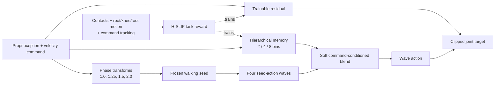

# GaitSpan: Growing Humanoid Locomotion from Walking to Running

| Field | Value |
| --- | --- |
| Primary source | [arXiv:2607.12114v1](https://arxiv.org/html/2607.12114v1), 13 July 2026 |
| Supplement | [Official project page](https://gaitspan2026.github.io/) |
| Harness relevance | Task reward; reference-composition hypothesis; evaluation; fixed-trainer boundary |
| Evidence tier | Core |

## Main point

Across five humanoid configurations, GaitSpan couples phase-scaled composition of a frozen walking policy with an event-level H-SLIP reward; ablations report that neither component alone matches the full tracking/flight balance, but only H-SLIP is directly inside Sam's task-reward knob because GaitWave and its residual branch change the fixed policy architecture.

## Mechanism

## Exact parameters

| Parameter | Value | Context | Source locator |
| --- | ---: | --- | --- |
| Frozen seed phase scales | `1.0, 1.25, 1.5, 2.0` | GaitWave queries of one walking policy | App. D.3 |
| Anchor coefficient target | `1.0, 0.25, 0.10, 0.05` | Corresponding weights over the four scales | App. D.3 |
| Memory resolutions | `2, 4, 8` bins | Parallel command partitions with soft cross-bin retrieval | Sec. 3.2; App. D.3 |
| Softmax temperature | `0.08` | Temperature-scaled blend | App. D.3 |
| Physics / control rates | `200 / 50 Hz` | Isaac Gym training | App. D.3 |
| Parallel environments | `4,096` | Isaac Gym training | Sec. 4; App. D.3 |
| Episode / command duration | `20 / 10 s` | Episode length / command resampling | App. D.3 |
| Standing-command probability | `0.2` | Command sampling | App. D.3 |
| High-speed sampling bias | exponent `1.0 -> 2.6` over first `95%` | Concentrates samples near `2.2 m/s` | App. D.3 |
| FastSAC learning rates | `3e-4` | Actor, critic, and entropy | App. D.3 |
| Replay / update settings | buffer `1,024`; batch `8,192`; `8` updates/step; policy every `4` steps | FastSAC | App. D.3 |
| Discount / Polyak coefficient | `0.97 / 0.125` | FastSAC | App. D.3 |
| Distributional critic | `101` atoms on `[-20, 20]` | Hidden sizes `512 / 768`; bf16 | App. D.3 |
| Key reward weights | linear tracking `3.0`; flight `3.6`; global SLIP `4.8`; upper/lower SLIP `3.6` each | Per-step sum uses weight times timestep times term | App. D.3, Table 1 |
| Robot configurations | T1 `23/29` DoF; K1 `22` DoF; G1 `23/29` DoF | Five configurations across three robot families | Sec. 4; App. D.4 |
| Training iterations | T1 `100K`; K1 `100K`; G1 `50K` | Robot-specific settings | App. D.4, Table 3 |

## What transfers to Sam's harness

- Candidate task reward: compute compression, rebound, touchdown, flight, and stance-slip terms from root/knee/foot geometry and contacts; gate rebound by velocity tracking.
- Keep evaluation independent: report raw velocity error, aerial duration, energy, falls, and contact quality rather than the generated reward scalar.
- Oracle hypothesis, not result: phase-transform immutable reference modes and soft-blend adjacent modes by command to avoid hard transition boundaries.
- Test reward-only and oracle-only interventions separately with the controller, observations, actions, dynamics, tracking reward, training algorithm, and budget frozen.
- Require an executable specification for every gate, width, weight, contact threshold, and frame convention before admitting an H-SLIP-derived reward.

## What does not transfer

- GaitWave's hierarchical memory, extra seed-policy queries, residual policy, self-anchored losses, FastSAC settings, sampling curriculum, and policy phase input are controller/trainer changes outside Sam's initial two-knob contract.
- GaitWave is not evidence for an external reference-dataset oracle or an OGMP state machine; it composes outputs of a frozen walking policy inside a new policy architecture.
- The full-system result does not isolate H-SLIP or GaitWave: the single-component ablations each fail a different objective.
- The paper demonstrates one walking-to-faster-gaits expansion, not a recursive harness that improves and reseeds itself.
- Qualitative real-world videos do not establish a deployment success rate.

## Failure modes and caveats

- A weak or narrow walking seed constrains emergent behaviors; v1 studies only one-step growth.
- GaitWave alone gives limited flight/high-speed expressiveness; H-SLIP alone becomes aggressive and loses OOD tracking.
- One global coefficient map leaks high-speed deviations into walking; hard command partitions produce boundary artifacts.
- Direct fine-tuning can overwrite stable walking; from-scratch variants do not recover a coherent gait family.
- Equation (2) uses an undefined dynamic gate, and v1 does not numerically specify the tracking/touchdown widths or every internal H-SLIP weight.
- Evaluation plots do not report rollout counts, independent training seeds, or uncertainty intervals.
- The project page's Code link targeted `LeCAR-Lab/GaitSpan`, which returned 404 on 30 August 2026; implementation claims were not code-verified.

## Evidence ledger

| ID | Claim | Source locator |
| --- | --- | --- |
| E1 | v1 metadata, title, authors, and submission date. | [arXiv v1](https://arxiv.org/abs/2607.12114v1) |
| E2 | The frozen seed, wave composer, and residual define the final action. | [Sec. 3; Eq. 1](https://arxiv.org/html/2607.12114v1#S3.E1) |
| E3 | GaitWave phase-scales seed queries and softly blends a multi-resolution coefficient field. | [Sec. 3.2](https://arxiv.org/html/2607.12114v1#S3.SS2) |
| E4 | H-SLIP defines virtual-leg compression, rebound, touchdown, flight, and slip terms. | [Sec. 3.3; Eq. 2](https://arxiv.org/html/2607.12114v1#S3.E2) |
| E5 | The total objective adds H-SLIP and subtracts self-anchored regularization. | [Eq. 3](https://arxiv.org/html/2607.12114v1#S3.E3) |
| E6 | Training uses five robot configurations, Isaac Gym, FastSAC, and three evaluation metrics. | [Sec. 4](https://arxiv.org/html/2607.12114v1#S4) |
| E7 | Baseline and component ablations report complementary GaitWave/H-SLIP behavior. | [Secs. 4.2-4.3](https://arxiv.org/html/2607.12114v1#S4.SS2) |
| E8 | Exact GaitWave, simulator, sampling, and FastSAC parameters are reported. | [App. D.3](https://arxiv.org/html/2607.12114v1#A4.SS3) |
| E9 | Reward weights and domain-randomization ranges are tabulated. | [App. D.3, Tables 1-2](https://arxiv.org/html/2607.12114v1#A4.T1) |
| E10 | Self-anchoring comprises seed proximity, residual compactness, phase similarity, and temporal consistency. | [App. D.1](https://arxiv.org/html/2607.12114v1#A4.SS1) |
| E11 | Detailed ablations identify failures of global maps, hard partitions, and shallow SLIP hierarchies. | [App. C.1](https://arxiv.org/html/2607.12114v1#A3.SS1) |
| E12 | Robot-specific training iterations and configurations are reported. | [App. D.4, Table 3](https://arxiv.org/html/2607.12114v1#A4.T3) |
| E13 | Limitations name seed dependence and one-step, non-recursive growth. | [Sec. 6](https://arxiv.org/html/2607.12114v1#S6) |
| E14 | The official page shows qualitative real-world terrains, perturbations, and embodiment examples. | [Project page](https://gaitspan2026.github.io/) |
| E15 | The project page's official Code link resolves to an unavailable repository. | [Official Code target](https://github.com/LeCAR-Lab/GaitSpan/) |

