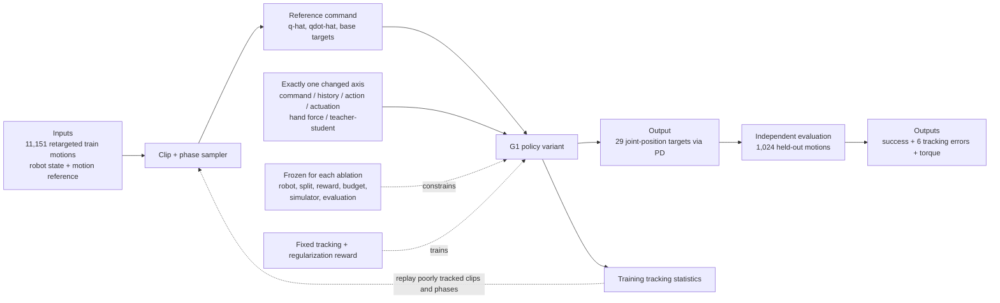

# What Matters in Humanoid General Motion Tracking? An Empirical Study

| Field | Value |
| --- | --- |
| Primary source | [arXiv:2607.19903v1](https://arxiv.org/html/2607.19903v1), 22 July 2026 |
| Code pin | Paper-linked [`hucebot/yahmp@2111a998`](https://github.com/hucebot/yahmp/tree/2111a998663e9f787b3ac36e8f8a7c17745ca83f), inspected 30 August 2026; no experiment-to-commit identity is claimed |
| Harness relevance | Evaluation; fixed-trainer boundary; reference interface; fixed task-reward baseline |
| Evidence tier | Core |

## Main point

Under one Unitree G1 PPO pipeline and 1,024 held-out retargeted motions, removing reference joint velocity or a 10-step history worsened all six mean tracking errors by 7--15% and 10--50%, respectively, while the other controlled changes were mixed; this supports freezing interfaces and using multi-metric evaluation, not treating YAHMP's trainer or reward as universally optimal.

## Mechanism

## Exact parameters

| Parameter | Value | Context | Source locator |
| --- | ---: | --- | --- |
| Robot action space | `29` joints | Unitree G1 joint-position targets | Sec. II-A |
| Motion command | `q_hat`, `qdot_hat`, planar base velocity, yaw rate, base height, roll, pitch | Nominal deployable reference input | Sec. II-B, Eq. 2 |
| History | nominal `10`; alternatives `0`, `20` steps | Past command and proprioception pairs | Sec. II-B, Eq. 3; Table I |
| Actor/critic MLP | `512, 512, 256, 128` | ELU; running normalization; final-hidden-layer LayerNorm | Sec. II-E |
| History encoder | channels `48, 24`; kernels `6, 4`; strides `2, 2`; output `64` | 1-D temporal convolution | Sec. II-E |
| Nominal action | `q_target = q_hat + alpha * action` | Residual around reference; alternative centers on default posture | Sec. II-C, Eqs. 4--6 |
| Mechanics-based actuation | `omega_0 = 2*pi*10 rad/s`; damping ratio `2`; `alpha = 0.25*tau_max/k_p` | Nominal PD profile | Sec. II-D, Eqs. 7--9 |
| Motion split | `12,175` total; `11,151` train; `1,024` test | Retargeted AMASS + OMOMO; motion clips disjoint | Sec. II-H |
| Training scale | `8,192` environments; `20,000` PPO iterations; about `25 h`; one RTX 4090 | Every YAHMP variant | Sec. II-H |
| Teacher-student | teacher `20,000` + student `20,000` iterations; KL `0.10 -> 0.07` | Both stages use PPO; teacher frozen for student | Sec. II-H |
| Simulation evaluation | `0.005 s` step; `50 Hz`; `1,024` test motions | Starts at first frame; no perturbations; torso-ground contact defines failure | Sec. III |
| Nominal mean errors | base pos/orient `0.197 m / 0.121 rad`; body pos/orient `0.044 m / 0.123 rad`; joint pos/vel `0.377 rad / 1.69 rad/s` | Time-average per motion, then aggregate across motions | Table II |
| Remove reference joint velocity | `+7, +14, +9, +9, +8, +15%` | Same metric order as nominal row | Table II |
| Remove history | `+38, +50, +10, +11, +10, +17%` | Same metric order as nominal row | Table II |
| Other one-factor changes | History-20 `-6,-7,+1,+4,+4,+4%`; no residual `+1,-5,+5,+6,+5,0%`; teacher-student `-8,+8,0,-8,-6,-3%` | Mixed effects across metrics | Table II |
| Stiffer-profile torque effect | maximum all-joint `+13%`; maximum upper-body `+41%` | Tracking changes were mixed | Tables II--III |
| Hand-force randomization | duration `[0.5,2.0] s`; cap `20 N` | Training perturbation applied around wrist | Appendix Table VII |
| Hand-load outcome | at `4 kg`: elbow deviation `15.5 deg` disabled vs `6.6 deg` enabled | One controlled execution per policy; enabled policy also held `5` and `6 kg` | Table IV; Sec. IV-B |
| Reward baseline | 8 exponential tracking terms plus excess-foot-force, slip, action-rate, and joint-limit costs | Held constant across all variants | Appendix Table VIII |
| Public code snapshot | commit `2111a998663e9f787b3ac36e8f8a7c17745ca83f`; package `0.1.0`; `mjlab==1.2.0` | Pin for inspection, not a claimed experiment artifact | Official repository commit and `pyproject.toml` |

## What transfers to Sam's harness

- Freeze the entire controller-facing interface: reference fields, history length, action centering, PD profile, randomization, trainer, dataset split, seed protocol, and budget. The measured effects are large enough to confound an oracle or reward comparison.
- Treat explicit reference velocity and the playback clock/history as part of the immutable reference-conditioning contract; a phase-indexed reward is not a substitute for actor conditioning.
- Use an independent metric vector: fall completion, base pose, key-body pose, joint pose/velocity, and torque. Add interaction-load metrics only for tasks that require force.
- Aggregate per rollout before aggregating across clips, preserve a fixed held-out clip set, and report distributions or uncertainty rather than only reward return.
- Admit the paper's tracking reward table only as a reproducible baseline. Reward-search experiments must keep the independent metrics unchanged.
- Consider tracking-statistic replay of poorly tracked clips/phases as a separate curriculum switch. Do not silently bundle it into oracle composition.

## What does not transfer

- Motion-command fields, history, residual action centering, PD gains, hand-force randomization, and teacher-student training are fixed-controller/trainer choices outside Sam's first two optimization knobs.
- The paper does not build an oracle, compose reference modes, generate task rewards, accept human steering, or recursively improve a harness.
- Its reward coefficients were not ablated and are not evidence of an optimal or transferable task reward.
- TWIST2 is a complete external pipeline. Its metric differences cannot be assigned to one mechanism.
- The code commit is a reproducibility inspection pin; the paper does not state that it is the exact checkpoint-producing snapshot.
- Zero-shot hardware demonstrations do not establish reliability on other robots, scenes, or autonomous manipulation tasks.

## Failure modes and caveats

- Omitting reference joint velocity or all temporal history materially degrades all six tracking metrics.
- A stiffer fixed-scale PD profile raises torque peaks and creates more ankle oscillation without a consistent tracking gain.
- Residual actions and teacher-student training have mixed metric effects; a single scalar score would hide reversals.
- The study changes one factor at a time around one nominal configuration; interactions and transfer to other humanoids remain untested.
- Train and test motions may share source datasets and subjects; only the retargeted clips are disjoint.
- The table reports one main training result. An extra seed is described as trend-consistent, but per-seed estimates and uncertainty are not reported.
- All simulated policies achieved 100% success under a narrow fall definition: torso-ground contact. This is not task completion or naturalness.
- Push, mattress, and box-lift evidence is qualitative. The hand-load table is one controlled execution per policy, and the actuation comparison is one matched crouch phase.

## Evidence ledger

| ID | Claim | Source locator |
| --- | --- | --- |
| E1 | v1 metadata, authors, date, and abstract. | [arXiv v1](https://arxiv.org/abs/2607.19903v1) |
| E2 | The deployable command includes reference joint position and velocity plus base targets; history variants are 0/10/20. | [Sec. II-B; Eqs. 1--3; Table I](https://arxiv.org/html/2607.19903v1) |
| E3 | Residual and default-centered actions feed saturated PD joint control. | [Sec. II-C; Eqs. 4--6](https://arxiv.org/html/2607.19903v1) |
| E4 | Mechanics-based gains/scales and the exact joint-group profiles are specified. | [Sec. II-D; Eqs. 7--9; Appendix Table VI](https://arxiv.org/html/2607.19903v1) |
| E5 | Actor/critic and temporal-history encoder dimensions are specified. | [Sec. II-E](https://arxiv.org/html/2607.19903v1) |
| E6 | Domain randomization and hand-force ranges are specified. | [Sec. II-F; Appendix Table VII](https://arxiv.org/html/2607.19903v1) |
| E7 | One reward is held across variants; clip and phase sampling is reweighted by training tracking statistics. | [Sec. II-G; Appendix Table VIII](https://arxiv.org/html/2607.19903v1) |
| E8 | Dataset split, PPO setup, environment count, iterations, GPU, and approximate runtime are reported. | [Sec. II-H](https://arxiv.org/html/2607.19903v1) |
| E9 | PPO and teacher-student hyperparameters are tabulated. | [Appendix Table V](https://arxiv.org/html/2607.19903v1) |
| E10 | Evaluation fixes simulator cadence, held-out motions, initialization, perturbations, success rule, metrics, and aggregation order. | [Sec. III, opening protocol](https://arxiv.org/html/2607.19903v1) |
| E11 | Absolute errors and all controlled factor changes are reported over 1,024 motions. | [Table II](https://arxiv.org/html/2607.19903v1) |
| E12 | The stiffer profile increases torque peaks despite mixed tracking effects. | [Table III; Sec. III-A.4](https://arxiv.org/html/2607.19903v1) |
| E13 | Reference velocity, history, action, actuation, and teacher-student ablations are interpreted separately; an extra seed is described as trend-consistent. | [Sec. III-A](https://arxiv.org/html/2607.19903v1) |
| E14 | TWIST2 is retrained on the same motions and iterations but remains a complete-pipeline baseline. | [Sec. III-B; Table II](https://arxiv.org/html/2607.19903v1) |
| E15 | Hardware deployment uses the same checkpoint at 50 Hz; pushes and unseen soft-ground trials are qualitative demonstrations. | [Sec. IV-A](https://arxiv.org/html/2607.19903v1) |
| E16 | One controlled hand-load execution per policy quantifies elbow displacement from 1--6 kg. | [Sec. IV-B; Table IV](https://arxiv.org/html/2607.19903v1) |
| E17 | The 1.5 kg box lift is explicitly a replay, not autonomous manipulation or replanning. | [Sec. IV-B; Fig. 6](https://arxiv.org/html/2607.19903v1) |
| E18 | One matched crouch shows larger torque peaks and oscillation for the stiffer profile. | [Sec. IV-C; Fig. 7](https://arxiv.org/html/2607.19903v1) |
| E19 | The authors limit the study to one robot and one-at-a-time changes; factor interactions remain open. | [Conclusion](https://arxiv.org/html/2607.19903v1) |
| E20 | The paper-linked public repository is pinned at commit `2111a998`; its package declares version 0.1.0 and `mjlab==1.2.0`. | [Official code commit](https://github.com/hucebot/yahmp/tree/2111a998663e9f787b3ac36e8f8a7c17745ca83f) |
