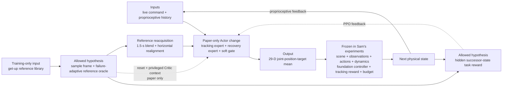

# StableMimic: Smooth Human-Like Recovery for Humanoid Motion Tracking

| Field | Value |
| --- | --- |
| Primary source | [arXiv:2608.02385v1](https://arxiv.org/html/2608.02385v1), submitted 3 August 2026 |
| Exact-version pin | PDF SHA-256 `a682d048fdd10fc16671b7af3bca82414fb70652f039e7fa788b343b0beb86d0`; source-archive SHA-256 `dec60ed8b8aaff149e33c162eea9742d67681f9cdc68978114a2b2910032c07f` |
| Status | Eight-page preprint; not formally peer reviewed in v1 |
| Harness relevance | Reference composition; task reward; evaluation; fixed-trainer boundary |
| Evidence tier | Core |

## Main point

Under a joint change to references, resets, reward, Actor/Critic architecture, and auxiliary losses—not a two-knob-only intervention—StableMimic reports `100/100` recovery trials and `28.53 mm` tracking MPBPE; the transferable hypotheses are a training-only recovery-reference oracle, successor-state task shaping, and explicit command-reference reacquisition.

## Mechanism

## Exact parameters

| Parameter | Value | Context | Source locator |
| --- | ---: | --- | --- |
| Observation dimensions | Actor `4 x 221 = 884`; gate `372`; Critic `1428` | Four-frame Actor history; get-up slots always zero for Actor | [Sec. III-A; Table II](https://arxiv.org/html/2608.02385v1#S3.SS1) |
| Networks | Experts `512-256-128`; Single MLP `1024-512-256`; ELU; `29-D` mean | MoE versus controlled Single-MLP ablation | [Appendix A, Table V](https://arxiv.org/html/2608.02385v1#A1) |
| Parameters | MoE Actor `1,298,301`; Single Actor `1,569,850`; Critic `896,001` | Single MLP is larger than MoE | [Appendix A, Table V](https://arxiv.org/html/2608.02385v1#A1) |
| PPO | `gamma=0.99`; GAE `lambda=0.95`; clip `0.2`; adaptive LR `0.001`; `24` steps; `5` epochs; `4` mini-batches; gradient norm `<=1.0` | Shared optimization protocol | [Appendix A, Table V](https://arxiv.org/html/2608.02385v1#A1) |
| Gate losses | CE `0.1`; transition `4.0`; consistency `0.01`; alignment `0.01`; entropy `0.05` | Training-only routing supervision | [Appendix A, Table V](https://arxiv.org/html/2608.02385v1#A1) |
| Training scale | `4,096` environments; `50 Hz`; `20 s` horizon | Equal tracking/recovery episode probability | [Appendix A, Table V](https://arxiv.org/html/2608.02385v1#A1) |
| Recovery-to-command transition | `1.5 s` | Smooth return to advancing command after terminal similarity | [Sec. III-B](https://arxiv.org/html/2608.02385v1#S3.SS2) |
| Persistent target-error tolerance | `2.0 s` | Recovery termination | [Sec. III-B](https://arxiv.org/html/2608.02385v1#S3.SS2) |
| Recovered-like routing safeguard | base height `>=0.8` of command height | Retains tracking gate target | [Sec. III-C](https://arxiv.org/html/2608.02385v1#S3.SS3) |
| Recovery reward coefficient | `2.5x` nominal command coefficient | Coefficient ratio, not realized-return ratio | [Sec. III-C, Eq. 4](https://arxiv.org/html/2608.02385v1#S3.E4) |
| Reset position noise | `x,y +/-0.05 m`; `z +/-0.01 m`; roll/pitch `+/-0.1 rad`; yaw `+/-0.2 rad` | Perturbations around sampled get-up frames | [Appendix A, Table V](https://arxiv.org/html/2608.02385v1#A1) |
| Reset velocity noise | linear `x,y +/-0.5 m/s`, `z +/-0.2 m/s`; angular roll/pitch `+/-0.52 rad/s`, yaw `+/-0.78 rad/s` | Perturbations around sampled get-up frames | [Appendix A, Table V](https://arxiv.org/html/2608.02385v1#A1) |
| Joint noise | `+/-0.1 rad` where enabled | Recovery-reset perturbation | [Appendix A, Table V](https://arxiv.org/html/2608.02385v1#A1) |
| Evaluation dynamics | MuJoCo step `0.005 s`; deterministic actions at `50 Hz`; recovery horizon `20 s` | Nominal G1 test environment | [Sec. IV-A](https://arxiv.org/html/2608.02385v1#S4.SS1) |
| Push protocol | `100` matched trials; `25` per `+/-x,+/-y`; `0.2 s`; `525-575 N` | Same pre-generated disturbances per method | [Sec. IV-A](https://arxiv.org/html/2608.02385v1#S4.SS1) |
| Fall threshold | pelvis `<0.50 m` or tilt `>60 deg` | Starts fixed three-second post-fall metric window | [Sec. IV-A](https://arxiv.org/html/2608.02385v1#S4.SS1) |

## Reported evaluation

| Protocol | StableMimic result | Comparator context | Source locator |
| --- | --- | --- | --- |
| Complete retargeted LAFAN1 dance subset | MPBPE `28.53 mm`; MJAE `88.83e-3 rad`; MJAVE `798.22e-3 rad/s`; relative acceleration error `2.08 mm/frame^2` | Lowest value on all four metrics among five methods | [Table III](https://arxiv.org/html/2608.02385v1#S4.T3) |
| 100 matched push-to-fall trials | Success `100/100`; limb-speed P95 `4.91 m/s`; limb path `13.80 m`; joint-speed P95 `5.26 rad/s`; target-rate P95 `17.35 rad/s`; displacement `1.32 m`; torque P95 `19.64 N m`; positive energy `0.61 kJ` | Lowest six of seven motion/load measures; BFM-Zero has lower target rate | [Table IV](https://arxiv.org/html/2608.02385v1#S4.T4) |
| Controlled MoE/Single-MLP comparison | Single MLP: MPBPE `32.66 mm`, recovery `98/100`; MoE: `28.53 mm`, `100/100` | Same observations, actions, Critic, reward, and PPO; architecture differs | [Secs. IV-A–B](https://arxiv.org/html/2608.02385v1#S4) |
| Real Unitree G1 | Dance and constant-standing Actors recover and resume their commands | Qualitative demonstrations only | [Sec. IV-D](https://arxiv.org/html/2608.02385v1#S4.SS4) |

## What transfers to Sam's harness

- Reference-oracle candidate: select a get-up trajectory and frame, advance the same hidden reference, oversample failed phase bins, and hand back to the live command after terminal similarity.
- Reference-composition candidate: realign horizontal translation to the recovered pose while retaining command yaw and local motion continuity.
- Task-reward candidate: score the physical successor against the next hidden recovery state; use root height—not global root translation—for translated get-ups.
- Keep the existing tracking reward fixed. Treat `K_get`, transition shaping, and load-aware penalties as separately ablated task-reward additions, not a silent replacement.
- Run four frozen-trainer cells: baseline, oracle only, task reward only, and both. StableMimic's full-system result does not answer this ablation.
- Keep objective metrics outside the authored reward: recovery success, limb speed/path, joint speed, target rate, workspace, torque, energy, and nominal tracking error.
- Preserve the paper's information boundary as a testable option: training-only reference identity/phase; no runtime get-up reference or external switch.

## What does not transfer

- The dual-expert Actor, soft gate, privileged Critic inputs, gate losses, and network widths change Sam's frozen controller/trainer contract.
- Perturbed recovery resets, equal tracking/recovery episode sampling, dynamics randomization, and failed-frame curriculum change the training-state distribution; they require an explicit experiment outside a strict reward/oracle-only run.
- The paper does not study an LLM, natural-language steering, executable reward generation, recursive improvement, or an external OGMP state machine.
- Its results do not isolate reference composition or task reward from the architecture, reset, curriculum, and auxiliary-loss changes.
- `100/100` simulation recovery under one force protocol is not a universal recovery or safety guarantee.

## Failure modes and caveats

- The recovery support is empirical, not a formal reachability set; behavior outside sampled perturbed get-up neighborhoods is outside the paper's claim.
- Action-rate, joint-limit, self-collision, and power penalties are load-aware but do not certify safety.
- Cross-method comparisons retain each baseline's native training procedure and command interface, limiting causal attribution to the full StableMimic mechanism.
- Training curves are descriptive, not causal evidence that the experts are independent.
- Hardware evidence is qualitative and is neither a matched architecture comparison nor a safety certification.
- v1 is an eight-page, non-peer-reviewed preprint with no public implementation linked from the primary source.

## Evidence ledger

| ID | Claim | Source locator |
| --- | --- | --- |
| E1 | Exact v1 metadata, authors, submission date, abstract, and preprint status. | [arXiv v1](https://arxiv.org/abs/2608.02385v1) |
| E2 | Recovery references are training-only and are masked from the deployed Actor. | [Sec. III-A; Table II](https://arxiv.org/html/2608.02385v1#S3.SS1) |
| E3 | A sampled, perturbed get-up frame advances as a hidden reference; the physical successor is scored against its next state. | [Sec. III-B; Eq. 2](https://arxiv.org/html/2608.02385v1#S3.E2) |
| E4 | Hard-frame sampling, termination, and a timed transition implement the recovery-to-command lifecycle. | [Sec. III-B](https://arxiv.org/html/2608.02385v1#S3.SS2) |
| E5 | Two experts are continuously blended by a proprioception-only gate with training-only regime supervision. | [Sec. III-C; Eq. 3](https://arxiv.org/html/2608.02385v1#S3.E3) |
| E6 | The regime-conditioned reward uses six Gaussian-kernel error families, recovery root height, regularizers, and a `2.5x` recovery coefficient. | [Sec. III-C; Eq. 4](https://arxiv.org/html/2608.02385v1#S3.E4) |
| E7 | Deployment removes the get-up library; horizontal translation is realigned before command resumption. | [Sec. III-D](https://arxiv.org/html/2608.02385v1#S3.SS4) |
| E8 | Unitree G1, sequence-disjoint LAFAN1 subsets, nominal MuJoCo settings, and the matched disturbance protocol define evaluation. | [Sec. IV-A](https://arxiv.org/html/2608.02385v1#S4.SS1) |
| E9 | Tracking, fall, recovery, and three-second motion/load metrics are defined independently of the training reward. | [Sec. IV-A, Evaluation metrics](https://arxiv.org/html/2608.02385v1#S4.SS1) |
| E10 | StableMimic has the lowest values on all four reported tracking metrics. | [Table III](https://arxiv.org/html/2608.02385v1#S4.T3) |
| E11 | StableMimic recovers `100/100` and has the lowest six of seven post-fall motion/load measures. | [Table IV](https://arxiv.org/html/2608.02385v1#S4.T4) |
| E12 | MoE training curves are explicitly described as non-causal evidence of expert independence. | [Sec. IV-C](https://arxiv.org/html/2608.02385v1#S4.SS3) |
| E13 | Real-G1 results are qualitative and not a certification or matched hardware comparison. | [Sec. IV-D](https://arxiv.org/html/2608.02385v1#S4.SS4) |
| E14 | Exact architecture, PPO, gate-loss, training, and reset settings are tabulated. | [Appendix A, Table V](https://arxiv.org/html/2608.02385v1#A1) |
