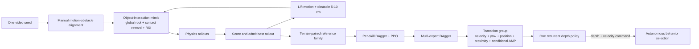

# Light-Loco-Parkour: Versatile Perceptive Whole-Body Locomotion via Multi-Skill Distillation

| Field | Value |
| --- | --- |
| Primary source | [arXiv:2608.02653v1](https://arxiv.org/abs/2608.02653v1), submitted 2026-08-01; PDF SHA-256 `1002633c2f96b8931a92d4b59e8f37081c91d0ea895f6221724f57d6ae1da760`; TeX-source SHA-256 `b55f611e6a87df540300d9319039e3c6d90c3227ae1e27e1e6f1e4d67a23b423` |
| Public project snapshot | [Light-Loco-Parkour project site, commit `33de3357`](https://github.com/Light-Loco-Parkour/light-loco-parkour.github.io/tree/33de335763540bcd5a649fd5a4f46112c9e0a293), committed 2026-08-08; no author implementation repository linked as of 2026-08-30 |
| Harness relevance | **Reference composition**, **task reward**, evaluation; strong **fixed-trainer boundary** |
| Evidence tier | Core |

## Main point

Under LightLP's staged PPO/DAgger pipeline—not a fixed trainer—the physics-grounded reference curriculum spans a reported 45–75 cm climb range and transition-group training raises transition-and-skill success from 33% to 98%; it is a mechanism source, not isolated causal evidence for Sam's two-knob harness.

## Mechanism

**Paper-fixed at deployment:** one policy; depth, proprioception, and velocity-command inputs; PD target-position action interface; 50 Hz control.  
**Changed during the paper's training pipeline:** terrain, reference, observation privileges, reward, reset distribution, policy stage, and training groups.

## Exact parameters

| Parameter | Value | Context | Source locator |
| --- | ---: | --- | --- |
| Per-iteration reference/obstacle lift | 5–10 cm | Iterative self-augmentation | §V-A2, Eq. 6, Algorithm 1 [E04] |
| Illustrative climb expansion | 45 → 75 cm | One seed to terrain-paired family | §I contributions [E05] |
| Reference-deviation termination | 25 cm | Object-interaction mimic / distillation | §V-B1, Table III [E07] |
| Whole-body skill experts | 3 | Climb-and-step, speed-vault, reverse-vault | §V; Fig. 2 [E02] |
| Total privileged teachers | 4 | Locomotion plus three skill teachers | Fig. 2; official project system figure [E02, E20] |
| Policy control rate | 50 Hz | Target joint positions through PD control | §III-B [E02] |
| Depth timing model | 27–33 Hz; 30–60 ms | Deployment-camera frame rate and processing latency | §VI [E11] |
| Ablation trials | 500 / setting | Randomized simulation trials | §VII-C2 [E14] |
| Ablation training budget | 15,000 iterations / variant | Same environment and budget per variant | §VII-C2 [E14] |
| Depth distillation / fine-tune | 14,000 / 1,000 iterations | Full 15,000-iteration depth-policy schedule | §VII-C2 [E14] |
| Skill-test box width / depth | 0.7–1.0 m / 0.5–1.5 m | Randomized within each height | §VII-C2 [E14] |
| Transition trials | 100 / setting | Switch and segment must both succeed | §VII-D1 [E17] |
| Transition success | 0%, 33%, 51%, 98% | No transition group (flat), no transition group (rough), no AMP, full | §VII-D1, Table VII [E17] |
| 75 cm climb student / teacher success | 33.4% / 98.6% | Deployable depth student vs privileged height-scan teacher | §VII-C2, Table V [E14] |
| Unseen-shape success | 93.4% / 95.3% | Reverse-vault / speed-vault on trapezoidal obstacle | §VII-C2, Table VI [E16] |

## What transfers to Sam's harness

- Treat reference synthesis as a closed loop: `candidate → rollout under frozen physics/controller → score → admit`.
- Bind each admitted reference to its scene geometry, embodiment, controller, cadence, and rollout evidence. LightLP's motion is explicitly paired with terrain.
- Keep the harness output narrow: an immutable reference/oracle proposal and executable task-reward proposal. Let the same external trainer evaluate each proposal.
- Test reference-family value with a fixed-budget ablation: seed-only versus admitted family, using objective success metrics outside the generated reward.
- Test oracle value against learned selection. LightLP shows that a policy can internalize behavior selection from perception, but it does not implement an external runtime oracle.
- Candidate transition-reward terms include command tracking, sparse completion, dense proximity, and a motion prior. Admit them separately; the conditional AMP trigger changes tracking logic as well as task reward.

## What does not transfer

- The full LightLP pipeline changes the terrain, privileged observations, critic inputs, resets, teacher/student stages, imitation loss, AMP prior, and policy training schedule. Those changes violate Sam's fixed-MDP/fixed-trainer comparison if copied wholesale.
- Its iterative curriculum lifts the obstacle together with the motion. Sam's initial contract holds the scene fixed; only reference/oracle logic and task reward may vary.
- Its deployed policy has **no runtime reference, skill label, state machine, or motion graph**. It is not evidence that an external OGMP-style oracle is better.
- “Dynamically feasible by construction” is local to LightLP's simulator, robot, controller, and actuator limits. It is not a portable Tier-D certificate.
- The paper does not report numeric `K`, `N`, rollout score weights, transition-reward weights, or trigger-position construction. These are reproduction gaps.
- No author implementation code is linked by the paper or pinned official project snapshot. Third-party repositories are not evidence of the reported implementation.

## Failure modes and caveats

- Seed creation still requires manual human alignment of each video and candidate obstacle.
- Sparse reward plus privileged observations does not discover the forceful contact sequence without expert distillation; the reported teacher fails to converge.
- One unaugmented reference overfits its obstacle and does not cover the evaluated height range.
- The transition policy covers a small discrete skill set and degrades on overlapping or closely spaced obstacles.
- Training-time handoff is not cue-free: a position trigger switches the discriminator from locomotion AMP to skill AMP.
- At the 75 cm frontier, the deployable student falls to 33.4% while the privileged teacher remains at 98.6%, exposing the perception/control gap.
- Chest-camera self-occlusion remains a limitation. Recurrence reduces but does not remove it.
- Controlled quantitative results are simulation-only. Hardware evidence is qualitative video/trajectory demonstration, not a reported success-rate study.

## Evidence ledger

| ID | Claim | Source locator |
| --- | --- | --- |
| E01 | v1 is the only arXiv version, submitted 2026-08-01. | [arXiv submission history](https://arxiv.org/abs/2608.02653v1) |
| E02 | The staged system uses privileged teachers, PPO/IsaacLab, PD target actions, and 50 Hz control. | [§III, Fig. 2, §III-A–B](https://arxiv.org/html/2608.02653v1) |
| E03 | Object-interaction mimic uses global-root/contact tracking, obstacle distance/size, and RSI. | [§V-A1](https://arxiv.org/html/2608.02653v1) |
| E04 | Rollouts are scored, admitted as the next reference, and lifted with the paired obstacle by 5–10 cm. | [§V-A2, Eq. 6, Algorithm 1](https://arxiv.org/html/2608.02653v1) |
| E05 | The paper reports a 45–75 cm illustrative climb-reference expansion. | [§I contributions](https://arxiv.org/html/2608.02653v1) |
| E06 | Hardest-reference DAgger plus PPO converts a privileged expert into a terrain-conditioned skill. | [§V-B1, Eqs. 7–8](https://arxiv.org/html/2608.02653v1) |
| E07 | The inherited reference-deviation termination threshold is 25 cm. | [§V-B1, Table III](https://arxiv.org/html/2608.02653v1) |
| E08 | Skill generalization pairs each terrain with its motion and adds continuous plus terminal task rewards. | [§V-B2, Eqs. 9–10](https://arxiv.org/html/2608.02653v1) |
| E09 | Multi-expert DAgger merges label-free actors; only the critic receives the group one-hot. | [§V-C1](https://arxiv.org/html/2608.02653v1) |
| E10 | Transition fine-tuning drops per-frame mimic, uses five reward terms, switches AMP at a trigger, and seeds sparse exploration with far-side resets. | [§V-C2, Eqs. 11–12, Fig. 6](https://arxiv.org/html/2608.02653v1) |
| E11 | Recurrent depth distillation models camera noise, 27–33 Hz frames, and 30–60 ms latency. | [§VI, Eq. 13](https://arxiv.org/html/2608.02653v1) |
| E12 | The project page states all quantitative results are simulation results; hardware videos show zero-shot transfer. | [Official project, evaluation section](https://light-loco-parkour.github.io/) |
| E13 | Reference comparison scores pairing, penetration, floating contact, and dynamic feasibility; LightLP reports all four. | [§VII-C1, Table IV](https://arxiv.org/html/2608.02653v1) |
| E14 | Fixed-budget ablations use 500 randomized trials, 15,000 iterations, and expose the 75 cm student/teacher gap. | [§VII-C2, Table V](https://arxiv.org/html/2608.02653v1) |
| E15 | No-expert-distillation training fails to converge; seed-only training overfits and loses range. | [§VII-C2, ablation discussion](https://arxiv.org/html/2608.02653v1) |
| E16 | The unseen trapezoidal-obstacle test reports 93.4% reverse-vault and 95.3% speed-vault success. | [§VII-C2, Table VI](https://arxiv.org/html/2608.02653v1) |
| E17 | Across 100 randomized trials per setting, transition success is 0%, 33%, 51%, and 98% for the four ablations. | [§VII-D1, Table VII](https://arxiv.org/html/2608.02653v1) |
| E18 | Authors report manual alignment, discrete-skill/close-obstacle limits, and camera occlusion. | [§VIII](https://arxiv.org/html/2608.02653v1) |
| E19 | The author project snapshot exposes the site/paper/media but no implementation repository. | [Official project repository at commit `33de3357`](https://github.com/Light-Loco-Parkour/light-loco-parkour.github.io/tree/33de335763540bcd5a649fd5a4f46112c9e0a293) |
| E20 | The project system summary names four privileged teachers and three whole-body skills. | [Official project, system section](https://light-loco-parkour.github.io/) |
