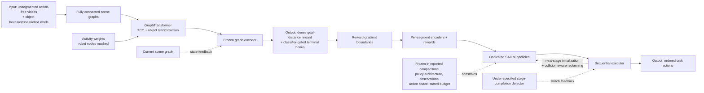

# GORDON: Graph-based Object-centric Rewards for Decomposition of Long-Horizon Manipulation

| Field | Value |
| --- | --- |
| Primary source | [arXiv:2608.03753v1](https://arxiv.org/html/2608.03753v1), 4 August 2026; [PDF](https://arxiv.org/pdf/2608.03753v1) SHA-256 `2b068c624a58db12eae36bc71d54709395df888ad56ced794eacafe9a93a0725`; TeX archive SHA-256 `4b63c782d88322613a2a808b43f55d409ab14b7a2aad0da2affc179623f92839` |
| Official supplement | [Project page repository, commit `c617d36`](https://github.com/andreaprotopapa/graph-reward-learning/tree/c617d3678f88a7ded57304eb804cfa47eaf51c65); the pinned page marks implementation code “coming soon” |
| Harness relevance | Executable task reward; ordered-stage oracle/reference composition; evaluation and fixed-trainer boundary |
| Evidence tier | Core |

## Main point

With policies reported to share SAC architecture, action space, and training budget, GORDON's learned stage decomposition reached 74.4% mean long-horizon success versus 49.0% for manually decomposed environmental rewards, but it also trains one reward encoder and policy per stage, perturbs stage initial states, and inserts a motion planner, so the result does not isolate Sam's two allowed knobs under one fixed trainer.

## Mechanism

## Exact parameters

| Parameter | Value | Context | Source locator |
| --- | ---: | --- | --- |
| Scene graph | Fully connected; semantic class + 2D/3D box geometry at nodes; pairwise box distance at edges | Reward-model input | [Sec. III-A](https://arxiv.org/html/2608.03753v1#S3.SS1) |
| Active-object weight `alpha` | 2.0 | Active non-robot nodes receive twice the base pooling weight | [Eq. 2; Sec. IV](https://arxiv.org/html/2608.03753v1#S3.E2) |
| Activity window `k` | 40 frames | Scale-normalized box-center displacement | [Eq. 3; Sec. IV](https://arxiv.org/html/2608.03753v1#S3.E3) |
| Activity threshold `tau` | 0.005 | Displacement divided by box diagonal; activity persists after first trigger | [Eq. 3; Sec. IV](https://arxiv.org/html/2608.03753v1#S3.E3) |
| Reconstruction weights | `lambda_rec=0.5`; `lambda_box=0.9`; `lambda_giou=0.1`; `lambda_cls=1.0` | TCC plus object reconstruction | [Eqs. 4–5; Sec. IV](https://arxiv.org/html/2608.03753v1#S3.E4) |
| Dense reward | `-||z_t-z_g||_2` | Goal is the mean final-frame embedding across demonstrations | [Eqs. 6–7](https://arxiv.org/html/2608.03753v1#S3.E7) |
| Terminal bonus | `beta=5`; positive window `q=3%`; `tau_c` selected per task | MLP classifier on frozen embeddings; numeric `tau_c` values are not reported | [Eq. 8; Sec. IV](https://arxiv.org/html/2608.03753v1#S3.E8) |
| Demonstrations | 100 MAGICAL; 25 per ManiSkill3 task | Teleoperated in simulation; object labels come from simulator annotations | [Sec. IV](https://arxiv.org/html/2608.03753v1#S4) |
| Evaluation | 7 tasks; 5 seeds; 16 episodes per seed | 3 short-horizon and 4 long-horizon tasks | [Sec. IV](https://arxiv.org/html/2608.03753v1#S4) |
| Detection-noise stress | 1 cm center noise and 5% half-extent scale noise, each per axis | Gaussian perturbation at every frame | [Sec. IV-B](https://arxiv.org/html/2608.03753v1#S4.SS2) |
| Long-horizon mean success | 74.4% | GORDON; decomposed environmental reward 49.0%, RoboHorizon 39.1%, full-task environmental/XIRL/GraphIRL 0% | [Table I](https://arxiv.org/html/2608.03753v1#S4.T1) |
| Robot-masked reward discrimination | `rho=0.629` standard/color; `0.583` detection noise | PutShoesInBox; lower is better under the paper's ratio | [Table III](https://arxiv.org/html/2608.03753v1#S4.T3) |
| PutShoesInBox composed success | 0% without bonus; 81.5% ± 12.0% with learned bonus | Dense reward alone fails both contact-rich placement stages | [Table IV](https://arxiv.org/html/2608.03753v1#S4.T4) |
| Objective ablation `rho` | TCC 0.798; reconstruction 0.837; both 0.629 | PutShoesInBox reward discrimination | [Table V](https://arxiv.org/html/2608.03753v1#S4.T5) |

## What transfers to Sam's harness

- Candidate `task_reward_k`: a versioned object-graph transform, frozen encoder, negative goal distance, and separately calibrated classifier bonus.
- Candidate `oracle_k`: convert a full-task reward trace into an ordered stage manifest with explicit boundaries, local goals, and completion guards. Keep this manifest separate from reward-model weights.
- Validate learned stage boundaries against independent simulator predicates; stress appearance and localization without changing the evaluator.
- Compare full-task and stage-local rewards under a fixed total training budget. Report per-stage and full-sequence success, not generated return alone.

## What does not transfer

- GORDON does not compose robot reference motions or expose a tracking clock. Its linear policy sequence is only adjacent evidence for Sam's reference/oracle knob.
- Dedicated subpolicies, altered initial-state distributions, and collision-aware inter-stage planning cross the frozen-trainer boundary.
- Simulator object annotations are not evidence that raw uploaded video can supply reliable identities, boxes, or robot masks.
- The paper does not demonstrate branching, recovery, predicate-conditioned, preference-conditioned, or learned-oracle execution.

## Failure modes and caveats

- A single distance-to-final-goal reward is weak or ambiguous inside long tasks; full-task environmental, XIRL, and GraphIRL policies make early progress but score 0% full-task success.
- The dense learned reward without a terminal bonus scores 0% composed success on PutShoesInBox; precise contact-rich completion depends on the learned goal classifier.
- Boundary detection is described only as “significant” reward-gradient changes after temporal normalization. No gradient threshold, normalization/alignment procedure, smoothing rule, or switch threshold is reported.
- GraphTransformer dimensions, TCC settings, SAC architecture, numeric training budget, per-task `tau_c`, and total-compute normalization across different numbers of subpolicies are absent from v1.
- The task suite is simulation-only and uses privileged annotations/evaluators. The noise test covers only moderate synthetic localization errors.
- Reward-discrimination `rho` is computed from the learned reward's own cumulative returns; it is a diagnostic, not an independent objective metric, and must not replace simulator-predicate success.
- RoboHorizon numbers are imported from its paper in a semantically matched comparison; the authors did not have its rollouts for the same cumulative predicates.
- At the pinned official-project commit, no implementation or task code is public.

## Evidence ledger

| ID | Claim | Source locator |
| --- | --- | --- |
| GOR-E01 | The exact public paper is active arXiv v1, submitted 4 August 2026. | [arXiv metadata/history](https://arxiv.org/abs/2608.03753v1) |
| GOR-E02 | Each frame becomes a fully connected object graph with class/box node features and pairwise spatial edge features. | [Sec. III-A](https://arxiv.org/html/2608.03753v1#S3.SS1) |
| GOR-E03 | Active non-robot objects are weighted by scale-normalized motion; robot nodes/features/edges are masked and activity persists. | [Eqs. 1–3](https://arxiv.org/html/2608.03753v1#S3.E1) |
| GOR-E04 | TCC and object reconstruction jointly train the GraphTransformer representation. | [Eqs. 4–5](https://arxiv.org/html/2608.03753v1#S3.E4) |
| GOR-E05 | The executable learned reward is negative latent distance to an averaged demonstrated goal plus a classifier-gated bonus. | [Eqs. 6–8](https://arxiv.org/html/2608.03753v1#S3.E6) |
| GOR-E06 | Significant full-task reward-gradient changes define ordered segments; each segment gets a separately trained encoder and local reward. | [Sec. III-C](https://arxiv.org/html/2608.03753v1#S3.SS3) |
| GOR-E07 | Deployment switches dedicated subpolicies; training perturbs stage starts and inter-stage transfer uses collision-aware planning. | [Sec. III-C](https://arxiv.org/html/2608.03753v1#S3.SS3) |
| GOR-E08 | Experiments use seven tasks, simulator-annotated objects, stated hyperparameters, and frozen reward encoders. | [Sec. IV](https://arxiv.org/html/2608.03753v1#S4) |
| GOR-E09 | The comparison reports common SAC architecture/action space/budget, five seeds, and 16 evaluation episodes per seed; RoboHorizon is semantically matched only. | [Sec. IV](https://arxiv.org/html/2608.03753v1#S4) |
| GOR-E10 | GORDON averages 74.4% long-horizon success versus 49.0% for decomposed environmental reward and 39.1% for RoboHorizon. | [Table I](https://arxiv.org/html/2608.03753v1#S4.T1) |
| GOR-E11 | Reward-profile boundaries visually align with simulator subtask endpoints; no numeric boundary metric is reported. | [Fig. 6](https://arxiv.org/html/2608.03753v1#S4.F6) |
| GOR-E12 | Appearance and bounding-box-noise tests report the robot-masked model's strongest reward discrimination. | [Sec. IV-B and Table III](https://arxiv.org/html/2608.03753v1#S4.T3) |
| GOR-E13 | Dense learned reward alone fails contact-rich shoe placement; the learned classifier bonus raises composed success to 81.5% ± 12.0%. | [Table IV](https://arxiv.org/html/2608.03753v1#S4.T4) |
| GOR-E14 | Combining TCC and reconstruction gives lower `rho` than either objective alone. | [Table V](https://arxiv.org/html/2608.03753v1#S4.T5) |
| GOR-E15 | The one-task simulator diagnostic reaches 100% in both environments but with different step/time/parallelism figures. | [Sec. IV-B](https://arxiv.org/html/2608.03753v1#S4.SS2) |
| GOR-E16 | The authors state that a single full-task reward is generally insufficient for long-horizon tasks. | [Sec. V](https://arxiv.org/html/2608.03753v1#S5) |
| GOR-E17 | The pinned official project source advertises paper access but marks code as coming soon. | [`project-data.js:28-31` at `c617d36`](https://github.com/andreaprotopapa/graph-reward-learning/blob/c617d3678f88a7ded57304eb804cfa47eaf51c65/docs/js/project-data.js#L28-L31) |
| GOR-E18 | Ordered cumulative and conditional success reveals sharp late-stage failure for full-task rewards and learned baselines. | [Table II](https://arxiv.org/html/2608.03753v1#S4.T2) |
