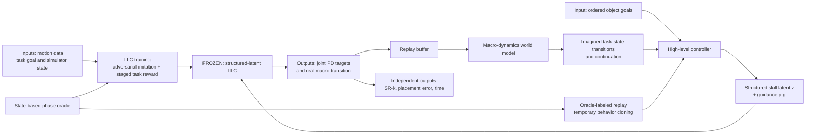

# LUCID: Latent-Skill Unified Control via Imagined Dynamics for Long-Horizon Humanoid Loco-Manipulation

| Field | Value |
| --- | --- |
| Primary source | [arXiv:2608.07746v1](https://arxiv.org/html/2608.07746v1), submitted 7 August 2026; latest public version verified 30 August 2026 |
| Authors | Cheng Guo, Mingzhe Ni, Angelo Cangelosi, Arash Ajoudani |
| Pinned bytes | v1 PDF SHA-256 `17642a8dfebb8400d0c8ee115a0484fe1748f48581578478829c534c7b47f6ed`; v1 source-archive SHA-256 `c72c0fa3575c6453f76772ad9d446f2ce22b43f4e65c9da677103bf540394836` |
| Public assets | No paper-specific project, code, checkpoint, dataset release, or included supplement is linked in arXiv v1 |
| Harness relevance | Reference composition / task reward / evaluation / fixed-trainer boundary |
| Evidence tier | Core |

## Main point

In simulated two-object rearrangement, LUCID reports higher full-chain success from a structured, oracle-labeled skill interface plus imagined macro-dynamics, but its coupled LLC/HLC/world-model training does **not** isolate either of Sam's two allowed harness knobs under a fixed trainer.

## Mechanism

## Exact parameters

| Parameter | Value | Context | Source locator |
| --- | ---: | --- | --- |
| LLC objective | `r_t^D + lambda_G r_t^G` | Adversarial-imitation plus goal-conditioned task reward; phase oracle `psi(s_t^L,g)` supplies the semantic latent during LLC training | Sec. 4.2, Eq. 1 |
| Adversarial reward | `-log(1-D(phi_t))` | Non-saturating discriminator reward from robot/object transition features | Sec. 4.2.1, Eq. 2 |
| Structured latent | normalized `[one_hot(c_t); sigma_z epsilon_t]`, with `D_z >= N` | One anchor per semantic skill; remaining dimensions model within-skill variation | Sec. 4.2.2, Eq. 3 |
| LLC curriculum | `3` stages | Carry; rearrangement; retreat and chaining | Sec. 4.2.3 |
| Stage-varying inputs | task reward and reference-state initialization only | Each curriculum stage warm-starts from the previous stage | Sec. 4.2.3, Eq. 4 |
| Macro action period | `20` LLC steps | One HLC action persists while the frozen LLC executes | Sec. 5.2 |
| Simulator rate | `60 Hz` | Isaac Gym physics loop | Sec. 5.2 |
| LLC rate | `30 Hz` | Low-level action rate | Sec. 5.2 |
| Imagination horizon | `12` macro steps | Actor/world-model unroll horizon | Sec. 5.2 |
| HLC sequence length | `32` | HLC/world-model training sequence | Sec. 5.2 |
| HLC batch size | `64` | HLC/world-model training batch | Sec. 5.2 |
| Parallel environments | `8192` | Joint HLC/world-model training | Sec. 5.2 |
| LLC hardware | `2 x NVIDIA RTX 4090` | Reported LLC training hardware; time and energy are not reported | Sec. 5.2 |
| Humanoid | `15` rigid bodies; `28` PD-controlled joints | Single simulated embodiment | Sec. 5.2 |
| Task split | `62` ID training tasks; `20` OOD tasks | HITR-derived warehouse, kitchen, bedroom, and living-room layouts | Sec. 5.1.1 |
| Chain length | `2` standard; up to `5` extended | LLC curriculum reaches two-object chaining; longer chains are test extensions | Sec. 5.1.1; Sec. 5.3.3 |
| Placement threshold | `0.2 m` | Object-to-target threshold for prefix success `SR_k` | Sec. 5.1.2 |
| Evaluation seeds | `3` | Mean plus sample standard deviation | Sec. 5.1.2 |
| Main ID result | `SR1 89.2 +/- 0.7%`; `SR2 73.4 +/- 3.0%`; `APE 0.32 +/- 0.02 m` | LUCID on two-object ID tasks | Table 1 |
| Main OOD result | `SR1 83.9 +/- 0.8%`; `SR2 68.4 +/- 3.8%`; `APE 0.52 +/- 0.05 m` | LUCID on two-object OOD tasks | Table 1 |
| Sparse WM advantage | ID `73.5 vs 59.3%`; OOD `63.1 vs 42.8%` SR2 | World-model imagination versus model-free HLC | Table 2 |
| Dense-reward transfer | ID `74.0%`; OOD `50.2%` SR2 | Dense LUCID changes little on ID but trails sparse LUCID by `12.9` points OOD | Table 2; Sec. 5.4.1 |
| Structured-interface ablation | ID `74.2 vs 0.0%`; OOD `66.4 vs 0.0%` SR2 | Structured versus unstructured frozen LLC/HLC pairs | Table 3 |
| Sustained-lift threshold | `0.4` mean time fraction | Three structured commands cross it; zero unstructured commands do | Fig. 6; Sec. 5.4.2 |

## Oracle, reward, and planner interfaces

- **LLC phase oracle:** `psi(s_t^L,g)` assigns the current interaction phase during low-level training. Its label selects one semantic one-hot anchor; Gaussian residual dimensions provide within-skill variation.
- **Reported semantic phases:** locomotion, fetch, transport, release, and transit appear as the five interpreted commands in the qualitative and structured-interface analyses.
- **Curriculum composition:** carry -> rearrangement -> retreat-and-chaining. The changing task reward and reference-state initialization couple reward design to the training distribution.
- **HLC warm start:** the geometry-based oracle labels replay states for behavior cloning. Its coefficient decays to zero, so the oracle initializes but does not hard-code the final high-level sequence.
- **Closed-loop planning:** the HLC chooses `(z_t, p_t^g)` from compact task state and ordered goal. The frozen LLC executes for up to 20 low-level steps. The learned world model predicts continuous residual state change, binary progress flags, and continuation probability.
- **Feedback path:** real macro-transitions continuously refresh replay; the world model generates 12-step imagined rollouts; the actor and critic optimize predicted task progress with continuation-discounted lambda returns.

## Evaluation evidence

| Question | Evidence | Boundary |
| --- | --- | --- |
| Does LUCID improve two-object completion? | ID/OOD SR2 is `73.4/68.4%`; strongest baseline is `39.8/37.0%` | Baseline humanoids receive favorable resets at handoffs; LUCID does not |
| Does the world model matter? | WM variants beat model-free HLCs in all four sparse/dense x ID/OOD SR2 comparisons | Real replay is refreshed during training; this is not offline imagination alone |
| Does latent structure matter? | Structured interface reaches `74.2/66.4%` ID/OOD SR2; unstructured reaches `0/0%` | Each HLC is retrained with its corresponding frozen LLC, so this is a system-level ablation |
| Does it extend beyond the training chain? | Authors report about `56%` SR3 and `21%` SR5 | Success still falls sharply with chain length; values are approximate from Fig. 3/text |
| Do dense rewards transfer better? | Sparse OOD SR2 is `63.1%`; dense OOD SR2 is `50.2%` | One task family and reward construction |

## What transfers to Sam's harness

- Represent an oracle candidate as a versioned phase-labeling program: state/goal inputs, guards, skill labels, transition order, termination semantics, and output schema.
- Test whether oracle labels align with task-required interactions. LUCID's structured/unstructured ablation shows that decodable latent diversity alone is insufficient.
- Keep reference composition and task reward separately addressable. LUCID's curriculum changes both reward and reference-state initialization, so copying the full recipe would destroy attribution.
- Evaluate prefix completion `SR_k`, final task error, transition failures, and OOD layouts independently of generated training reward.
- Include sparse-versus-dense task-reward candidates. The reported OOD reversal is a concrete warning that extra shaping can reduce transfer.
- Treat a learned macro planner as a later, separately authorized trainer experiment. It is not an oracle-only mutation under the initial contract.

## What does not transfer

- LUCID does not automatically discover, rank, splice, or verify reference motions. OMOMO and SAMP motions and a human-designed phase vocabulary are inputs.
- It does not hold the trainer fixed: it trains a new ASE-derived LLC, replaces the latent interface, then jointly trains a DreamerV3-style HLC and world model.
- It does not isolate the phase oracle from task reward, curriculum, reference-state initialization, latent architecture, replay collection, or high-level optimization.
- The state-based oracle is not natural-language steering, preference learning, a VIBE result, or evidence for RL-Sculptor implementation.
- Results do not establish vision-based control, real-robot transfer, another embodiment, or broad object/task generality.

## Failure modes and caveats

- Inputs are privileged simulator states. The authors list vision, broader tasks, embodiment diversity, and real-world transfer as open work.
- Approximate prefix success falls to about `21%` by five objects.
- Baseline adapters reset the humanoid to a favorable pose at each handoff. Their completion times are therefore descriptive, not directly comparable.
- Dense shaping reduces LUCID OOD SR2 by `12.9` points relative to sparse shaping.
- The structured-interface ablation retrains both LLC/HLC pairings; it does not identify which individual structural choice causes the gap.
- arXiv v1 repeatedly points to supplementary sections for reward coefficients, oracle details, architecture, losses, and update schedules, but its source archive and nine-page PDF contain no supplement.
- arXiv v1 provides no paper-specific code, checkpoints, or project/data URL. Exact reproduction is not possible from the public assets verified on 30 August 2026.

## Evidence ledger

| ID | Claim | Source locator |
| --- | --- | --- |
| E1 | v1 was submitted 7 August 2026 and is the only public arXiv version | [arXiv submission history](https://arxiv.org/abs/2608.07746) |
| E2 | Two-stage training freezes the ASE-derived LLC before joint HLC/world-model training | [v1 Sec. 4 and Fig. 1](https://arxiv.org/html/2608.07746v1#S4) |
| E3 | LLC objective combines adversarial imitation and task reward; the state/goal oracle supplies phase skills | [v1 Sec. 4.2, Eq. 1-2](https://arxiv.org/html/2608.07746v1#S4.SS2) |
| E4 | Structured latent concatenates a semantic one-hot anchor with Gaussian within-skill variation | [v1 Sec. 4.2.2, Eq. 3](https://arxiv.org/html/2608.07746v1#S4.SS2.SSS2) |
| E5 | Three-stage LLC curriculum changes task reward and reference-state initialization | [v1 Sec. 4.2.3, Eq. 4](https://arxiv.org/html/2608.07746v1#S4.SS2.SSS3) |
| E6 | Macro model predicts residual continuous state, binary progress flags, and continuation over a frozen-LLC action | [v1 Sec. 4.3, Eq. 5-6](https://arxiv.org/html/2608.07746v1#S4.SS3) |
| E7 | HLC learns from real-start imagined rollouts with continuation-discounted lambda returns and replay refresh | [v1 Sec. 4.4, Eq. 7-9 and Algorithm 1](https://arxiv.org/html/2608.07746v1#S4.SS4) |
| E8 | Geometry-oracle behavior cloning is annealed to zero | [v1 Algorithm 1 and text after it](https://arxiv.org/html/2608.07746v1#S4.SS4) |
| E9 | HITR-derived 62/20 ID/OOD tasks, two-to-five-object chains, and OMOMO/SAMP references | [v1 Sec. 5.1.1](https://arxiv.org/html/2608.07746v1#S5.SS1.SSS1) |
| E10 | Placement metric, three seeds, simulator/controller timing, model horizons, batch, environment count, and hardware | [v1 Sec. 5.1.2 and Sec. 5.2](https://arxiv.org/html/2608.07746v1#S5.SS2) |
| E11 | Main ID/OOD baseline comparison | [v1 Table 1 and Sec. 5.3.1](https://arxiv.org/html/2608.07746v1#S5.SS3.SSS1) |
| E12 | Approximate SR3/SR5 results and degradation over longer chains | [v1 Sec. 5.3.3 and Fig. 3](https://arxiv.org/html/2608.07746v1#S5.SS3.SSS3) |
| E13 | World-model versus model-free and sparse versus dense ablation | [v1 Table 2 and Sec. 5.4.1](https://arxiv.org/html/2608.07746v1#S5.SS4.SSS1) |
| E14 | Structured versus unstructured latent controllability and task-success ablation | [v1 Fig. 6, Table 3, Sec. 5.4.2](https://arxiv.org/html/2608.07746v1#S5.SS4.SSS2) |
| E15 | Privileged-state, task/object/embodiment-diversity, vision, and real-transfer limitations | [v1 Conclusion](https://arxiv.org/html/2608.07746v1#S6) |
| E16 | Baseline adapters reset the humanoid; time is not directly comparable | [v1 Sec. 5.1.3](https://arxiv.org/html/2608.07746v1#S5.SS1.SSS3) |
| E17 | Source archive contains only the nine-page main submission while the text cites absent supplementary sections | [v1 source archive](https://export.arxiv.org/e-print/2608.07746v1), SHA-256 `c72c0fa3575c6453f76772ad9d446f2ce22b43f4e65c9da677103bf540394836` |
| E18 | No paper-specific code/project link is active in the v1 source or arXiv record | [v1 arXiv record](https://arxiv.org/abs/2608.07746); source template has only a commented generic placeholder |
