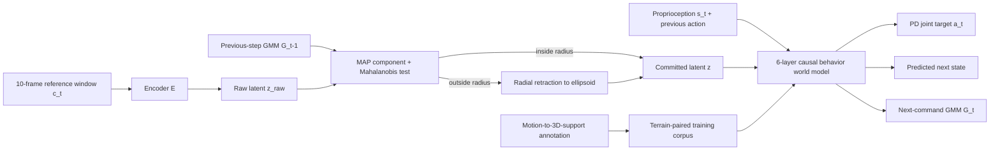

# GigaBrain-WBC-0.5: A Behavior World Model for Robust Whole-Body Control with Environment Interaction

| Field | Value |
| --- | --- |
| Primary source | [arXiv:2608.18234v2](https://arxiv.org/abs/2608.18234v2), 23 August 2026; [versioned PDF](https://arxiv.org/pdf/2608.18234v2), SHA-256 `312ba5cf6b01a0b25833a12b47912c15fa8ffe809934617d951943fd3b8d859d` |
| Harness relevance | Reference composition; evaluation; fixed-trainer boundary |
| Evidence tier | Core |
| Public implementation | [Official project page](https://shepherd1226.github.io/gigabrain-wbc-0.5/) said “Code coming soon” when checked 30 August 2026 |

## Main point

Under the paper's MuJoCo protocol, an environment-trained world-model tracker with a causal latent-command projection reports 81.3% terrain success, 83.1% success on implausible commands, and 99.3% recovery from fallen initializations; the study does not isolate those gains to the projection alone.

## Mechanism

## Exact parameters

| Parameter | Value | Context | Source locator |
| --- | ---: | --- | --- |
| Control interface | 29 DoF at 50 Hz | Unitree G1; 67-D proprioception; 29-D PD targets | §3.1 |
| Reference command | 10 frames × 0.02 s; 440-D | Joint, root-relative rotation/translation, gravity blocks | §3.2 |
| Latent command | 64-D; two 32-D tokens | Continuous policy input; auxiliary FSQ has 32 levels/dimension | §3.2 |
| Transformer | 6 layers, 4 heads, 256-D, 32-frame local window | Six stacked windows yield a reported 187-frame effective receptive field | §3.2 |
| Next-command model | 4 diagonal Gaussians; 516-D head | Mixture over the next 64-D latent command | Eq. (1) |
| Auxiliary-loss weights | recon 0.01; cycle 1.0; next-state 0.01; GMM NLL 0.005 | Added to PPO objective | Eq. (2) |
| Root-translation block | masked with probability 2/3; resampled every 2–5 s | Zero throughout deployment and evaluation | §§3.2, 4.1; Table 2 |
| Command filter | `log σ` clamp [-3, 10]; `R_safe = 3` deployed | MAP-selected component; radial Mahalanobis retraction | Eqs. (3)–(4); Table 3 |
| Filter cost | <1 ms per step | Compared with 20 ms control period | §3.4 |
| Training environments | 4,096 flat; 512 with terrain/fallen initialization | PPO in Isaac Lab | §3.5 |
| Terrain/flat sampling ratio | 0.2 | Terrain rebuilt only at motion-resample boundaries | §3.3 |
| Terrain-contact thresholds | normal <0.2 m/s; tangential <0.3 m/s; ≥2/10 prior frames with normal deceleration >1 m/s² | Contact ends after >5 cm drift/slide; segments <10 frames discarded | §3.3 |
| Annotation audit | 200 clips; 92% correct overall | 50 per category; strict all-support/no-spurious-primitive criterion | Table 4; §4.3 |

## What transfers to Sam's harness

- Treat command feasibility as an explicit **reference/oracle transform** before policy execution: raw reference → causal admissibility test → unchanged or projected reference.
- Use only information available before the current command in an admissibility test. The paper uses the preceding-step mixture to avoid self-validation leakage.
- Expose one named projection parameter and sweep it against independent fidelity and survival metrics; do not hide the robustness–precision trade-off.
- Evaluate full-length rollouts. Do not let early failure reduce accumulated tracking error.
- Separate four regimes: ordinary tracking, terrain interaction, infeasible commands, and recovery. Each needs a regime-specific success definition.

## What does not transfer

- The behavior-world-model Transformer, GMM head, terrain-conditioned corpus, PPO losses, tracking reward, and recovery curriculum modify the controller/trainer. They are outside Sam's two initial knobs when the foundation controller and tracking reward are fixed.
- The Table 2 reward is a **controller tracking reward**, not evidence for a generated `task_reward_k`.
- The filter depends on a controller-produced next-command distribution. A frozen controller without that output cannot reproduce this mechanism without a separate, validated feasibility model.
- The paper does not test a harness-generated oracle, text steering, iterative reward improvement, or RL-Sculptor.
- The reported system is not currently reproducible from public code: the official page marked code “coming soon” on 30 August 2026.

## Failure modes and caveats

- The filter is a similarity-to-training proxy, not a direct physical-risk model; infeasible-command interception is probabilistic.
- `R_safe` must be recalibrated for each checkpoint and platform before hardware reliance.
- The first step and steps after a reset, behavior switch, or PD hand-off are unfiltered because no predecessor mixture exists.
- The terrain pipeline reconstructs only contacted supports, not unused or non-supporting scene geometry.
- Baselines use different corpora and retargeting pipelines; Table 3 is not a data-matched ablation.
- The release omits the promised broader component ablations and real-robot latency measurements.
- Root-position masking supports hardware deployability but worsens root-velocity tracking; the paper reports 211.1 mm/s versus HoloMotion-1's 121.3 mm/s on Standard.

## Evidence ledger

| ID | Claim | Source locator |
| --- | --- | --- |
| GIGA-E01 | v2 is the current public arXiv version. | [arXiv v2 abstract and submission history](https://arxiv.org/abs/2608.18234v2) |
| GIGA-E02 | The controller consumes state, prior action, and a 10-frame reference and jointly predicts action, next state, and next-command mixture. | [§§3.1–3.2, Figure 2, Eq. (1)](https://arxiv.org/html/2608.18234v2#S3) |
| GIGA-E03 | The admissibility filter uses the preceding-step GMM, MAP component selection, Mahalanobis radius, and radial retraction. | [§3.4, Eqs. (3)–(4)](https://arxiv.org/html/2608.18234v2#S3.SS4) |
| GIGA-E04 | Terrain annotation uses motion-derived contact points, penetration filtering, clustering, and 3D primitive fitting. | [§3.3, Figure 3](https://arxiv.org/html/2608.18234v2#S3.SS3) |
| GIGA-E05 | PPO training includes terrain-paired data, fallen initializations, recovery gating, and force randomization. | [§3.5 and Table 2](https://arxiv.org/html/2608.18234v2#S3.SS5) |
| GIGA-E06 | The four evaluation regimes use distinct metrics and full-length rollouts. | [§4.1](https://arxiv.org/html/2608.18234v2#S4.SS1) |
| GIGA-E07 | The reported MuJoCo results are 81.3% Terrain SR, 83.1% OOD SR, and 99.3% Fall recovery. | [Table 3 and §4.2](https://arxiv.org/html/2608.18234v2#S4.SS2) |
| GIGA-E08 | The annotation audit reports 92% correctness over 200 sampled motions. | [Table 4 and §4.3](https://arxiv.org/html/2608.18234v2#S4.SS3) |
| GIGA-E09 | `R_safe` sweeps a measured robustness–precision frontier; 3 is the reported operating point. | [§4.4 and Figure 6](https://arxiv.org/html/2608.18234v2#S4.SS4) |
| GIGA-E10 | The authors state filter-calibration, risk-proxy, and partial-geometry limitations. | [§5](https://arxiv.org/html/2608.18234v2#S5) |
| GIGA-E11 | Public code was not linked at extraction time. | [Official project page, line “Code coming soon”](https://shepherd1226.github.io/gigabrain-wbc-0.5/) |
