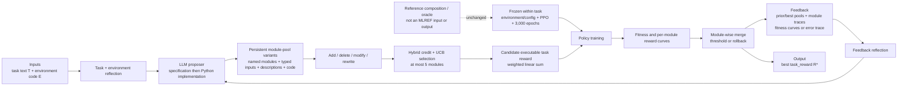

# MLREF: Efficient Module Reuse for Reward Design in Reinforcement Learning via Large Language Models

| Field | Value |
| --- | --- |
| Primary source | [arXiv:2608.18827v1](https://arxiv.org/html/2608.18827v1), submitted 19 August 2026; sole public arXiv revision verified 30 August 2026; reviewed PDF SHA-256 `bfdaf574bb3c241d046be9d447ef2cdceebd0adab387ff77411a668f41863aff`; TeX-source SHA-256 `eae7c2d2600e2f07009a84ef3534d9ef2a9b183c9f4fd06e2c14cef685462852` |
| Authors | Chenglin Liu, Xun Wang, Ruishuo Chen, Zhuoran Li, Longbo Huang |
| Official code | No project or repository URL is supplied in arXiv v1 or its TeX source; no official implementation can be pinned as of 30 August 2026 |
| Harness relevance | Task reward / evaluation / fixed-trainer boundary |
| Evidence tier | Core |

## Main point

Under an `81`-candidate outer-loop budget per task, MLREF reports `25.2%` and `6.6%` aggregate gains over the best locomotion and manipulation baselines by evolving reusable executable reward modules, but it neither changes reference/oracle logic nor supplies code that resolves its published UCB ambiguity.

## Mechanism

## Reward-design contract

| Element | Paper definition | Consequence for Sam |
| --- | --- | --- |
| Persistent object | The module pool persists; a reward function is a temporary weighted assembly | Version the pool, every module, and every assembly separately |
| Module identity | Name, input-variable names/types, natural-language specification, and a single TorchScript-compatible Python function returning `torch.Tensor` | Bind source bytes, input schema, runtime, dependencies, and parent pool; a name is not an identity |
| Allowed edits | `add`, `delete/remove`, `modify` code under a fixed specification, or `rewrite` specification and code | Represent edits as typed diffs with rationales and immutable before/after artifacts |
| Reward assembly | `R(s,a) = sum_k w_k m_k(s,a)`; select at most five modules | Preserve module outputs and weights as diagnostics; test units, scale, bounds, and interactions |
| Credit heuristic | Fuse normalized LLM weights with lagged raw/difference reward-performance correlations, EMA smoothing, and a UCB exploration bonus | Treat credit as a ranking heuristic, not causal attribution |
| Failure recovery | Discard pool variants more than `t=0.1` below the historical best; merge survivors by module name; roll back if none survive | Use an immutable, reward-independent evaluator and declare threshold units before launch |
| Final selection | Keep the best reward across iterations; run three complete pipelines and return the best execution | Record all `81` candidates, not only the selected reward |
| Fixed comparison surface | Within each task, environment settings follow EUREKA and PPO candidates receive the same `3,000` epochs; final rewards are retrained for `20,000` epochs on five seeds | Freeze the full scene/observation/action/dynamics/controller/tracking-reward/trainer contract explicitly; the paper does not enumerate it |

## Exact parameters

| Parameter | Value | Context | Source locator |
| --- | ---: | --- | --- |
| Initial modules | `4–6` | Prompted number of module specifications in each initial pool | [App. D.4.1](https://arxiv.org/html/2608.18827v1#A4.SS4.SSS1) |
| Maximum selected modules `K` | `5` | Top UCB-ranked modules used in one reward assembly | [App. B, Table 4](https://arxiv.org/html/2608.18827v1#A2.T4) |
| Improvement operations | `4` | Add, delete/remove, modify, rewrite | [Sec. 4.2.2](https://arxiv.org/html/2608.18827v1#S4.SS2.SSS2) |
| Iterations `I` | `9` | Per complete MLREF execution | [Sec. 5.1](https://arxiv.org/html/2608.18827v1#S5.SS1) |
| Parallel variants `S` | `3` | Per iteration | [Sec. 5.1](https://arxiv.org/html/2608.18827v1#S5.SS1) |
| Complete pipeline runs | `3` | Best run is returned | [Sec. 5.1](https://arxiv.org/html/2608.18827v1#S5.SS1) |
| Candidate-policy trainings | `81` | Derived exactly as `3 runs × 9 iterations × 3 variants`; baselines receive `80` | [Sec. 5.1; App. B](https://arxiv.org/html/2608.18827v1#S5.SS1) |
| Candidate training | `3,000` epochs | Every reward candidate | [Sec. 5.1](https://arxiv.org/html/2608.18827v1#S5.SS1) |
| Final evaluation | `20,000` epochs; `5` seeds | PPO retraining from scratch after reward selection | [Sec. 5.1](https://arxiv.org/html/2608.18827v1#S5.SS1) |
| Main LLM | `DeepSeek-V4-Flash`, reasoning mode | Official API; no dated model snapshot or API revision is reported | [Sec. 5.1; App. B](https://arxiv.org/html/2608.18827v1#A2.T4) |
| Pool merge threshold `t` | `0.1` | Reject a variant more than this margin below historical best | [Sec. 4.2.3; App. B](https://arxiv.org/html/2608.18827v1#S4.SS2.SSS3) |
| Correlation windows | smoothing `w_s=30`; difference `w_d=30`; max lag `L=10` | Module reward versus policy-performance curves | [App. A.1.2; App. B](https://arxiv.org/html/2608.18827v1#A1.SS1.SSS2) |
| Correlation mixture | `w_raw=0.5` | Raw and temporal-difference correlation | [App. A.1.2; App. B](https://arxiv.org/html/2608.18827v1#A1.SS1.SSS2) |
| Credit smoothing | EMA `alpha=0.7` | LLM and correlation credits start at zero | [App. A.1.3; App. B](https://arxiv.org/html/2608.18827v1#A1.SS1.SSS3) |
| Credit normalization/fusion | softmax `tau=0.25`; `w_LLM=0.5` | Equal mixture of normalized semantic and correlation credit | [App. A.2; App. B](https://arxiv.org/html/2608.18827v1#A1.SS2) |
| UCB exploration `gamma` | `0.2` | Bonus for underused modules | [App. A.3; App. B](https://arxiv.org/html/2608.18827v1#A1.SS3) |
| Baseline budgets | EUREKA `5 × 16 = 80`; RF-Agent `80` MCTS updates | Candidate-level budget comparison | [Sec. 5.1; App. B](https://arxiv.org/html/2608.18827v1#A2.T4) |
| Task suite | `17` total: `7` paper-labelled locomotion + `10` manipulation | Isaac Gym and Bi-DexHands simulation | [Table 2](https://arxiv.org/html/2608.18827v1#S5.T2) |
| Locomotion aggregate | MLREF `3.288`; RF-Agent `2.625`; EUREKA `2.135` | Average normalized score; `+25.2%` over best baseline | [Table 2](https://arxiv.org/html/2608.18827v1#S5.T2) |
| Manipulation aggregate | MLREF `0.708`; EUREKA `0.664`; RF-Agent `0.651` | Average raw performance; `+6.6%` over best baseline | [Table 2](https://arxiv.org/html/2608.18827v1#S5.T2) |
| Ablation average | GPT-4o `40.9%`; no pool `73.2%`; no reflection `53.3%`; no weight optimization `63.9%` | Average percentage of full MLREF on Ant, Block Stack, Bottle Cap | [Table 3](https://arxiv.org/html/2608.18827v1#S5.T3) |

## Evaluation evidence

| Question | Evidence | Boundary |
| --- | --- | --- |
| Does MLREF beat function-level baselines? | It has the best aggregate in both groups and the best mean on `4/7` and `2/10` individual tasks | Aggregate gains coexist with losses on `3/7` and `8/10`; no confidence interval or significance test for aggregate differences |
| Are pool, reflection, and weight optimization useful? | Removing each lowers the reported three-task average to `73.2%`, `53.3%`, and `63.9%` of full | Three tasks only; no module-level leave-one-out study validates correlation credit causally |
| Is evolution more stable? | Best-sample curves show MLREF improving while EUREKA oscillates on Shadow Hand and Catch Abreast | Curves select the best MLREF variant across three runs, normalize progress axes, and min-max normalize task averages; no scalar stability statistic is reported |
| Does selection generalize? | Authors state that only full MLREF's validation-selected reward remains best at test on all three ablation tasks | Validation/test construction, split sizes, and separate scores are not specified |
| Does the method solve sparse manipulation? | Block Stack improves to `0.313 ± 0.244` from `0.139 ± 0.096` for RF-Agent | Authors call absolute performance modest; variance is large |
| Is the artifact reproducible? | v1 supplies formulas, hyperparameters, and full prompts | No linked code, exact API snapshot, dependency lock, environment manifest, or unambiguous UCB implementation |

## What transfers to Sam's harness

- Store a content-addressed reward-module registry. A module record needs exact specification, code bytes, typed inputs, units, dependencies, runtime, parent pool, edit operation, and rationale.
- Make a candidate reward an immutable assembly manifest: ordered module IDs, exact weights, compiler/runtime identity, and component-output schema.
- Preserve failed candidates and error traces. Rollback must restore an exact prior pool, not regenerate one with the same names.
- Keep the task-success evaluator independent from generated reward code. Bind its hash, metric direction, normalization, and rollback margin before training.
- Use component traces and lagged correlations as proposal evidence only. Confirm accepted changes with fresh-seed and module-removal tests.
- Match total outer-loop candidate trainings as well as per-candidate epochs. MLREF's comparable budget is `81` versus `80`, not `27` versus `80`.
- Retrain selected rewards from scratch on fresh seeds and report all candidates, selected-run logic, dispersion, and negative task results.
- Admit generated reward code through a bounded DSL or a static validator plus isolated trusted compiler/runtime. A prompt requesting TorchScript compatibility is not an execution-safety boundary.

## What does not transfer

- MLREF does not select, order, compose, transition, recover, or certify reference motions. Its module pool is a task-reward artifact, not an oracle.
- Reuse is within one task across optimization iterations; the paper does not demonstrate cross-task reward-module transfer.
- It provides no human-steering experiment, natural-language correction protocol, foundation-controller integration, VIBE result, motion-tracking result, or physical-robot result.
- Pearson correlation with training performance is not causal module credit and does not establish that a module will help under a new assembly.
- The paper does not prove safe, deterministic, bounded, or side-effect-free execution of LLM-generated Python.
- The task-local settings are held constant by reference to EUREKA, but v1 does not provide a complete frozen MDP/controller/runtime manifest.
- Representing this paper in the graph is not evidence that RL-Sculptor implements MLREF.

## Failure modes and caveats

- **Generated-code crashes:** the paper states that hallucinated invalid code can crash RL training; recovery consumes the error trace after failure.
- **Redundant or conflicting modules:** naive pool accumulation can retain duplicate or opposing incentives; same-name merge does not establish semantic deduplication.
- **Ambiguous UCB equation:** Appendix A.3 uses `u_i` for both the UCB score and the module selection count, making the printed denominator and ranking definition self-conflicting.
- **Unspecified merge units:** `t=0.1` is reported without a stated normalization or metric-unit contract for task-local fitness.
- **Associational credit:** lagged Pearson correlation remains confounded by policy learning, other modules, and changing reward assemblies.
- **Model dependence:** replacing DeepSeek-V4-Flash with GPT-4o gives only `40.9%` of full performance in the three-task ablation; open models are not evaluated.
- **Sparse-task weakness:** authors identify modest absolute Block Stack performance and call for stronger early exploration.
- **Selection evidence gap:** the best of three complete MLREF executions is returned, but outer-loop variance and aggregate significance are not reported.
- **Validation/test gap:** the claimed three-task generalization has no documented split construction or separate result table.
- **Execution boundary gap:** prompts require TorchScript-compatible Python, but v1 gives no sandbox, static allowlist, resource bound, or pre-execution semantic check.
- **Reproduction gap:** the paper defers PPO/environment settings to EUREKA, gives only a mutable model label/API mode, and links no implementation.
- **Simulation-only evidence:** all results use Isaac Gym or Bi-DexHands; no real-world, safety, perturbation-recovery, or cross-MDP transfer study is reported.

## Public-artifact audit

| Item | Pinned evidence | Interpretation |
| --- | --- | --- |
| Paper bytes | arXiv v1 PDF `bfdaf574…`; source archive `eae7c2d2…` | Exact reviewed public paper is reproducible |
| Code | No official repository/project URL in v1 or source archive | No implementation commit, tag, environment lock, or generated rewards can be pinned |
| LLM | `DeepSeek-V4-Flash`, reasoning mode, official API | Product label only; no dated snapshot, endpoint revision, temperature, or seed |
| Reward runtime | Prompt says single-function Python, `torch.Tensor` output, TorchScript-compatible | Prompt-level contract; no released executor validates actual behavior |
| UCB selector | Formula and prose in Appendix A.3 | Not implementable unambiguously without an author clarification or code |

## Evidence ledger

| ID | Claim | Source locator |
| --- | --- | --- |
| E01 | v1 is the sole public revision; title, authors, submission time, size, and arXiv DOI; reviewed official PDF/source bytes yield the recorded hashes | [arXiv submission record](https://arxiv.org/abs/2608.18827v1); [v1 TeX source](https://export.arxiv.org/e-print/2608.18827v1) |
| E02 | Module-level optimization addresses lost reuse, redundant search, and redundant/conflicting accumulation; Table 1 contrasts persistence, credit, and rollback | [Introduction and Table 1](https://arxiv.org/html/2608.18827v1#S1.T1) |
| E03 | The reward-design problem separates candidate reward `R`, fixed environment/trainer, learned policy, and policy fitness `F` | [Sec. 3.2](https://arxiv.org/html/2608.18827v1#S3.SS2) |
| E04 | Weighted reward equation, two-phase pipeline, persistent-pool semantics, feedback path, and best-reward selection | [Sec. 4.1, Eq. 1, Fig. 1, Algorithm 1](https://arxiv.org/html/2608.18827v1#S4.SS1) |
| E05 | Module metadata, specification-before-code initialization, and add/delete/modify/rewrite operations | [Secs. 4.2.1–4.2.2](https://arxiv.org/html/2608.18827v1#S4.SS2.SSS1) |
| E06 | Thresholded module-wise merge, same-name winner selection, failed-attempt logging, and rollback | [Sec. 4.2.3](https://arxiv.org/html/2608.18827v1#S4.SS2.SSS3) |
| E07 | Initial and feedback reflection inputs; invalid generated code may crash training and returns an error trace | [Sec. 4.3](https://arxiv.org/html/2608.18827v1#S4.SS3) |
| E08 | LLM credit, lagged raw/difference correlations, EMA, normalization, fusion, and UCB selection | [Sec. 4.4 and App. A](https://arxiv.org/html/2608.18827v1#A1) |
| E09 | The printed UCB equation uses `u_i` as both score and selection count, leaving its denominator and ranking notation ambiguous | [App. A.3](https://arxiv.org/html/2608.18827v1#A1.SS3) |
| E10 | Complete reported MLREF, PPO, LLM-label, and baseline hyperparameters | [App. B, Table 4](https://arxiv.org/html/2608.18827v1#A2.T4) |
| E11 | Prompt-level executable-reward contract: `4–6` initial modules, typed single-function Python, tensor output, and TorchScript compatibility | [Appendix D, especially D.1 and D.4](https://arxiv.org/html/2608.18827v1#A4) |
| E12 | Three runs, nine iterations, three variants, `3,000` candidate epochs, `20,000` final epochs, five seeds, PPO, and DeepSeek-V4-Flash setup | [Sec. 5.1](https://arxiv.org/html/2608.18827v1#S5.SS1) |
| E13 | Seventeen-task means, standard deviations, aggregates, improvement percentages, and task-win counts | [Secs. 5.1–5.2, Table 2](https://arxiv.org/html/2608.18827v1#S5.T2) |
| E14 | Three-task component/model ablation and qualitative validation-to-test claim | [Sec. 5.3, Table 3](https://arxiv.org/html/2608.18827v1#S5.SS3) |
| E15 | Best-sample evolution-curve selection and progress/task normalization protocol | [Sec. 5.4 and Fig. 2](https://arxiv.org/html/2608.18827v1#S5.SS4) |
| E16 | Reported limits: modest sparse-task performance, narrow LLM coverage, and single-LLM design | [Sec. 5.5](https://arxiv.org/html/2608.18827v1#S5.SS5) |
| E17 | The complete v1 source contains no official project/repository URL; exact public code therefore cannot be pinned | [v1 TeX source archive](https://export.arxiv.org/e-print/2608.18827v1) |
