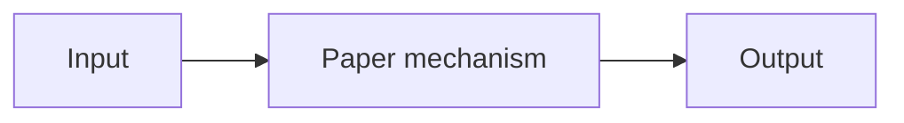

# Paper title

| Field | Value |
| --- | --- |
| Primary source | URL and exact version |
| Harness relevance | Reference composition / task reward / steering / evaluation / fixed trainer |
| Evidence tier | Anchor / core / supporting / baseline |

## Main point

One falsifiable sentence.

## Mechanism

## Exact parameters

| Parameter | Value | Context | Source locator |
| --- | ---: | --- | --- |

## What transfers to Sam's harness

- Decision or interface consequence.

## What does not transfer

- Scope boundary or unsupported inference.

## Failure modes and caveats

- Reported limitation, negative result, or evidence gap.

## Evidence ledger

| ID | Claim | Source locator |
| --- | --- | --- |
